Appendix 1: Code for ‘An update to the Birds of the Nebraska National
Forest’
================

``` r
library(tidyverse)
```

    ## ── Attaching core tidyverse packages ──────────────────────── tidyverse 2.0.0 ──
    ## ✔ dplyr     1.1.2     ✔ readr     2.1.4
    ## ✔ forcats   1.0.0     ✔ stringr   1.5.0
    ## ✔ ggplot2   3.4.2     ✔ tibble    3.2.1
    ## ✔ lubridate 1.9.2     ✔ tidyr     1.3.0
    ## ✔ purrr     1.0.1     
    ## ── Conflicts ────────────────────────────────────────── tidyverse_conflicts() ──
    ## ✖ dplyr::filter() masks stats::filter()
    ## ✖ dplyr::lag()    masks stats::lag()
    ## ℹ Use the conflicted package (<http://conflicted.r-lib.org/>) to force all conflicts to become errors

``` r
library(lubridate)
library(terra)
```

    ## terra 1.7.39
    ## 
    ## Attaching package: 'terra'
    ## 
    ## The following object is masked from 'package:tidyr':
    ## 
    ##     extract

``` r
library(data.table)
```

    ## 
    ## Attaching package: 'data.table'
    ## 
    ## The following object is masked from 'package:terra':
    ## 
    ##     shift
    ## 
    ## The following objects are masked from 'package:lubridate':
    ## 
    ##     hour, isoweek, mday, minute, month, quarter, second, wday, week,
    ##     yday, year
    ## 
    ## The following objects are masked from 'package:dplyr':
    ## 
    ##     between, first, last
    ## 
    ## The following object is masked from 'package:purrr':
    ## 
    ##     transpose

``` r
gbif <- read.delim(paste0(filepath,"0104629-230530130749713.csv"),sep = "\t")

# remove unclassifiable
gbif$species[which(gbif$species=="Junco hyemalis"&
        gbif$infraspecificEpithet=="")] <- "Junco sp."

gbif$species[which(gbif$species=="Setophaga coronata"&
        gbif$infraspecificEpithet=="")] <- "Setophaga coronata/auduboni"

sp_list <-  c("Junco","hyemalis","Junco hyemalis",
             "Junco","oreganus","Junco oreganus",
             "Junco","aikeni","Junco aikeni",
             "Junco","mearnsi","Junco mearnsi",
             "Junco","cismontanus","Junco cismontanus",
             "Junco","caniceps","Junco caniceps",
             "Junco","shufeldti",
                    "Junco oreganus",
             "Junco","montanus",
                    "Junco oreganus",
             "Setophaga","coronata","Setophaga coronata",
             "Setophaga","","Setophaga coronata/auduboni")

renamer <- matrix(data=sp_list,
       nrow=(length(sp_list)/3),ncol=3,
       byrow = T) %>% as.data.frame()
colnames(renamer) <- c("genus","from","to")

for(i in 1:nrow(renamer)){
  index=which(gbif$infraspecificEpithet==renamer$from[i])
  gbif$species[index]=renamer$to[i]
}

# reduce to relevant columns
# all have coords??

gbif <- gbif%>%
  select(species, locality, individualCount,
         decimalLongitude, decimalLatitude, eventDate) %>%
  unique()

taxo_order <- read_csv(paste0(filepath,"sp_list_ne.csv"))
taxo_order <- taxo_order%>%
  rename(species = scientific)

gbif <- gbif%>%
  left_join(taxo_order,by="species")

missing <- gbif$species[which(is.na(gbif$order))]%>%unique()%>%
  as.data.frame
# write as file, then put new names
# write_csv(missing,paste0(filepath,"missing.csv"))

# rename missing taxa... there's several of them!

rename_taxon <- function(gbif,wrong,right,keep){
  index <- which(gbif$species==wrong)
  if(length(index)<1){
    return(gbif)
  }else{
    if(keep==F){
      gbif <- gbif[-index,]
    }else{
      gbif$species[index] <- right
    }
    return(gbif)
  }
}

missing <- read_csv(paste0(filepath,"missing.csv"))

for(i in 1:nrow(missing)){
  right <- missing$right[i]
  wrong <- missing$wrong[i]
  keep <- missing$keep[i]
  gbif <- rename_taxon(gbif=gbif,right=right,wrong=wrong,keep=keep)
}

# gbif <- gbif[-which(gbif$species==""),]
gbif$species[which(gbif$species%like%"villosus")] <- "Leuconotopicus villosus"

write_csv(gbif,paste0(filepath,"reduced_gbif.csv"))
```

We are also going to import and reformat eBird data. Note that for
*Junco*, we are only using populations predesignated to subspecies since
roughly 57% of western *Junco* are *hyemalis* in Nebraska; thus, we
can’t make broad assumptions. To contrast, 98% in eastern Nebraska are
*hyemalis*.

``` r
# reformat eBird data
# add to ensure nothing is missing in GBIF!
# first run revealed some data lacking

ebird <- read.delim(paste0(filepath,
                           "ebd_US-NE_relJun-2023/ebd_US-NE_relJun-2023.txt"),
                    sep = "\t",quote="")

# remove unknowns
`%notlike%` <- Negate(`%like%`)
ebird <- ebird[which(ebird$CATEGORY%notlike%"slash"&
                       ebird$CATEGORY%notlike%"domestic"&
                       ebird$CATEGORY%notlike%"spuh"),]

# split some taxa for better resolution
# code has errors...
#ssp_rename <- function(from,to){
#  index <- which(ebird$SUBSPECIES.SCIENTIFIC.NAME==from)
#  if(length(index)<1){
#    print(paste0("No matches for ",from))
#  }else{
#    ebird$SCIENTIFIC.NAME[index] <- to
#    print(paste0(from," changed to ",to))
#  }
#}

# remove unclassifiable
sp_list <-  c("Setophaga coronata coronata","Setophaga coronata",
              "Setophaga coronata auduboni","Setophaga auduboni",
              "Junco hyemalis hyemalis/carolinensis","Junco hyemalis",
             "Junco hyemalis [oreganus Group]","Junco oreganus",
             "Junco hyemalis aikeni","Junco aikeni",
             "Junco hyemalis mearnsi","Junco mearnsi",
             "Junco hyemalis cismontanus","Junco cismontanus",
             "Junco hyemalis caniceps","Junco caniceps",
             "Junco hyemalis hyemalis/carolinensis/cismontanus",
                    "Junco hyemalis/cismontanus",
             "Junco hyemalis oreganus x mearnsi",
                    "Junco hyemalis oreganus x mearnsi",
             "Junco hyemalis mearnsi x aikeni",
                    "Junco hyemalis mearnsi x aikeni",
             "Setophaga coronata coronata","Setophaga coronata",
             "Setophaga coronata auduboni","Setophaga auduboni",
             "Setophaga coronata coronata x auduboni",
                    "Setophaga coronata coronata x auduboni")

renamer <- matrix(data=sp_list,
       nrow=(length(sp_list)/2),ncol=2,
       byrow = T) %>% as.data.frame()
colnames(renamer) <- c("from","to")

for(i in 1:nrow(renamer)){
  index=which(ebird$SUBSPECIES.SCIENTIFIC.NAME==renamer$from[i])
  ebird$SCIENTIFIC.NAME[index]=renamer$to[i]
}

# reduce to relevant columns
# all have coords??

ebird <- ebird[order(ebird$TAXONOMIC.ORDER),]

ebird <- ebird%>%
  select(SCIENTIFIC.NAME, OBSERVATION.COUNT,
         LONGITUDE, LATITUDE, OBSERVATION.DATE) %>%
  rename("species" = SCIENTIFIC.NAME,
         "individualCount" = OBSERVATION.COUNT, "decimalLongitude" = LONGITUDE,
         "decimalLatitude" = LATITUDE, "eventDate" = OBSERVATION.DATE)%>%
  unique()

ebird$species[which(ebird$species%like%"villosus")] <- "Leuconotopicus villosus"

write_csv(ebird,paste0(filepath,"reduced_ebird.csv"))
```

``` r
# note some longitudes are wrong; remove anything over 0
# locality columns causing problems for ebird

gbif <- read_csv(paste0(filepath,"reduced_gbif.csv"))%>%
  filter(decimalLongitude < 0) %>%
  select(-order,-english,-locality)

ebird <- read_csv(paste0(filepath,"reduced_ebird.csv"),quote="")

gbif <- rbind(ebird,gbif) %>%
  unique()

rm(ebird)
# load shapefile

nf <- vect(paste0(filepath,"S_USA.AdministrativeForest/S_USA.AdministrativeForest.shp"))

ne_nf <- nf$FORESTNAME[which(nf$FORESTNAME%like%"Nebraska")]

# select NE National Forest
ne_nf <- nf[which(nf$FORESTNAME==ne_nf)]

# get points in Nebraska NF
ne_crs <- crs(ne_nf)

gbif_vect <- vect(gbif,geom=c("decimalLongitude","decimalLatitude"),crs = ne_crs)

ne_gbif <- extract(y = gbif_vect,x = ne_nf)

# get non-empty rows
index <- which(!is.na(ne_gbif$FORESTNAME))

ne_nf_gbif <- gbif[index,]

write_csv(ne_nf_gbif,paste0(filepath,"ne_natl_forest_birds.csv"))
```

``` r
ne_nf_gbif <- read_csv(paste0(filepath,"ne_natl_forest_birds.csv"))

bessey <- which(ne_nf_gbif$decimalLatitude<42.5&ne_nf_gbif$decimalLongitude>-101)
mckelvie <- which(ne_nf_gbif$decimalLatitude>42.3&ne_nf_gbif$decimalLongitude>-102)
pine_ridge_oglala <- which(ne_nf_gbif$decimalLatitude>42.3&ne_nf_gbif$decimalLongitude<c(-102))

ne_nf_gbif$district <- "Unknown"

ne_nf_gbif$district[bessey] <- "Bessey"
ne_nf_gbif$district[mckelvie] <- "McKelvie"
ne_nf_gbif$district[pine_ridge_oglala] <- "Pine Ridge / Oglala"

write_csv(ne_nf_gbif,paste0(filepath,"ne_natl_forest_birds.csv"))
```

# District Summaries

``` r
ne_nf_gbif <- read_csv(paste0(filepath,"ne_natl_forest_birds.csv"))
```

    ## Rows: 46392 Columns: 6
    ## ── Column specification ────────────────────────────────────────────────────────
    ## Delimiter: ","
    ## chr  (3): species, individualCount, district
    ## dbl  (2): decimalLongitude, decimalLatitude
    ## date (1): eventDate
    ## 
    ## ℹ Use `spec()` to retrieve the full column specification for this data.
    ## ℹ Specify the column types or set `show_col_types = FALSE` to quiet this message.

``` r
ne_nf_gbif$species <- as.factor(ne_nf_gbif$species)
ne_nf_gbif$eventDate <- as.Date(ne_nf_gbif$eventDate)
ne_nf_gbif$district <- as.factor(ne_nf_gbif$district)
```

## Bessey

``` r
districtR <- function(ne_nf_gbif,district){
  sub.ne <- ne_nf_gbif[ne_nf_gbif$district==district,]
  sub.ne$eventDate <- year(sub.ne$eventDate)
  sp_list <- unique(sub.ne$species)
  hist(sub.ne$eventDate,main=district,breaks=100,
       xlab="Year")
  for(i in 1:length(sp_list)){
    sp_x <- sp_list[i]
    sp_ne <- sub.ne[which(sub.ne$species==sp_x),]%>%
      select(species,eventDate)
    if(nrow(sp_ne)<1){
      next
    }
    print(summary(sp_ne))
    hist(sp_ne$eventDate,main=sp_x,breaks=100,
       xlab="Year")
  }
}
```

``` r
districtR(ne_nf_gbif = ne_nf_gbif,district = "Bessey")
```

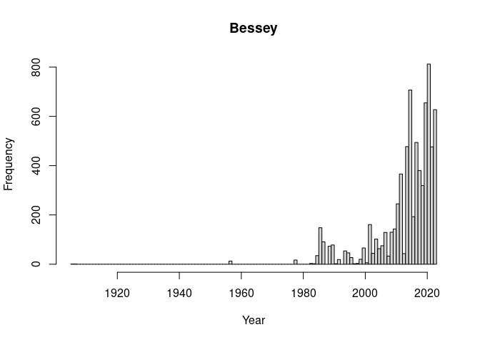<!-- -->

    ##                species    eventDate   
    ##  Anser albifrons   :2   Min.   :2004  
    ##  Acanthis flammea  :0   1st Qu.:2009  
    ##  Accipiter cooperii:0   Median :2014  
    ##  Accipiter gentilis:0   Mean   :2014  
    ##  Accipiter striatus:0   3rd Qu.:2018  
    ##  Actitis macularius:0   Max.   :2023  
    ##  (Other)           :0

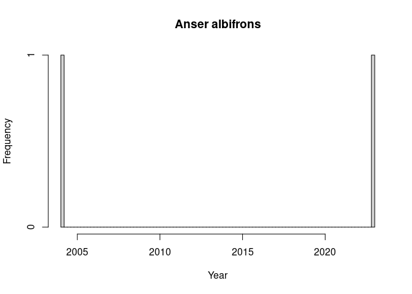<!-- -->

    ##                species    eventDate   
    ##  Branta hutchinsii :2   Min.   :2016  
    ##  Acanthis flammea  :0   1st Qu.:2017  
    ##  Accipiter cooperii:0   Median :2018  
    ##  Accipiter gentilis:0   Mean   :2018  
    ##  Accipiter striatus:0   3rd Qu.:2020  
    ##  Actitis macularius:0   Max.   :2021  
    ##  (Other)           :0

<!-- -->

    ##                species     eventDate   
    ##  Branta canadensis :73   Min.   :2002  
    ##  Acanthis flammea  : 0   1st Qu.:2014  
    ##  Accipiter cooperii: 0   Median :2018  
    ##  Accipiter gentilis: 0   Mean   :2017  
    ##  Accipiter striatus: 0   3rd Qu.:2022  
    ##  Actitis macularius: 0   Max.   :2023  
    ##  (Other)           : 0

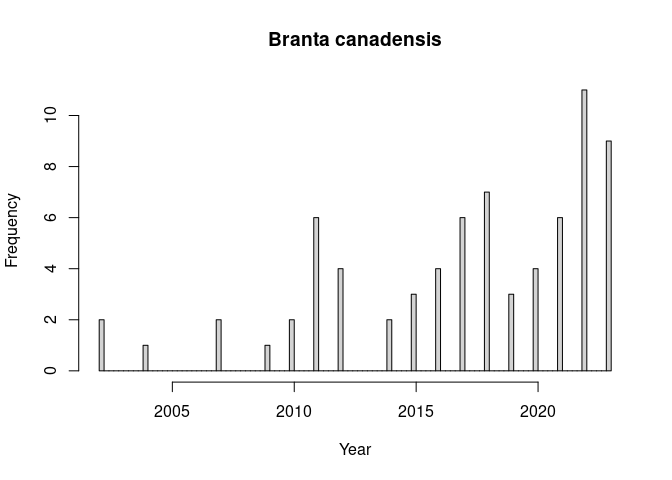<!-- -->

    ##                species    eventDate   
    ##  Cygnus buccinator :2   Min.   :2021  
    ##  Acanthis flammea  :0   1st Qu.:2021  
    ##  Accipiter cooperii:0   Median :2022  
    ##  Accipiter gentilis:0   Mean   :2022  
    ##  Accipiter striatus:0   3rd Qu.:2022  
    ##  Actitis macularius:0   Max.   :2022  
    ##  (Other)           :0

<!-- -->

    ##                species     eventDate   
    ##  Aix sponsa        :15   Min.   :1990  
    ##  Acanthis flammea  : 0   1st Qu.:2008  
    ##  Accipiter cooperii: 0   Median :2011  
    ##  Accipiter gentilis: 0   Mean   :2009  
    ##  Accipiter striatus: 0   3rd Qu.:2012  
    ##  Actitis macularius: 0   Max.   :2021  
    ##  (Other)           : 0

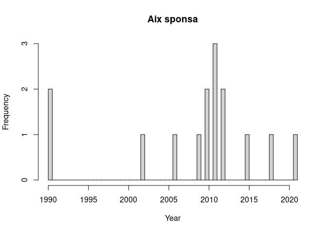<!-- -->

    ##                species     eventDate   
    ##  Spatula discors   :33   Min.   :1986  
    ##  Acanthis flammea  : 0   1st Qu.:2011  
    ##  Accipiter cooperii: 0   Median :2014  
    ##  Accipiter gentilis: 0   Mean   :2013  
    ##  Accipiter striatus: 0   3rd Qu.:2020  
    ##  Actitis macularius: 0   Max.   :2023  
    ##  (Other)           : 0

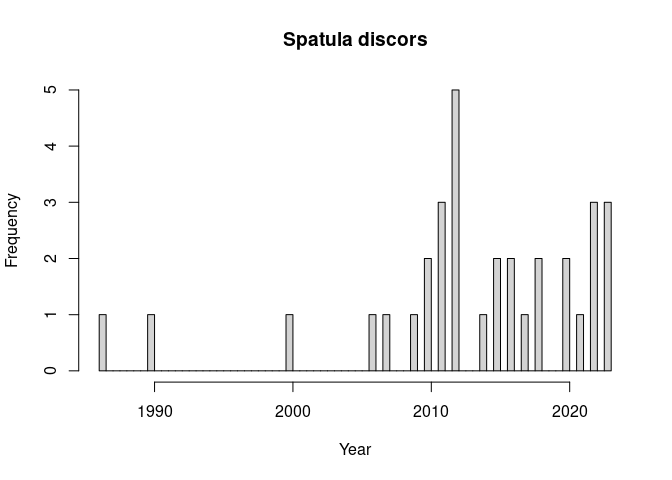<!-- -->

    ##                species     eventDate   
    ##  Spatula clypeata  :11   Min.   :2011  
    ##  Acanthis flammea  : 0   1st Qu.:2013  
    ##  Accipiter cooperii: 0   Median :2016  
    ##  Accipiter gentilis: 0   Mean   :2017  
    ##  Accipiter striatus: 0   3rd Qu.:2022  
    ##  Actitis macularius: 0   Max.   :2023  
    ##  (Other)           : 0

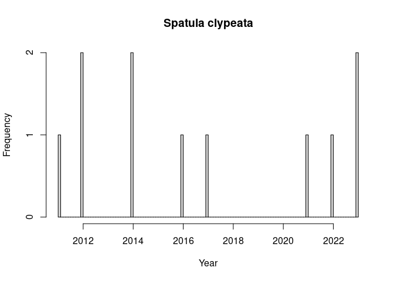<!-- -->

    ##                species    eventDate   
    ##  Mareca strepera   :8   Min.   :2000  
    ##  Acanthis flammea  :0   1st Qu.:2015  
    ##  Accipiter cooperii:0   Median :2022  
    ##  Accipiter gentilis:0   Mean   :2017  
    ##  Accipiter striatus:0   3rd Qu.:2022  
    ##  Actitis macularius:0   Max.   :2023  
    ##  (Other)           :0

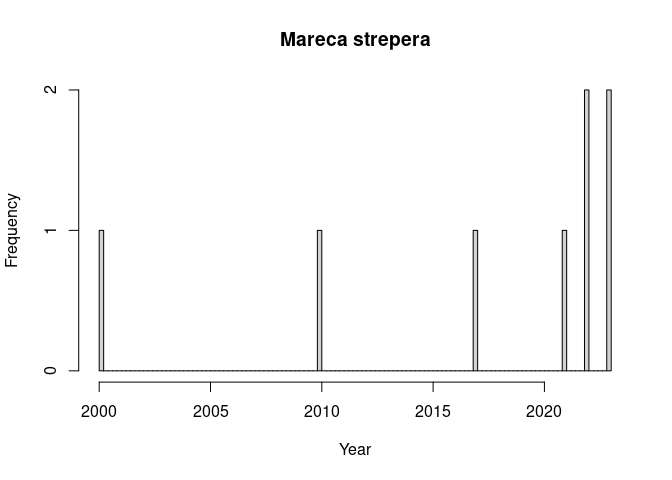<!-- -->

    ##                species    eventDate   
    ##  Mareca americana  :7   Min.   :2012  
    ##  Acanthis flammea  :0   1st Qu.:2015  
    ##  Accipiter cooperii:0   Median :2021  
    ##  Accipiter gentilis:0   Mean   :2019  
    ##  Accipiter striatus:0   3rd Qu.:2022  
    ##  Actitis macularius:0   Max.   :2023  
    ##  (Other)           :0

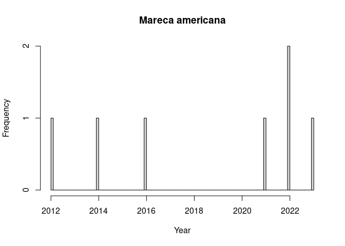<!-- -->

    ##                species     eventDate   
    ##  Anas platyrhynchos:39   Min.   :1985  
    ##  Acanthis flammea  : 0   1st Qu.:2011  
    ##  Accipiter cooperii: 0   Median :2016  
    ##  Accipiter gentilis: 0   Mean   :2013  
    ##  Accipiter striatus: 0   3rd Qu.:2020  
    ##  Actitis macularius: 0   Max.   :2023  
    ##  (Other)           : 0

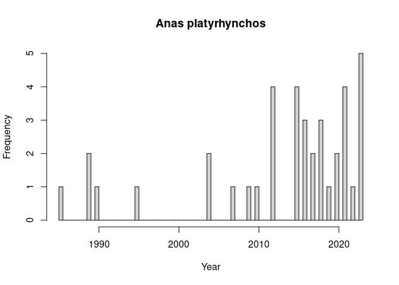<!-- -->

    ##                species    eventDate   
    ##  Anas acuta        :2   Min.   :2000  
    ##  Acanthis flammea  :0   1st Qu.:2005  
    ##  Accipiter cooperii:0   Median :2010  
    ##  Accipiter gentilis:0   Mean   :2010  
    ##  Accipiter striatus:0   3rd Qu.:2016  
    ##  Actitis macularius:0   Max.   :2021  
    ##  (Other)           :0

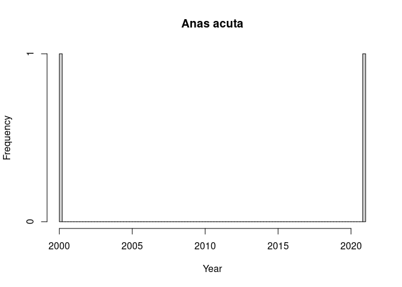<!-- -->

    ##                species    eventDate   
    ##  Anas crecca       :9   Min.   :2000  
    ##  Acanthis flammea  :0   1st Qu.:2012  
    ##  Accipiter cooperii:0   Median :2017  
    ##  Accipiter gentilis:0   Mean   :2016  
    ##  Accipiter striatus:0   3rd Qu.:2022  
    ##  Actitis macularius:0   Max.   :2023  
    ##  (Other)           :0

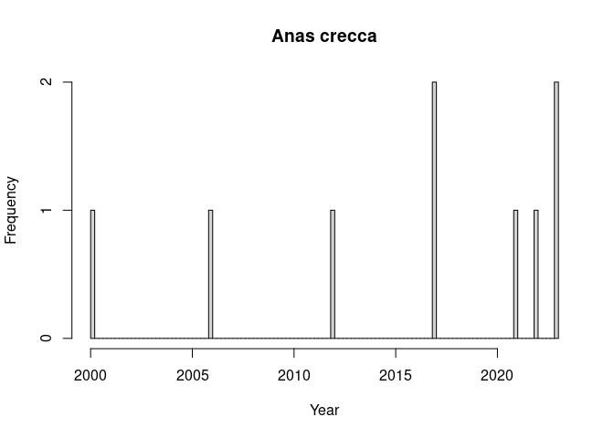<!-- -->

    ##                species    eventDate   
    ##  Aythya valisineria:2   Min.   :2022  
    ##  Acanthis flammea  :0   1st Qu.:2022  
    ##  Accipiter cooperii:0   Median :2022  
    ##  Accipiter gentilis:0   Mean   :2022  
    ##  Accipiter striatus:0   3rd Qu.:2023  
    ##  Actitis macularius:0   Max.   :2023  
    ##  (Other)           :0

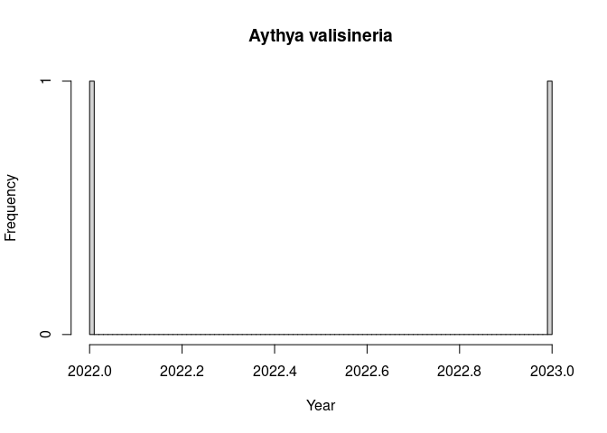<!-- -->

    ##                species    eventDate   
    ##  Aythya americana  :6   Min.   :2014  
    ##  Acanthis flammea  :0   1st Qu.:2017  
    ##  Accipiter cooperii:0   Median :2022  
    ##  Accipiter gentilis:0   Mean   :2020  
    ##  Accipiter striatus:0   3rd Qu.:2023  
    ##  Actitis macularius:0   Max.   :2023  
    ##  (Other)           :0

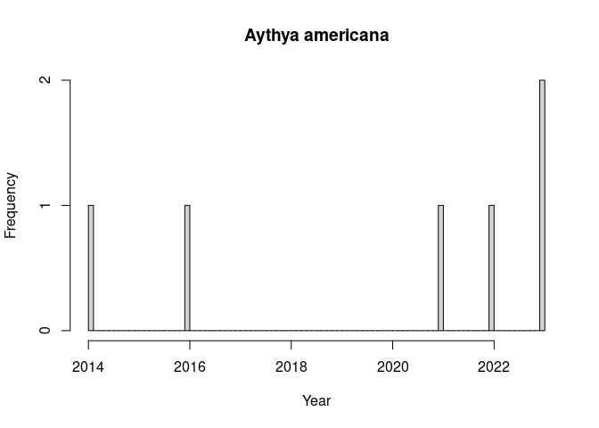<!-- -->

    ##                species     eventDate   
    ##  Aythya collaris   :11   Min.   :2000  
    ##  Acanthis flammea  : 0   1st Qu.:2013  
    ##  Accipiter cooperii: 0   Median :2017  
    ##  Accipiter gentilis: 0   Mean   :2017  
    ##  Accipiter striatus: 0   3rd Qu.:2022  
    ##  Actitis macularius: 0   Max.   :2023  
    ##  (Other)           : 0

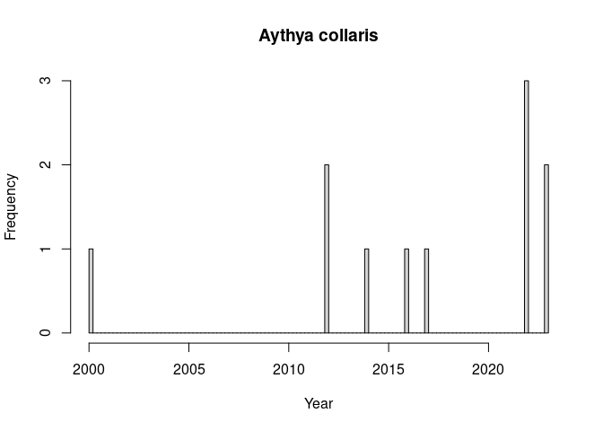<!-- -->

    ##                species    eventDate   
    ##  Aythya marila     :1   Min.   :2000  
    ##  Acanthis flammea  :0   1st Qu.:2000  
    ##  Accipiter cooperii:0   Median :2000  
    ##  Accipiter gentilis:0   Mean   :2000  
    ##  Accipiter striatus:0   3rd Qu.:2000  
    ##  Actitis macularius:0   Max.   :2000  
    ##  (Other)           :0

<!-- -->

    ##                species    eventDate   
    ##  Aythya affinis    :9   Min.   :2005  
    ##  Acanthis flammea  :0   1st Qu.:2011  
    ##  Accipiter cooperii:0   Median :2023  
    ##  Accipiter gentilis:0   Mean   :2018  
    ##  Accipiter striatus:0   3rd Qu.:2023  
    ##  Actitis macularius:0   Max.   :2023  
    ##  (Other)           :0

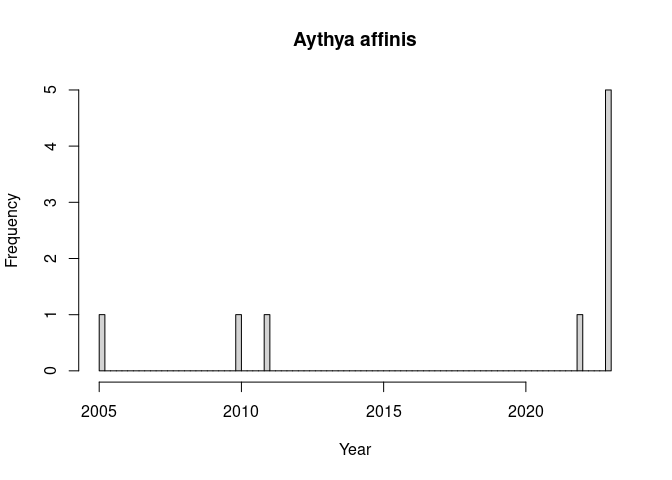<!-- -->

    ##                species    eventDate   
    ##  Bucephala albeola :3   Min.   :2016  
    ##  Acanthis flammea  :0   1st Qu.:2019  
    ##  Accipiter cooperii:0   Median :2022  
    ##  Accipiter gentilis:0   Mean   :2020  
    ##  Accipiter striatus:0   3rd Qu.:2022  
    ##  Actitis macularius:0   Max.   :2023  
    ##  (Other)           :0

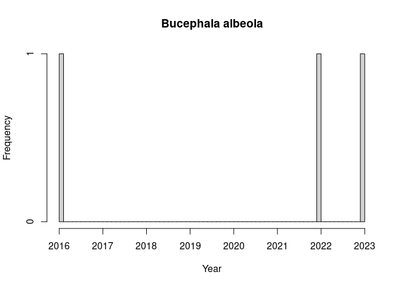<!-- -->

    ##                species    eventDate   
    ##  Bucephala clangula:3   Min.   :2001  
    ##  Acanthis flammea  :0   1st Qu.:2012  
    ##  Accipiter cooperii:0   Median :2023  
    ##  Accipiter gentilis:0   Mean   :2016  
    ##  Accipiter striatus:0   3rd Qu.:2023  
    ##  Actitis macularius:0   Max.   :2023  
    ##  (Other)           :0

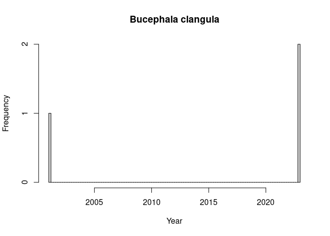<!-- -->

    ##                species    eventDate   
    ##  Mergus merganser  :3   Min.   :2009  
    ##  Acanthis flammea  :0   1st Qu.:2012  
    ##  Accipiter cooperii:0   Median :2014  
    ##  Accipiter gentilis:0   Mean   :2013  
    ##  Accipiter striatus:0   3rd Qu.:2015  
    ##  Actitis macularius:0   Max.   :2016  
    ##  (Other)           :0

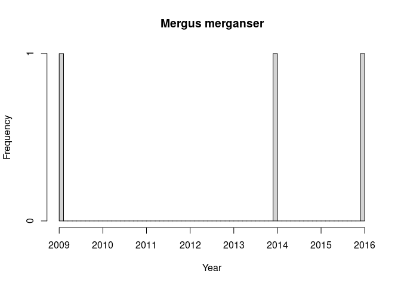<!-- -->

    ##                species    eventDate   
    ##  Oxyura jamaicensis:4   Min.   :2010  
    ##  Acanthis flammea  :0   1st Qu.:2012  
    ##  Accipiter cooperii:0   Median :2014  
    ##  Accipiter gentilis:0   Mean   :2015  
    ##  Accipiter striatus:0   3rd Qu.:2018  
    ##  Actitis macularius:0   Max.   :2023  
    ##  (Other)           :0

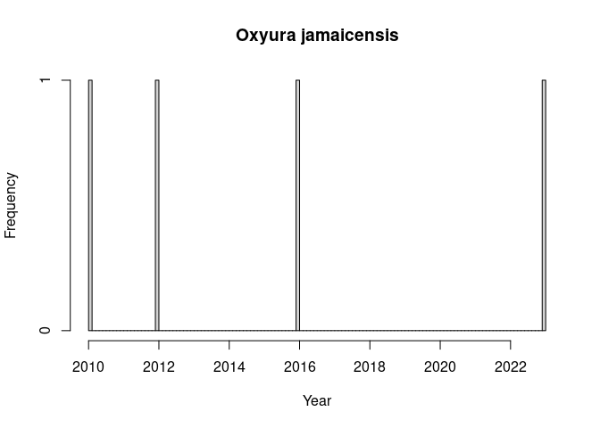<!-- -->

    ##                 species     eventDate   
    ##  Colinus virginianus:22   Min.   :2002  
    ##  Acanthis flammea   : 0   1st Qu.:2017  
    ##  Accipiter cooperii : 0   Median :2019  
    ##  Accipiter gentilis : 0   Mean   :2017  
    ##  Accipiter striatus : 0   3rd Qu.:2020  
    ##  Actitis macularius : 0   Max.   :2022  
    ##  (Other)            : 0

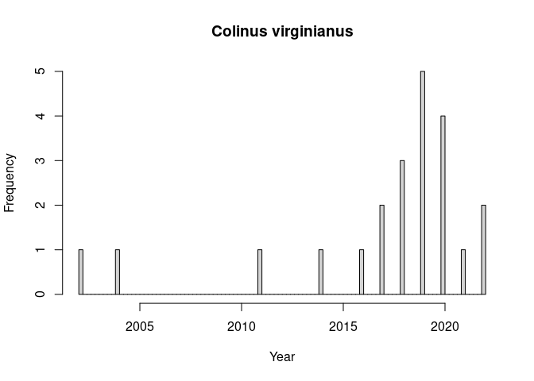<!-- -->

    ##                 species     eventDate   
    ##  Meleagris gallopavo:51   Min.   :2000  
    ##  Acanthis flammea   : 0   1st Qu.:2012  
    ##  Accipiter cooperii : 0   Median :2018  
    ##  Accipiter gentilis : 0   Mean   :2017  
    ##  Accipiter striatus : 0   3rd Qu.:2021  
    ##  Actitis macularius : 0   Max.   :2023  
    ##  (Other)            : 0

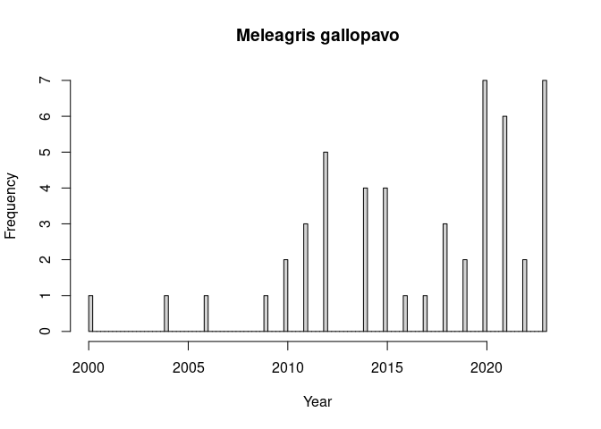<!-- -->

    ##                      species     eventDate   
    ##  Tympanuchus phasianellus:43   Min.   :1957  
    ##  Acanthis flammea        : 0   1st Qu.:2004  
    ##  Accipiter cooperii      : 0   Median :2017  
    ##  Accipiter gentilis      : 0   Mean   :2010  
    ##  Accipiter striatus      : 0   3rd Qu.:2022  
    ##  Actitis macularius      : 0   Max.   :2023  
    ##  (Other)                 : 0

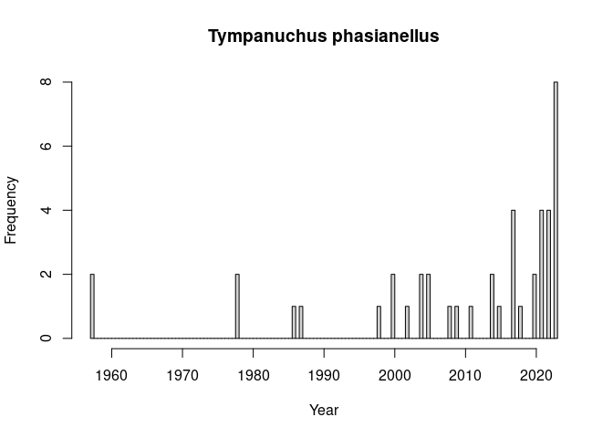<!-- -->

    ##                species     eventDate   
    ##  Tympanuchus cupido:19   Min.   :1986  
    ##  Acanthis flammea  : 0   1st Qu.:2000  
    ##  Accipiter cooperii: 0   Median :2010  
    ##  Accipiter gentilis: 0   Mean   :2009  
    ##  Accipiter striatus: 0   3rd Qu.:2019  
    ##  Actitis macularius: 0   Max.   :2023  
    ##  (Other)           : 0

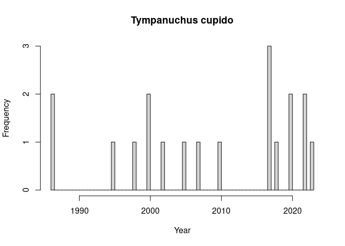<!-- -->

    ##                 species     eventDate   
    ##  Phasianus colchicus:16   Min.   :1986  
    ##  Acanthis flammea   : 0   1st Qu.:2005  
    ##  Accipiter cooperii : 0   Median :2010  
    ##  Accipiter gentilis : 0   Mean   :2009  
    ##  Accipiter striatus : 0   3rd Qu.:2017  
    ##  Actitis macularius : 0   Max.   :2023  
    ##  (Other)            : 0

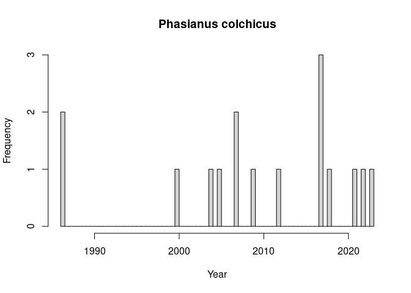<!-- -->

    ##                 species    eventDate   
    ##  Podilymbus podiceps:7   Min.   :1987  
    ##  Acanthis flammea   :0   1st Qu.:2012  
    ##  Accipiter cooperii :0   Median :2015  
    ##  Accipiter gentilis :0   Mean   :2011  
    ##  Accipiter striatus :0   3rd Qu.:2016  
    ##  Actitis macularius :0   Max.   :2021  
    ##  (Other)            :0

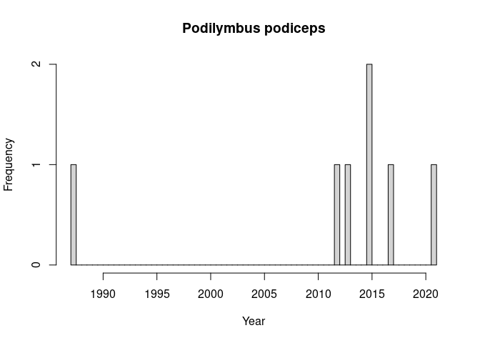<!-- -->

    ##                  species    eventDate   
    ##  Podiceps nigricollis:2   Min.   :2007  
    ##  Acanthis flammea    :0   1st Qu.:2011  
    ##  Accipiter cooperii  :0   Median :2015  
    ##  Accipiter gentilis  :0   Mean   :2015  
    ##  Accipiter striatus  :0   3rd Qu.:2019  
    ##  Actitis macularius  :0   Max.   :2023  
    ##  (Other)             :0

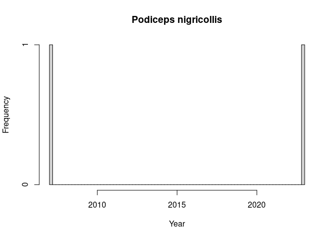<!-- -->

    ##                   species     eventDate   
    ##  Streptopelia decaocto:55   Min.   :2007  
    ##  Acanthis flammea     : 0   1st Qu.:2014  
    ##  Accipiter cooperii   : 0   Median :2017  
    ##  Accipiter gentilis   : 0   Mean   :2017  
    ##  Accipiter striatus   : 0   3rd Qu.:2020  
    ##  Actitis macularius   : 0   Max.   :2023  
    ##  (Other)              : 0

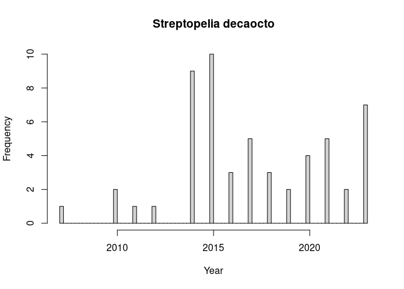<!-- -->

    ##                species      eventDate   
    ##  Zenaida macroura  :169   Min.   :1985  
    ##  Acanthis flammea  :  0   1st Qu.:2014  
    ##  Accipiter cooperii:  0   Median :2018  
    ##  Accipiter gentilis:  0   Mean   :2015  
    ##  Accipiter striatus:  0   3rd Qu.:2021  
    ##  Actitis macularius:  0   Max.   :2023  
    ##  (Other)           :  0

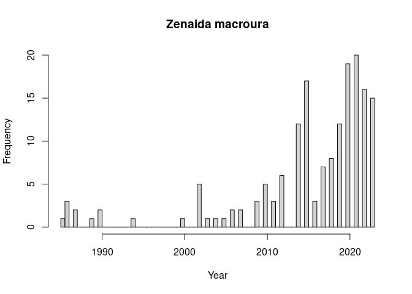<!-- -->

    ##                 species     eventDate   
    ##  Coccyzus americanus:21   Min.   :2007  
    ##  Acanthis flammea   : 0   1st Qu.:2015  
    ##  Accipiter cooperii : 0   Median :2018  
    ##  Accipiter gentilis : 0   Mean   :2018  
    ##  Accipiter striatus : 0   3rd Qu.:2022  
    ##  Actitis macularius : 0   Max.   :2023  
    ##  (Other)            : 0

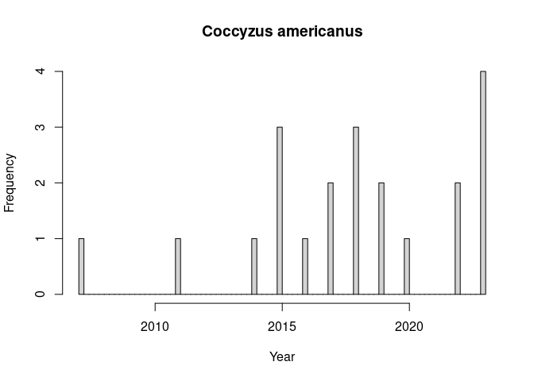<!-- -->

    ##                      species    eventDate   
    ##  Coccyzus erythropthalmus:3   Min.   :2014  
    ##  Acanthis flammea        :0   1st Qu.:2014  
    ##  Accipiter cooperii      :0   Median :2014  
    ##  Accipiter gentilis      :0   Mean   :2017  
    ##  Accipiter striatus      :0   3rd Qu.:2018  
    ##  Actitis macularius      :0   Max.   :2022  
    ##  (Other)                 :0

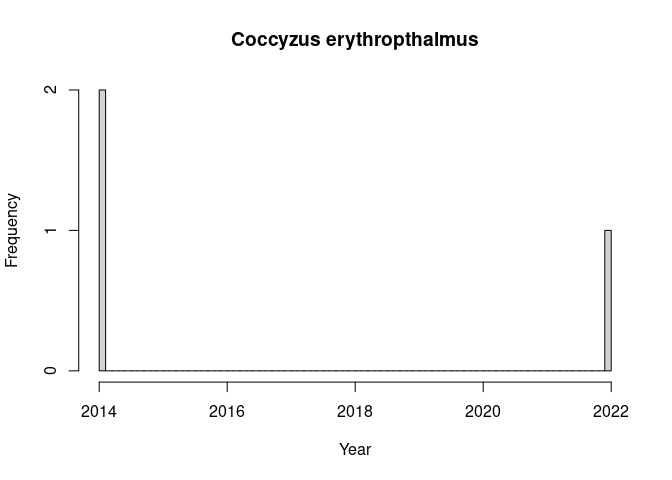<!-- -->

    ##                species     eventDate   
    ##  Chordeiles minor  :20   Min.   :1986  
    ##  Acanthis flammea  : 0   1st Qu.:2011  
    ##  Accipiter cooperii: 0   Median :2017  
    ##  Accipiter gentilis: 0   Mean   :2013  
    ##  Accipiter striatus: 0   3rd Qu.:2020  
    ##  Actitis macularius: 0   Max.   :2022  
    ##  (Other)           : 0

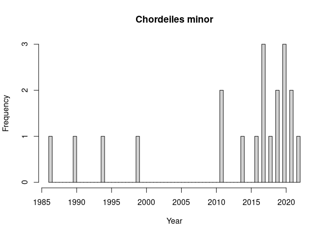<!-- -->

    ##                      species     eventDate   
    ##  Phalaenoptilus nuttallii:13   Min.   :1957  
    ##  Acanthis flammea        : 0   1st Qu.:1995  
    ##  Accipiter cooperii      : 0   Median :2009  
    ##  Accipiter gentilis      : 0   Mean   :2004  
    ##  Accipiter striatus      : 0   3rd Qu.:2018  
    ##  Actitis macularius      : 0   Max.   :2020  
    ##  (Other)                 : 0

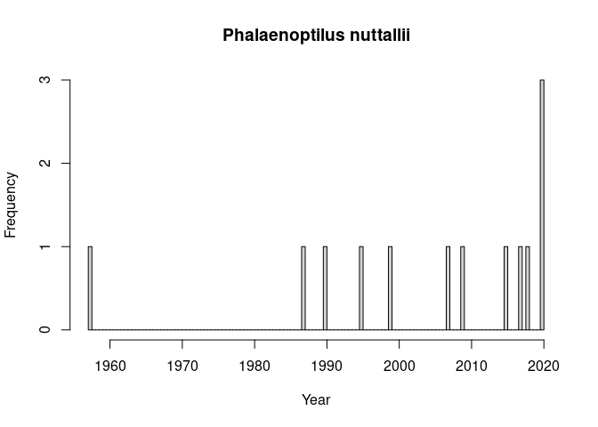<!-- -->

    ##                   species    eventDate   
    ##  Antrostomus vociferus:3   Min.   :2009  
    ##  Acanthis flammea     :0   1st Qu.:2012  
    ##  Accipiter cooperii   :0   Median :2015  
    ##  Accipiter gentilis   :0   Mean   :2013  
    ##  Accipiter striatus   :0   3rd Qu.:2016  
    ##  Actitis macularius   :0   Max.   :2016  
    ##  (Other)              :0

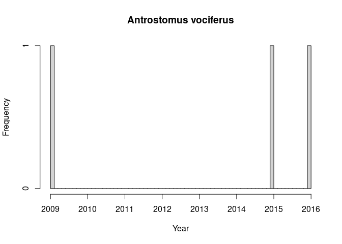<!-- -->

    ##                species     eventDate   
    ##  Chaetura pelagica :25   Min.   :1986  
    ##  Acanthis flammea  : 0   1st Qu.:2012  
    ##  Accipiter cooperii: 0   Median :2016  
    ##  Accipiter gentilis: 0   Mean   :2014  
    ##  Accipiter striatus: 0   3rd Qu.:2021  
    ##  Actitis macularius: 0   Max.   :2023  
    ##  (Other)           : 0

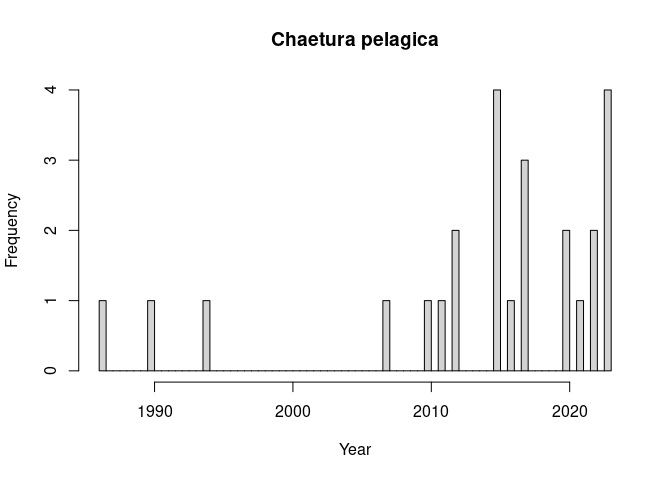<!-- -->

    ##                  species    eventDate   
    ##  Archilochus colubris:1   Min.   :1990  
    ##  Acanthis flammea    :0   1st Qu.:1990  
    ##  Accipiter cooperii  :0   Median :1990  
    ##  Accipiter gentilis  :0   Mean   :1990  
    ##  Accipiter striatus  :0   3rd Qu.:1990  
    ##  Actitis macularius  :0   Max.   :1990  
    ##  (Other)             :0

<!-- -->

    ##                species    eventDate   
    ##  Porzana carolina  :1   Min.   :2009  
    ##  Acanthis flammea  :0   1st Qu.:2009  
    ##  Accipiter cooperii:0   Median :2009  
    ##  Accipiter gentilis:0   Mean   :2009  
    ##  Accipiter striatus:0   3rd Qu.:2009  
    ##  Actitis macularius:0   Max.   :2009  
    ##  (Other)           :0

<!-- -->

    ##                species    eventDate   
    ##  Fulica americana  :7   Min.   :2000  
    ##  Acanthis flammea  :0   1st Qu.:2012  
    ##  Accipiter cooperii:0   Median :2015  
    ##  Accipiter gentilis:0   Mean   :2015  
    ##  Accipiter striatus:0   3rd Qu.:2022  
    ##  Actitis macularius:0   Max.   :2023  
    ##  (Other)           :0

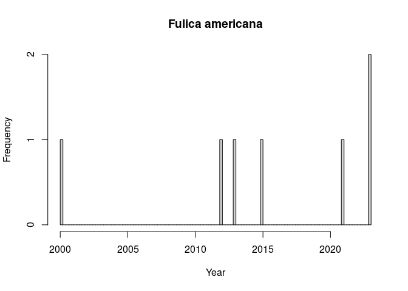<!-- -->

    ##                 species    eventDate   
    ##  Antigone canadensis:7   Min.   :2000  
    ##  Acanthis flammea   :0   1st Qu.:2011  
    ##  Accipiter cooperii :0   Median :2017  
    ##  Accipiter gentilis :0   Mean   :2014  
    ##  Accipiter striatus :0   3rd Qu.:2020  
    ##  Actitis macularius :0   Max.   :2021  
    ##  (Other)            :0

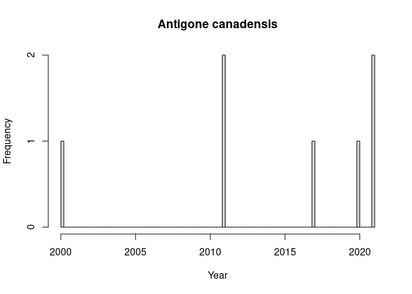<!-- -->

    ##                     species    eventDate   
    ##  Recurvirostra americana:1   Min.   :1986  
    ##  Acanthis flammea       :0   1st Qu.:1986  
    ##  Accipiter cooperii     :0   Median :1986  
    ##  Accipiter gentilis     :0   Mean   :1986  
    ##  Accipiter striatus     :0   3rd Qu.:1986  
    ##  Actitis macularius     :0   Max.   :1986  
    ##  (Other)                :0

<!-- -->

    ##                species    eventDate   
    ##  Pluvialis dominica:1   Min.   :2018  
    ##  Acanthis flammea  :0   1st Qu.:2018  
    ##  Accipiter cooperii:0   Median :2018  
    ##  Accipiter gentilis:0   Mean   :2018  
    ##  Accipiter striatus:0   3rd Qu.:2018  
    ##  Actitis macularius:0   Max.   :2018  
    ##  (Other)           :0

<!-- -->

    ##                  species     eventDate   
    ##  Charadrius vociferus:49   Min.   :1978  
    ##  Acanthis flammea    : 0   1st Qu.:2009  
    ##  Accipiter cooperii  : 0   Median :2016  
    ##  Accipiter gentilis  : 0   Mean   :2013  
    ##  Accipiter striatus  : 0   3rd Qu.:2020  
    ##  Actitis macularius  : 0   Max.   :2023  
    ##  (Other)             : 0

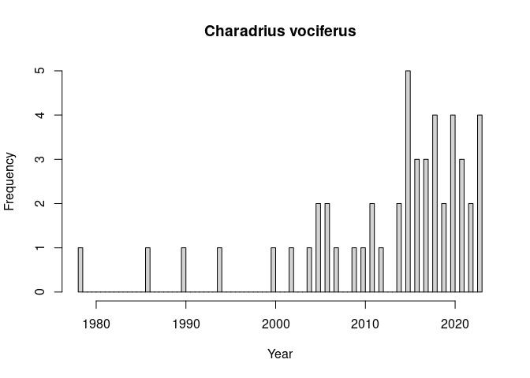<!-- -->

    ##                  species     eventDate   
    ##  Bartramia longicauda:10   Min.   :1986  
    ##  Acanthis flammea    : 0   1st Qu.:2011  
    ##  Accipiter cooperii  : 0   Median :2017  
    ##  Accipiter gentilis  : 0   Mean   :2014  
    ##  Accipiter striatus  : 0   3rd Qu.:2020  
    ##  Actitis macularius  : 0   Max.   :2023  
    ##  (Other)             : 0

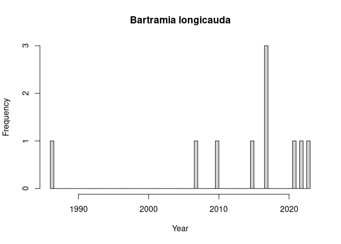<!-- -->

    ##                 species     eventDate   
    ##  Numenius americanus:12   Min.   :2005  
    ##  Acanthis flammea   : 0   1st Qu.:2009  
    ##  Accipiter cooperii : 0   Median :2016  
    ##  Accipiter gentilis : 0   Mean   :2015  
    ##  Accipiter striatus : 0   3rd Qu.:2022  
    ##  Actitis macularius : 0   Max.   :2023  
    ##  (Other)            : 0

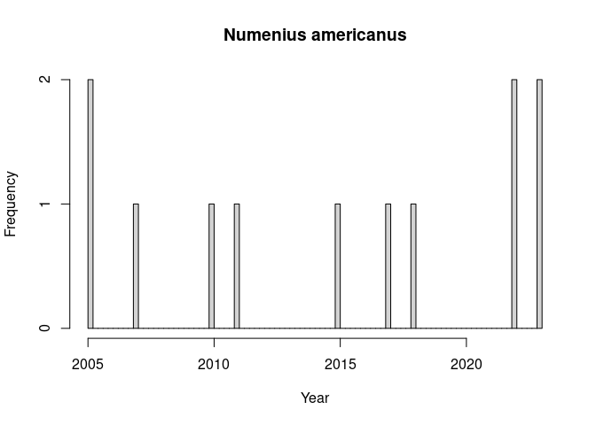<!-- -->

    ##                species    eventDate   
    ##  Calidris minutilla:1   Min.   :2009  
    ##  Acanthis flammea  :0   1st Qu.:2009  
    ##  Accipiter cooperii:0   Median :2009  
    ##  Accipiter gentilis:0   Mean   :2009  
    ##  Accipiter striatus:0   3rd Qu.:2009  
    ##  Actitis macularius:0   Max.   :2009  
    ##  (Other)           :0

<!-- -->

    ##                species    eventDate   
    ##  Gallinago delicata:3   Min.   :1989  
    ##  Acanthis flammea  :0   1st Qu.:1997  
    ##  Accipiter cooperii:0   Median :2005  
    ##  Accipiter gentilis:0   Mean   :2003  
    ##  Accipiter striatus:0   3rd Qu.:2010  
    ##  Actitis macularius:0   Max.   :2015  
    ##  (Other)           :0

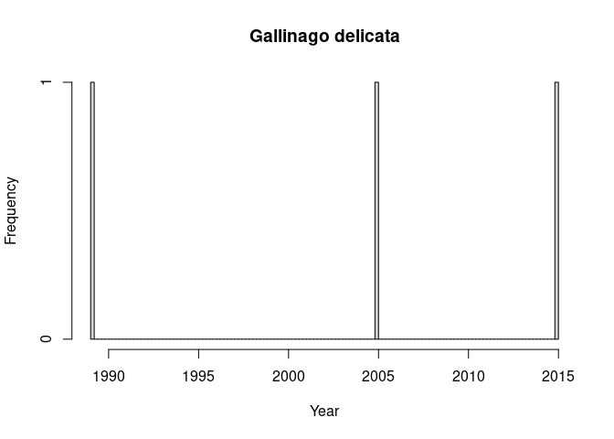<!-- -->

    ##                  species     eventDate   
    ##  Actitis macularius  :11   Min.   :1986  
    ##  Acanthis flammea    : 0   1st Qu.:2008  
    ##  Accipiter cooperii  : 0   Median :2014  
    ##  Accipiter gentilis  : 0   Mean   :2011  
    ##  Accipiter striatus  : 0   3rd Qu.:2018  
    ##  Aechmophorus clarkii: 0   Max.   :2022  
    ##  (Other)             : 0

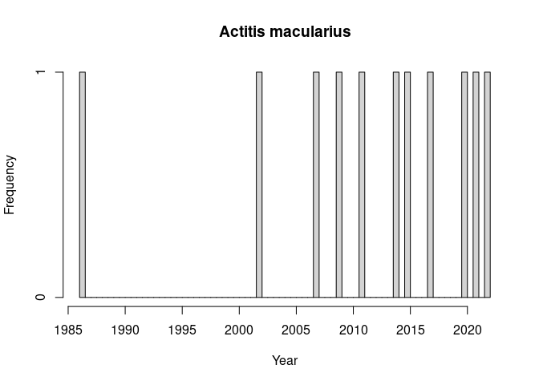<!-- -->

    ##                species    eventDate   
    ##  Tringa melanoleuca:3   Min.   :1986  
    ##  Acanthis flammea  :0   1st Qu.:1993  
    ##  Accipiter cooperii:0   Median :2000  
    ##  Accipiter gentilis:0   Mean   :2003  
    ##  Accipiter striatus:0   3rd Qu.:2012  
    ##  Actitis macularius:0   Max.   :2023  
    ##  (Other)           :0

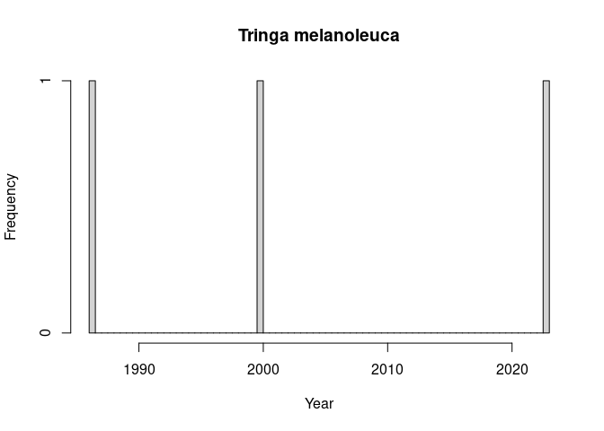<!-- -->

    ##                species    eventDate   
    ##  Larus delawarensis:2   Min.   :2011  
    ##  Acanthis flammea  :0   1st Qu.:2014  
    ##  Accipiter cooperii:0   Median :2016  
    ##  Accipiter gentilis:0   Mean   :2016  
    ##  Accipiter striatus:0   3rd Qu.:2018  
    ##  Actitis macularius:0   Max.   :2021  
    ##  (Other)           :0

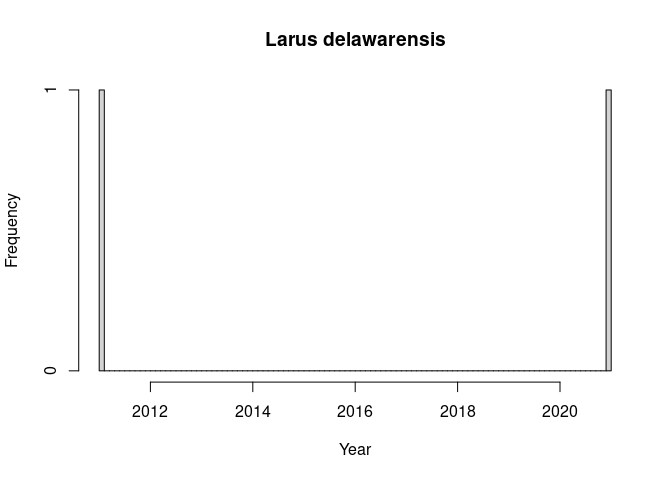<!-- -->

    ##                species    eventDate   
    ##  Chlidonias niger  :1   Min.   :2021  
    ##  Acanthis flammea  :0   1st Qu.:2021  
    ##  Accipiter cooperii:0   Median :2021  
    ##  Accipiter gentilis:0   Mean   :2021  
    ##  Accipiter striatus:0   3rd Qu.:2021  
    ##  Actitis macularius:0   Max.   :2021  
    ##  (Other)           :0

<!-- -->

    ##                species    eventDate   
    ##  Sterna forsteri   :1   Min.   :2018  
    ##  Acanthis flammea  :0   1st Qu.:2018  
    ##  Accipiter cooperii:0   Median :2018  
    ##  Accipiter gentilis:0   Mean   :2018  
    ##  Accipiter striatus:0   3rd Qu.:2018  
    ##  Actitis macularius:0   Max.   :2018  
    ##  (Other)           :0

<!-- -->

    ##                 species     eventDate   
    ##  Nannopterum auritum:12   Min.   :1986  
    ##  Acanthis flammea   : 0   1st Qu.:1993  
    ##  Accipiter cooperii : 0   Median :2008  
    ##  Accipiter gentilis : 0   Mean   :2006  
    ##  Accipiter striatus : 0   3rd Qu.:2018  
    ##  Actitis macularius : 0   Max.   :2023  
    ##  (Other)            : 0

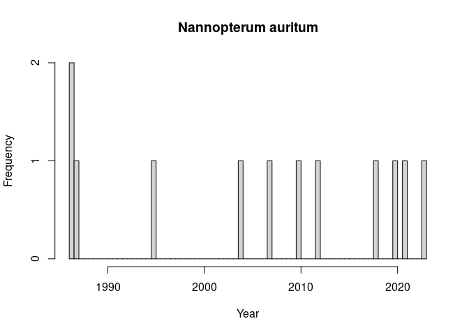<!-- -->

    ##                       species    eventDate   
    ##  Pelecanus erythrorhynchos:2   Min.   :1995  
    ##  Acanthis flammea         :0   1st Qu.:2002  
    ##  Accipiter cooperii       :0   Median :2008  
    ##  Accipiter gentilis       :0   Mean   :2008  
    ##  Accipiter striatus       :0   3rd Qu.:2014  
    ##  Actitis macularius       :0   Max.   :2021  
    ##  (Other)                  :0

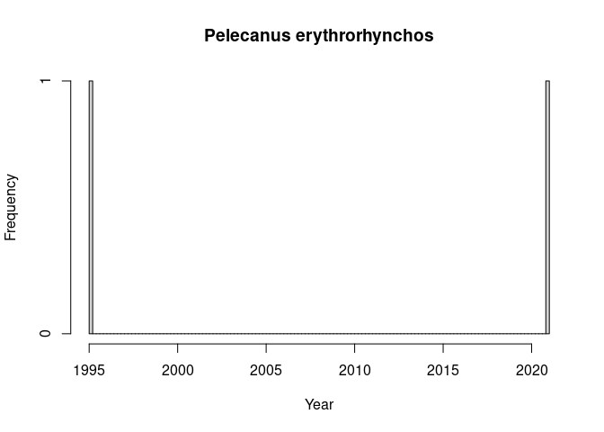<!-- -->

    ##                   species    eventDate   
    ##  Botaurus lentiginosus:1   Min.   :2023  
    ##  Acanthis flammea     :0   1st Qu.:2023  
    ##  Accipiter cooperii   :0   Median :2023  
    ##  Accipiter gentilis   :0   Mean   :2023  
    ##  Accipiter striatus   :0   3rd Qu.:2023  
    ##  Actitis macularius   :0   Max.   :2023  
    ##  (Other)              :0

<!-- -->

    ##                species     eventDate   
    ##  Ardea herodias    :19   Min.   :1905  
    ##  Acanthis flammea  : 0   1st Qu.:2003  
    ##  Accipiter cooperii: 0   Median :2010  
    ##  Accipiter gentilis: 0   Mean   :2004  
    ##  Accipiter striatus: 0   3rd Qu.:2020  
    ##  Actitis macularius: 0   Max.   :2023  
    ##  (Other)           : 0

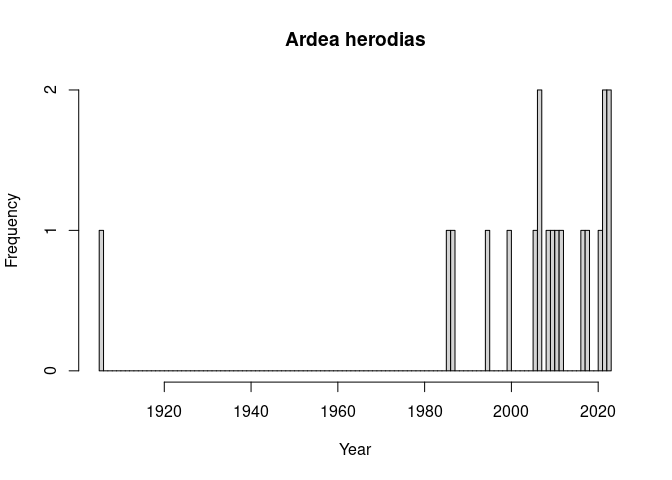<!-- -->

    ##                 species    eventDate   
    ##  Butorides virescens:2   Min.   :2007  
    ##  Acanthis flammea   :0   1st Qu.:2011  
    ##  Accipiter cooperii :0   Median :2014  
    ##  Accipiter gentilis :0   Mean   :2014  
    ##  Accipiter striatus :0   3rd Qu.:2018  
    ##  Actitis macularius :0   Max.   :2022  
    ##  (Other)            :0

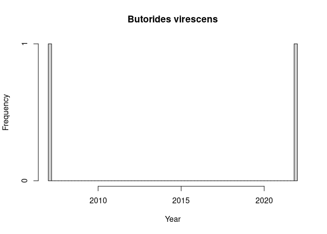<!-- -->

    ##                species    eventDate   
    ##  Plegadis chihi    :2   Min.   :2013  
    ##  Acanthis flammea  :0   1st Qu.:2014  
    ##  Accipiter cooperii:0   Median :2015  
    ##  Accipiter gentilis:0   Mean   :2015  
    ##  Accipiter striatus:0   3rd Qu.:2016  
    ##  Actitis macularius:0   Max.   :2017  
    ##  (Other)           :0

<!-- -->

    ##                species      eventDate   
    ##  Cathartes aura    :117   Min.   :1986  
    ##  Acanthis flammea  :  0   1st Qu.:2013  
    ##  Accipiter cooperii:  0   Median :2018  
    ##  Accipiter gentilis:  0   Mean   :2015  
    ##  Accipiter striatus:  0   3rd Qu.:2021  
    ##  Actitis macularius:  0   Max.   :2023  
    ##  (Other)           :  0

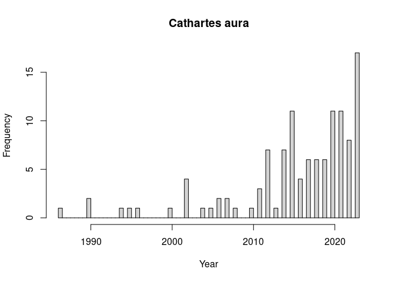<!-- -->

    ##                species    eventDate   
    ##  Pandion haliaetus :6   Min.   :1986  
    ##  Acanthis flammea  :0   1st Qu.:2006  
    ##  Accipiter cooperii:0   Median :2017  
    ##  Accipiter gentilis:0   Mean   :2011  
    ##  Accipiter striatus:0   3rd Qu.:2019  
    ##  Actitis macularius:0   Max.   :2022  
    ##  (Other)           :0

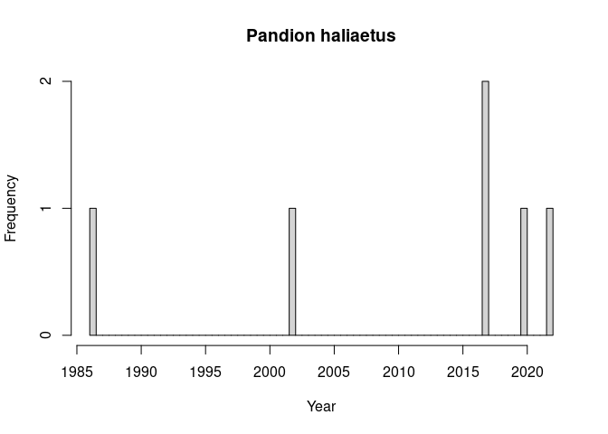<!-- -->

    ##                species    eventDate   
    ##  Aquila chrysaetos :3   Min.   :1987  
    ##  Acanthis flammea  :0   1st Qu.:1988  
    ##  Accipiter cooperii:0   Median :1989  
    ##  Accipiter gentilis:0   Mean   :1999  
    ##  Accipiter striatus:0   3rd Qu.:2005  
    ##  Actitis macularius:0   Max.   :2021  
    ##  (Other)           :0

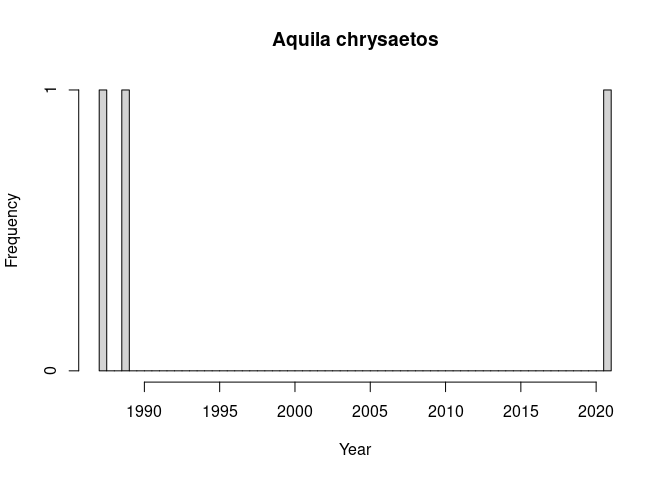<!-- -->

    ##                species     eventDate   
    ##  Circus hudsonius  :28   Min.   :1986  
    ##  Acanthis flammea  : 0   1st Qu.:2001  
    ##  Accipiter cooperii: 0   Median :2012  
    ##  Accipiter gentilis: 0   Mean   :2009  
    ##  Accipiter striatus: 0   3rd Qu.:2021  
    ##  Actitis macularius: 0   Max.   :2023  
    ##  (Other)           : 0

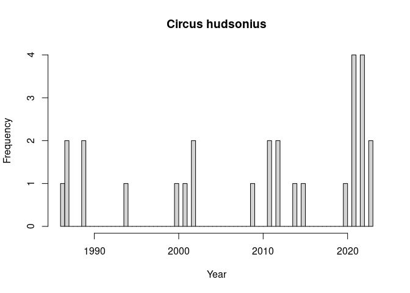<!-- -->

    ##                  species    eventDate   
    ##  Accipiter striatus  :7   Min.   :1985  
    ##  Acanthis flammea    :0   1st Qu.:1990  
    ##  Accipiter cooperii  :0   Median :1995  
    ##  Accipiter gentilis  :0   Mean   :2001  
    ##  Actitis macularius  :0   3rd Qu.:2012  
    ##  Aechmophorus clarkii:0   Max.   :2021  
    ##  (Other)             :0

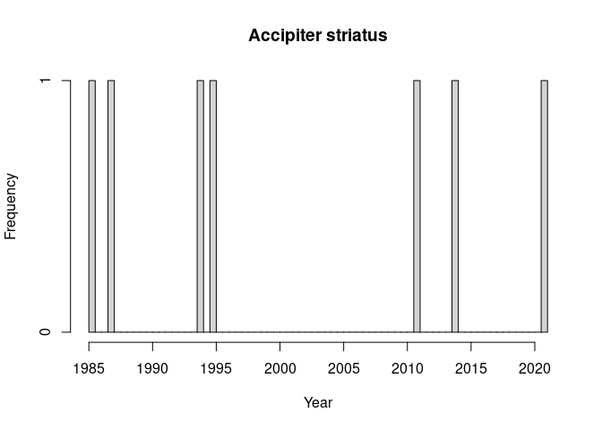<!-- -->

    ##                  species     eventDate   
    ##  Accipiter cooperii  :11   Min.   :1990  
    ##  Acanthis flammea    : 0   1st Qu.:2010  
    ##  Accipiter gentilis  : 0   Median :2018  
    ##  Accipiter striatus  : 0   Mean   :2014  
    ##  Actitis macularius  : 0   3rd Qu.:2020  
    ##  Aechmophorus clarkii: 0   Max.   :2022  
    ##  (Other)             : 0

<!-- -->

    ##                      species     eventDate   
    ##  Haliaeetus leucocephalus:18   Min.   :1978  
    ##  Acanthis flammea        : 0   1st Qu.:2016  
    ##  Accipiter cooperii      : 0   Median :2020  
    ##  Accipiter gentilis      : 0   Mean   :2017  
    ##  Accipiter striatus      : 0   3rd Qu.:2022  
    ##  Actitis macularius      : 0   Max.   :2023  
    ##  (Other)                 : 0

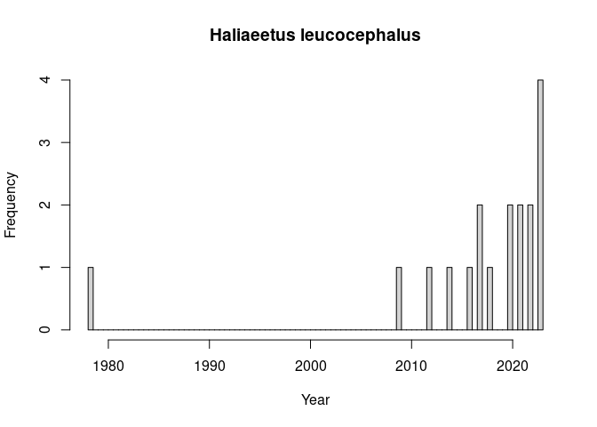<!-- -->

    ##                species    eventDate   
    ##  Buteo platypterus :4   Min.   :2015  
    ##  Acanthis flammea  :0   1st Qu.:2016  
    ##  Accipiter cooperii:0   Median :2020  
    ##  Accipiter gentilis:0   Mean   :2019  
    ##  Accipiter striatus:0   3rd Qu.:2022  
    ##  Actitis macularius:0   Max.   :2023  
    ##  (Other)           :0

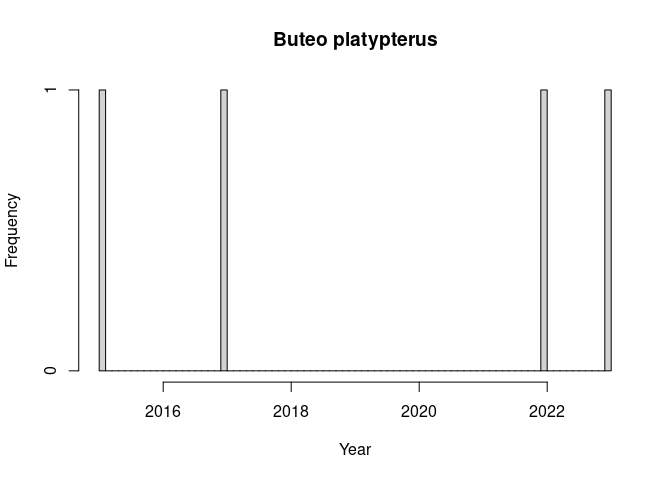<!-- -->

    ##                species     eventDate   
    ##  Buteo swainsoni   :11   Min.   :1986  
    ##  Acanthis flammea  : 0   1st Qu.:2004  
    ##  Accipiter cooperii: 0   Median :2015  
    ##  Accipiter gentilis: 0   Mean   :2010  
    ##  Accipiter striatus: 0   3rd Qu.:2018  
    ##  Actitis macularius: 0   Max.   :2021  
    ##  (Other)           : 0

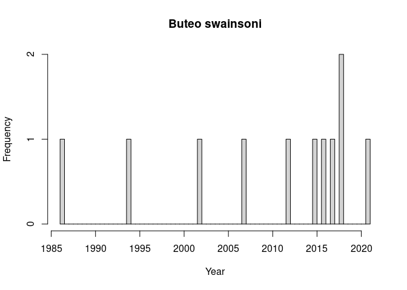<!-- -->

    ##                species     eventDate   
    ##  Buteo jamaicensis :81   Min.   :1978  
    ##  Acanthis flammea  : 0   1st Qu.:2005  
    ##  Accipiter cooperii: 0   Median :2015  
    ##  Accipiter gentilis: 0   Mean   :2011  
    ##  Accipiter striatus: 0   3rd Qu.:2021  
    ##  Actitis macularius: 0   Max.   :2023  
    ##  (Other)           : 0

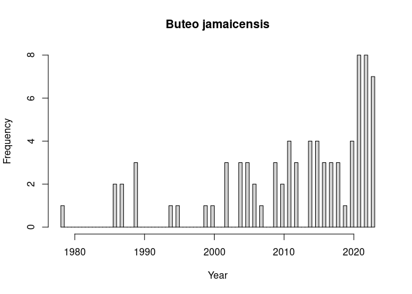<!-- -->

    ##                species    eventDate   
    ##  Buteo lagopus     :4   Min.   :2001  
    ##  Acanthis flammea  :0   1st Qu.:2004  
    ##  Accipiter cooperii:0   Median :2005  
    ##  Accipiter gentilis:0   Mean   :2008  
    ##  Accipiter striatus:0   3rd Qu.:2009  
    ##  Actitis macularius:0   Max.   :2021  
    ##  (Other)           :0

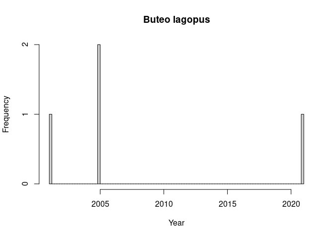<!-- -->

    ##                species    eventDate   
    ##  Buteo regalis     :1   Min.   :2021  
    ##  Acanthis flammea  :0   1st Qu.:2021  
    ##  Accipiter cooperii:0   Median :2021  
    ##  Accipiter gentilis:0   Mean   :2021  
    ##  Accipiter striatus:0   3rd Qu.:2021  
    ##  Actitis macularius:0   Max.   :2021  
    ##  (Other)           :0

<!-- -->

    ##                species    eventDate   
    ##  Tyto alba         :1   Min.   :1987  
    ##  Acanthis flammea  :0   1st Qu.:1987  
    ##  Accipiter cooperii:0   Median :1987  
    ##  Accipiter gentilis:0   Mean   :1987  
    ##  Accipiter striatus:0   3rd Qu.:1987  
    ##  Actitis macularius:0   Max.   :1987  
    ##  (Other)           :0

<!-- -->

    ##                species     eventDate   
    ##  Megascops asio    :11   Min.   :1983  
    ##  Acanthis flammea  : 0   1st Qu.:2000  
    ##  Accipiter cooperii: 0   Median :2008  
    ##  Accipiter gentilis: 0   Mean   :2006  
    ##  Accipiter striatus: 0   3rd Qu.:2013  
    ##  Actitis macularius: 0   Max.   :2022  
    ##  (Other)           : 0

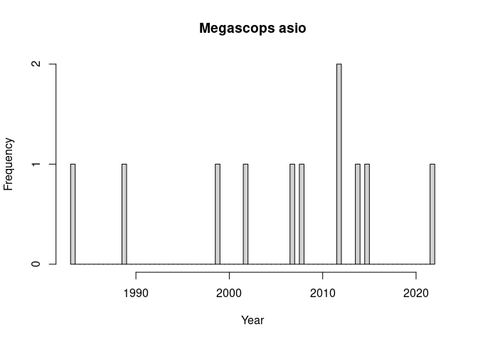<!-- -->

    ##                species     eventDate   
    ##  Bubo virginianus  :24   Min.   :1978  
    ##  Acanthis flammea  : 0   1st Qu.:2002  
    ##  Accipiter cooperii: 0   Median :2014  
    ##  Accipiter gentilis: 0   Mean   :2009  
    ##  Accipiter striatus: 0   3rd Qu.:2021  
    ##  Actitis macularius: 0   Max.   :2022  
    ##  (Other)           : 0

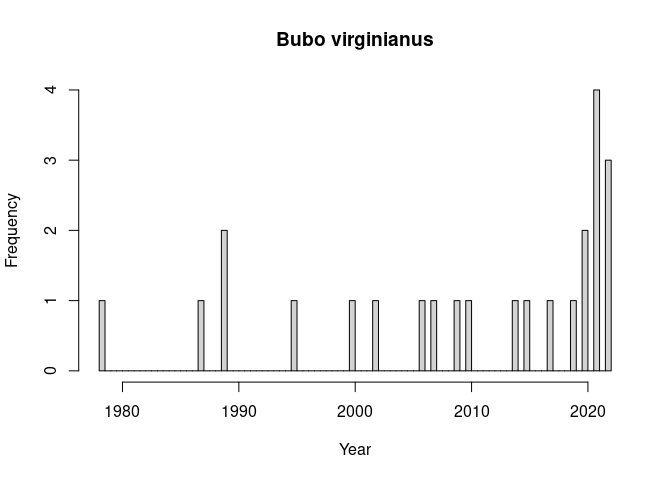<!-- -->

    ##                species    eventDate   
    ##  Athene cunicularia:2   Min.   :2005  
    ##  Acanthis flammea  :0   1st Qu.:2010  
    ##  Accipiter cooperii:0   Median :2014  
    ##  Accipiter gentilis:0   Mean   :2014  
    ##  Accipiter striatus:0   3rd Qu.:2018  
    ##  Actitis macularius:0   Max.   :2023  
    ##  (Other)           :0

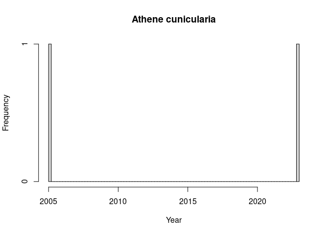<!-- -->

    ##                species    eventDate   
    ##  Aegolius acadicus :2   Min.   :2016  
    ##  Acanthis flammea  :0   1st Qu.:2016  
    ##  Accipiter cooperii:0   Median :2017  
    ##  Accipiter gentilis:0   Mean   :2017  
    ##  Accipiter striatus:0   3rd Qu.:2018  
    ##  Actitis macularius:0   Max.   :2018  
    ##  (Other)           :0

<!-- -->

    ##                species     eventDate   
    ##  Megaceryle alcyon :33   Min.   :1985  
    ##  Acanthis flammea  : 0   1st Qu.:2004  
    ##  Accipiter cooperii: 0   Median :2015  
    ##  Accipiter gentilis: 0   Mean   :2009  
    ##  Accipiter striatus: 0   3rd Qu.:2017  
    ##  Actitis macularius: 0   Max.   :2023  
    ##  (Other)           : 0

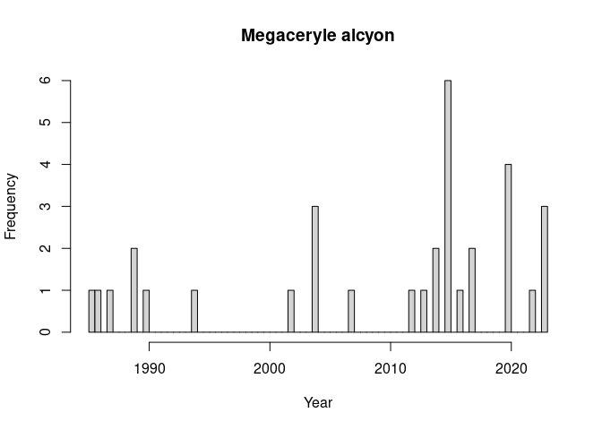<!-- -->

    ##                species    eventDate   
    ##  Sphyrapicus varius:6   Min.   :1984  
    ##  Acanthis flammea  :0   1st Qu.:1993  
    ##  Accipiter cooperii:0   Median :2008  
    ##  Accipiter gentilis:0   Mean   :2005  
    ##  Accipiter striatus:0   3rd Qu.:2018  
    ##  Actitis macularius:0   Max.   :2022  
    ##  (Other)           :0

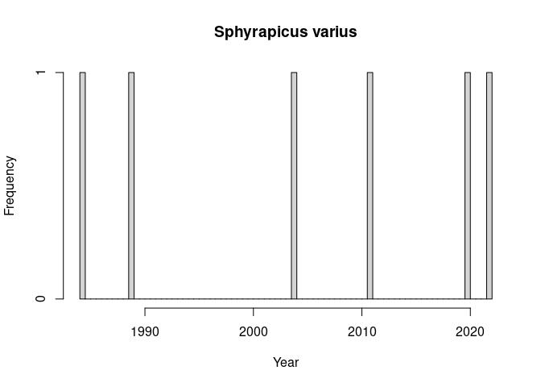<!-- -->

    ##                        species     eventDate   
    ##  Melanerpes erythrocephalus:63   Min.   :1986  
    ##  Acanthis flammea          : 0   1st Qu.:2014  
    ##  Accipiter cooperii        : 0   Median :2018  
    ##  Accipiter gentilis        : 0   Mean   :2015  
    ##  Accipiter striatus        : 0   3rd Qu.:2021  
    ##  Actitis macularius        : 0   Max.   :2023  
    ##  (Other)                   : 0

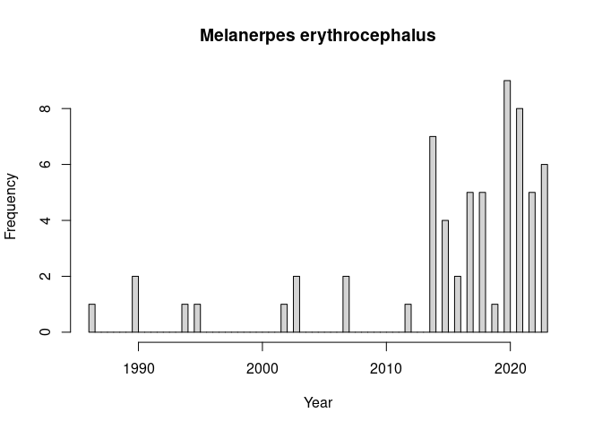<!-- -->

    ##                  species     eventDate   
    ##  Melanerpes carolinus:11   Min.   :1990  
    ##  Acanthis flammea    : 0   1st Qu.:2006  
    ##  Accipiter cooperii  : 0   Median :2017  
    ##  Accipiter gentilis  : 0   Mean   :2013  
    ##  Accipiter striatus  : 0   3rd Qu.:2020  
    ##  Actitis macularius  : 0   Max.   :2023  
    ##  (Other)             : 0

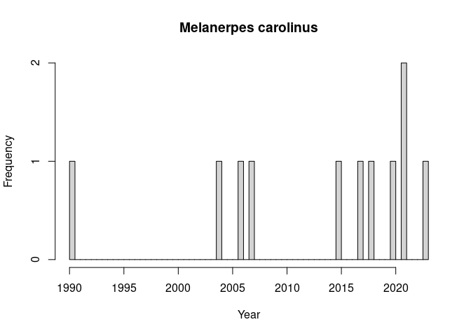<!-- -->

    ##                 species     eventDate   
    ##  Dryobates pubescens:90   Min.   :1985  
    ##  Acanthis flammea   : 0   1st Qu.:2006  
    ##  Accipiter cooperii : 0   Median :2014  
    ##  Accipiter gentilis : 0   Mean   :2011  
    ##  Accipiter striatus : 0   3rd Qu.:2019  
    ##  Actitis macularius : 0   Max.   :2023  
    ##  (Other)            : 0

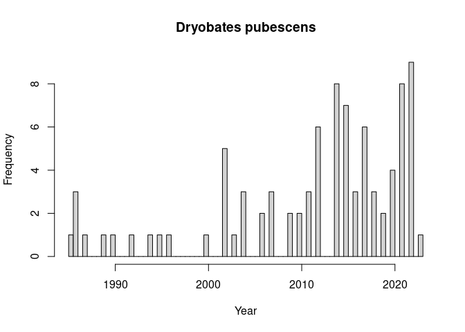<!-- -->

    ##                     species     eventDate   
    ##  Leuconotopicus villosus:45   Min.   :1986  
    ##  Acanthis flammea       : 0   1st Qu.:2006  
    ##  Accipiter cooperii     : 0   Median :2013  
    ##  Accipiter gentilis     : 0   Mean   :2010  
    ##  Accipiter striatus     : 0   3rd Qu.:2017  
    ##  Actitis macularius     : 0   Max.   :2023  
    ##  (Other)                : 0

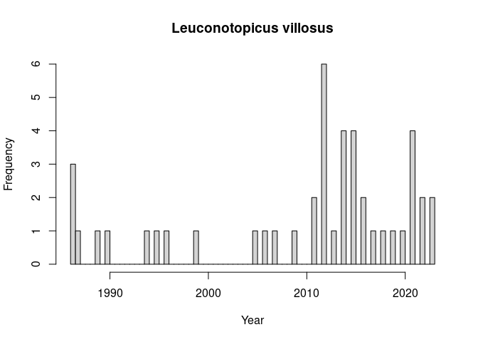<!-- -->

    ##                species      eventDate   
    ##  Colaptes auratus  :134   Min.   :1986  
    ##  Acanthis flammea  :  0   1st Qu.:2010  
    ##  Accipiter cooperii:  0   Median :2015  
    ##  Accipiter gentilis:  0   Mean   :2013  
    ##  Accipiter striatus:  0   3rd Qu.:2021  
    ##  Actitis macularius:  0   Max.   :2023  
    ##  (Other)           :  0

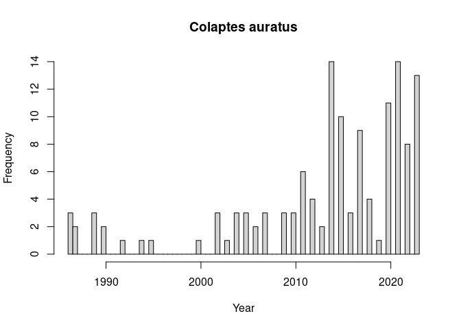<!-- -->

    ##                species     eventDate   
    ##  Falco sparverius  :59   Min.   :1986  
    ##  Acanthis flammea  : 0   1st Qu.:2006  
    ##  Accipiter cooperii: 0   Median :2014  
    ##  Accipiter gentilis: 0   Mean   :2012  
    ##  Accipiter striatus: 0   3rd Qu.:2022  
    ##  Actitis macularius: 0   Max.   :2023  
    ##  (Other)           : 0

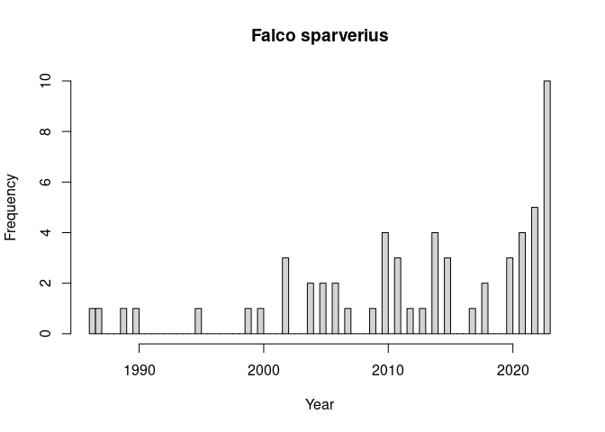<!-- -->

    ##                species    eventDate   
    ##  Falco columbarius :4   Min.   :1983  
    ##  Acanthis flammea  :0   1st Qu.:2005  
    ##  Accipiter cooperii:0   Median :2016  
    ##  Accipiter gentilis:0   Mean   :2009  
    ##  Accipiter striatus:0   3rd Qu.:2020  
    ##  Actitis macularius:0   Max.   :2021  
    ##  (Other)           :0

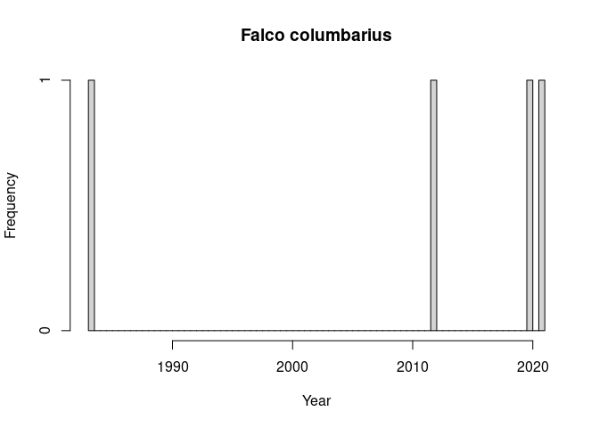<!-- -->

    ##                species    eventDate   
    ##  Falco mexicanus   :2   Min.   :1990  
    ##  Acanthis flammea  :0   1st Qu.:1997  
    ##  Accipiter cooperii:0   Median :2004  
    ##  Accipiter gentilis:0   Mean   :2004  
    ##  Accipiter striatus:0   3rd Qu.:2011  
    ##  Actitis macularius:0   Max.   :2018  
    ##  (Other)           :0

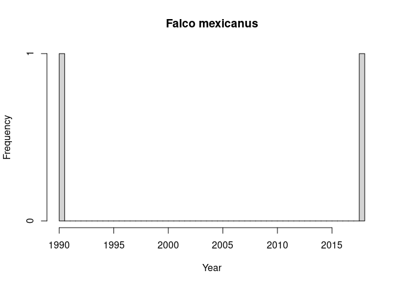<!-- -->

    ##                 species    eventDate   
    ##  Contopus sordidulus:8   Min.   :2010  
    ##  Acanthis flammea   :0   1st Qu.:2015  
    ##  Accipiter cooperii :0   Median :2022  
    ##  Accipiter gentilis :0   Mean   :2019  
    ##  Accipiter striatus :0   3rd Qu.:2023  
    ##  Actitis macularius :0   Max.   :2023  
    ##  (Other)            :0

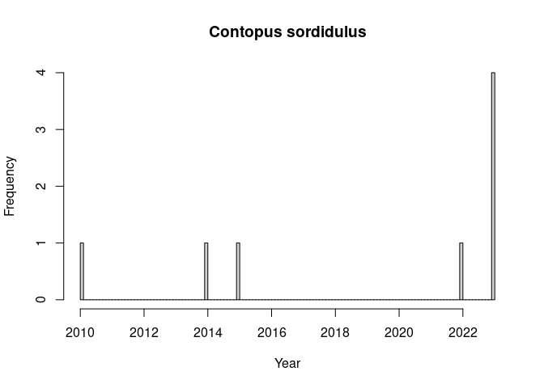<!-- -->

    ##                species     eventDate   
    ##  Contopus virens   :10   Min.   :2014  
    ##  Acanthis flammea  : 0   1st Qu.:2018  
    ##  Accipiter cooperii: 0   Median :2020  
    ##  Accipiter gentilis: 0   Mean   :2020  
    ##  Accipiter striatus: 0   3rd Qu.:2021  
    ##  Actitis macularius: 0   Max.   :2023  
    ##  (Other)           : 0

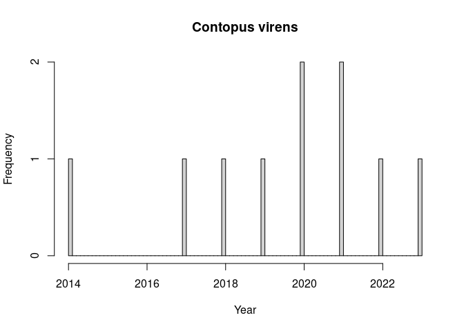<!-- -->

    ##                species    eventDate   
    ##  Empidonax alnorum :1   Min.   :2018  
    ##  Acanthis flammea  :0   1st Qu.:2018  
    ##  Accipiter cooperii:0   Median :2018  
    ##  Accipiter gentilis:0   Mean   :2018  
    ##  Accipiter striatus:0   3rd Qu.:2018  
    ##  Actitis macularius:0   Max.   :2018  
    ##  (Other)           :0

<!-- -->

    ##                species    eventDate   
    ##  Empidonax traillii:6   Min.   :2008  
    ##  Acanthis flammea  :0   1st Qu.:2014  
    ##  Accipiter cooperii:0   Median :2016  
    ##  Accipiter gentilis:0   Mean   :2016  
    ##  Accipiter striatus:0   3rd Qu.:2020  
    ##  Actitis macularius:0   Max.   :2023  
    ##  (Other)           :0

<!-- -->

    ##                species     eventDate   
    ##  Empidonax minimus :13   Min.   :1990  
    ##  Acanthis flammea  : 0   1st Qu.:2012  
    ##  Accipiter cooperii: 0   Median :2017  
    ##  Accipiter gentilis: 0   Mean   :2014  
    ##  Accipiter striatus: 0   3rd Qu.:2017  
    ##  Actitis macularius: 0   Max.   :2023  
    ##  (Other)           : 0

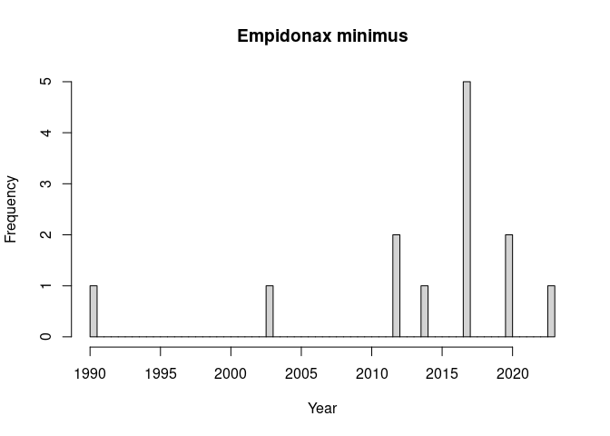<!-- -->

    ##                species     eventDate   
    ##  Sayornis phoebe   :25   Min.   :1994  
    ##  Acanthis flammea  : 0   1st Qu.:2015  
    ##  Accipiter cooperii: 0   Median :2017  
    ##  Accipiter gentilis: 0   Mean   :2017  
    ##  Accipiter striatus: 0   3rd Qu.:2022  
    ##  Actitis macularius: 0   Max.   :2023  
    ##  (Other)           : 0

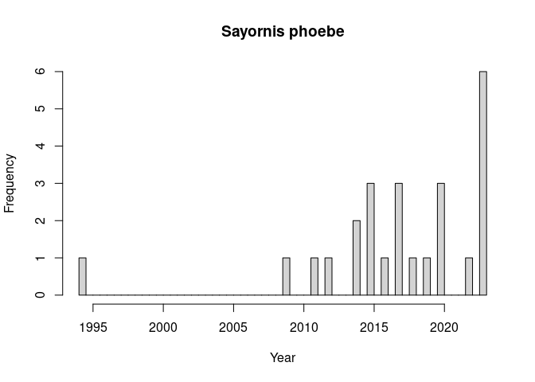<!-- -->

    ##                species    eventDate   
    ##  Sayornis saya     :1   Min.   :2020  
    ##  Acanthis flammea  :0   1st Qu.:2020  
    ##  Accipiter cooperii:0   Median :2020  
    ##  Accipiter gentilis:0   Mean   :2020  
    ##  Accipiter striatus:0   3rd Qu.:2020  
    ##  Actitis macularius:0   Max.   :2020  
    ##  (Other)           :0

<!-- -->

    ##                species     eventDate   
    ##  Myiarchus crinitus:40   Min.   :1990  
    ##  Acanthis flammea  : 0   1st Qu.:2014  
    ##  Accipiter cooperii: 0   Median :2016  
    ##  Accipiter gentilis: 0   Mean   :2015  
    ##  Accipiter striatus: 0   3rd Qu.:2020  
    ##  Actitis macularius: 0   Max.   :2023  
    ##  (Other)           : 0

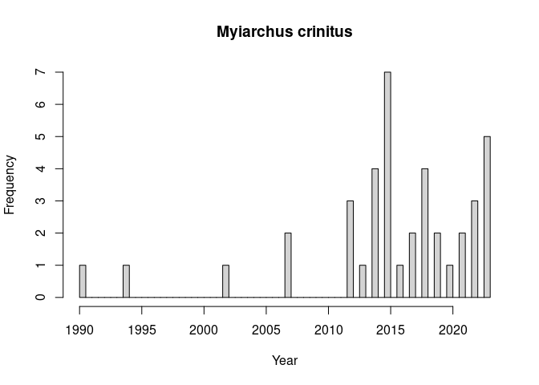<!-- -->

    ##                 species     eventDate   
    ##  Tyrannus verticalis:28   Min.   :1994  
    ##  Acanthis flammea   : 0   1st Qu.:2012  
    ##  Accipiter cooperii : 0   Median :2016  
    ##  Accipiter gentilis : 0   Mean   :2015  
    ##  Accipiter striatus : 0   3rd Qu.:2020  
    ##  Actitis macularius : 0   Max.   :2023  
    ##  (Other)            : 0

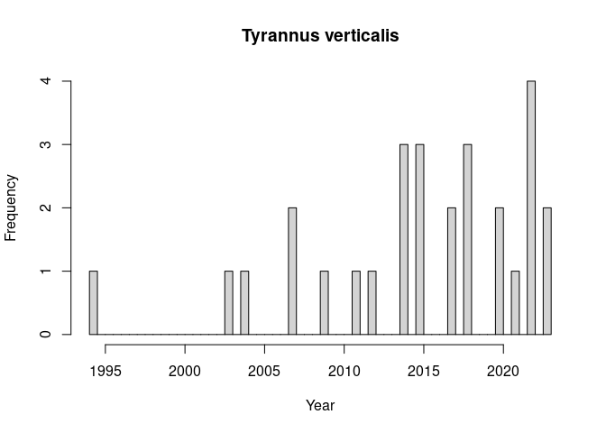<!-- -->

    ##                species     eventDate   
    ##  Tyrannus tyrannus :63   Min.   :1986  
    ##  Acanthis flammea  : 0   1st Qu.:2013  
    ##  Accipiter cooperii: 0   Median :2017  
    ##  Accipiter gentilis: 0   Mean   :2015  
    ##  Accipiter striatus: 0   3rd Qu.:2021  
    ##  Actitis macularius: 0   Max.   :2023  
    ##  (Other)           : 0

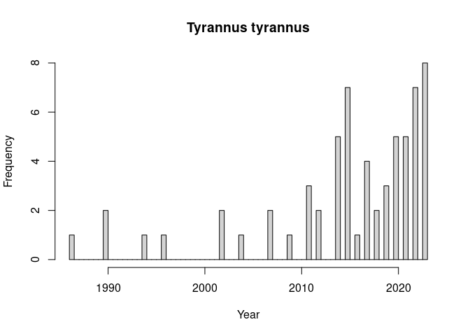<!-- -->

    ##                species     eventDate   
    ##  Vireo bellii      :82   Min.   :1986  
    ##  Acanthis flammea  : 0   1st Qu.:2014  
    ##  Accipiter cooperii: 0   Median :2017  
    ##  Accipiter gentilis: 0   Mean   :2015  
    ##  Accipiter striatus: 0   3rd Qu.:2021  
    ##  Actitis macularius: 0   Max.   :2023  
    ##  (Other)           : 0

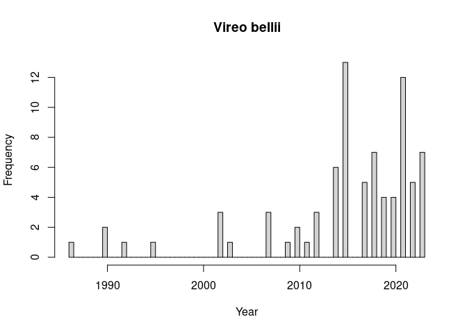<!-- -->

    ##                species    eventDate   
    ##  Vireo flavifrons  :2   Min.   :2015  
    ##  Acanthis flammea  :0   1st Qu.:2015  
    ##  Accipiter cooperii:0   Median :2015  
    ##  Accipiter gentilis:0   Mean   :2015  
    ##  Accipiter striatus:0   3rd Qu.:2015  
    ##  Actitis macularius:0   Max.   :2015  
    ##  (Other)           :0

<!-- -->

    ##                  species    eventDate   
    ##  Vireo philadelphicus:2   Min.   :2015  
    ##  Acanthis flammea    :0   1st Qu.:2015  
    ##  Accipiter cooperii  :0   Median :2015  
    ##  Accipiter gentilis  :0   Mean   :2015  
    ##  Accipiter striatus  :0   3rd Qu.:2015  
    ##  Actitis macularius  :0   Max.   :2015  
    ##  (Other)             :0

<!-- -->

    ##                species     eventDate   
    ##  Vireo gilvus      :23   Min.   :1990  
    ##  Acanthis flammea  : 0   1st Qu.:2013  
    ##  Accipiter cooperii: 0   Median :2015  
    ##  Accipiter gentilis: 0   Mean   :2014  
    ##  Accipiter striatus: 0   3rd Qu.:2021  
    ##  Actitis macularius: 0   Max.   :2023  
    ##  (Other)           : 0

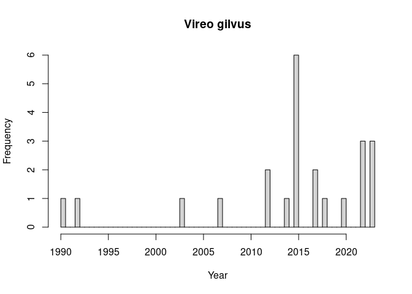<!-- -->

    ##                species     eventDate   
    ##  Vireo olivaceus   :66   Min.   :2007  
    ##  Acanthis flammea  : 0   1st Qu.:2015  
    ##  Accipiter cooperii: 0   Median :2018  
    ##  Accipiter gentilis: 0   Mean   :2018  
    ##  Accipiter striatus: 0   3rd Qu.:2022  
    ##  Actitis macularius: 0   Max.   :2023  
    ##  (Other)           : 0

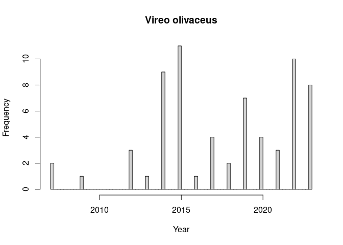<!-- -->

    ##                 species    eventDate   
    ##  Lanius ludovicianus:8   Min.   :1987  
    ##  Acanthis flammea   :0   1st Qu.:2003  
    ##  Accipiter cooperii :0   Median :2018  
    ##  Accipiter gentilis :0   Mean   :2012  
    ##  Accipiter striatus :0   3rd Qu.:2022  
    ##  Actitis macularius :0   Max.   :2023  
    ##  (Other)            :0

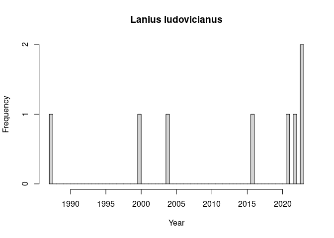<!-- -->

    ##                species    eventDate   
    ##  Lanius borealis   :3   Min.   :1999  
    ##  Acanthis flammea  :0   1st Qu.:2002  
    ##  Accipiter cooperii:0   Median :2004  
    ##  Accipiter gentilis:0   Mean   :2008  
    ##  Accipiter striatus:0   3rd Qu.:2012  
    ##  Actitis macularius:0   Max.   :2021  
    ##  (Other)           :0

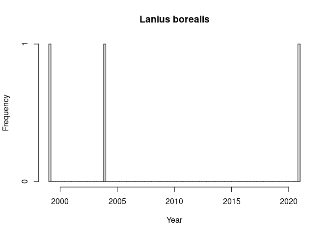<!-- -->

    ##                 species      eventDate   
    ##  Cyanocitta cristata:123   Min.   :1985  
    ##  Acanthis flammea   :  0   1st Qu.:2012  
    ##  Accipiter cooperii :  0   Median :2018  
    ##  Accipiter gentilis :  0   Mean   :2014  
    ##  Accipiter striatus :  0   3rd Qu.:2021  
    ##  Actitis macularius :  0   Max.   :2023  
    ##  (Other)            :  0

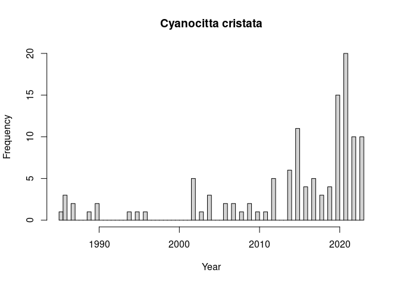<!-- -->

    ##                species     eventDate   
    ##  Pica hudsonia     :10   Min.   :1978  
    ##  Acanthis flammea  : 0   1st Qu.:1986  
    ##  Accipiter cooperii: 0   Median :1988  
    ##  Accipiter gentilis: 0   Mean   :1990  
    ##  Accipiter striatus: 0   3rd Qu.:1993  
    ##  Actitis macularius: 0   Max.   :2004  
    ##  (Other)           : 0

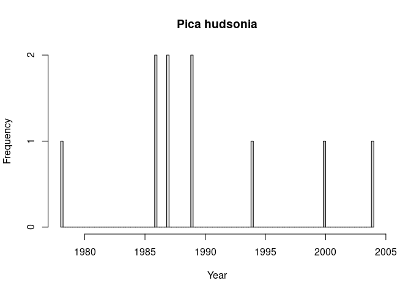<!-- -->

    ##                   species      eventDate   
    ##  Corvus brachyrhynchos:153   Min.   :1978  
    ##  Acanthis flammea     :  0   1st Qu.:2007  
    ##  Accipiter cooperii   :  0   Median :2015  
    ##  Accipiter gentilis   :  0   Mean   :2012  
    ##  Accipiter striatus   :  0   3rd Qu.:2021  
    ##  Actitis macularius   :  0   Max.   :2023  
    ##  (Other)              :  0

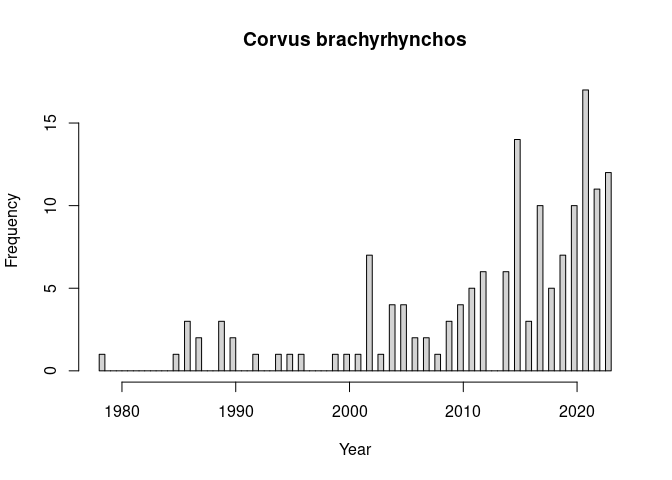<!-- -->

    ##                  species      eventDate   
    ##  Poecile atricapillus:143   Min.   :1985  
    ##  Acanthis flammea    :  0   1st Qu.:2010  
    ##  Accipiter cooperii  :  0   Median :2016  
    ##  Accipiter gentilis  :  0   Mean   :2013  
    ##  Accipiter striatus  :  0   3rd Qu.:2020  
    ##  Actitis macularius  :  0   Max.   :2023  
    ##  (Other)             :  0

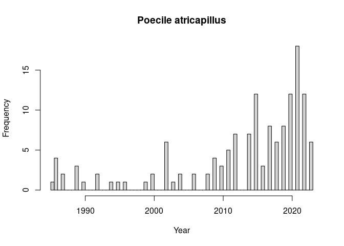<!-- -->

    ##                  species     eventDate   
    ##  Eremophila alpestris:40   Min.   :1978  
    ##  Acanthis flammea    : 0   1st Qu.:2004  
    ##  Accipiter cooperii  : 0   Median :2013  
    ##  Accipiter gentilis  : 0   Mean   :2009  
    ##  Accipiter striatus  : 0   3rd Qu.:2021  
    ##  Actitis macularius  : 0   Max.   :2023  
    ##  (Other)             : 0

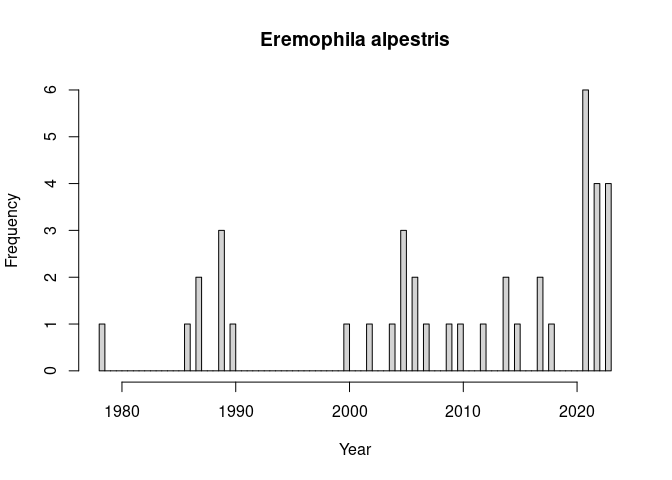<!-- -->

    ##                        species     eventDate   
    ##  Stelgidopteryx serripennis:19   Min.   :2007  
    ##  Acanthis flammea          : 0   1st Qu.:2015  
    ##  Accipiter cooperii        : 0   Median :2018  
    ##  Accipiter gentilis        : 0   Mean   :2018  
    ##  Accipiter striatus        : 0   3rd Qu.:2022  
    ##  Actitis macularius        : 0   Max.   :2023  
    ##  (Other)                   : 0

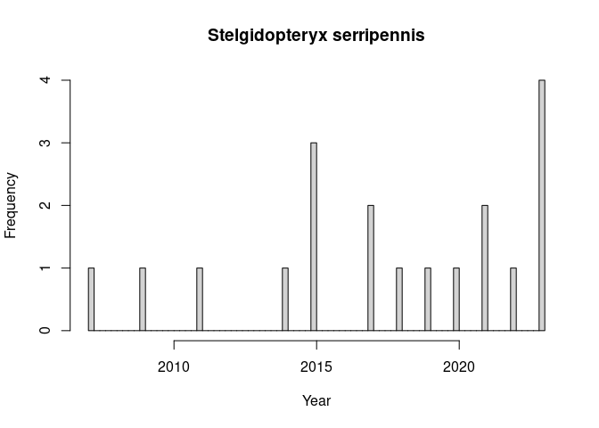<!-- -->

    ##                 species     eventDate   
    ##  Tachycineta bicolor:18   Min.   :2009  
    ##  Acanthis flammea   : 0   1st Qu.:2015  
    ##  Accipiter cooperii : 0   Median :2018  
    ##  Accipiter gentilis : 0   Mean   :2018  
    ##  Accipiter striatus : 0   3rd Qu.:2021  
    ##  Actitis macularius : 0   Max.   :2023  
    ##  (Other)            : 0

<!-- -->

    ##                species    eventDate   
    ##  Riparia riparia   :5   Min.   :1986  
    ##  Acanthis flammea  :0   1st Qu.:2014  
    ##  Accipiter cooperii:0   Median :2014  
    ##  Accipiter gentilis:0   Mean   :2011  
    ##  Accipiter striatus:0   3rd Qu.:2019  
    ##  Actitis macularius:0   Max.   :2021  
    ##  (Other)           :0

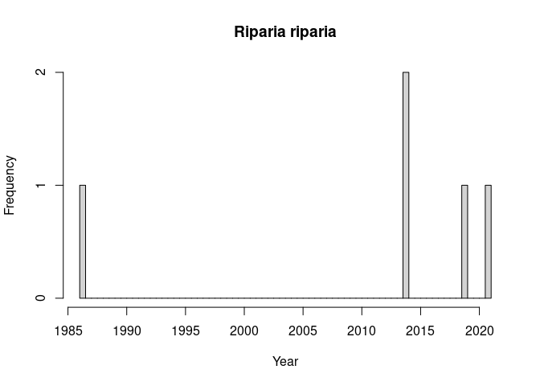<!-- -->

    ##                species     eventDate   
    ##  Hirundo rustica   :98   Min.   :1986  
    ##  Acanthis flammea  : 0   1st Qu.:2014  
    ##  Accipiter cooperii: 0   Median :2018  
    ##  Accipiter gentilis: 0   Mean   :2015  
    ##  Accipiter striatus: 0   3rd Qu.:2021  
    ##  Actitis macularius: 0   Max.   :2023  
    ##  (Other)           : 0

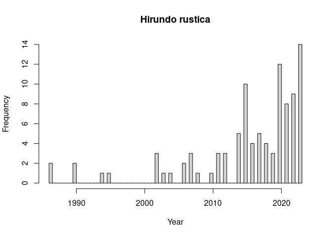<!-- -->

    ##                      species     eventDate   
    ##  Petrochelidon pyrrhonota:61   Min.   :1986  
    ##  Acanthis flammea        : 0   1st Qu.:2014  
    ##  Accipiter cooperii      : 0   Median :2018  
    ##  Accipiter gentilis      : 0   Mean   :2016  
    ##  Accipiter striatus      : 0   3rd Qu.:2021  
    ##  Actitis macularius      : 0   Max.   :2023  
    ##  (Other)                 : 0

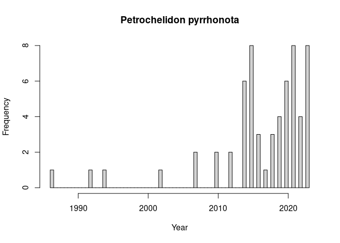<!-- -->

    ##                 species     eventDate   
    ##  Corthylio calendula:11   Min.   :1985  
    ##  Acanthis flammea   : 0   1st Qu.:1991  
    ##  Accipiter cooperii : 0   Median :2012  
    ##  Accipiter gentilis : 0   Mean   :2006  
    ##  Accipiter striatus : 0   3rd Qu.:2016  
    ##  Actitis macularius : 0   Max.   :2022  
    ##  (Other)            : 0

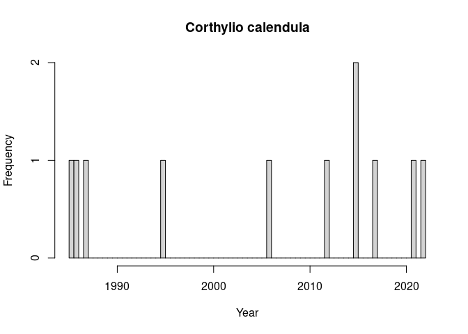<!-- -->

    ##                species    eventDate   
    ##  Regulus satrapa   :9   Min.   :1986  
    ##  Acanthis flammea  :0   1st Qu.:1986  
    ##  Accipiter cooperii:0   Median :1989  
    ##  Accipiter gentilis:0   Mean   :1997  
    ##  Accipiter striatus:0   3rd Qu.:2004  
    ##  Actitis macularius:0   Max.   :2022  
    ##  (Other)           :0

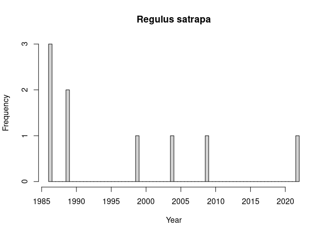<!-- -->

    ##                species      eventDate   
    ##  Sitta canadensis  :143   Min.   :1978  
    ##  Acanthis flammea  :  0   1st Qu.:2010  
    ##  Accipiter cooperii:  0   Median :2017  
    ##  Accipiter gentilis:  0   Mean   :2013  
    ##  Accipiter striatus:  0   3rd Qu.:2020  
    ##  Actitis macularius:  0   Max.   :2023  
    ##  (Other)           :  0

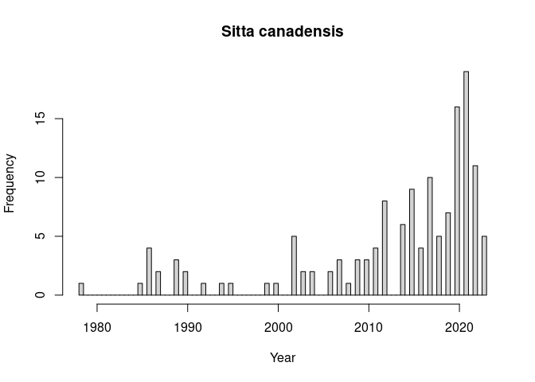<!-- -->

    ##                species     eventDate   
    ##  Sitta carolinensis:59   Min.   :1994  
    ##  Acanthis flammea  : 0   1st Qu.:2011  
    ##  Accipiter cooperii: 0   Median :2017  
    ##  Accipiter gentilis: 0   Mean   :2015  
    ##  Accipiter striatus: 0   3rd Qu.:2020  
    ##  Actitis macularius: 0   Max.   :2023  
    ##  (Other)           : 0

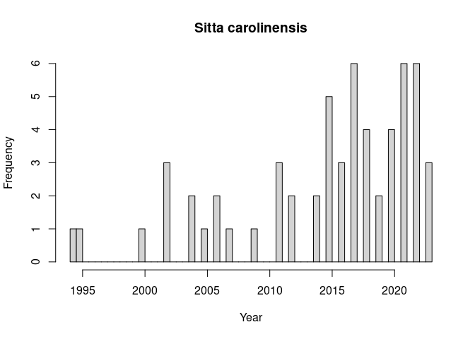<!-- -->

    ##                species    eventDate   
    ##  Sitta pygmaea     :8   Min.   :2014  
    ##  Acanthis flammea  :0   1st Qu.:2018  
    ##  Accipiter cooperii:0   Median :2021  
    ##  Accipiter gentilis:0   Mean   :2020  
    ##  Accipiter striatus:0   3rd Qu.:2022  
    ##  Actitis macularius:0   Max.   :2023  
    ##  (Other)           :0

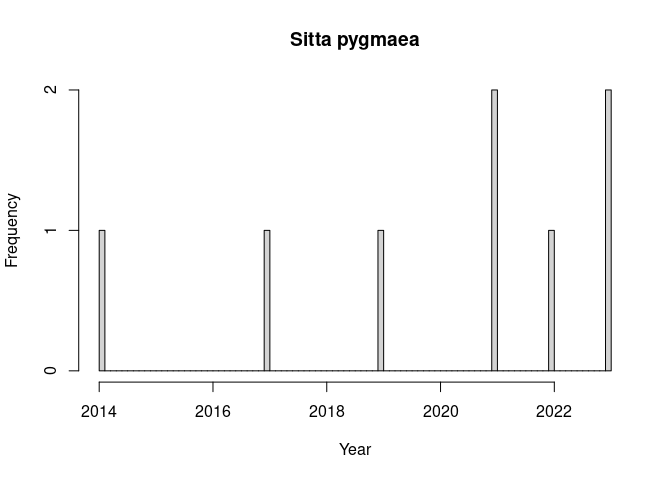<!-- -->

    ##                species    eventDate   
    ##  Certhia americana :3   Min.   :1992  
    ##  Acanthis flammea  :0   1st Qu.:1998  
    ##  Accipiter cooperii:0   Median :2004  
    ##  Accipiter gentilis:0   Mean   :2002  
    ##  Accipiter striatus:0   3rd Qu.:2006  
    ##  Actitis macularius:0   Max.   :2009  
    ##  (Other)           :0

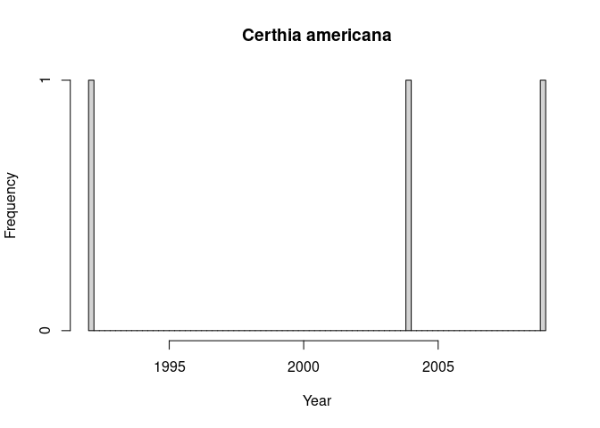<!-- -->

    ##                 species    eventDate   
    ##  Polioptila caerulea:4   Min.   :2009  
    ##  Acanthis flammea   :0   1st Qu.:2017  
    ##  Accipiter cooperii :0   Median :2022  
    ##  Accipiter gentilis :0   Mean   :2019  
    ##  Accipiter striatus :0   3rd Qu.:2023  
    ##  Actitis macularius :0   Max.   :2023  
    ##  (Other)            :0

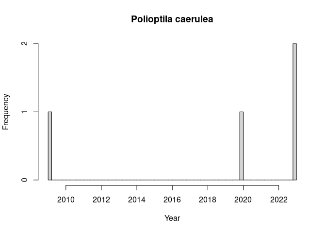<!-- -->

    ##                species      eventDate   
    ##  Troglodytes aedon :116   Min.   :1985  
    ##  Acanthis flammea  :  0   1st Qu.:2014  
    ##  Accipiter cooperii:  0   Median :2017  
    ##  Accipiter gentilis:  0   Mean   :2016  
    ##  Accipiter striatus:  0   3rd Qu.:2021  
    ##  Actitis macularius:  0   Max.   :2023  
    ##  (Other)           :  0

<!-- -->

    ##                   species    eventDate   
    ##  Cistothorus stellaris:2   Min.   :2010  
    ##  Acanthis flammea     :0   1st Qu.:2012  
    ##  Accipiter cooperii   :0   Median :2014  
    ##  Accipiter gentilis   :0   Mean   :2014  
    ##  Accipiter striatus   :0   3rd Qu.:2016  
    ##  Actitis macularius   :0   Max.   :2018  
    ##  (Other)              :0

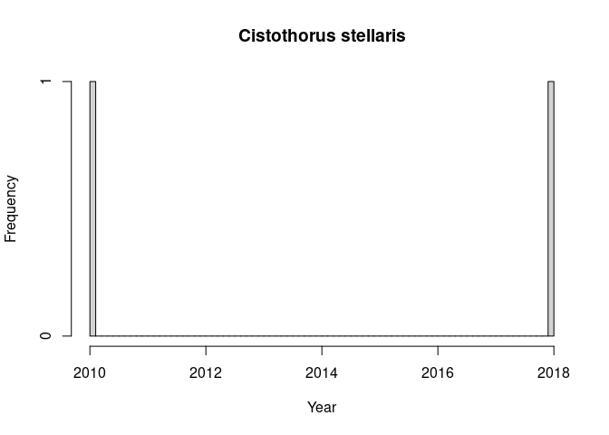<!-- -->

    ##                   species    eventDate   
    ##  Cistothorus palustris:3   Min.   :2013  
    ##  Acanthis flammea     :0   1st Qu.:2015  
    ##  Accipiter cooperii   :0   Median :2017  
    ##  Accipiter gentilis   :0   Mean   :2016  
    ##  Accipiter striatus   :0   3rd Qu.:2018  
    ##  Actitis macularius   :0   Max.   :2019  
    ##  (Other)              :0

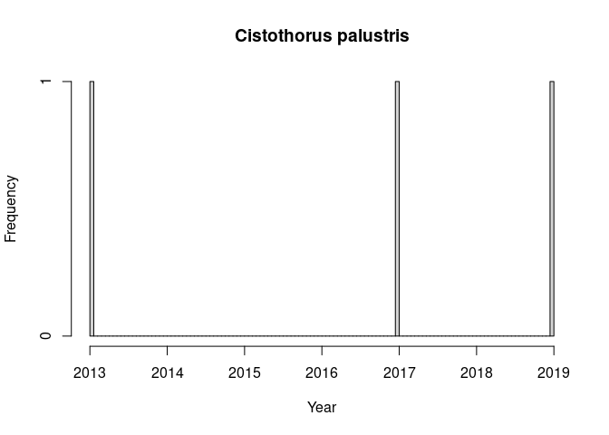<!-- -->

    ##                species     eventDate   
    ##  Sturnus vulgaris  :42   Min.   :1978  
    ##  Acanthis flammea  : 0   1st Qu.:2006  
    ##  Accipiter cooperii: 0   Median :2016  
    ##  Accipiter gentilis: 0   Mean   :2013  
    ##  Accipiter striatus: 0   3rd Qu.:2020  
    ##  Actitis macularius: 0   Max.   :2023  
    ##  (Other)           : 0

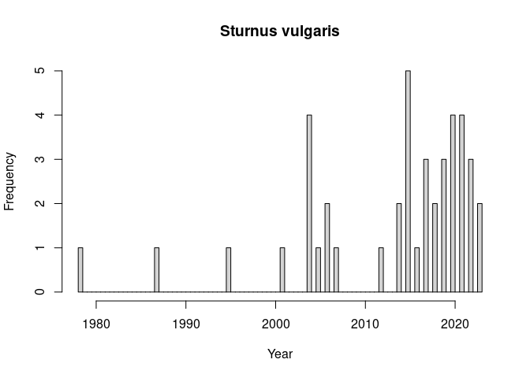<!-- -->

    ##                    species     eventDate   
    ##  Dumetella carolinensis:32   Min.   :1990  
    ##  Acanthis flammea      : 0   1st Qu.:2007  
    ##  Accipiter cooperii    : 0   Median :2014  
    ##  Accipiter gentilis    : 0   Mean   :2012  
    ##  Accipiter striatus    : 0   3rd Qu.:2020  
    ##  Actitis macularius    : 0   Max.   :2023  
    ##  (Other)               : 0

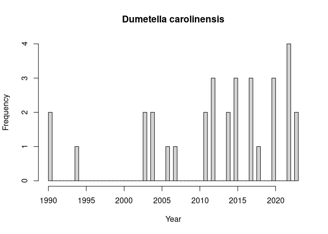<!-- -->

    ##                species     eventDate   
    ##  Toxostoma rufum   :61   Min.   :1986  
    ##  Acanthis flammea  : 0   1st Qu.:2010  
    ##  Accipiter cooperii: 0   Median :2015  
    ##  Accipiter gentilis: 0   Mean   :2012  
    ##  Accipiter striatus: 0   3rd Qu.:2019  
    ##  Actitis macularius: 0   Max.   :2023  
    ##  (Other)           : 0

<!-- -->

    ##                species     eventDate   
    ##  Sialia sialis     :71   Min.   :1985  
    ##  Acanthis flammea  : 0   1st Qu.:2010  
    ##  Accipiter cooperii: 0   Median :2015  
    ##  Accipiter gentilis: 0   Mean   :2012  
    ##  Accipiter striatus: 0   3rd Qu.:2020  
    ##  Actitis macularius: 0   Max.   :2023  
    ##  (Other)           : 0

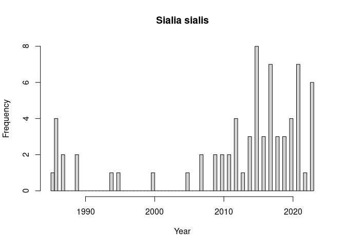<!-- -->

    ##                species    eventDate   
    ##  Sialia currucoides:2   Min.   :1989  
    ##  Acanthis flammea  :0   1st Qu.:1997  
    ##  Accipiter cooperii:0   Median :2006  
    ##  Accipiter gentilis:0   Mean   :2006  
    ##  Accipiter striatus:0   3rd Qu.:2014  
    ##  Actitis macularius:0   Max.   :2022  
    ##  (Other)           :0

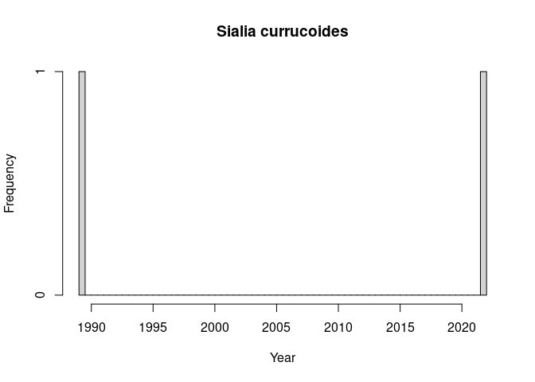<!-- -->

    ##                 species     eventDate   
    ##  Myadestes townsendi:35   Min.   :1985  
    ##  Acanthis flammea   : 0   1st Qu.:2007  
    ##  Accipiter cooperii : 0   Median :2015  
    ##  Accipiter gentilis : 0   Mean   :2012  
    ##  Accipiter striatus : 0   3rd Qu.:2021  
    ##  Actitis macularius : 0   Max.   :2023  
    ##  (Other)            : 0

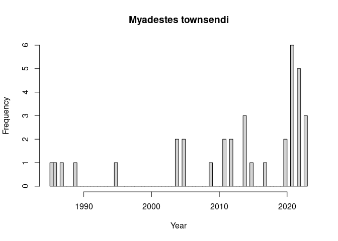<!-- -->

    ##                species     eventDate   
    ##  Catharus ustulatus:15   Min.   :1990  
    ##  Acanthis flammea  : 0   1st Qu.:2009  
    ##  Accipiter cooperii: 0   Median :2015  
    ##  Accipiter gentilis: 0   Mean   :2013  
    ##  Accipiter striatus: 0   3rd Qu.:2020  
    ##  Actitis macularius: 0   Max.   :2023  
    ##  (Other)           : 0

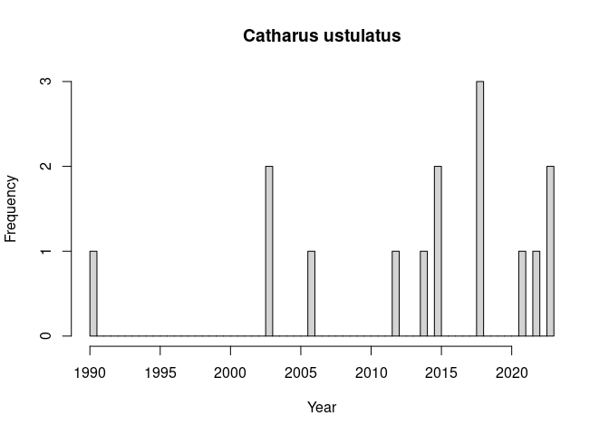<!-- -->

    ##                species    eventDate   
    ##  Catharus guttatus :3   Min.   :1985  
    ##  Acanthis flammea  :0   1st Qu.:2001  
    ##  Accipiter cooperii:0   Median :2017  
    ##  Accipiter gentilis:0   Mean   :2007  
    ##  Accipiter striatus:0   3rd Qu.:2018  
    ##  Actitis macularius:0   Max.   :2018  
    ##  (Other)           :0

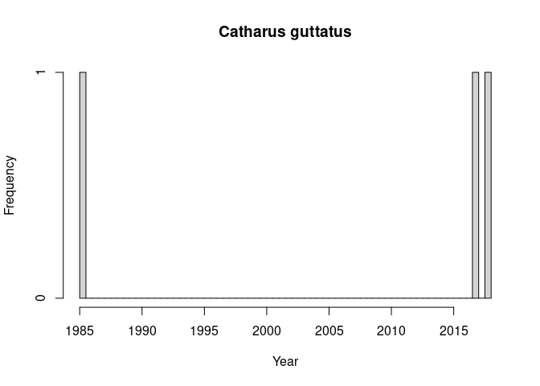<!-- -->

    ##                  species    eventDate   
    ##  Hylocichla mustelina:1   Min.   :2016  
    ##  Acanthis flammea    :0   1st Qu.:2016  
    ##  Accipiter cooperii  :0   Median :2016  
    ##  Accipiter gentilis  :0   Mean   :2016  
    ##  Accipiter striatus  :0   3rd Qu.:2016  
    ##  Actitis macularius  :0   Max.   :2016  
    ##  (Other)             :0

<!-- -->

    ##                species      eventDate   
    ##  Turdus migratorius:252   Min.   :1985  
    ##  Acanthis flammea  :  0   1st Qu.:2012  
    ##  Accipiter cooperii:  0   Median :2018  
    ##  Accipiter gentilis:  0   Mean   :2015  
    ##  Accipiter striatus:  0   3rd Qu.:2021  
    ##  Actitis macularius:  0   Max.   :2023  
    ##  (Other)           :  0

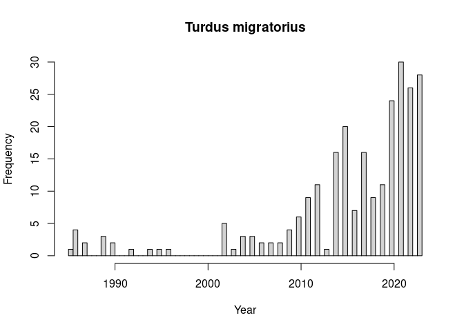<!-- -->

    ##                 species      eventDate   
    ##  Bombycilla cedrorum:115   Min.   :1986  
    ##  Acanthis flammea   :  0   1st Qu.:2011  
    ##  Accipiter cooperii :  0   Median :2016  
    ##  Accipiter gentilis :  0   Mean   :2014  
    ##  Accipiter striatus :  0   3rd Qu.:2020  
    ##  Actitis macularius :  0   Max.   :2023  
    ##  (Other)            :  0

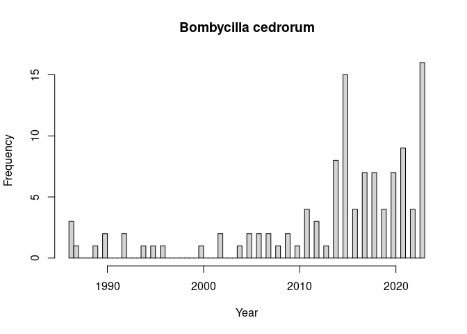<!-- -->

    ##                species     eventDate   
    ##  Passer domesticus :18   Min.   :1987  
    ##  Acanthis flammea  : 0   1st Qu.:2004  
    ##  Accipiter cooperii: 0   Median :2015  
    ##  Accipiter gentilis: 0   Mean   :2010  
    ##  Accipiter striatus: 0   3rd Qu.:2020  
    ##  Actitis macularius: 0   Max.   :2021  
    ##  (Other)           : 0

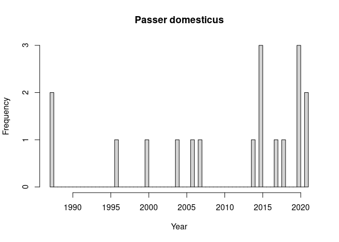<!-- -->

    ##                species    eventDate   
    ##  Anthus rubescens  :1   Min.   :1987  
    ##  Acanthis flammea  :0   1st Qu.:1987  
    ##  Accipiter cooperii:0   Median :1987  
    ##  Accipiter gentilis:0   Mean   :1987  
    ##  Accipiter striatus:0   3rd Qu.:1987  
    ##  Actitis macularius:0   Max.   :1987  
    ##  (Other)           :0

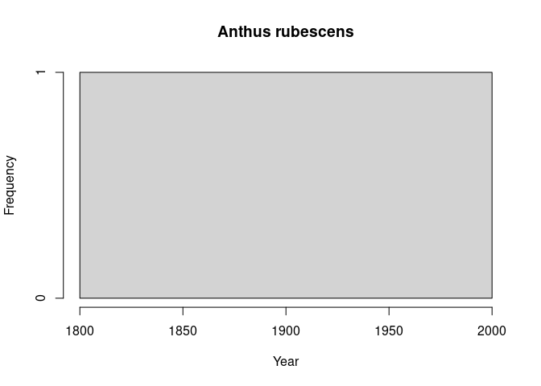<!-- -->

    ##                        species    eventDate   
    ##  Coccothraustes vespertinus:2   Min.   :1986  
    ##  Acanthis flammea          :0   1st Qu.:1992  
    ##  Accipiter cooperii        :0   Median :1998  
    ##  Accipiter gentilis        :0   Mean   :1998  
    ##  Accipiter striatus        :0   3rd Qu.:2005  
    ##  Actitis macularius        :0   Max.   :2011  
    ##  (Other)                   :0

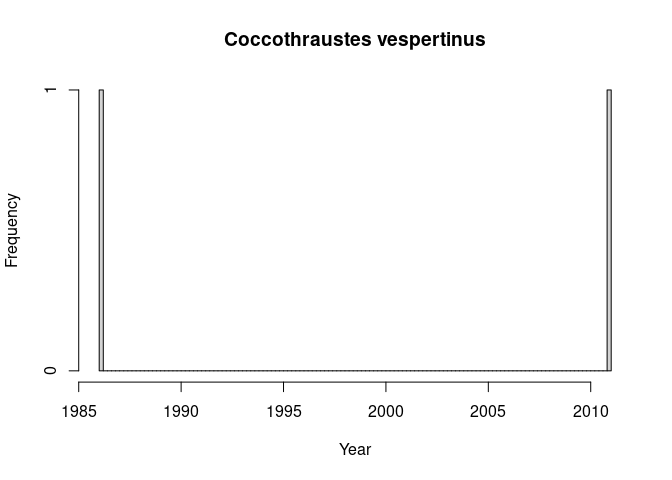<!-- -->

    ##                  species      eventDate   
    ##  Haemorhous mexicanus:107   Min.   :1985  
    ##  Acanthis flammea    :  0   1st Qu.:2012  
    ##  Accipiter cooperii  :  0   Median :2017  
    ##  Accipiter gentilis  :  0   Mean   :2015  
    ##  Accipiter striatus  :  0   3rd Qu.:2021  
    ##  Actitis macularius  :  0   Max.   :2023  
    ##  (Other)             :  0

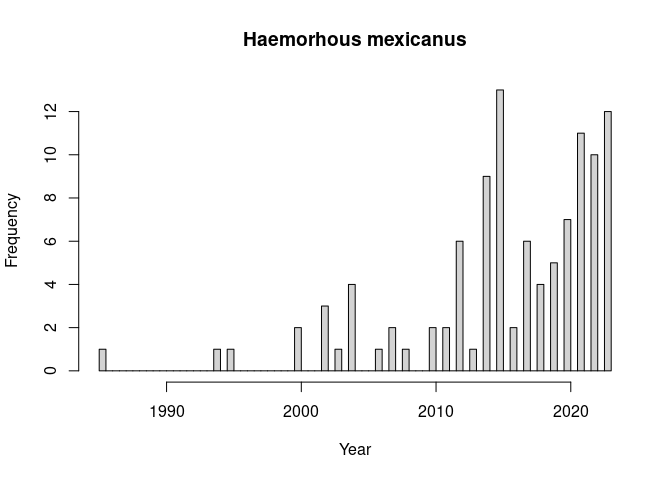<!-- -->

    ##                  species    eventDate   
    ##  Haemorhous purpureus:4   Min.   :1996  
    ##  Acanthis flammea    :0   1st Qu.:2002  
    ##  Accipiter cooperii  :0   Median :2012  
    ##  Accipiter gentilis  :0   Mean   :2010  
    ##  Accipiter striatus  :0   3rd Qu.:2020  
    ##  Actitis macularius  :0   Max.   :2021  
    ##  (Other)             :0

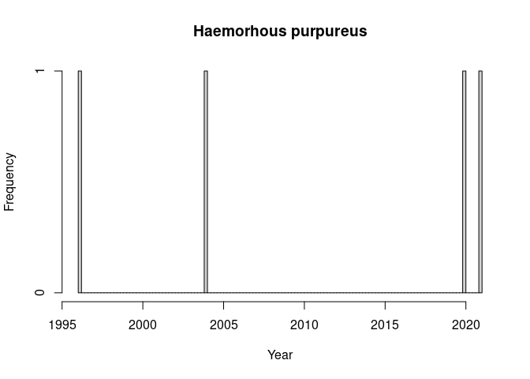<!-- -->

    ##                species     eventDate   
    ##  Loxia curvirostra :28   Min.   :1987  
    ##  Acanthis flammea  : 0   1st Qu.:2014  
    ##  Accipiter cooperii: 0   Median :2020  
    ##  Accipiter gentilis: 0   Mean   :2014  
    ##  Accipiter striatus: 0   3rd Qu.:2021  
    ##  Actitis macularius: 0   Max.   :2023  
    ##  (Other)           : 0

<!-- -->

    ##                species     eventDate   
    ##  Spinus pinus      :40   Min.   :1985  
    ##  Acanthis flammea  : 0   1st Qu.:2003  
    ##  Accipiter cooperii: 0   Median :2012  
    ##  Accipiter gentilis: 0   Mean   :2009  
    ##  Accipiter striatus: 0   3rd Qu.:2018  
    ##  Actitis macularius: 0   Max.   :2023  
    ##  (Other)           : 0

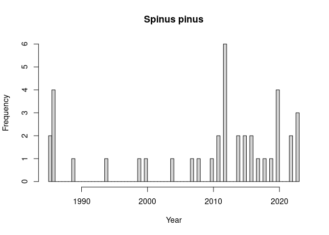<!-- -->

    ##                species      eventDate   
    ##  Spinus tristis    :212   Min.   :1986  
    ##  Acanthis flammea  :  0   1st Qu.:2014  
    ##  Accipiter cooperii:  0   Median :2019  
    ##  Accipiter gentilis:  0   Mean   :2016  
    ##  Accipiter striatus:  0   3rd Qu.:2021  
    ##  Actitis macularius:  0   Max.   :2023  
    ##  (Other)           :  0

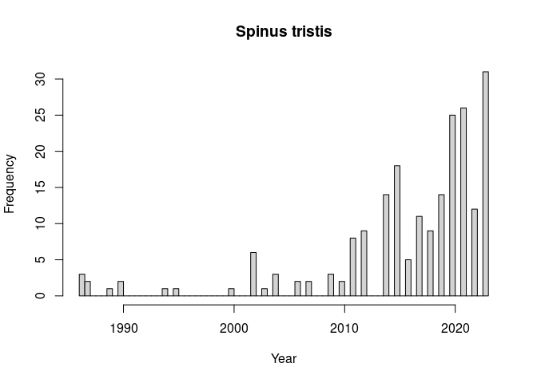<!-- -->

    ##                  species    eventDate   
    ##  Calcarius lapponicus:1   Min.   :2020  
    ##  Acanthis flammea    :0   1st Qu.:2020  
    ##  Accipiter cooperii  :0   Median :2020  
    ##  Accipiter gentilis  :0   Mean   :2020  
    ##  Accipiter striatus  :0   3rd Qu.:2020  
    ##  Actitis macularius  :0   Max.   :2020  
    ##  (Other)             :0

<!-- -->

    ##                   species     eventDate   
    ##  Ammodramus savannarum:45   Min.   :1907  
    ##  Acanthis flammea     : 0   1st Qu.:2010  
    ##  Accipiter cooperii   : 0   Median :2018  
    ##  Accipiter gentilis   : 0   Mean   :2013  
    ##  Accipiter striatus   : 0   3rd Qu.:2021  
    ##  Actitis macularius   : 0   Max.   :2023  
    ##  (Other)              : 0

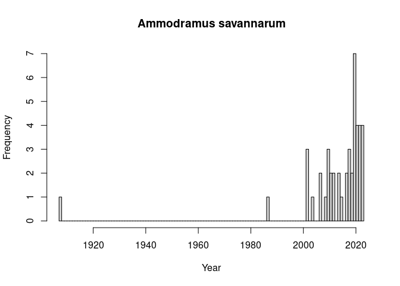<!-- -->

    ##                species      eventDate   
    ##  Spizella passerina:174   Min.   :1986  
    ##  Acanthis flammea  :  0   1st Qu.:2012  
    ##  Accipiter cooperii:  0   Median :2016  
    ##  Accipiter gentilis:  0   Mean   :2014  
    ##  Accipiter striatus:  0   3rd Qu.:2020  
    ##  Actitis macularius:  0   Max.   :2023  
    ##  (Other)           :  0

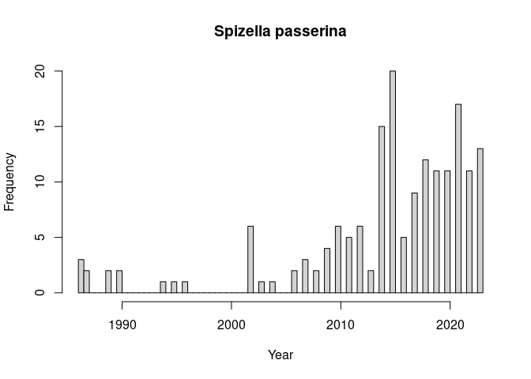<!-- -->

    ##                species     eventDate   
    ##  Spizella pallida  :36   Min.   :1987  
    ##  Acanthis flammea  : 0   1st Qu.:2008  
    ##  Accipiter cooperii: 0   Median :2015  
    ##  Accipiter gentilis: 0   Mean   :2012  
    ##  Accipiter striatus: 0   3rd Qu.:2020  
    ##  Actitis macularius: 0   Max.   :2023  
    ##  (Other)           : 0

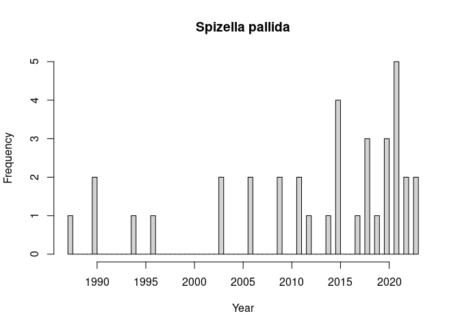<!-- -->

    ##                species      eventDate   
    ##  Spizella pusilla  :111   Min.   :1985  
    ##  Acanthis flammea  :  0   1st Qu.:2010  
    ##  Accipiter cooperii:  0   Median :2016  
    ##  Accipiter gentilis:  0   Mean   :2014  
    ##  Accipiter striatus:  0   3rd Qu.:2020  
    ##  Actitis macularius:  0   Max.   :2023  
    ##  (Other)           :  0

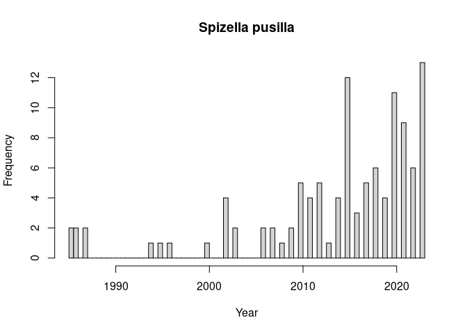<!-- -->

    ##                  species      eventDate   
    ##  Chondestes grammacus:105   Min.   :1957  
    ##  Acanthis flammea    :  0   1st Qu.:2014  
    ##  Accipiter cooperii  :  0   Median :2018  
    ##  Accipiter gentilis  :  0   Mean   :2015  
    ##  Accipiter striatus  :  0   3rd Qu.:2021  
    ##  Actitis macularius  :  0   Max.   :2023  
    ##  (Other)             :  0

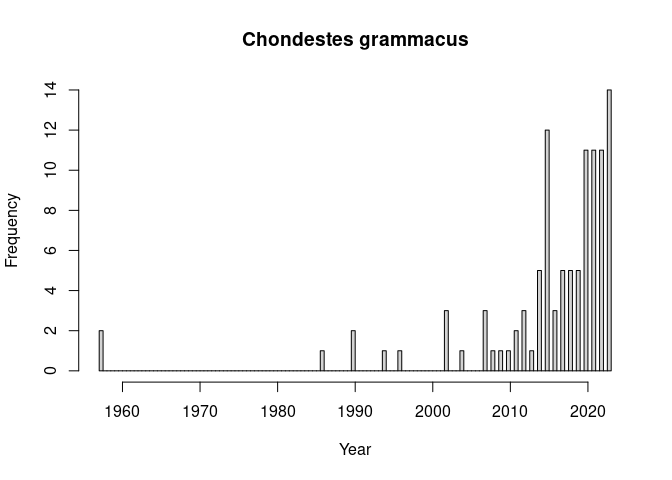<!-- -->

    ##                     species    eventDate   
    ##  Calamospiza melanocorys:4   Min.   :1990  
    ##  Acanthis flammea       :0   1st Qu.:2003  
    ##  Accipiter cooperii     :0   Median :2008  
    ##  Accipiter gentilis     :0   Mean   :2006  
    ##  Accipiter striatus     :0   3rd Qu.:2011  
    ##  Actitis macularius     :0   Max.   :2017  
    ##  (Other)                :0

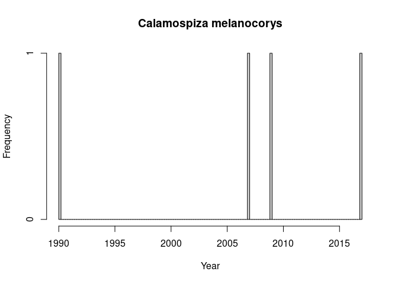<!-- -->

    ##                  species     eventDate   
    ##  Spizelloides arborea:18   Min.   :1999  
    ##  Acanthis flammea    : 0   1st Qu.:2011  
    ##  Accipiter cooperii  : 0   Median :2018  
    ##  Accipiter gentilis  : 0   Mean   :2015  
    ##  Accipiter striatus  : 0   3rd Qu.:2023  
    ##  Actitis macularius  : 0   Max.   :2023  
    ##  (Other)             : 0

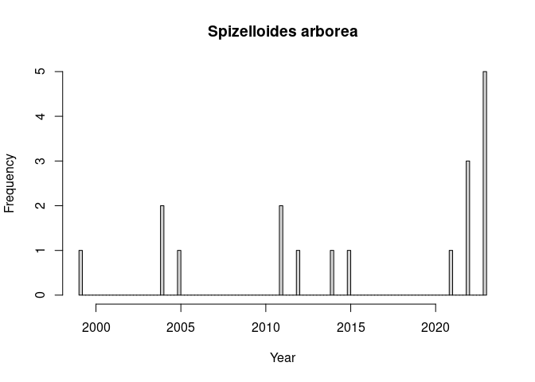<!-- -->

    ##                species     eventDate   
    ##  Junco hyemalis    :59   Min.   :1985  
    ##  Acanthis flammea  : 0   1st Qu.:2004  
    ##  Accipiter cooperii: 0   Median :2016  
    ##  Accipiter gentilis: 0   Mean   :2011  
    ##  Accipiter striatus: 0   3rd Qu.:2021  
    ##  Actitis macularius: 0   Max.   :2023  
    ##  (Other)           : 0

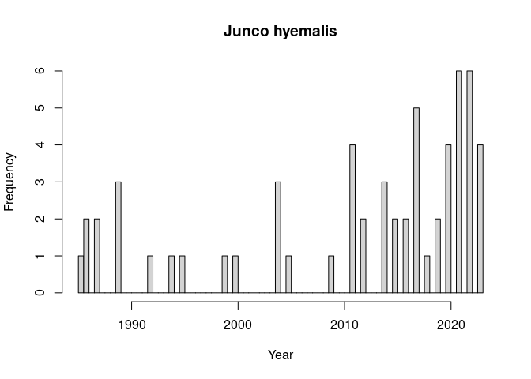<!-- -->

    ##                        species    eventDate   
    ##  Junco hyemalis/cismontanus:1   Min.   :2021  
    ##  Acanthis flammea          :0   1st Qu.:2021  
    ##  Accipiter cooperii        :0   Median :2021  
    ##  Accipiter gentilis        :0   Mean   :2021  
    ##  Accipiter striatus        :0   3rd Qu.:2021  
    ##  Actitis macularius        :0   Max.   :2021  
    ##  (Other)                   :0

<!-- -->

    ##                species    eventDate   
    ##  Junco cismontanus :2   Min.   :2020  
    ##  Acanthis flammea  :0   1st Qu.:2020  
    ##  Accipiter cooperii:0   Median :2021  
    ##  Accipiter gentilis:0   Mean   :2021  
    ##  Accipiter striatus:0   3rd Qu.:2022  
    ##  Actitis macularius:0   Max.   :2022  
    ##  (Other)           :0

<!-- -->

    ##                species    eventDate   
    ##  Junco oreganus    :5   Min.   :1986  
    ##  Acanthis flammea  :0   1st Qu.:2004  
    ##  Accipiter cooperii:0   Median :2004  
    ##  Accipiter gentilis:0   Mean   :2007  
    ##  Accipiter striatus:0   3rd Qu.:2020  
    ##  Actitis macularius:0   Max.   :2022  
    ##  (Other)           :0

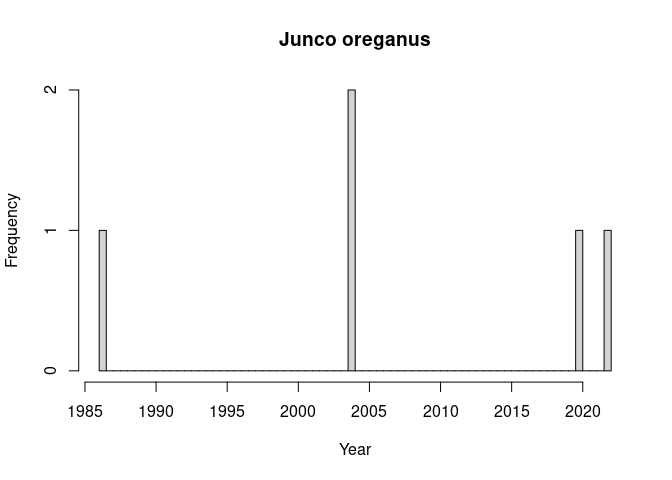<!-- -->

    ##                species    eventDate   
    ##  Junco mearnsi     :1   Min.   :2022  
    ##  Acanthis flammea  :0   1st Qu.:2022  
    ##  Accipiter cooperii:0   Median :2022  
    ##  Accipiter gentilis:0   Mean   :2022  
    ##  Accipiter striatus:0   3rd Qu.:2022  
    ##  Actitis macularius:0   Max.   :2022  
    ##  (Other)           :0

<!-- -->

    ##                    species     eventDate   
    ##  Zonotrichia leucophrys:32   Min.   :1985  
    ##  Acanthis flammea      : 0   1st Qu.:1994  
    ##  Accipiter cooperii    : 0   Median :2018  
    ##  Accipiter gentilis    : 0   Mean   :2009  
    ##  Accipiter striatus    : 0   3rd Qu.:2021  
    ##  Actitis macularius    : 0   Max.   :2023  
    ##  (Other)               : 0

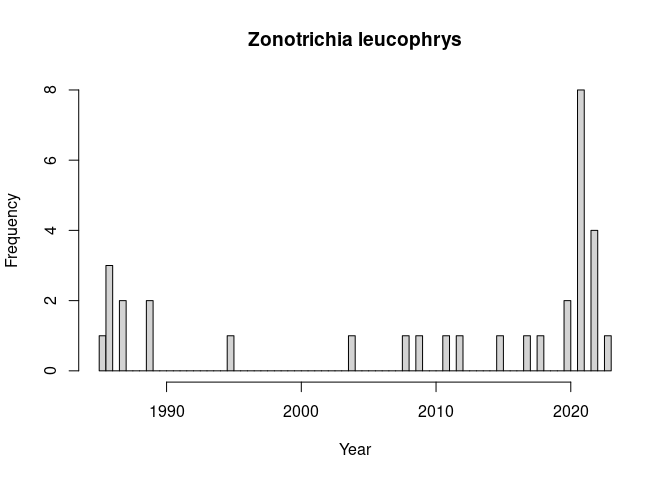<!-- -->

    ##                 species     eventDate   
    ##  Zonotrichia querula:25   Min.   :1985  
    ##  Acanthis flammea   : 0   1st Qu.:1989  
    ##  Accipiter cooperii : 0   Median :2002  
    ##  Accipiter gentilis : 0   Mean   :2003  
    ##  Accipiter striatus : 0   3rd Qu.:2017  
    ##  Actitis macularius : 0   Max.   :2022  
    ##  (Other)            : 0

<!-- -->

    ##                    species     eventDate   
    ##  Zonotrichia albicollis:14   Min.   :1985  
    ##  Acanthis flammea      : 0   1st Qu.:1989  
    ##  Accipiter cooperii    : 0   Median :2009  
    ##  Accipiter gentilis    : 0   Mean   :2006  
    ##  Accipiter striatus    : 0   3rd Qu.:2022  
    ##  Actitis macularius    : 0   Max.   :2023  
    ##  (Other)               : 0

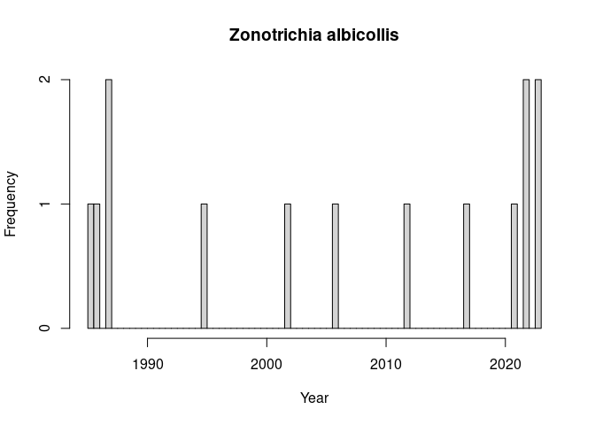<!-- -->

    ##                 species     eventDate   
    ##  Pooecetes gramineus:23   Min.   :1987  
    ##  Acanthis flammea   : 0   1st Qu.:2006  
    ##  Accipiter cooperii : 0   Median :2014  
    ##  Accipiter gentilis : 0   Mean   :2012  
    ##  Accipiter striatus : 0   3rd Qu.:2020  
    ##  Actitis macularius : 0   Max.   :2023  
    ##  (Other)            : 0

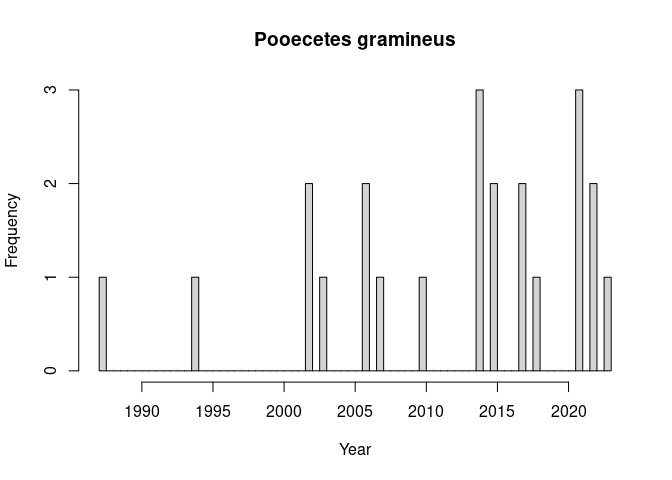<!-- -->

    ##                       species    eventDate   
    ##  Passerculus sandwichensis:3   Min.   :1994  
    ##  Acanthis flammea         :0   1st Qu.:2004  
    ##  Accipiter cooperii       :0   Median :2015  
    ##  Accipiter gentilis       :0   Mean   :2010  
    ##  Accipiter striatus       :0   3rd Qu.:2018  
    ##  Actitis macularius       :0   Max.   :2022  
    ##  (Other)                  :0

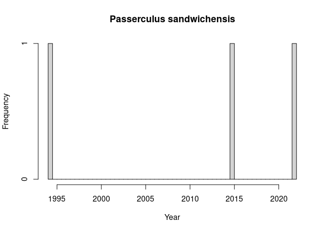<!-- -->

    ##                species     eventDate   
    ##  Melospiza melodia :32   Min.   :1986  
    ##  Acanthis flammea  : 0   1st Qu.:2009  
    ##  Accipiter cooperii: 0   Median :2018  
    ##  Accipiter gentilis: 0   Mean   :2013  
    ##  Accipiter striatus: 0   3rd Qu.:2022  
    ##  Actitis macularius: 0   Max.   :2023  
    ##  (Other)           : 0

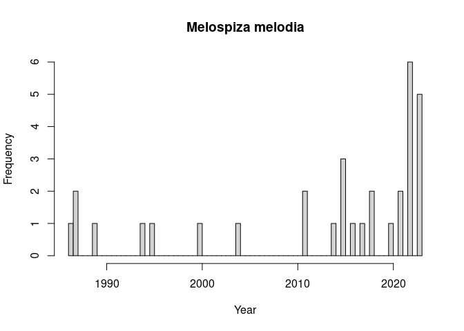<!-- -->

    ##                 species     eventDate   
    ##  Melospiza lincolnii:17   Min.   :1985  
    ##  Acanthis flammea   : 0   1st Qu.:1995  
    ##  Accipiter cooperii : 0   Median :2011  
    ##  Accipiter gentilis : 0   Mean   :2007  
    ##  Accipiter striatus : 0   3rd Qu.:2018  
    ##  Actitis macularius : 0   Max.   :2022  
    ##  (Other)            : 0

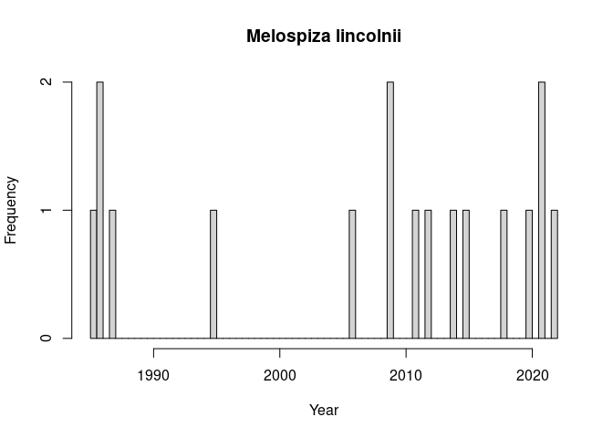<!-- -->

    ##                 species    eventDate   
    ##  Melospiza georgiana:2   Min.   :1987  
    ##  Acanthis flammea   :0   1st Qu.:1996  
    ##  Accipiter cooperii :0   Median :2004  
    ##  Accipiter gentilis :0   Mean   :2004  
    ##  Accipiter striatus :0   3rd Qu.:2012  
    ##  Actitis macularius :0   Max.   :2021  
    ##  (Other)            :0

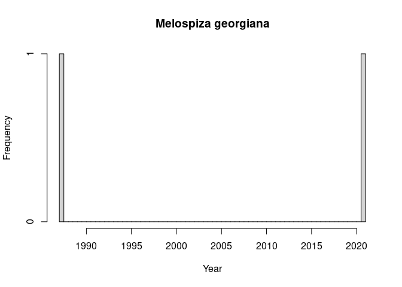<!-- -->

    ##                species      eventDate   
    ##  Pipilo maculatus  :134   Min.   :1985  
    ##  Acanthis flammea  :  0   1st Qu.:2010  
    ##  Accipiter cooperii:  0   Median :2016  
    ##  Accipiter gentilis:  0   Mean   :2014  
    ##  Accipiter striatus:  0   3rd Qu.:2021  
    ##  Actitis macularius:  0   Max.   :2023  
    ##  (Other)           :  0

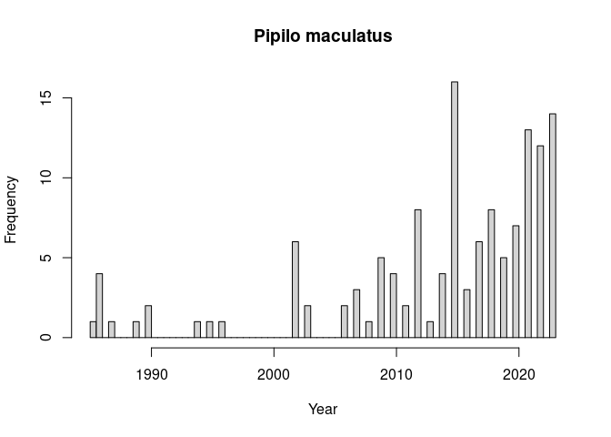<!-- -->

    ##                     species    eventDate   
    ##  Pipilo erythrophthalmus:4   Min.   :1994  
    ##  Acanthis flammea       :0   1st Qu.:2009  
    ##  Accipiter cooperii     :0   Median :2016  
    ##  Accipiter gentilis     :0   Mean   :2012  
    ##  Accipiter striatus     :0   3rd Qu.:2019  
    ##  Actitis macularius     :0   Max.   :2020  
    ##  (Other)                :0

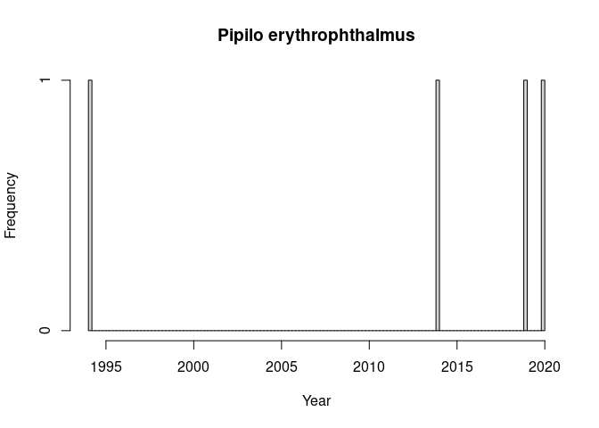<!-- -->

    ##                                 species    eventDate   
    ##  Pipilo maculatus x erythrophthalmus:3   Min.   :2015  
    ##  Acanthis flammea                   :0   1st Qu.:2016  
    ##  Accipiter cooperii                 :0   Median :2018  
    ##  Accipiter gentilis                 :0   Mean   :2018  
    ##  Accipiter striatus                 :0   3rd Qu.:2020  
    ##  Actitis macularius                 :0   Max.   :2022  
    ##  (Other)                            :0

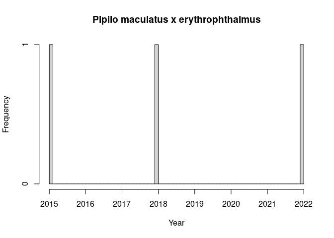<!-- -->

    ##                species     eventDate   
    ##  Icteria virens    :15   Min.   :1990  
    ##  Acanthis flammea  : 0   1st Qu.:2010  
    ##  Accipiter cooperii: 0   Median :2017  
    ##  Accipiter gentilis: 0   Mean   :2011  
    ##  Accipiter striatus: 0   3rd Qu.:2018  
    ##  Actitis macularius: 0   Max.   :2020  
    ##  (Other)           : 0

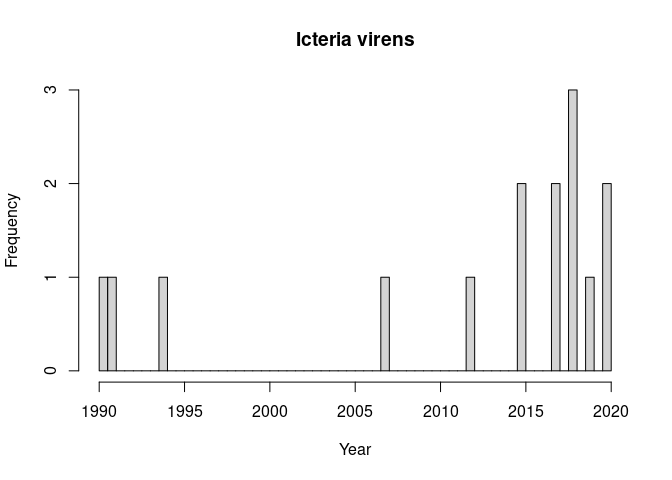<!-- -->

    ##                           species    eventDate   
    ##  Xanthocephalus xanthocephalus:5   Min.   :2007  
    ##  Acanthis flammea             :0   1st Qu.:2015  
    ##  Accipiter cooperii           :0   Median :2016  
    ##  Accipiter gentilis           :0   Mean   :2016  
    ##  Accipiter striatus           :0   3rd Qu.:2018  
    ##  Actitis macularius           :0   Max.   :2022  
    ##  (Other)                      :0

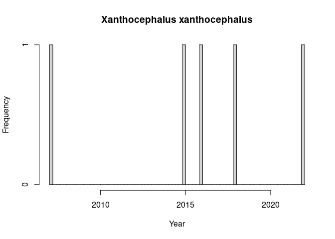<!-- -->

    ##                   species    eventDate   
    ##  Dolichonyx oryzivorus:7   Min.   :2017  
    ##  Acanthis flammea     :0   1st Qu.:2018  
    ##  Accipiter cooperii   :0   Median :2021  
    ##  Accipiter gentilis   :0   Mean   :2020  
    ##  Accipiter striatus   :0   3rd Qu.:2022  
    ##  Actitis macularius   :0   Max.   :2023  
    ##  (Other)              :0

<!-- -->

    ##                species      eventDate   
    ##  Sturnella neglecta:108   Min.   :1978  
    ##  Acanthis flammea  :  0   1st Qu.:2010  
    ##  Accipiter cooperii:  0   Median :2017  
    ##  Accipiter gentilis:  0   Mean   :2014  
    ##  Accipiter striatus:  0   3rd Qu.:2021  
    ##  Actitis macularius:  0   Max.   :2023  
    ##  (Other)           :  0

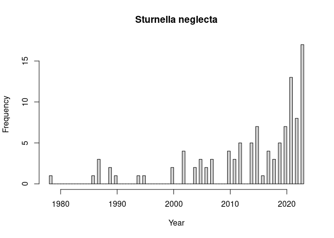<!-- -->

    ##                species    eventDate   
    ##  Sturnella magna   :3   Min.   :2017  
    ##  Acanthis flammea  :0   1st Qu.:2017  
    ##  Accipiter cooperii:0   Median :2017  
    ##  Accipiter gentilis:0   Mean   :2018  
    ##  Accipiter striatus:0   3rd Qu.:2018  
    ##  Actitis macularius:0   Max.   :2020  
    ##  (Other)           :0

<!-- -->

    ##                species     eventDate   
    ##  Icterus spurius   :48   Min.   :1986  
    ##  Acanthis flammea  : 0   1st Qu.:2015  
    ##  Accipiter cooperii: 0   Median :2017  
    ##  Accipiter gentilis: 0   Mean   :2017  
    ##  Accipiter striatus: 0   3rd Qu.:2021  
    ##  Actitis macularius: 0   Max.   :2023  
    ##  (Other)           : 0

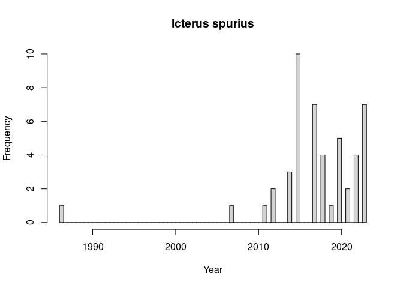<!-- -->

    ##                species     eventDate   
    ##  Icterus galbula   :37   Min.   :1996  
    ##  Acanthis flammea  : 0   1st Qu.:2014  
    ##  Accipiter cooperii: 0   Median :2017  
    ##  Accipiter gentilis: 0   Mean   :2016  
    ##  Accipiter striatus: 0   3rd Qu.:2022  
    ##  Actitis macularius: 0   Max.   :2023  
    ##  (Other)           : 0

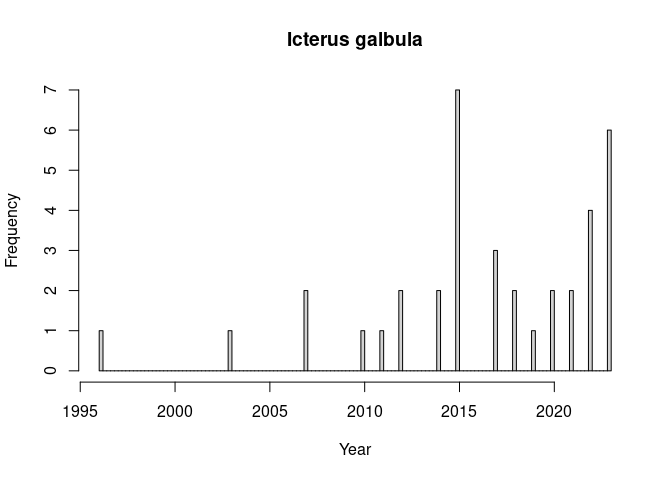<!-- -->

    ##                         species    eventDate   
    ##  Icterus bullockii x galbula:1   Min.   :1986  
    ##  Acanthis flammea           :0   1st Qu.:1986  
    ##  Accipiter cooperii         :0   Median :1986  
    ##  Accipiter gentilis         :0   Mean   :1986  
    ##  Accipiter striatus         :0   3rd Qu.:1986  
    ##  Actitis macularius         :0   Max.   :1986  
    ##  (Other)                    :0

<!-- -->

    ##                 species     eventDate   
    ##  Agelaius phoeniceus:93   Min.   :1986  
    ##  Acanthis flammea   : 0   1st Qu.:2012  
    ##  Accipiter cooperii : 0   Median :2019  
    ##  Accipiter gentilis : 0   Mean   :2016  
    ##  Accipiter striatus : 0   3rd Qu.:2022  
    ##  Actitis macularius : 0   Max.   :2023  
    ##  (Other)            : 0

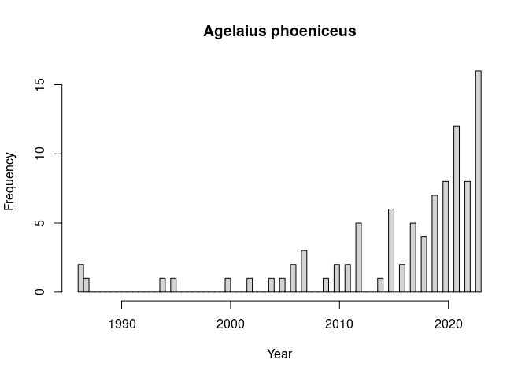<!-- -->

    ##                species     eventDate   
    ##  Molothrus ater    :68   Min.   :1990  
    ##  Acanthis flammea  : 0   1st Qu.:2014  
    ##  Accipiter cooperii: 0   Median :2017  
    ##  Accipiter gentilis: 0   Mean   :2015  
    ##  Accipiter striatus: 0   3rd Qu.:2021  
    ##  Actitis macularius: 0   Max.   :2023  
    ##  (Other)           : 0

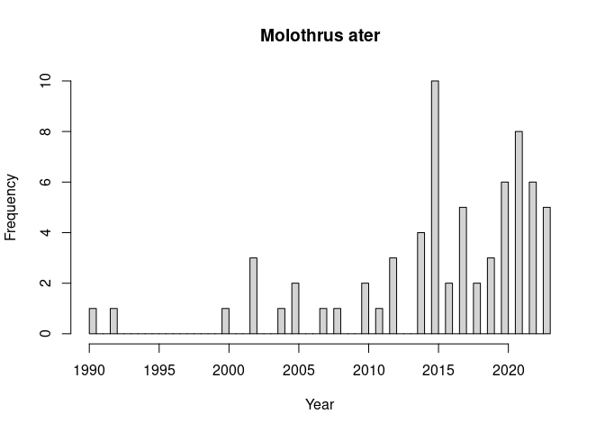<!-- -->

    ##                    species    eventDate   
    ##  Euphagus cyanocephalus:2   Min.   :2020  
    ##  Acanthis flammea      :0   1st Qu.:2020  
    ##  Accipiter cooperii    :0   Median :2020  
    ##  Accipiter gentilis    :0   Mean   :2020  
    ##  Accipiter striatus    :0   3rd Qu.:2021  
    ##  Actitis macularius    :0   Max.   :2021  
    ##  (Other)               :0

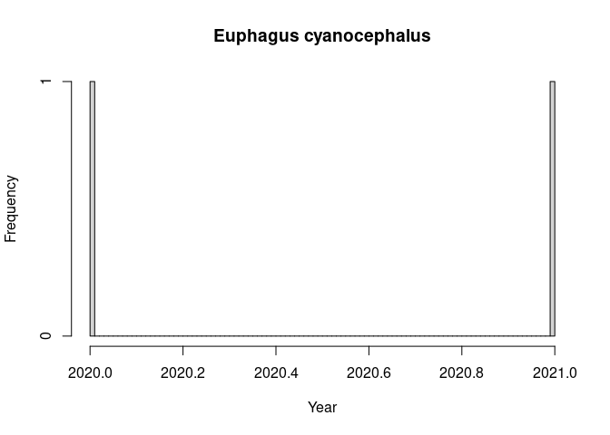<!-- -->

    ##                species     eventDate   
    ##  Quiscalus quiscula:68   Min.   :1986  
    ##  Acanthis flammea  : 0   1st Qu.:2012  
    ##  Accipiter cooperii: 0   Median :2017  
    ##  Accipiter gentilis: 0   Mean   :2014  
    ##  Accipiter striatus: 0   3rd Qu.:2020  
    ##  Actitis macularius: 0   Max.   :2023  
    ##  (Other)           : 0

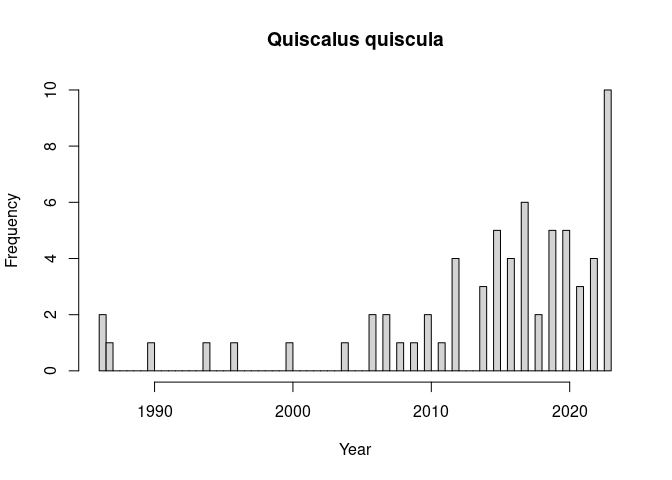<!-- -->

    ##                 species    eventDate   
    ##  Quiscalus mexicanus:2   Min.   :2009  
    ##  Acanthis flammea   :0   1st Qu.:2011  
    ##  Accipiter cooperii :0   Median :2014  
    ##  Accipiter gentilis :0   Mean   :2014  
    ##  Accipiter striatus :0   3rd Qu.:2016  
    ##  Actitis macularius :0   Max.   :2018  
    ##  (Other)            :0

<!-- -->

    ##                 species     eventDate   
    ##  Seiurus aurocapilla:35   Min.   :2002  
    ##  Acanthis flammea   : 0   1st Qu.:2015  
    ##  Accipiter cooperii : 0   Median :2017  
    ##  Accipiter gentilis : 0   Mean   :2016  
    ##  Accipiter striatus : 0   3rd Qu.:2020  
    ##  Actitis macularius : 0   Max.   :2023  
    ##  (Other)            : 0

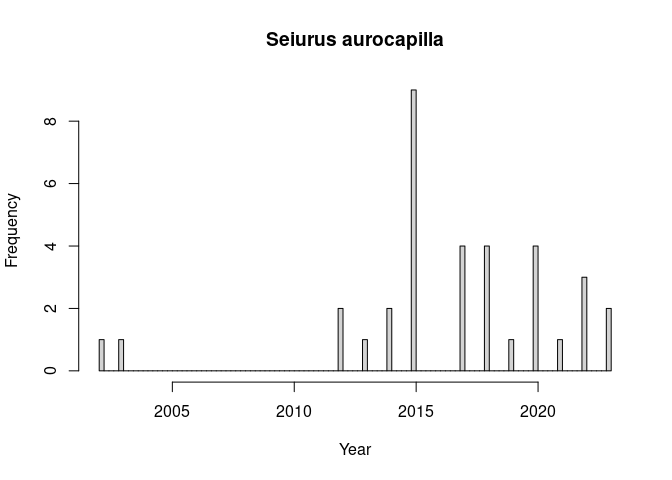<!-- -->

    ##                species    eventDate   
    ##  Mniotilta varia   :6   Min.   :1986  
    ##  Acanthis flammea  :0   1st Qu.:2018  
    ##  Accipiter cooperii:0   Median :2020  
    ##  Accipiter gentilis:0   Mean   :2014  
    ##  Accipiter striatus:0   3rd Qu.:2021  
    ##  Actitis macularius:0   Max.   :2022  
    ##  (Other)           :0

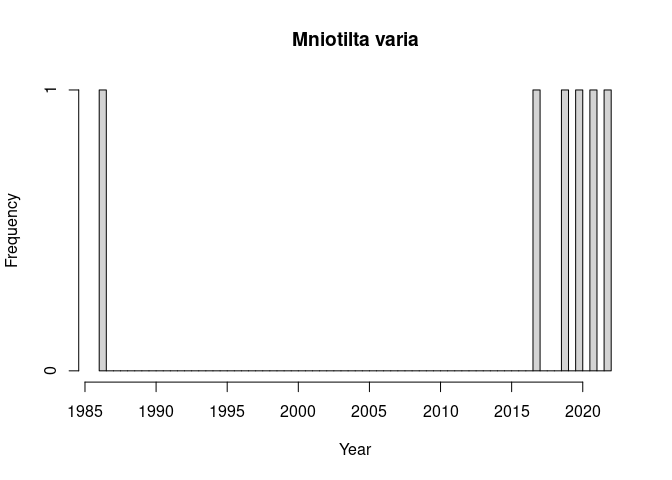<!-- -->

    ##                   species    eventDate   
    ##  Leiothlypis peregrina:3   Min.   :2015  
    ##  Acanthis flammea     :0   1st Qu.:2016  
    ##  Accipiter cooperii   :0   Median :2017  
    ##  Accipiter gentilis   :0   Mean   :2017  
    ##  Accipiter striatus   :0   3rd Qu.:2018  
    ##  Actitis macularius   :0   Max.   :2018  
    ##  (Other)              :0

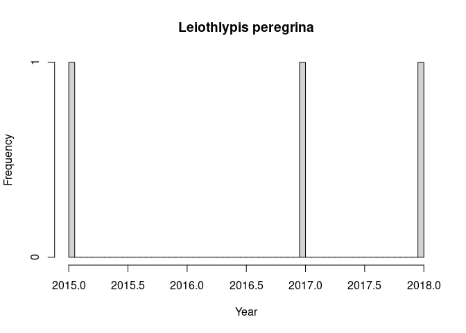<!-- -->

    ##                species     eventDate   
    ##  Leiothlypis celata:22   Min.   :1985  
    ##  Acanthis flammea  : 0   1st Qu.:1990  
    ##  Accipiter cooperii: 0   Median :2009  
    ##  Accipiter gentilis: 0   Mean   :2005  
    ##  Accipiter striatus: 0   3rd Qu.:2015  
    ##  Actitis macularius: 0   Max.   :2022  
    ##  (Other)           : 0

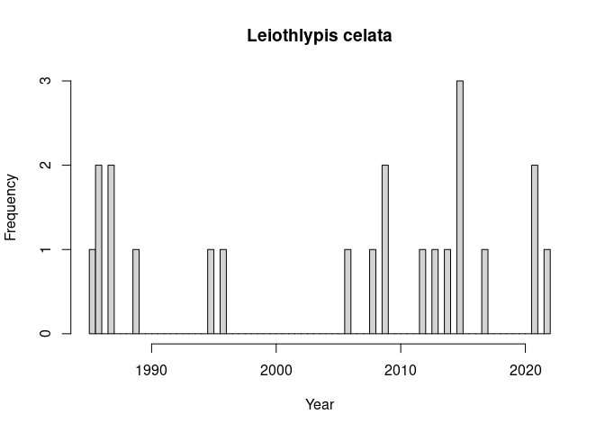<!-- -->

    ##                     species    eventDate   
    ##  Leiothlypis ruficapilla:1   Min.   :1990  
    ##  Acanthis flammea       :0   1st Qu.:1990  
    ##  Accipiter cooperii     :0   Median :1990  
    ##  Accipiter gentilis     :0   Mean   :1990  
    ##  Accipiter striatus     :0   3rd Qu.:1990  
    ##  Actitis macularius     :0   Max.   :1990  
    ##  (Other)                :0

<!-- -->

    ##                     species    eventDate   
    ##  Geothlypis philadelphia:1   Min.   :2009  
    ##  Acanthis flammea       :0   1st Qu.:2009  
    ##  Accipiter cooperii     :0   Median :2009  
    ##  Accipiter gentilis     :0   Mean   :2009  
    ##  Accipiter striatus     :0   3rd Qu.:2009  
    ##  Actitis macularius     :0   Max.   :2009  
    ##  (Other)                :0

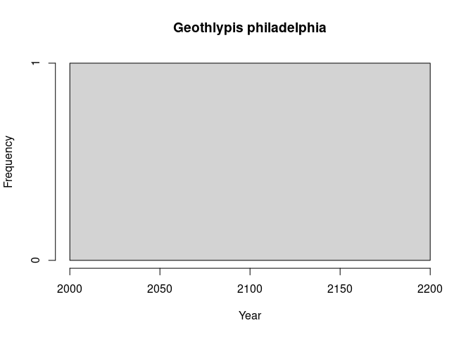<!-- -->

    ##                species     eventDate   
    ##  Geothlypis trichas:62   Min.   :1986  
    ##  Acanthis flammea  : 0   1st Qu.:2015  
    ##  Accipiter cooperii: 0   Median :2018  
    ##  Accipiter gentilis: 0   Mean   :2016  
    ##  Accipiter striatus: 0   3rd Qu.:2022  
    ##  Actitis macularius: 0   Max.   :2023  
    ##  (Other)           : 0

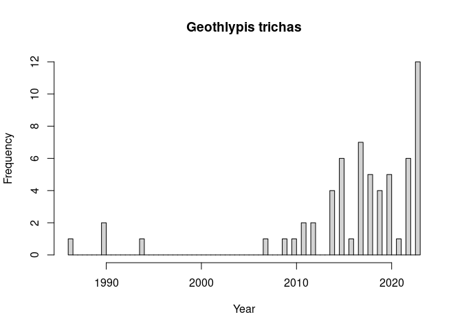<!-- -->

    ##                species    eventDate   
    ##  Setophaga citrina :2   Min.   :2015  
    ##  Acanthis flammea  :0   1st Qu.:2015  
    ##  Accipiter cooperii:0   Median :2015  
    ##  Accipiter gentilis:0   Mean   :2015  
    ##  Accipiter striatus:0   3rd Qu.:2015  
    ##  Actitis macularius:0   Max.   :2015  
    ##  (Other)           :0

<!-- -->

    ##                 species     eventDate   
    ##  Setophaga ruticilla:14   Min.   :1990  
    ##  Acanthis flammea   : 0   1st Qu.:2016  
    ##  Accipiter cooperii : 0   Median :2018  
    ##  Accipiter gentilis : 0   Mean   :2017  
    ##  Accipiter striatus : 0   3rd Qu.:2022  
    ##  Actitis macularius : 0   Max.   :2023  
    ##  (Other)            : 0

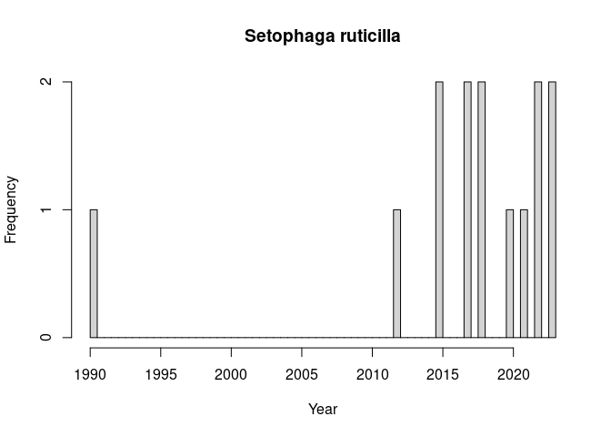<!-- -->

    ##                species    eventDate   
    ##  Setophaga castanea:1   Min.   :1985  
    ##  Acanthis flammea  :0   1st Qu.:1985  
    ##  Accipiter cooperii:0   Median :1985  
    ##  Accipiter gentilis:0   Mean   :1985  
    ##  Accipiter striatus:0   3rd Qu.:1985  
    ##  Actitis macularius:0   Max.   :1985  
    ##  (Other)           :0

<!-- -->

    ##                species     eventDate   
    ##  Setophaga petechia:76   Min.   :1986  
    ##  Acanthis flammea  : 0   1st Qu.:2015  
    ##  Accipiter cooperii: 0   Median :2018  
    ##  Accipiter gentilis: 0   Mean   :2017  
    ##  Accipiter striatus: 0   3rd Qu.:2022  
    ##  Actitis macularius: 0   Max.   :2023  
    ##  (Other)           : 0

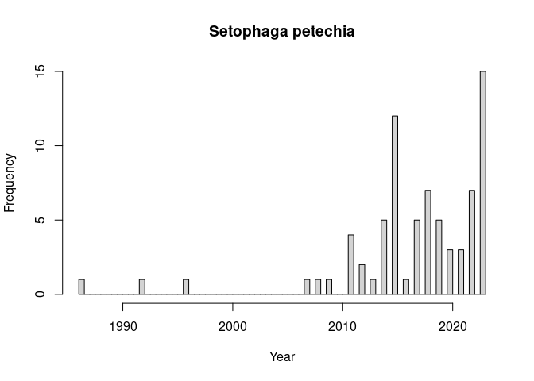<!-- -->

    ##                    species    eventDate   
    ##  Setophaga pensylvanica:1   Min.   :2015  
    ##  Acanthis flammea      :0   1st Qu.:2015  
    ##  Accipiter cooperii    :0   Median :2015  
    ##  Accipiter gentilis    :0   Mean   :2015  
    ##  Accipiter striatus    :0   3rd Qu.:2015  
    ##  Actitis macularius    :0   Max.   :2015  
    ##  (Other)               :0

<!-- -->

    ##                species    eventDate   
    ##  Setophaga striata :3   Min.   :2015  
    ##  Acanthis flammea  :0   1st Qu.:2015  
    ##  Accipiter cooperii:0   Median :2015  
    ##  Accipiter gentilis:0   Mean   :2017  
    ##  Accipiter striatus:0   3rd Qu.:2018  
    ##  Actitis macularius:0   Max.   :2021  
    ##  (Other)           :0

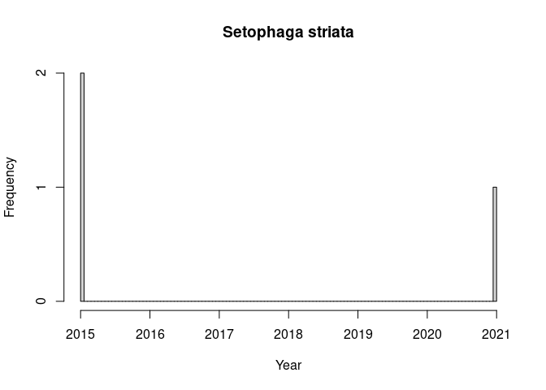<!-- -->

    ##                species     eventDate   
    ##  Setophaga coronata:41   Min.   :1985  
    ##  Acanthis flammea  : 0   1st Qu.:2009  
    ##  Accipiter cooperii: 0   Median :2015  
    ##  Accipiter gentilis: 0   Mean   :2011  
    ##  Accipiter striatus: 0   3rd Qu.:2020  
    ##  Actitis macularius: 0   Max.   :2023  
    ##  (Other)           : 0

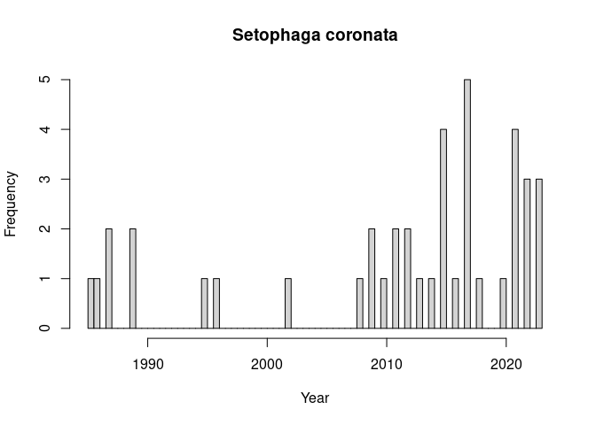<!-- -->

    ##                species    eventDate   
    ##  Cardellina pusilla:8   Min.   :1985  
    ##  Acanthis flammea  :0   1st Qu.:1993  
    ##  Accipiter cooperii:0   Median :2008  
    ##  Accipiter gentilis:0   Mean   :2004  
    ##  Accipiter striatus:0   3rd Qu.:2012  
    ##  Actitis macularius:0   Max.   :2022  
    ##  (Other)           :0

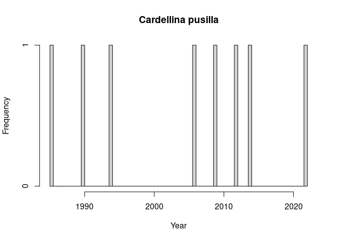<!-- -->

    ##                   species      eventDate   
    ##  Cardinalis cardinalis:137   Min.   :1986  
    ##  Acanthis flammea     :  0   1st Qu.:2012  
    ##  Accipiter cooperii   :  0   Median :2018  
    ##  Accipiter gentilis   :  0   Mean   :2015  
    ##  Accipiter striatus   :  0   3rd Qu.:2021  
    ##  Actitis macularius   :  0   Max.   :2023  
    ##  (Other)              :  0

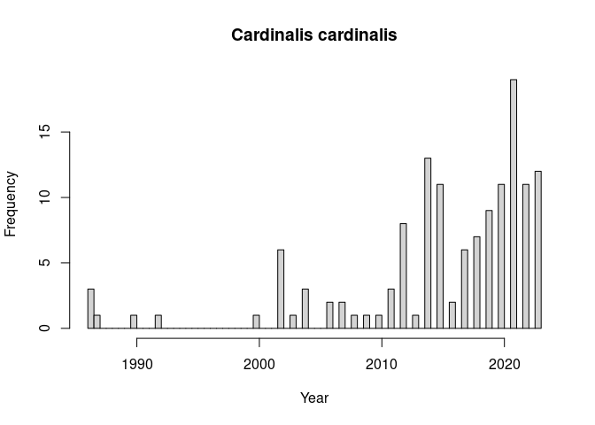<!-- -->

    ##                     species    eventDate   
    ##  Pheucticus ludovicianus:8   Min.   :2002  
    ##  Acanthis flammea       :0   1st Qu.:2016  
    ##  Accipiter cooperii     :0   Median :2022  
    ##  Accipiter gentilis     :0   Mean   :2018  
    ##  Accipiter striatus     :0   3rd Qu.:2023  
    ##  Actitis macularius     :0   Max.   :2023  
    ##  (Other)                :0

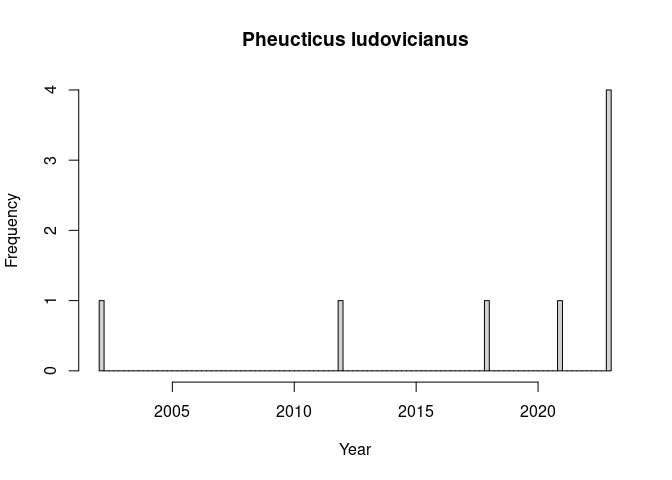<!-- -->

    ##                       species    eventDate   
    ##  Pheucticus melanocephalus:6   Min.   :1957  
    ##  Acanthis flammea         :0   1st Qu.:1971  
    ##  Accipiter cooperii       :0   Median :2014  
    ##  Accipiter gentilis       :0   Mean   :1996  
    ##  Accipiter striatus       :0   3rd Qu.:2016  
    ##  Actitis macularius       :0   Max.   :2018  
    ##  (Other)                  :0

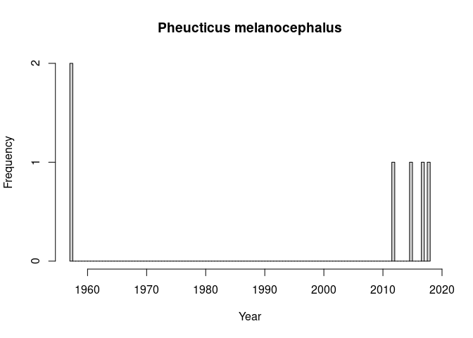<!-- -->

    ##                species     eventDate   
    ##  Passerina caerulea:33   Min.   :2002  
    ##  Acanthis flammea  : 0   1st Qu.:2014  
    ##  Accipiter cooperii: 0   Median :2019  
    ##  Accipiter gentilis: 0   Mean   :2017  
    ##  Accipiter striatus: 0   3rd Qu.:2022  
    ##  Actitis macularius: 0   Max.   :2023  
    ##  (Other)           : 0

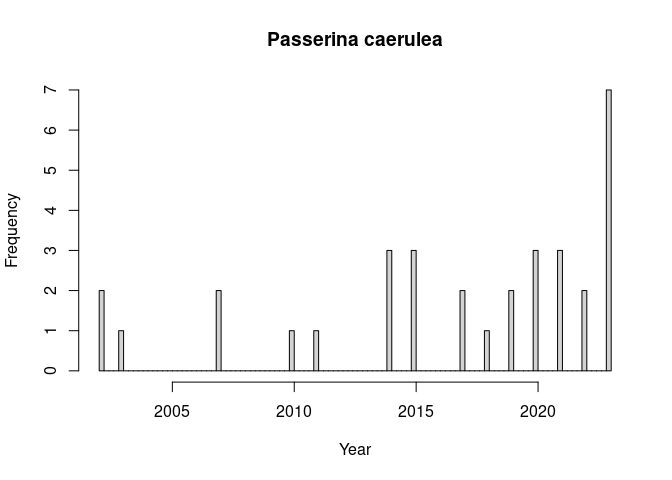<!-- -->

    ##                species    eventDate   
    ##  Passerina amoena  :4   Min.   :2012  
    ##  Acanthis flammea  :0   1st Qu.:2012  
    ##  Accipiter cooperii:0   Median :2018  
    ##  Accipiter gentilis:0   Mean   :2018  
    ##  Accipiter striatus:0   3rd Qu.:2023  
    ##  Actitis macularius:0   Max.   :2023  
    ##  (Other)           :0

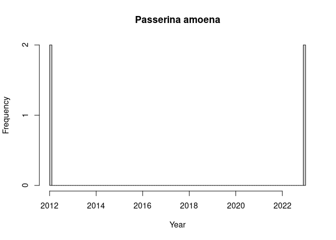<!-- -->

    ##                species     eventDate   
    ##  Passerina cyanea  :44   Min.   :2002  
    ##  Acanthis flammea  : 0   1st Qu.:2014  
    ##  Accipiter cooperii: 0   Median :2015  
    ##  Accipiter gentilis: 0   Mean   :2016  
    ##  Accipiter striatus: 0   3rd Qu.:2021  
    ##  Actitis macularius: 0   Max.   :2023  
    ##  (Other)           : 0

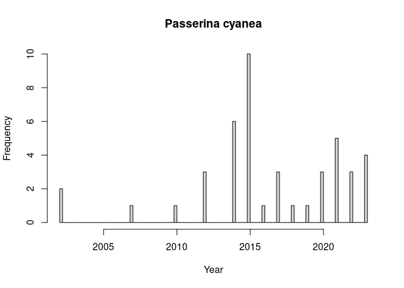<!-- -->

    ##                species     eventDate   
    ##  Spiza americana   :20   Min.   :2010  
    ##  Acanthis flammea  : 0   1st Qu.:2014  
    ##  Accipiter cooperii: 0   Median :2018  
    ##  Accipiter gentilis: 0   Mean   :2017  
    ##  Accipiter striatus: 0   3rd Qu.:2020  
    ##  Actitis macularius: 0   Max.   :2023  
    ##  (Other)           : 0

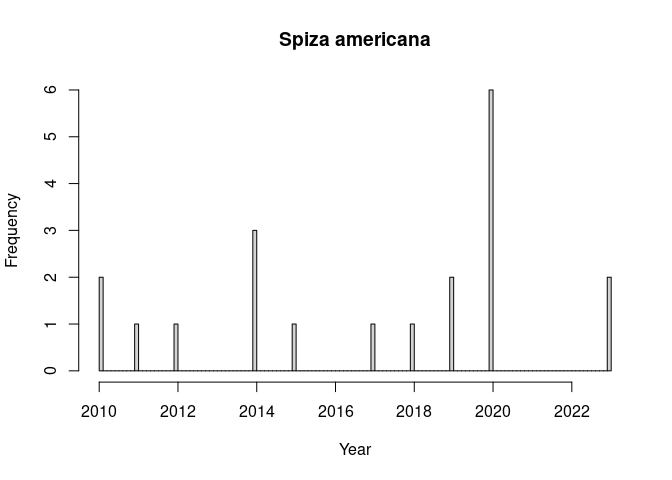<!-- -->

    ##                         species       eventDate   
    ##  Setophaga coronata/auduboni:1453   Min.   :1957  
    ##  Acanthis flammea           :   0   1st Qu.:2012  
    ##  Accipiter cooperii         :   0   Median :2017  
    ##  Accipiter gentilis         :   0   Mean   :2014  
    ##  Accipiter striatus         :   0   3rd Qu.:2020  
    ##  Actitis macularius         :   0   Max.   :2022  
    ##  (Other)                    :   0

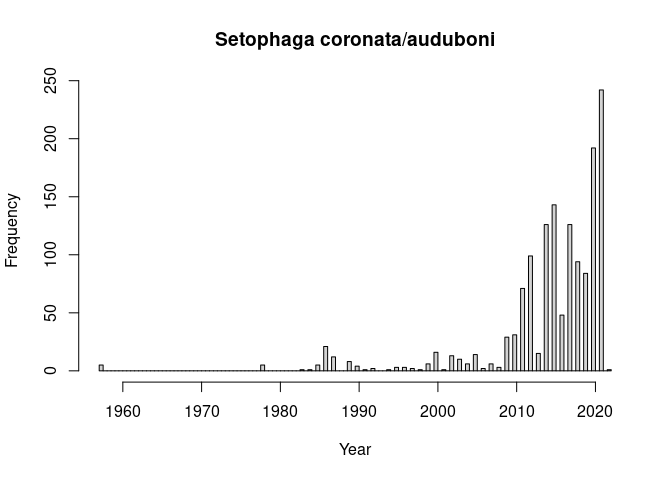<!-- -->

    ##                species    eventDate   
    ##  Rallus limicola   :1   Min.   :1957  
    ##  Acanthis flammea  :0   1st Qu.:1957  
    ##  Accipiter cooperii:0   Median :1957  
    ##  Accipiter gentilis:0   Mean   :1957  
    ##  Accipiter striatus:0   3rd Qu.:1957  
    ##  Actitis macularius:0   Max.   :1957  
    ##  (Other)           :0

<!-- -->

## mckelvie

``` r
districtR(ne_nf_gbif = ne_nf_gbif,district = "McKelvie")
```

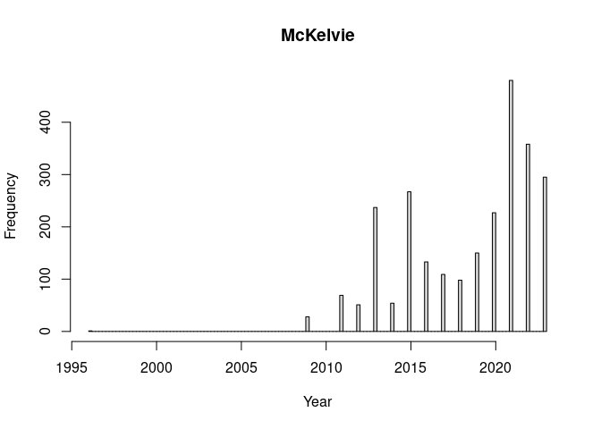<!-- -->

    ##                species    eventDate   
    ##  Branta hutchinsii :1   Min.   :2021  
    ##  Acanthis flammea  :0   1st Qu.:2021  
    ##  Accipiter cooperii:0   Median :2021  
    ##  Accipiter gentilis:0   Mean   :2021  
    ##  Accipiter striatus:0   3rd Qu.:2021  
    ##  Actitis macularius:0   Max.   :2021  
    ##  (Other)           :0

<!-- -->

    ##                species     eventDate   
    ##  Branta canadensis :26   Min.   :2009  
    ##  Acanthis flammea  : 0   1st Qu.:2018  
    ##  Accipiter cooperii: 0   Median :2021  
    ##  Accipiter gentilis: 0   Mean   :2020  
    ##  Accipiter striatus: 0   3rd Qu.:2023  
    ##  Actitis macularius: 0   Max.   :2023  
    ##  (Other)           : 0

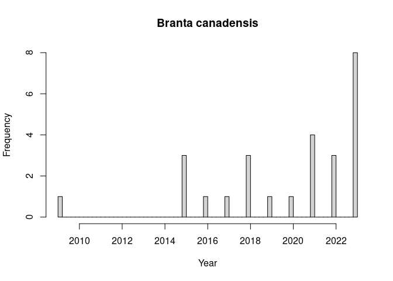<!-- -->

    ##                species     eventDate   
    ##  Cygnus buccinator :12   Min.   :2009  
    ##  Acanthis flammea  : 0   1st Qu.:2019  
    ##  Accipiter cooperii: 0   Median :2020  
    ##  Accipiter gentilis: 0   Mean   :2020  
    ##  Accipiter striatus: 0   3rd Qu.:2021  
    ##  Actitis macularius: 0   Max.   :2023  
    ##  (Other)           : 0

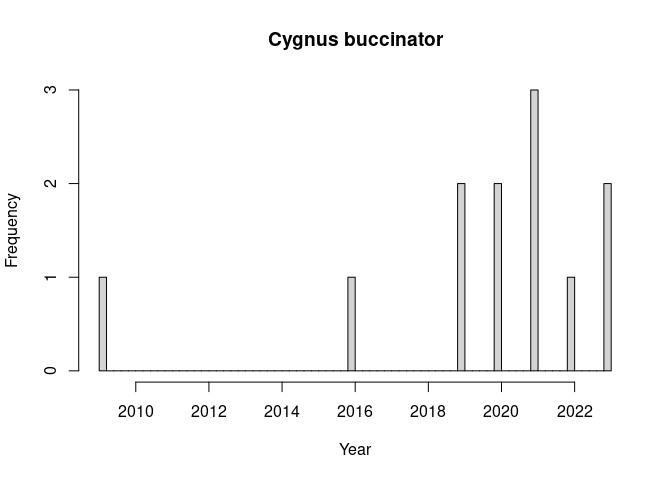<!-- -->

    ##                species     eventDate   
    ##  Aix sponsa        :15   Min.   :2015  
    ##  Acanthis flammea  : 0   1st Qu.:2020  
    ##  Accipiter cooperii: 0   Median :2021  
    ##  Accipiter gentilis: 0   Mean   :2021  
    ##  Accipiter striatus: 0   3rd Qu.:2022  
    ##  Actitis macularius: 0   Max.   :2023  
    ##  (Other)           : 0

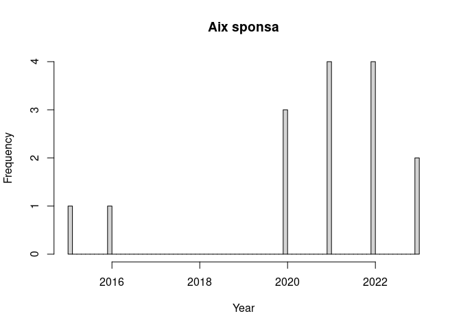<!-- -->

    ##                species     eventDate   
    ##  Spatula discors   :33   Min.   :2015  
    ##  Acanthis flammea  : 0   1st Qu.:2018  
    ##  Accipiter cooperii: 0   Median :2020  
    ##  Accipiter gentilis: 0   Mean   :2020  
    ##  Accipiter striatus: 0   3rd Qu.:2021  
    ##  Actitis macularius: 0   Max.   :2023  
    ##  (Other)           : 0

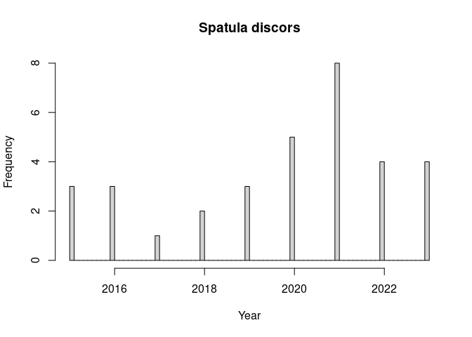<!-- -->

    ##                species     eventDate   
    ##  Spatula clypeata  :11   Min.   :2016  
    ##  Acanthis flammea  : 0   1st Qu.:2020  
    ##  Accipiter cooperii: 0   Median :2021  
    ##  Accipiter gentilis: 0   Mean   :2021  
    ##  Accipiter striatus: 0   3rd Qu.:2023  
    ##  Actitis macularius: 0   Max.   :2023  
    ##  (Other)           : 0

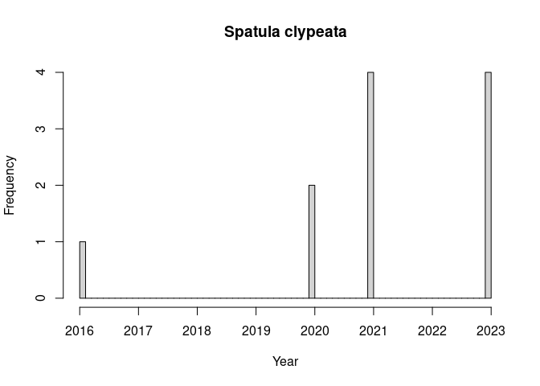<!-- -->

    ##                species     eventDate   
    ##  Mareca strepera   :14   Min.   :2015  
    ##  Acanthis flammea  : 0   1st Qu.:2021  
    ##  Accipiter cooperii: 0   Median :2021  
    ##  Accipiter gentilis: 0   Mean   :2021  
    ##  Accipiter striatus: 0   3rd Qu.:2023  
    ##  Actitis macularius: 0   Max.   :2023  
    ##  (Other)           : 0

<!-- -->

    ##                species    eventDate   
    ##  Mareca americana  :6   Min.   :2016  
    ##  Acanthis flammea  :0   1st Qu.:2021  
    ##  Accipiter cooperii:0   Median :2021  
    ##  Accipiter gentilis:0   Mean   :2020  
    ##  Accipiter striatus:0   3rd Qu.:2021  
    ##  Actitis macularius:0   Max.   :2023  
    ##  (Other)           :0

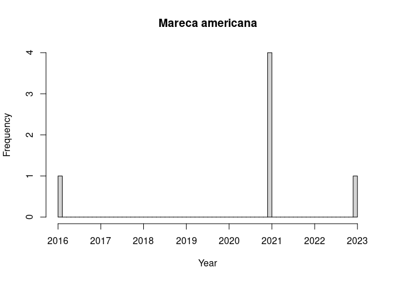<!-- -->

    ##                species     eventDate   
    ##  Anas platyrhynchos:54   Min.   :2009  
    ##  Acanthis flammea  : 0   1st Qu.:2019  
    ##  Accipiter cooperii: 0   Median :2021  
    ##  Accipiter gentilis: 0   Mean   :2020  
    ##  Accipiter striatus: 0   3rd Qu.:2023  
    ##  Actitis macularius: 0   Max.   :2023  
    ##  (Other)           : 0

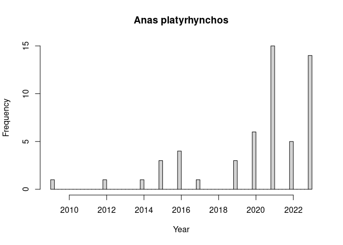<!-- -->

    ##                species    eventDate   
    ##  Anas acuta        :9   Min.   :2016  
    ##  Acanthis flammea  :0   1st Qu.:2020  
    ##  Accipiter cooperii:0   Median :2020  
    ##  Accipiter gentilis:0   Mean   :2020  
    ##  Accipiter striatus:0   3rd Qu.:2021  
    ##  Actitis macularius:0   Max.   :2023  
    ##  (Other)           :0

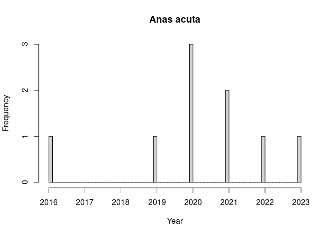<!-- -->

    ##                species     eventDate   
    ##  Anas crecca       :10   Min.   :2016  
    ##  Acanthis flammea  : 0   1st Qu.:2021  
    ##  Accipiter cooperii: 0   Median :2022  
    ##  Accipiter gentilis: 0   Mean   :2021  
    ##  Accipiter striatus: 0   3rd Qu.:2023  
    ##  Actitis macularius: 0   Max.   :2023  
    ##  (Other)           : 0

<!-- -->

    ##                species    eventDate   
    ##  Aythya valisineria:3   Min.   :2019  
    ##  Acanthis flammea  :0   1st Qu.:2020  
    ##  Accipiter cooperii:0   Median :2021  
    ##  Accipiter gentilis:0   Mean   :2021  
    ##  Accipiter striatus:0   3rd Qu.:2022  
    ##  Actitis macularius:0   Max.   :2023  
    ##  (Other)           :0

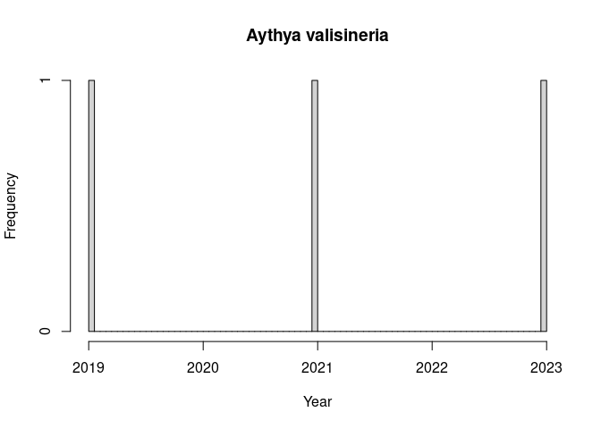<!-- -->

    ##                species    eventDate   
    ##  Aythya americana  :9   Min.   :2019  
    ##  Acanthis flammea  :0   1st Qu.:2021  
    ##  Accipiter cooperii:0   Median :2022  
    ##  Accipiter gentilis:0   Mean   :2022  
    ##  Accipiter striatus:0   3rd Qu.:2023  
    ##  Actitis macularius:0   Max.   :2023  
    ##  (Other)           :0

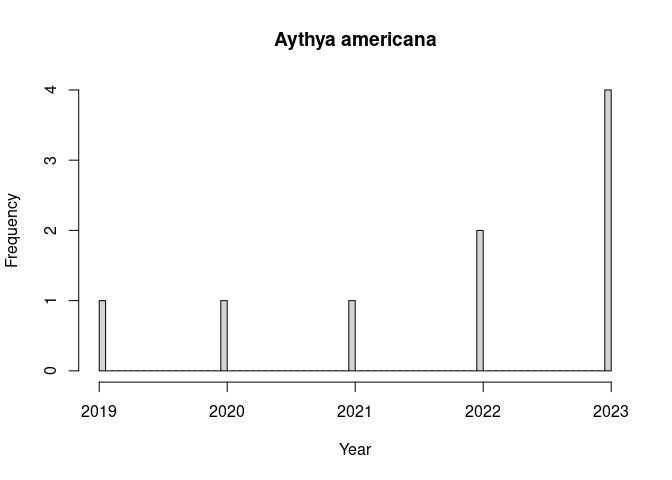<!-- -->

    ##                species     eventDate   
    ##  Aythya collaris   :14   Min.   :2018  
    ##  Acanthis flammea  : 0   1st Qu.:2020  
    ##  Accipiter cooperii: 0   Median :2022  
    ##  Accipiter gentilis: 0   Mean   :2021  
    ##  Accipiter striatus: 0   3rd Qu.:2023  
    ##  Actitis macularius: 0   Max.   :2023  
    ##  (Other)           : 0

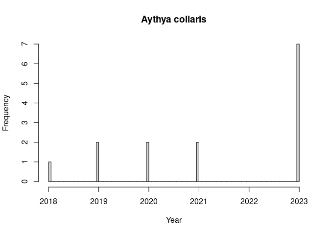<!-- -->

    ##                species    eventDate   
    ##  Aythya marila     :1   Min.   :2023  
    ##  Acanthis flammea  :0   1st Qu.:2023  
    ##  Accipiter cooperii:0   Median :2023  
    ##  Accipiter gentilis:0   Mean   :2023  
    ##  Accipiter striatus:0   3rd Qu.:2023  
    ##  Actitis macularius:0   Max.   :2023  
    ##  (Other)           :0

<!-- -->

    ##                species    eventDate   
    ##  Aythya affinis    :4   Min.   :2023  
    ##  Acanthis flammea  :0   1st Qu.:2023  
    ##  Accipiter cooperii:0   Median :2023  
    ##  Accipiter gentilis:0   Mean   :2023  
    ##  Accipiter striatus:0   3rd Qu.:2023  
    ##  Actitis macularius:0   Max.   :2023  
    ##  (Other)           :0

<!-- -->

    ##                species    eventDate   
    ##  Bucephala albeola :3   Min.   :2023  
    ##  Acanthis flammea  :0   1st Qu.:2023  
    ##  Accipiter cooperii:0   Median :2023  
    ##  Accipiter gentilis:0   Mean   :2023  
    ##  Accipiter striatus:0   3rd Qu.:2023  
    ##  Actitis macularius:0   Max.   :2023  
    ##  (Other)           :0

<!-- -->

    ##                species    eventDate   
    ##  Bucephala clangula:2   Min.   :2023  
    ##  Acanthis flammea  :0   1st Qu.:2023  
    ##  Accipiter cooperii:0   Median :2023  
    ##  Accipiter gentilis:0   Mean   :2023  
    ##  Accipiter striatus:0   3rd Qu.:2023  
    ##  Actitis macularius:0   Max.   :2023  
    ##  (Other)           :0

<!-- -->

    ##                   species    eventDate   
    ##  Lophodytes cucullatus:3   Min.   :2012  
    ##  Acanthis flammea     :0   1st Qu.:2014  
    ##  Accipiter cooperii   :0   Median :2015  
    ##  Accipiter gentilis   :0   Mean   :2017  
    ##  Accipiter striatus   :0   3rd Qu.:2019  
    ##  Actitis macularius   :0   Max.   :2023  
    ##  (Other)              :0

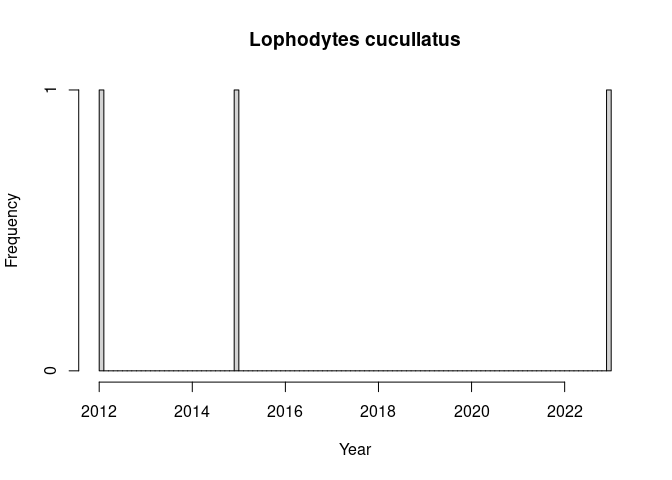<!-- -->

    ##                species    eventDate   
    ##  Oxyura jamaicensis:2   Min.   :2021  
    ##  Acanthis flammea  :0   1st Qu.:2021  
    ##  Accipiter cooperii:0   Median :2021  
    ##  Accipiter gentilis:0   Mean   :2021  
    ##  Accipiter striatus:0   3rd Qu.:2021  
    ##  Actitis macularius:0   Max.   :2021  
    ##  (Other)           :0

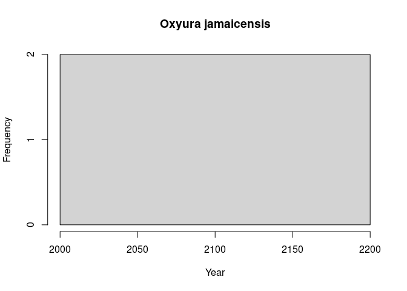<!-- -->

    ##                 species    eventDate   
    ##  Colinus virginianus:8   Min.   :2014  
    ##  Acanthis flammea   :0   1st Qu.:2021  
    ##  Accipiter cooperii :0   Median :2022  
    ##  Accipiter gentilis :0   Mean   :2021  
    ##  Accipiter striatus :0   3rd Qu.:2022  
    ##  Actitis macularius :0   Max.   :2022  
    ##  (Other)            :0

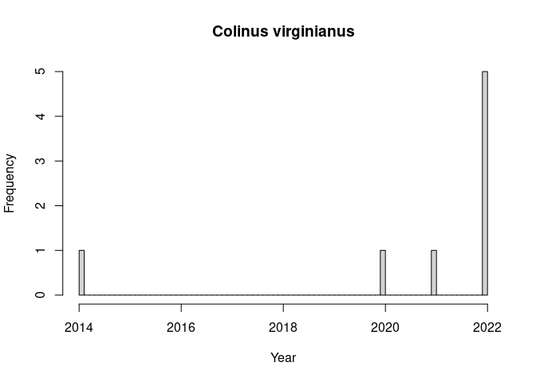<!-- -->

    ##                 species    eventDate   
    ##  Meleagris gallopavo:8   Min.   :2009  
    ##  Acanthis flammea   :0   1st Qu.:2014  
    ##  Accipiter cooperii :0   Median :2015  
    ##  Accipiter gentilis :0   Mean   :2016  
    ##  Accipiter striatus :0   3rd Qu.:2017  
    ##  Actitis macularius :0   Max.   :2022  
    ##  (Other)            :0

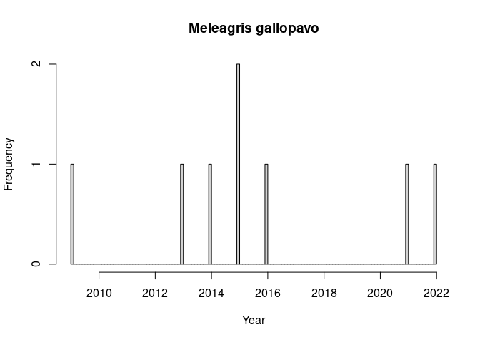<!-- -->

    ##                      species     eventDate   
    ##  Tympanuchus phasianellus:10   Min.   :2015  
    ##  Acanthis flammea        : 0   1st Qu.:2015  
    ##  Accipiter cooperii      : 0   Median :2016  
    ##  Accipiter gentilis      : 0   Mean   :2018  
    ##  Accipiter striatus      : 0   3rd Qu.:2020  
    ##  Actitis macularius      : 0   Max.   :2022  
    ##  (Other)                 : 0

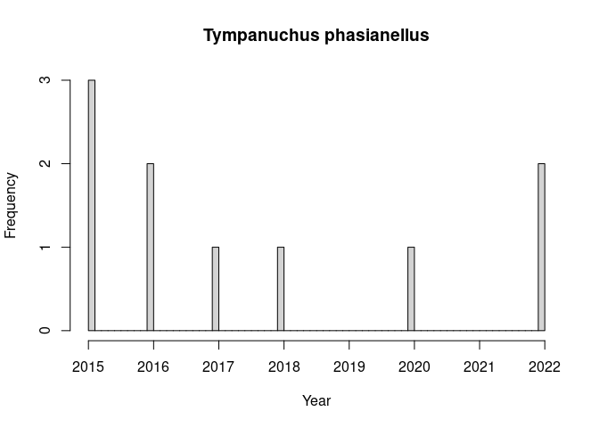<!-- -->

    ##                species    eventDate   
    ##  Tympanuchus cupido:5   Min.   :2015  
    ##  Acanthis flammea  :0   1st Qu.:2015  
    ##  Accipiter cooperii:0   Median :2017  
    ##  Accipiter gentilis:0   Mean   :2018  
    ##  Accipiter striatus:0   3rd Qu.:2021  
    ##  Actitis macularius:0   Max.   :2023  
    ##  (Other)           :0

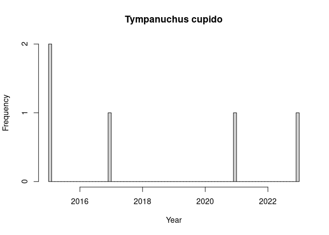<!-- -->

    ##                 species    eventDate   
    ##  Phasianus colchicus:8   Min.   :2011  
    ##  Acanthis flammea   :0   1st Qu.:2015  
    ##  Accipiter cooperii :0   Median :2018  
    ##  Accipiter gentilis :0   Mean   :2018  
    ##  Accipiter striatus :0   3rd Qu.:2021  
    ##  Actitis macularius :0   Max.   :2023  
    ##  (Other)            :0

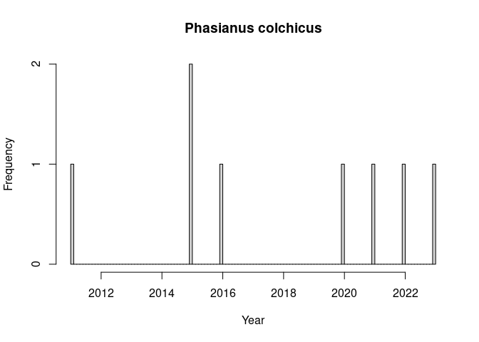<!-- -->

    ##                 species     eventDate   
    ##  Podilymbus podiceps:17   Min.   :2011  
    ##  Acanthis flammea   : 0   1st Qu.:2019  
    ##  Accipiter cooperii : 0   Median :2021  
    ##  Accipiter gentilis : 0   Mean   :2019  
    ##  Accipiter striatus : 0   3rd Qu.:2022  
    ##  Actitis macularius : 0   Max.   :2022  
    ##  (Other)            : 0

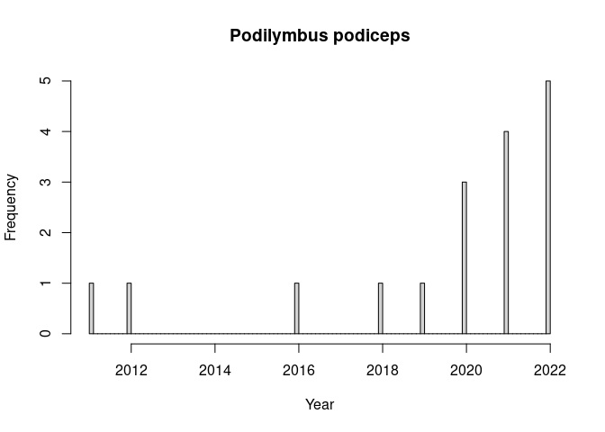<!-- -->

    ##                  species    eventDate   
    ##  Podiceps nigricollis:3   Min.   :2021  
    ##  Acanthis flammea    :0   1st Qu.:2021  
    ##  Accipiter cooperii  :0   Median :2021  
    ##  Accipiter gentilis  :0   Mean   :2022  
    ##  Accipiter striatus  :0   3rd Qu.:2022  
    ##  Actitis macularius  :0   Max.   :2023  
    ##  (Other)             :0

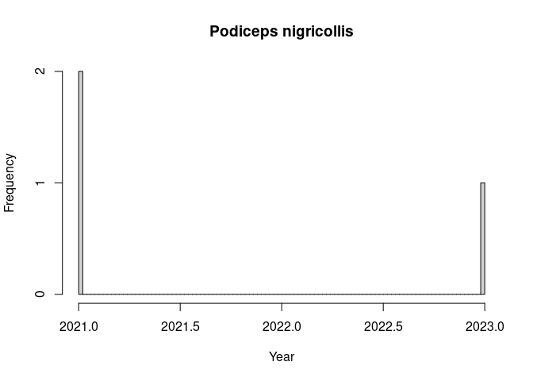<!-- -->

    ##                       species    eventDate   
    ##  Aechmophorus occidentalis:1   Min.   :2023  
    ##  Acanthis flammea         :0   1st Qu.:2023  
    ##  Accipiter cooperii       :0   Median :2023  
    ##  Accipiter gentilis       :0   Mean   :2023  
    ##  Accipiter striatus       :0   3rd Qu.:2023  
    ##  Actitis macularius       :0   Max.   :2023  
    ##  (Other)                  :0

<!-- -->

    ##                species     eventDate   
    ##  Zenaida macroura  :72   Min.   :2009  
    ##  Acanthis flammea  : 0   1st Qu.:2015  
    ##  Accipiter cooperii: 0   Median :2020  
    ##  Accipiter gentilis: 0   Mean   :2019  
    ##  Accipiter striatus: 0   3rd Qu.:2022  
    ##  Actitis macularius: 0   Max.   :2023  
    ##  (Other)           : 0

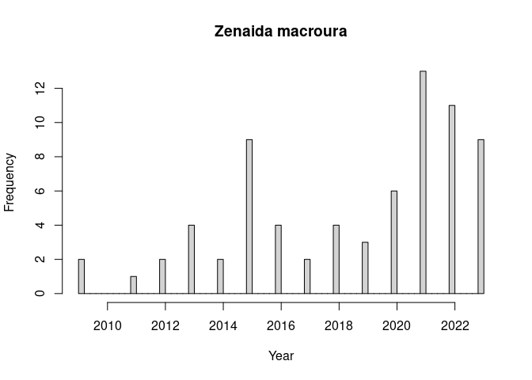<!-- -->

    ##                 species    eventDate   
    ##  Coccyzus americanus:3   Min.   :2011  
    ##  Acanthis flammea   :0   1st Qu.:2012  
    ##  Accipiter cooperii :0   Median :2014  
    ##  Accipiter gentilis :0   Mean   :2016  
    ##  Accipiter striatus :0   3rd Qu.:2018  
    ##  Actitis macularius :0   Max.   :2022  
    ##  (Other)            :0

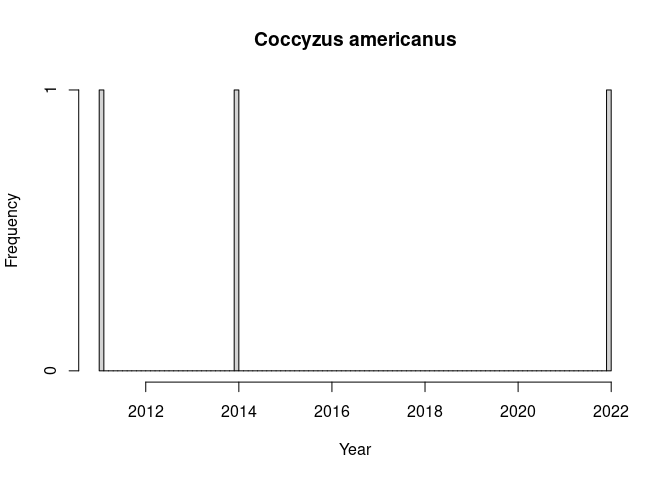<!-- -->

    ##                species     eventDate   
    ##  Chordeiles minor  :37   Min.   :2009  
    ##  Acanthis flammea  : 0   1st Qu.:2015  
    ##  Accipiter cooperii: 0   Median :2020  
    ##  Accipiter gentilis: 0   Mean   :2018  
    ##  Accipiter striatus: 0   3rd Qu.:2022  
    ##  Actitis macularius: 0   Max.   :2023  
    ##  (Other)           : 0

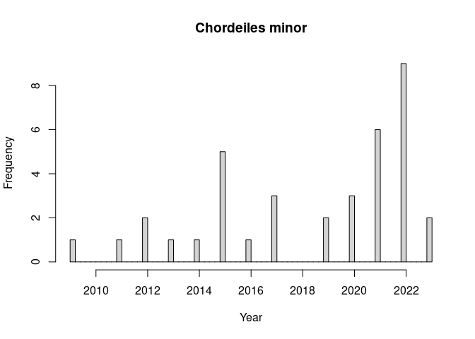<!-- -->

    ##                      species    eventDate   
    ##  Phalaenoptilus nuttallii:5   Min.   :2015  
    ##  Acanthis flammea        :0   1st Qu.:2021  
    ##  Accipiter cooperii      :0   Median :2022  
    ##  Accipiter gentilis      :0   Mean   :2021  
    ##  Accipiter striatus      :0   3rd Qu.:2023  
    ##  Actitis macularius      :0   Max.   :2023  
    ##  (Other)                 :0

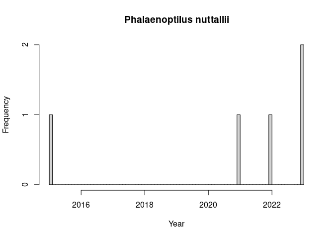<!-- -->

    ##                species    eventDate   
    ##  Chaetura pelagica :1   Min.   :2021  
    ##  Acanthis flammea  :0   1st Qu.:2021  
    ##  Accipiter cooperii:0   Median :2021  
    ##  Accipiter gentilis:0   Mean   :2021  
    ##  Accipiter striatus:0   3rd Qu.:2021  
    ##  Actitis macularius:0   Max.   :2021  
    ##  (Other)           :0

<!-- -->

    ##                species    eventDate   
    ##  Rallus limicola   :3   Min.   :2014  
    ##  Acanthis flammea  :0   1st Qu.:2016  
    ##  Accipiter cooperii:0   Median :2018  
    ##  Accipiter gentilis:0   Mean   :2018  
    ##  Accipiter striatus:0   3rd Qu.:2020  
    ##  Actitis macularius:0   Max.   :2022  
    ##  (Other)           :0

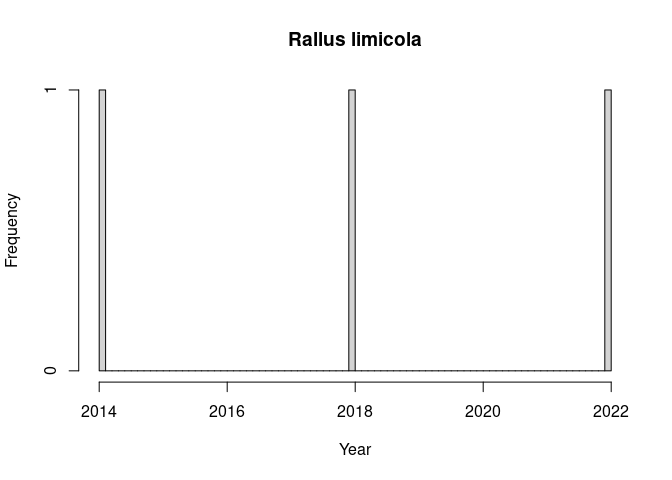<!-- -->

    ##                species    eventDate   
    ##  Porzana carolina  :5   Min.   :2015  
    ##  Acanthis flammea  :0   1st Qu.:2016  
    ##  Accipiter cooperii:0   Median :2018  
    ##  Accipiter gentilis:0   Mean   :2018  
    ##  Accipiter striatus:0   3rd Qu.:2019  
    ##  Actitis macularius:0   Max.   :2021  
    ##  (Other)           :0

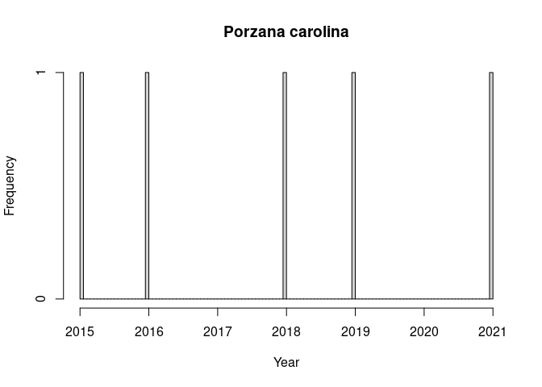<!-- -->

    ##                species    eventDate   
    ##  Fulica americana  :8   Min.   :2016  
    ##  Acanthis flammea  :0   1st Qu.:2018  
    ##  Accipiter cooperii:0   Median :2020  
    ##  Accipiter gentilis:0   Mean   :2020  
    ##  Accipiter striatus:0   3rd Qu.:2021  
    ##  Actitis macularius:0   Max.   :2023  
    ##  (Other)           :0

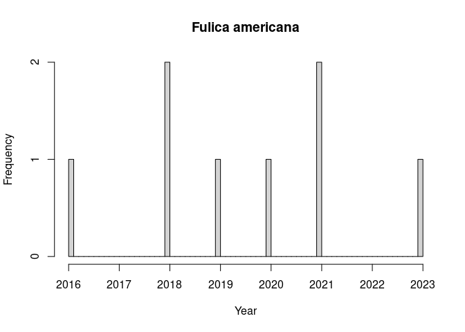<!-- -->

    ##                 species    eventDate   
    ##  Antigone canadensis:2   Min.   :2015  
    ##  Acanthis flammea   :0   1st Qu.:2015  
    ##  Accipiter cooperii :0   Median :2016  
    ##  Accipiter gentilis :0   Mean   :2016  
    ##  Accipiter striatus :0   3rd Qu.:2016  
    ##  Actitis macularius :0   Max.   :2016  
    ##  (Other)            :0

<!-- -->

    ##                  species    eventDate   
    ##  Himantopus mexicanus:1   Min.   :2020  
    ##  Acanthis flammea    :0   1st Qu.:2020  
    ##  Accipiter cooperii  :0   Median :2020  
    ##  Accipiter gentilis  :0   Mean   :2020  
    ##  Accipiter striatus  :0   3rd Qu.:2020  
    ##  Actitis macularius  :0   Max.   :2020  
    ##  (Other)             :0

<!-- -->

    ##                  species     eventDate   
    ##  Charadrius vociferus:37   Min.   :2012  
    ##  Acanthis flammea    : 0   1st Qu.:2016  
    ##  Accipiter cooperii  : 0   Median :2020  
    ##  Accipiter gentilis  : 0   Mean   :2019  
    ##  Accipiter striatus  : 0   3rd Qu.:2022  
    ##  Actitis macularius  : 0   Max.   :2023  
    ##  (Other)             : 0

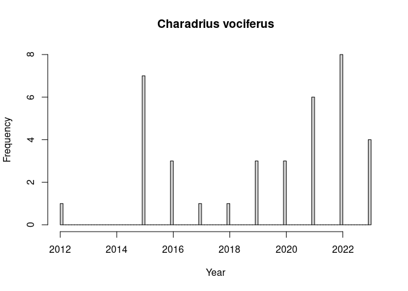<!-- -->

    ##                  species     eventDate   
    ##  Bartramia longicauda:37   Min.   :2009  
    ##  Acanthis flammea    : 0   1st Qu.:2016  
    ##  Accipiter cooperii  : 0   Median :2020  
    ##  Accipiter gentilis  : 0   Mean   :2019  
    ##  Accipiter striatus  : 0   3rd Qu.:2021  
    ##  Actitis macularius  : 0   Max.   :2023  
    ##  (Other)             : 0

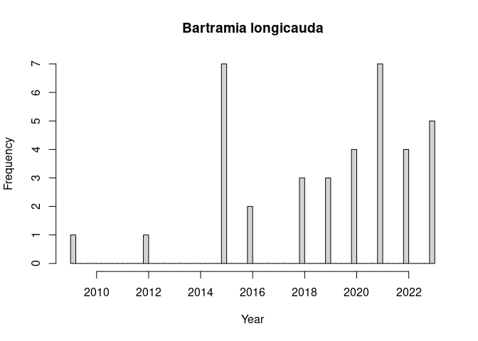<!-- -->

    ##                 species     eventDate   
    ##  Numenius americanus:11   Min.   :2016  
    ##  Acanthis flammea   : 0   1st Qu.:2019  
    ##  Accipiter cooperii : 0   Median :2022  
    ##  Accipiter gentilis : 0   Mean   :2021  
    ##  Accipiter striatus : 0   3rd Qu.:2023  
    ##  Actitis macularius : 0   Max.   :2023  
    ##  (Other)            : 0

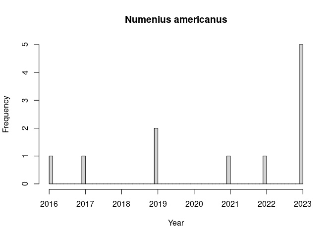<!-- -->

    ##                species    eventDate   
    ##  Limosa fedoa      :1   Min.   :2023  
    ##  Acanthis flammea  :0   1st Qu.:2023  
    ##  Accipiter cooperii:0   Median :2023  
    ##  Accipiter gentilis:0   Mean   :2023  
    ##  Accipiter striatus:0   3rd Qu.:2023  
    ##  Actitis macularius:0   Max.   :2023  
    ##  (Other)           :0

<!-- -->

    ##                  species    eventDate   
    ##  Calidris fuscicollis:1   Min.   :2022  
    ##  Acanthis flammea    :0   1st Qu.:2022  
    ##  Accipiter cooperii  :0   Median :2022  
    ##  Accipiter gentilis  :0   Mean   :2022  
    ##  Accipiter striatus  :0   3rd Qu.:2022  
    ##  Actitis macularius  :0   Max.   :2022  
    ##  (Other)             :0

<!-- -->

    ##                species    eventDate   
    ##  Calidris pusilla  :1   Min.   :2022  
    ##  Acanthis flammea  :0   1st Qu.:2022  
    ##  Accipiter cooperii:0   Median :2022  
    ##  Accipiter gentilis:0   Mean   :2022  
    ##  Accipiter striatus:0   3rd Qu.:2022  
    ##  Actitis macularius:0   Max.   :2022  
    ##  (Other)           :0

<!-- -->

    ##                     species    eventDate   
    ##  Limnodromus scolopaceus:1   Min.   :2023  
    ##  Acanthis flammea       :0   1st Qu.:2023  
    ##  Accipiter cooperii     :0   Median :2023  
    ##  Accipiter gentilis     :0   Mean   :2023  
    ##  Accipiter striatus     :0   3rd Qu.:2023  
    ##  Actitis macularius     :0   Max.   :2023  
    ##  (Other)                :0

<!-- -->

    ##                species    eventDate   
    ##  Gallinago delicata:5   Min.   :2014  
    ##  Acanthis flammea  :0   1st Qu.:2019  
    ##  Accipiter cooperii:0   Median :2021  
    ##  Accipiter gentilis:0   Mean   :2019  
    ##  Accipiter striatus:0   3rd Qu.:2021  
    ##  Actitis macularius:0   Max.   :2022  
    ##  (Other)           :0

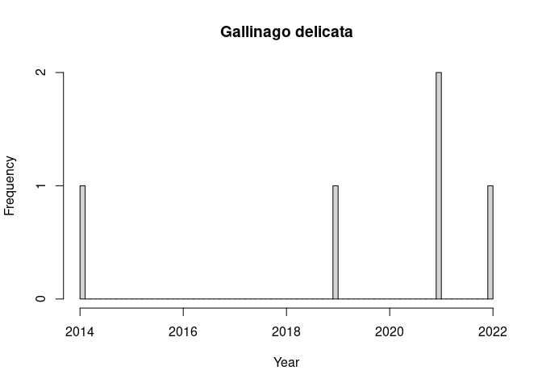<!-- -->

    ##                 species    eventDate   
    ##  Phalaropus tricolor:9   Min.   :2015  
    ##  Acanthis flammea   :0   1st Qu.:2016  
    ##  Accipiter cooperii :0   Median :2021  
    ##  Accipiter gentilis :0   Mean   :2019  
    ##  Accipiter striatus :0   3rd Qu.:2022  
    ##  Actitis macularius :0   Max.   :2023  
    ##  (Other)            :0

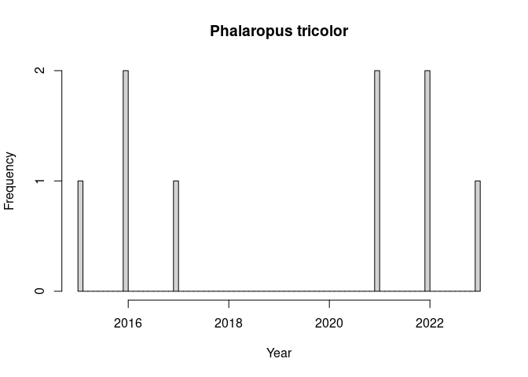<!-- -->

    ##                  species    eventDate   
    ##  Actitis macularius  :4   Min.   :2021  
    ##  Acanthis flammea    :0   1st Qu.:2021  
    ##  Accipiter cooperii  :0   Median :2021  
    ##  Accipiter gentilis  :0   Mean   :2021  
    ##  Accipiter striatus  :0   3rd Qu.:2021  
    ##  Aechmophorus clarkii:0   Max.   :2022  
    ##  (Other)             :0

<!-- -->

    ##                species    eventDate   
    ##  Tringa solitaria  :2   Min.   :2021  
    ##  Acanthis flammea  :0   1st Qu.:2022  
    ##  Accipiter cooperii:0   Median :2022  
    ##  Accipiter gentilis:0   Mean   :2022  
    ##  Accipiter striatus:0   3rd Qu.:2022  
    ##  Actitis macularius:0   Max.   :2023  
    ##  (Other)           :0

<!-- -->

    ##                species    eventDate   
    ##  Tringa melanoleuca:1   Min.   :2023  
    ##  Acanthis flammea  :0   1st Qu.:2023  
    ##  Accipiter cooperii:0   Median :2023  
    ##  Accipiter gentilis:0   Mean   :2023  
    ##  Accipiter striatus:0   3rd Qu.:2023  
    ##  Actitis macularius:0   Max.   :2023  
    ##  (Other)           :0

<!-- -->

    ##                species    eventDate   
    ##  Tringa semipalmata:2   Min.   :2019  
    ##  Acanthis flammea  :0   1st Qu.:2020  
    ##  Accipiter cooperii:0   Median :2020  
    ##  Accipiter gentilis:0   Mean   :2020  
    ##  Accipiter striatus:0   3rd Qu.:2021  
    ##  Actitis macularius:0   Max.   :2022  
    ##  (Other)           :0

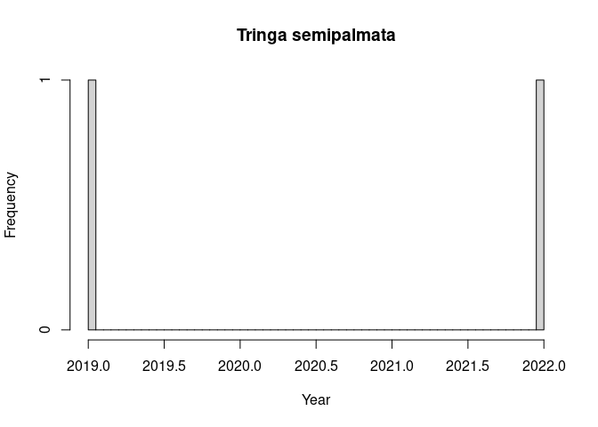<!-- -->

    ##                species    eventDate   
    ##  Tringa flavipes   :2   Min.   :2016  
    ##  Acanthis flammea  :0   1st Qu.:2017  
    ##  Accipiter cooperii:0   Median :2018  
    ##  Accipiter gentilis:0   Mean   :2018  
    ##  Accipiter striatus:0   3rd Qu.:2018  
    ##  Actitis macularius:0   Max.   :2019  
    ##  (Other)           :0

<!-- -->

    ##                species    eventDate   
    ##  Larus delawarensis:3   Min.   :2018  
    ##  Acanthis flammea  :0   1st Qu.:2020  
    ##  Accipiter cooperii:0   Median :2021  
    ##  Accipiter gentilis:0   Mean   :2021  
    ##  Accipiter striatus:0   3rd Qu.:2022  
    ##  Actitis macularius:0   Max.   :2023  
    ##  (Other)           :0

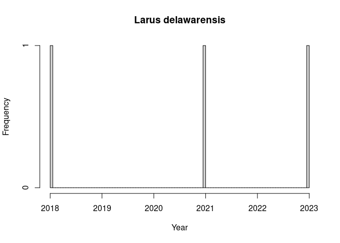<!-- -->

    ##                species    eventDate   
    ##  Chlidonias niger  :2   Min.   :2021  
    ##  Acanthis flammea  :0   1st Qu.:2021  
    ##  Accipiter cooperii:0   Median :2022  
    ##  Accipiter gentilis:0   Mean   :2022  
    ##  Accipiter striatus:0   3rd Qu.:2022  
    ##  Actitis macularius:0   Max.   :2022  
    ##  (Other)           :0

<!-- -->

    ##                species    eventDate   
    ##  Sterna forsteri   :2   Min.   :2017  
    ##  Acanthis flammea  :0   1st Qu.:2018  
    ##  Accipiter cooperii:0   Median :2020  
    ##  Accipiter gentilis:0   Mean   :2020  
    ##  Accipiter striatus:0   3rd Qu.:2022  
    ##  Actitis macularius:0   Max.   :2023  
    ##  (Other)           :0

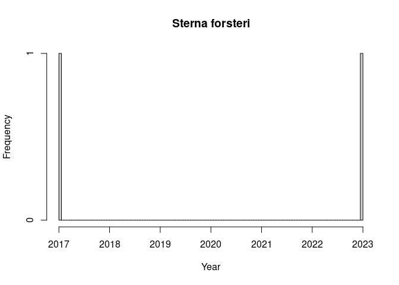<!-- -->

    ##                 species    eventDate   
    ##  Nannopterum auritum:5   Min.   :2015  
    ##  Acanthis flammea   :0   1st Qu.:2017  
    ##  Accipiter cooperii :0   Median :2021  
    ##  Accipiter gentilis :0   Mean   :2020  
    ##  Accipiter striatus :0   3rd Qu.:2022  
    ##  Actitis macularius :0   Max.   :2023  
    ##  (Other)            :0

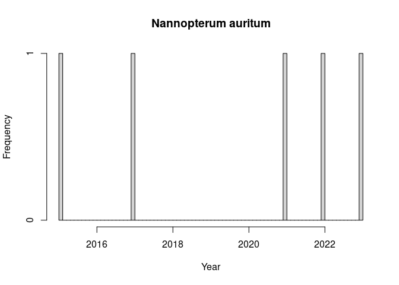<!-- -->

    ##                       species     eventDate   
    ##  Pelecanus erythrorhynchos:12   Min.   :2012  
    ##  Acanthis flammea         : 0   1st Qu.:2015  
    ##  Accipiter cooperii       : 0   Median :2020  
    ##  Accipiter gentilis       : 0   Mean   :2019  
    ##  Accipiter striatus       : 0   3rd Qu.:2021  
    ##  Actitis macularius       : 0   Max.   :2023  
    ##  (Other)                  : 0

<!-- -->

    ##                   species     eventDate   
    ##  Botaurus lentiginosus:12   Min.   :2016  
    ##  Acanthis flammea     : 0   1st Qu.:2020  
    ##  Accipiter cooperii   : 0   Median :2020  
    ##  Accipiter gentilis   : 0   Mean   :2020  
    ##  Accipiter striatus   : 0   3rd Qu.:2022  
    ##  Actitis macularius   : 0   Max.   :2023  
    ##  (Other)              : 0

<!-- -->

    ##                species     eventDate   
    ##  Ardea herodias    :20   Min.   :2011  
    ##  Acanthis flammea  : 0   1st Qu.:2016  
    ##  Accipiter cooperii: 0   Median :2020  
    ##  Accipiter gentilis: 0   Mean   :2018  
    ##  Accipiter striatus: 0   3rd Qu.:2021  
    ##  Actitis macularius: 0   Max.   :2023  
    ##  (Other)           : 0

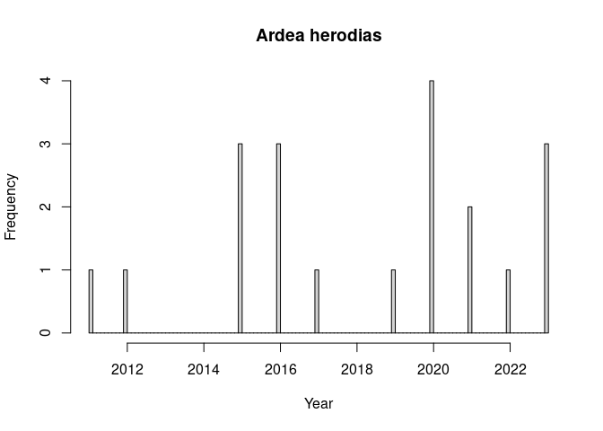<!-- -->

    ##                species    eventDate   
    ##  Bubulcus ibis     :1   Min.   :2020  
    ##  Acanthis flammea  :0   1st Qu.:2020  
    ##  Accipiter cooperii:0   Median :2020  
    ##  Accipiter gentilis:0   Mean   :2020  
    ##  Accipiter striatus:0   3rd Qu.:2020  
    ##  Actitis macularius:0   Max.   :2020  
    ##  (Other)           :0

<!-- -->

    ##                  species    eventDate   
    ##  Plegadis falcinellus:1   Min.   :2022  
    ##  Acanthis flammea    :0   1st Qu.:2022  
    ##  Accipiter cooperii  :0   Median :2022  
    ##  Accipiter gentilis  :0   Mean   :2022  
    ##  Accipiter striatus  :0   3rd Qu.:2022  
    ##  Actitis macularius  :0   Max.   :2022  
    ##  (Other)             :0

<!-- -->

    ##                species    eventDate   
    ##  Plegadis chihi    :3   Min.   :2019  
    ##  Acanthis flammea  :0   1st Qu.:2020  
    ##  Accipiter cooperii:0   Median :2021  
    ##  Accipiter gentilis:0   Mean   :2021  
    ##  Accipiter striatus:0   3rd Qu.:2022  
    ##  Actitis macularius:0   Max.   :2022  
    ##  (Other)           :0

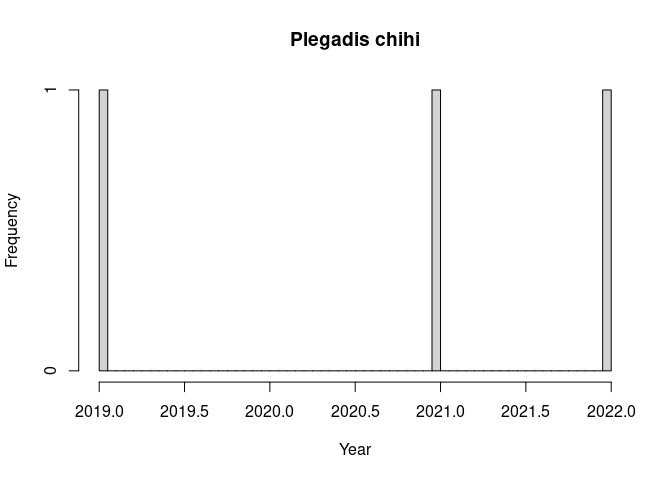<!-- -->

    ##                species     eventDate   
    ##  Cathartes aura    :27   Min.   :2013  
    ##  Acanthis flammea  : 0   1st Qu.:2016  
    ##  Accipiter cooperii: 0   Median :2021  
    ##  Accipiter gentilis: 0   Mean   :2019  
    ##  Accipiter striatus: 0   3rd Qu.:2022  
    ##  Actitis macularius: 0   Max.   :2023  
    ##  (Other)           : 0

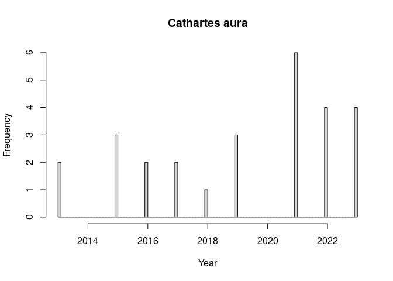<!-- -->

    ##                species    eventDate   
    ##  Circus hudsonius  :6   Min.   :2013  
    ##  Acanthis flammea  :0   1st Qu.:2015  
    ##  Accipiter cooperii:0   Median :2018  
    ##  Accipiter gentilis:0   Mean   :2018  
    ##  Accipiter striatus:0   3rd Qu.:2021  
    ##  Actitis macularius:0   Max.   :2023  
    ##  (Other)           :0

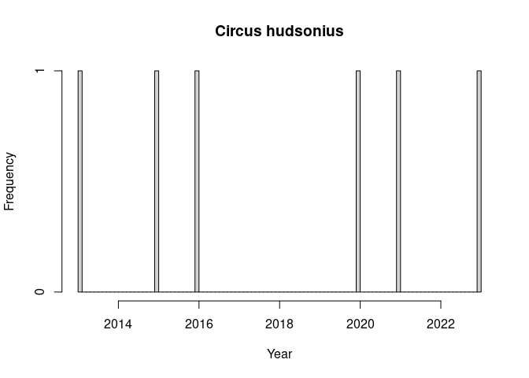<!-- -->

    ##                  species    eventDate   
    ##  Accipiter cooperii  :4   Min.   :2013  
    ##  Acanthis flammea    :0   1st Qu.:2014  
    ##  Accipiter gentilis  :0   Median :2015  
    ##  Accipiter striatus  :0   Mean   :2016  
    ##  Actitis macularius  :0   3rd Qu.:2017  
    ##  Aechmophorus clarkii:0   Max.   :2020  
    ##  (Other)             :0

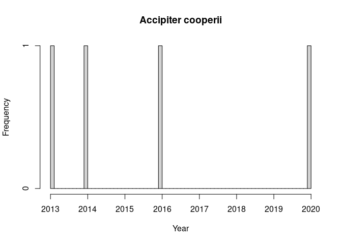<!-- -->

    ##                      species    eventDate   
    ##  Haliaeetus leucocephalus:3   Min.   :2016  
    ##  Acanthis flammea        :0   1st Qu.:2020  
    ##  Accipiter cooperii      :0   Median :2023  
    ##  Accipiter gentilis      :0   Mean   :2021  
    ##  Accipiter striatus      :0   3rd Qu.:2023  
    ##  Actitis macularius      :0   Max.   :2023  
    ##  (Other)                 :0

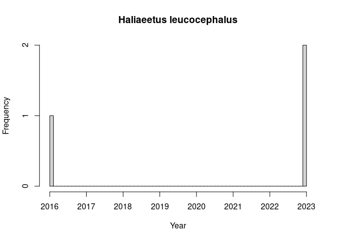<!-- -->

    ##                species     eventDate   
    ##  Buteo swainsoni   :13   Min.   :2009  
    ##  Acanthis flammea  : 0   1st Qu.:2015  
    ##  Accipiter cooperii: 0   Median :2018  
    ##  Accipiter gentilis: 0   Mean   :2017  
    ##  Accipiter striatus: 0   3rd Qu.:2021  
    ##  Actitis macularius: 0   Max.   :2022  
    ##  (Other)           : 0

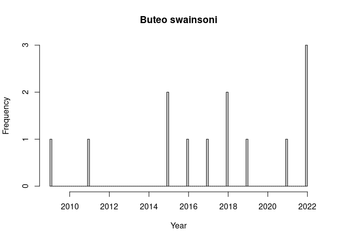<!-- -->

    ##                species     eventDate   
    ##  Buteo jamaicensis :22   Min.   :2009  
    ##  Acanthis flammea  : 0   1st Qu.:2016  
    ##  Accipiter cooperii: 0   Median :2018  
    ##  Accipiter gentilis: 0   Mean   :2018  
    ##  Accipiter striatus: 0   3rd Qu.:2021  
    ##  Actitis macularius: 0   Max.   :2022  
    ##  (Other)           : 0

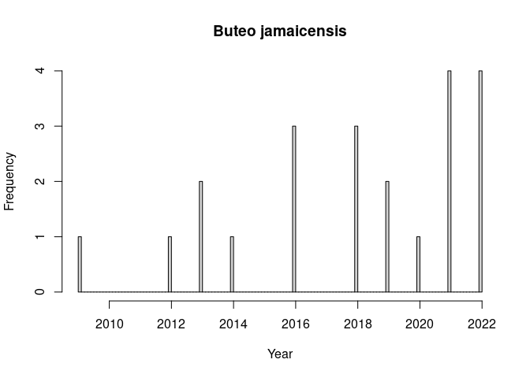<!-- -->

    ##                species    eventDate   
    ##  Buteo regalis     :1   Min.   :2009  
    ##  Acanthis flammea  :0   1st Qu.:2009  
    ##  Accipiter cooperii:0   Median :2009  
    ##  Accipiter gentilis:0   Mean   :2009  
    ##  Accipiter striatus:0   3rd Qu.:2009  
    ##  Actitis macularius:0   Max.   :2009  
    ##  (Other)           :0

<!-- -->

    ##                species    eventDate   
    ##  Megascops asio    :1   Min.   :2011  
    ##  Acanthis flammea  :0   1st Qu.:2011  
    ##  Accipiter cooperii:0   Median :2011  
    ##  Accipiter gentilis:0   Mean   :2011  
    ##  Accipiter striatus:0   3rd Qu.:2011  
    ##  Actitis macularius:0   Max.   :2011  
    ##  (Other)           :0

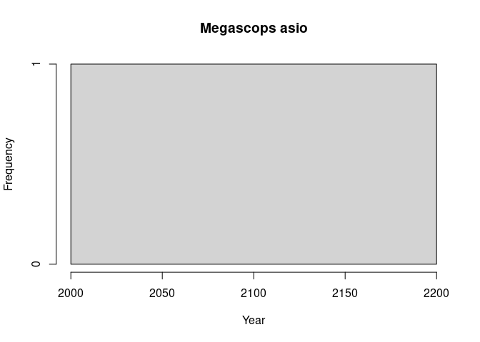<!-- -->

    ##                species     eventDate   
    ##  Bubo virginianus  :12   Min.   :2009  
    ##  Acanthis flammea  : 0   1st Qu.:2013  
    ##  Accipiter cooperii: 0   Median :2014  
    ##  Accipiter gentilis: 0   Mean   :2015  
    ##  Accipiter striatus: 0   3rd Qu.:2019  
    ##  Actitis macularius: 0   Max.   :2022  
    ##  (Other)           : 0

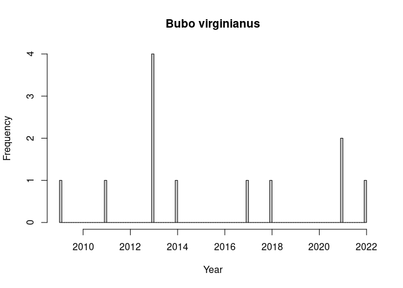<!-- -->

    ##                species    eventDate   
    ##  Athene cunicularia:1   Min.   :2018  
    ##  Acanthis flammea  :0   1st Qu.:2018  
    ##  Accipiter cooperii:0   Median :2018  
    ##  Accipiter gentilis:0   Mean   :2018  
    ##  Accipiter striatus:0   3rd Qu.:2018  
    ##  Actitis macularius:0   Max.   :2018  
    ##  (Other)           :0

<!-- -->

    ##                species    eventDate   
    ##  Megaceryle alcyon :1   Min.   :2022  
    ##  Acanthis flammea  :0   1st Qu.:2022  
    ##  Accipiter cooperii:0   Median :2022  
    ##  Accipiter gentilis:0   Mean   :2022  
    ##  Accipiter striatus:0   3rd Qu.:2022  
    ##  Actitis macularius:0   Max.   :2022  
    ##  (Other)           :0

<!-- -->

    ##                        species     eventDate   
    ##  Melanerpes erythrocephalus:16   Min.   :2011  
    ##  Acanthis flammea          : 0   1st Qu.:2015  
    ##  Accipiter cooperii        : 0   Median :2020  
    ##  Accipiter gentilis        : 0   Mean   :2018  
    ##  Accipiter striatus        : 0   3rd Qu.:2022  
    ##  Actitis macularius        : 0   Max.   :2023  
    ##  (Other)                   : 0

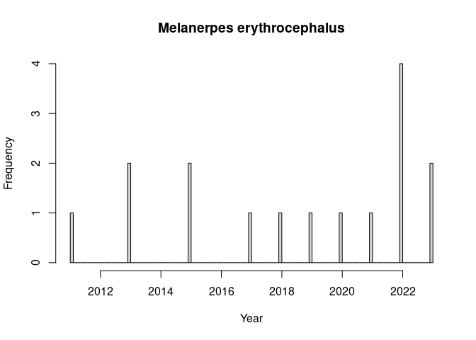<!-- -->

    ##                  species    eventDate   
    ##  Melanerpes carolinus:1   Min.   :2012  
    ##  Acanthis flammea    :0   1st Qu.:2012  
    ##  Accipiter cooperii  :0   Median :2012  
    ##  Accipiter gentilis  :0   Mean   :2012  
    ##  Accipiter striatus  :0   3rd Qu.:2012  
    ##  Actitis macularius  :0   Max.   :2012  
    ##  (Other)             :0

<!-- -->

    ##                 species     eventDate   
    ##  Dryobates pubescens:21   Min.   :2011  
    ##  Acanthis flammea   : 0   1st Qu.:2017  
    ##  Accipiter cooperii : 0   Median :2021  
    ##  Accipiter gentilis : 0   Mean   :2019  
    ##  Accipiter striatus : 0   3rd Qu.:2022  
    ##  Actitis macularius : 0   Max.   :2023  
    ##  (Other)            : 0

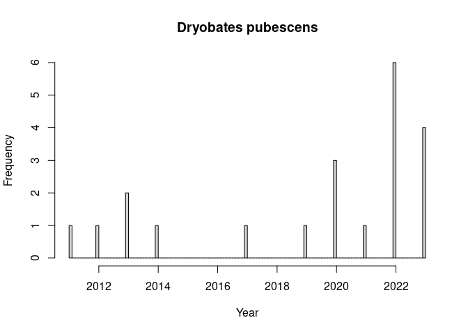<!-- -->

    ##                     species     eventDate   
    ##  Leuconotopicus villosus:13   Min.   :2011  
    ##  Acanthis flammea       : 0   1st Qu.:2021  
    ##  Accipiter cooperii     : 0   Median :2022  
    ##  Accipiter gentilis     : 0   Mean   :2020  
    ##  Accipiter striatus     : 0   3rd Qu.:2022  
    ##  Actitis macularius     : 0   Max.   :2023  
    ##  (Other)                : 0

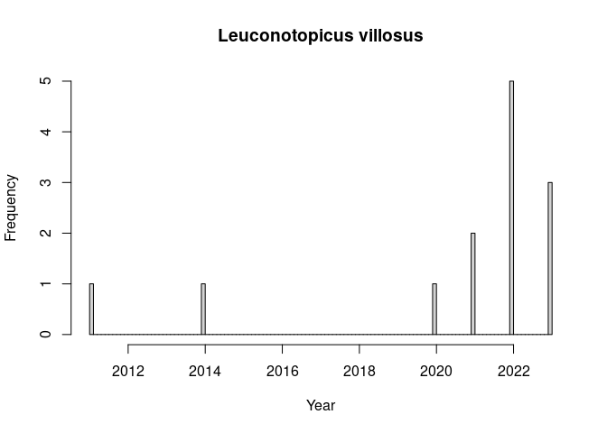<!-- -->

    ##                species     eventDate   
    ##  Colaptes auratus  :20   Min.   :2011  
    ##  Acanthis flammea  : 0   1st Qu.:2013  
    ##  Accipiter cooperii: 0   Median :2018  
    ##  Accipiter gentilis: 0   Mean   :2017  
    ##  Accipiter striatus: 0   3rd Qu.:2021  
    ##  Actitis macularius: 0   Max.   :2023  
    ##  (Other)           : 0

<!-- -->

    ##                species     eventDate   
    ##  Falco sparverius  :12   Min.   :2011  
    ##  Acanthis flammea  : 0   1st Qu.:2013  
    ##  Accipiter cooperii: 0   Median :2020  
    ##  Accipiter gentilis: 0   Mean   :2018  
    ##  Accipiter striatus: 0   3rd Qu.:2022  
    ##  Actitis macularius: 0   Max.   :2023  
    ##  (Other)           : 0

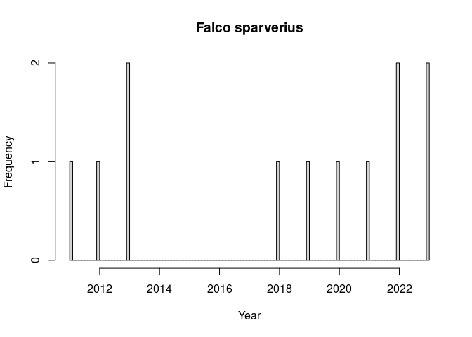<!-- -->

    ##                species    eventDate   
    ##  Falco columbarius :1   Min.   :2013  
    ##  Acanthis flammea  :0   1st Qu.:2013  
    ##  Accipiter cooperii:0   Median :2013  
    ##  Accipiter gentilis:0   Mean   :2013  
    ##  Accipiter striatus:0   3rd Qu.:2013  
    ##  Actitis macularius:0   Max.   :2013  
    ##  (Other)           :0

<!-- -->

    ##                 species     eventDate   
    ##  Contopus sordidulus:32   Min.   :2011  
    ##  Acanthis flammea   : 0   1st Qu.:2018  
    ##  Accipiter cooperii : 0   Median :2021  
    ##  Accipiter gentilis : 0   Mean   :2020  
    ##  Accipiter striatus : 0   3rd Qu.:2022  
    ##  Actitis macularius : 0   Max.   :2023  
    ##  (Other)            : 0

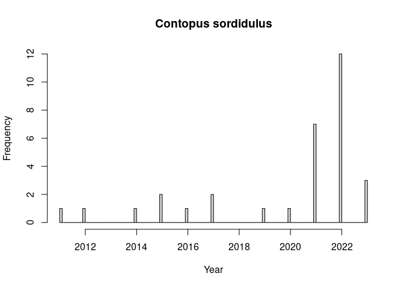<!-- -->

    ##                species    eventDate   
    ##  Contopus virens   :2   Min.   :2013  
    ##  Acanthis flammea  :0   1st Qu.:2014  
    ##  Accipiter cooperii:0   Median :2015  
    ##  Accipiter gentilis:0   Mean   :2015  
    ##  Accipiter striatus:0   3rd Qu.:2016  
    ##  Actitis macularius:0   Max.   :2017  
    ##  (Other)           :0

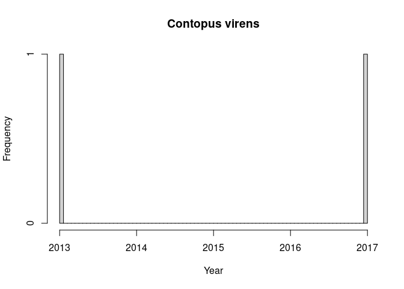<!-- -->

    ##                species    eventDate   
    ##  Empidonax minimus :5   Min.   :2013  
    ##  Acanthis flammea  :0   1st Qu.:2015  
    ##  Accipiter cooperii:0   Median :2018  
    ##  Accipiter gentilis:0   Mean   :2017  
    ##  Accipiter striatus:0   3rd Qu.:2020  
    ##  Actitis macularius:0   Max.   :2021  
    ##  (Other)           :0

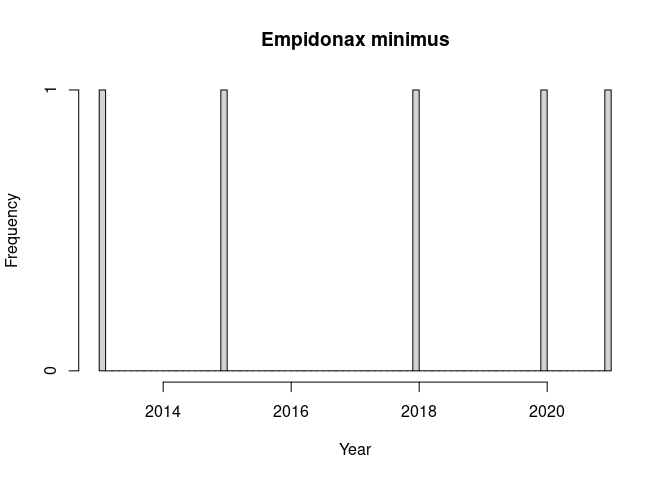<!-- -->

    ##                species    eventDate   
    ##  Sayornis phoebe   :1   Min.   :2023  
    ##  Acanthis flammea  :0   1st Qu.:2023  
    ##  Accipiter cooperii:0   Median :2023  
    ##  Accipiter gentilis:0   Mean   :2023  
    ##  Accipiter striatus:0   3rd Qu.:2023  
    ##  Actitis macularius:0   Max.   :2023  
    ##  (Other)           :0

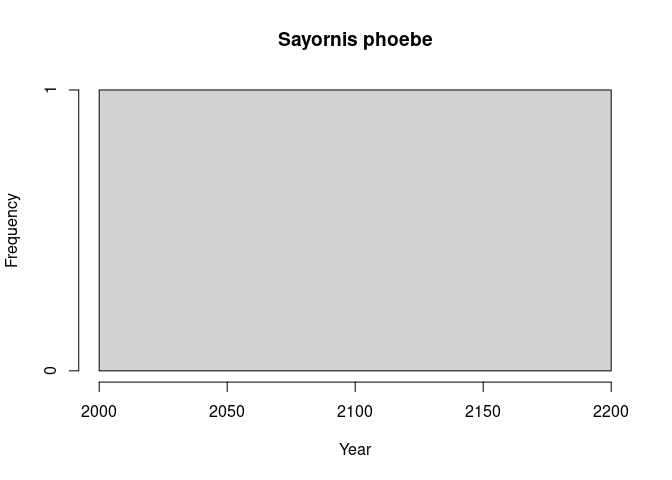<!-- -->

    ##                species    eventDate   
    ##  Sayornis saya     :1   Min.   :2013  
    ##  Acanthis flammea  :0   1st Qu.:2013  
    ##  Accipiter cooperii:0   Median :2013  
    ##  Accipiter gentilis:0   Mean   :2013  
    ##  Accipiter striatus:0   3rd Qu.:2013  
    ##  Actitis macularius:0   Max.   :2013  
    ##  (Other)           :0

<!-- -->

    ##                species     eventDate   
    ##  Myiarchus crinitus:23   Min.   :2012  
    ##  Acanthis flammea  : 0   1st Qu.:2018  
    ##  Accipiter cooperii: 0   Median :2021  
    ##  Accipiter gentilis: 0   Mean   :2020  
    ##  Accipiter striatus: 0   3rd Qu.:2022  
    ##  Actitis macularius: 0   Max.   :2023  
    ##  (Other)           : 0

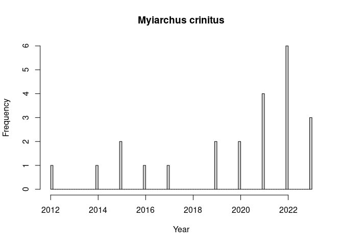<!-- -->

    ##                 species     eventDate   
    ##  Tyrannus verticalis:22   Min.   :2011  
    ##  Acanthis flammea   : 0   1st Qu.:2015  
    ##  Accipiter cooperii : 0   Median :2018  
    ##  Accipiter gentilis : 0   Mean   :2018  
    ##  Accipiter striatus : 0   3rd Qu.:2021  
    ##  Actitis macularius : 0   Max.   :2023  
    ##  (Other)            : 0

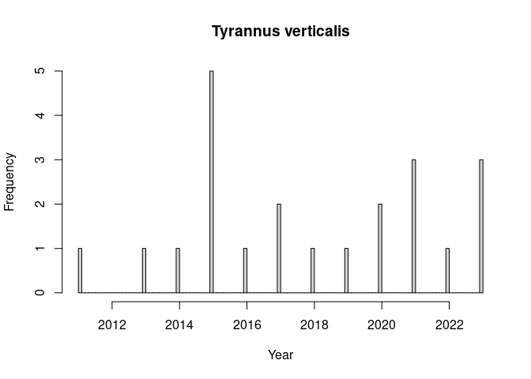<!-- -->

    ##                species     eventDate   
    ##  Tyrannus tyrannus :53   Min.   :2009  
    ##  Acanthis flammea  : 0   1st Qu.:2015  
    ##  Accipiter cooperii: 0   Median :2021  
    ##  Accipiter gentilis: 0   Mean   :2019  
    ##  Accipiter striatus: 0   3rd Qu.:2022  
    ##  Actitis macularius: 0   Max.   :2023  
    ##  (Other)           : 0

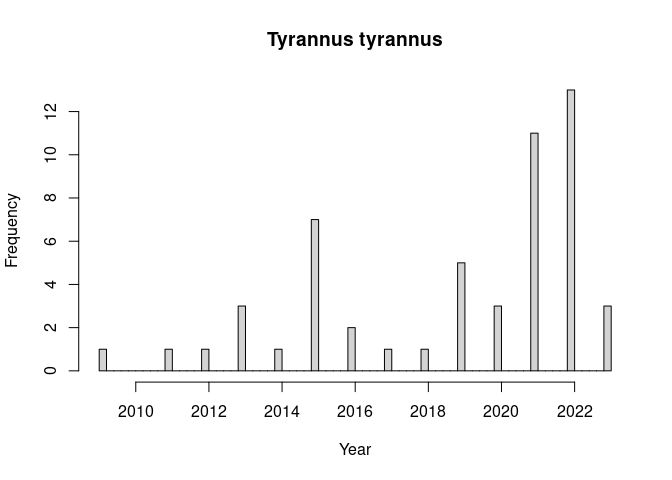<!-- -->

    ##                species     eventDate   
    ##  Vireo bellii      :18   Min.   :2012  
    ##  Acanthis flammea  : 0   1st Qu.:2015  
    ##  Accipiter cooperii: 0   Median :2018  
    ##  Accipiter gentilis: 0   Mean   :2018  
    ##  Accipiter striatus: 0   3rd Qu.:2022  
    ##  Actitis macularius: 0   Max.   :2023  
    ##  (Other)           : 0

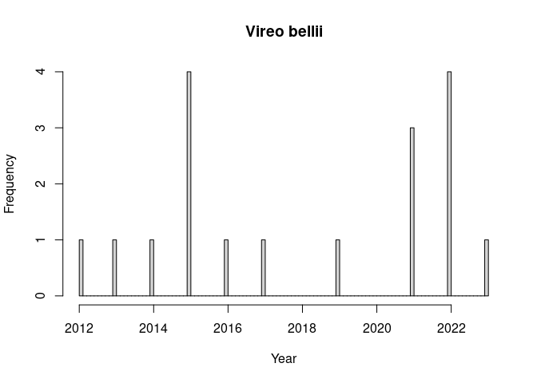<!-- -->

    ##                species    eventDate   
    ##  Vireo solitarius  :1   Min.   :2013  
    ##  Acanthis flammea  :0   1st Qu.:2013  
    ##  Accipiter cooperii:0   Median :2013  
    ##  Accipiter gentilis:0   Mean   :2013  
    ##  Accipiter striatus:0   3rd Qu.:2013  
    ##  Actitis macularius:0   Max.   :2013  
    ##  (Other)           :0

<!-- -->

    ##                species    eventDate   
    ##  Vireo gilvus      :3   Min.   :2013  
    ##  Acanthis flammea  :0   1st Qu.:2015  
    ##  Accipiter cooperii:0   Median :2017  
    ##  Accipiter gentilis:0   Mean   :2017  
    ##  Accipiter striatus:0   3rd Qu.:2020  
    ##  Actitis macularius:0   Max.   :2022  
    ##  (Other)           :0

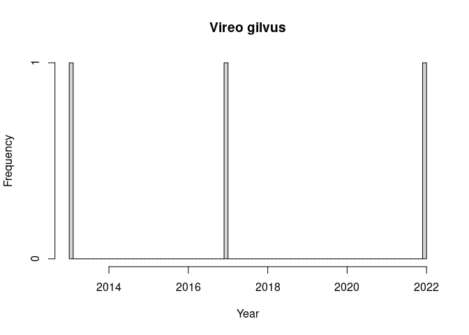<!-- -->

    ##                species    eventDate   
    ##  Vireo olivaceus   :7   Min.   :2013  
    ##  Acanthis flammea  :0   1st Qu.:2014  
    ##  Accipiter cooperii:0   Median :2015  
    ##  Accipiter gentilis:0   Mean   :2018  
    ##  Accipiter striatus:0   3rd Qu.:2022  
    ##  Actitis macularius:0   Max.   :2023  
    ##  (Other)           :0

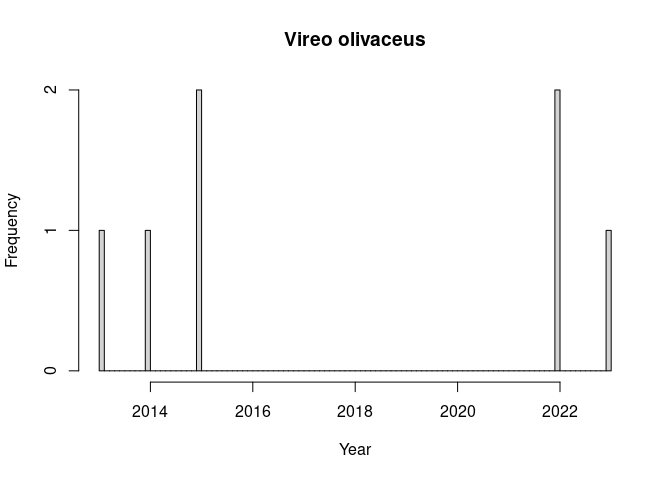<!-- -->

    ##                 species    eventDate   
    ##  Lanius ludovicianus:7   Min.   :2009  
    ##  Acanthis flammea   :0   1st Qu.:2011  
    ##  Accipiter cooperii :0   Median :2018  
    ##  Accipiter gentilis :0   Mean   :2016  
    ##  Accipiter striatus :0   3rd Qu.:2021  
    ##  Actitis macularius :0   Max.   :2023  
    ##  (Other)            :0

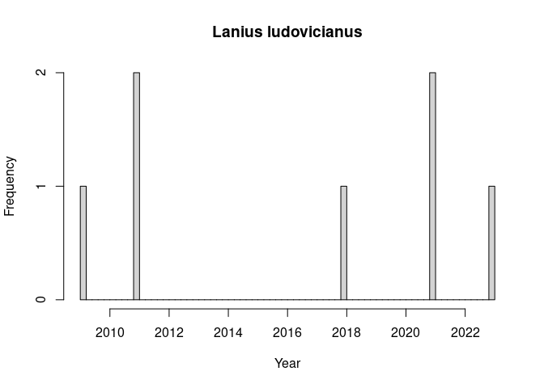<!-- -->

    ##                species    eventDate   
    ##  Lanius borealis   :1   Min.   :2013  
    ##  Acanthis flammea  :0   1st Qu.:2013  
    ##  Accipiter cooperii:0   Median :2013  
    ##  Accipiter gentilis:0   Mean   :2013  
    ##  Accipiter striatus:0   3rd Qu.:2013  
    ##  Actitis macularius:0   Max.   :2013  
    ##  (Other)           :0

<!-- -->

    ##                 species     eventDate   
    ##  Cyanocitta cristata:21   Min.   :2011  
    ##  Acanthis flammea   : 0   1st Qu.:2018  
    ##  Accipiter cooperii : 0   Median :2021  
    ##  Accipiter gentilis : 0   Mean   :2020  
    ##  Accipiter striatus : 0   3rd Qu.:2022  
    ##  Actitis macularius : 0   Max.   :2023  
    ##  (Other)            : 0

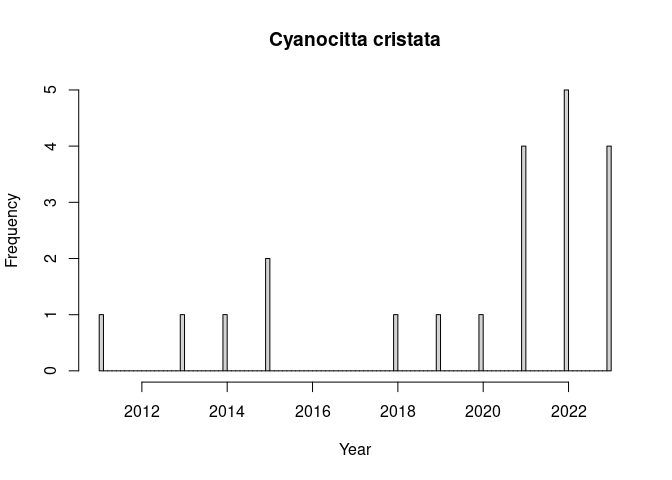<!-- -->

    ##                species    eventDate   
    ##  Pica hudsonia     :1   Min.   :2015  
    ##  Acanthis flammea  :0   1st Qu.:2015  
    ##  Accipiter cooperii:0   Median :2015  
    ##  Accipiter gentilis:0   Mean   :2015  
    ##  Accipiter striatus:0   3rd Qu.:2015  
    ##  Actitis macularius:0   Max.   :2015  
    ##  (Other)           :0

<!-- -->

    ##                   species     eventDate   
    ##  Corvus brachyrhynchos:49   Min.   :2011  
    ##  Acanthis flammea     : 0   1st Qu.:2016  
    ##  Accipiter cooperii   : 0   Median :2021  
    ##  Accipiter gentilis   : 0   Mean   :2019  
    ##  Accipiter striatus   : 0   3rd Qu.:2022  
    ##  Actitis macularius   : 0   Max.   :2023  
    ##  (Other)              : 0

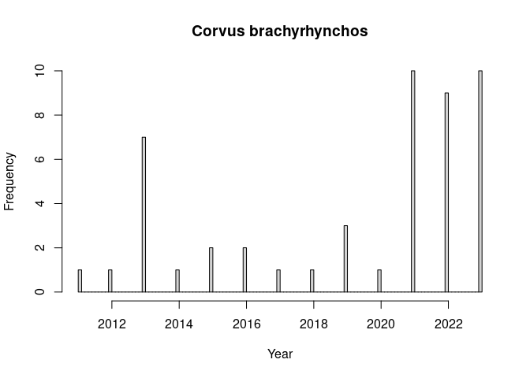<!-- -->

    ##                  species     eventDate   
    ##  Poecile atricapillus:41   Min.   :2009  
    ##  Acanthis flammea    : 0   1st Qu.:2013  
    ##  Accipiter cooperii  : 0   Median :2020  
    ##  Accipiter gentilis  : 0   Mean   :2018  
    ##  Accipiter striatus  : 0   3rd Qu.:2022  
    ##  Actitis macularius  : 0   Max.   :2023  
    ##  (Other)             : 0

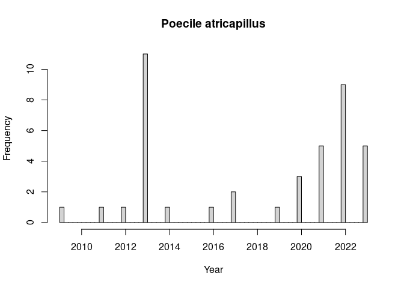<!-- -->

    ##                  species     eventDate   
    ##  Eremophila alpestris:33   Min.   :2011  
    ##  Acanthis flammea    : 0   1st Qu.:2016  
    ##  Accipiter cooperii  : 0   Median :2019  
    ##  Accipiter gentilis  : 0   Mean   :2019  
    ##  Accipiter striatus  : 0   3rd Qu.:2021  
    ##  Actitis macularius  : 0   Max.   :2023  
    ##  (Other)             : 0

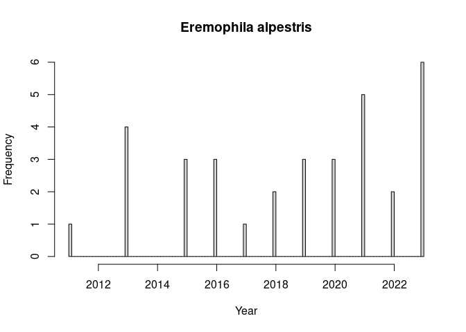<!-- -->

    ##                        species    eventDate   
    ##  Stelgidopteryx serripennis:6   Min.   :2015  
    ##  Acanthis flammea          :0   1st Qu.:2015  
    ##  Accipiter cooperii        :0   Median :2018  
    ##  Accipiter gentilis        :0   Mean   :2018  
    ##  Accipiter striatus        :0   3rd Qu.:2021  
    ##  Actitis macularius        :0   Max.   :2023  
    ##  (Other)                   :0

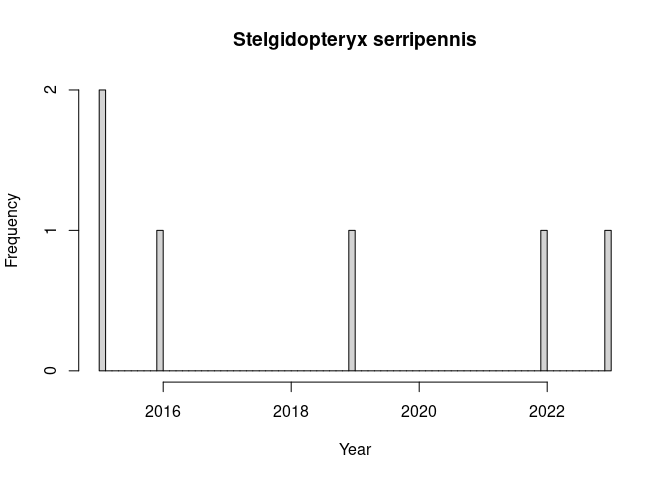<!-- -->

    ##                species    eventDate   
    ##  Progne subis      :1   Min.   :2023  
    ##  Acanthis flammea  :0   1st Qu.:2023  
    ##  Accipiter cooperii:0   Median :2023  
    ##  Accipiter gentilis:0   Mean   :2023  
    ##  Accipiter striatus:0   3rd Qu.:2023  
    ##  Actitis macularius:0   Max.   :2023  
    ##  (Other)           :0

<!-- -->

    ##                 species     eventDate   
    ##  Tachycineta bicolor:14   Min.   :2015  
    ##  Acanthis flammea   : 0   1st Qu.:2018  
    ##  Accipiter cooperii : 0   Median :2021  
    ##  Accipiter gentilis : 0   Mean   :2020  
    ##  Accipiter striatus : 0   3rd Qu.:2022  
    ##  Actitis macularius : 0   Max.   :2023  
    ##  (Other)            : 0

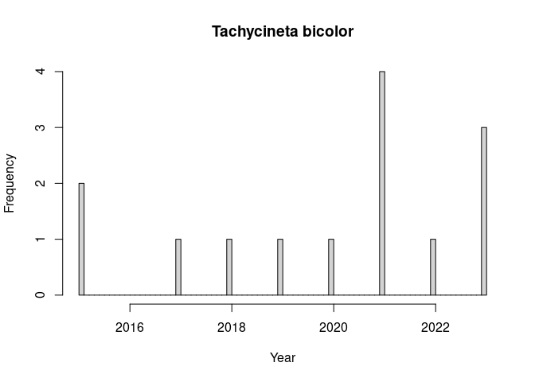<!-- -->

    ##                species    eventDate   
    ##  Riparia riparia   :4   Min.   :2015  
    ##  Acanthis flammea  :0   1st Qu.:2020  
    ##  Accipiter cooperii:0   Median :2021  
    ##  Accipiter gentilis:0   Mean   :2020  
    ##  Accipiter striatus:0   3rd Qu.:2021  
    ##  Actitis macularius:0   Max.   :2021  
    ##  (Other)           :0

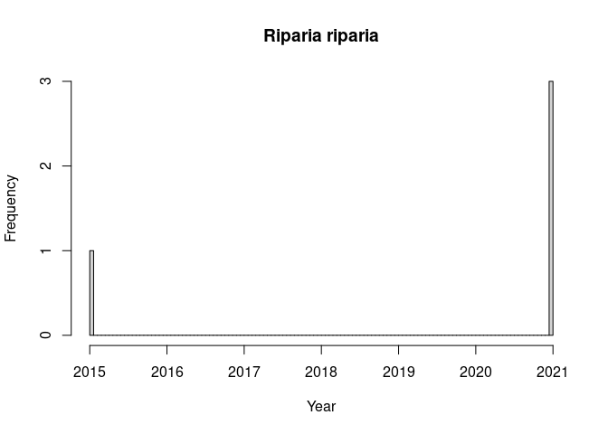<!-- -->

    ##                species     eventDate   
    ##  Hirundo rustica   :22   Min.   :2013  
    ##  Acanthis flammea  : 0   1st Qu.:2016  
    ##  Accipiter cooperii: 0   Median :2020  
    ##  Accipiter gentilis: 0   Mean   :2019  
    ##  Accipiter striatus: 0   3rd Qu.:2022  
    ##  Actitis macularius: 0   Max.   :2023  
    ##  (Other)           : 0

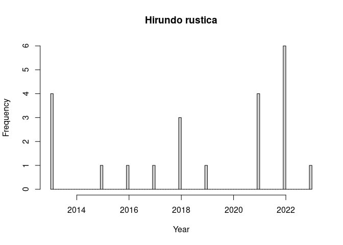<!-- -->

    ##                      species    eventDate   
    ##  Petrochelidon pyrrhonota:7   Min.   :2015  
    ##  Acanthis flammea        :0   1st Qu.:2018  
    ##  Accipiter cooperii      :0   Median :2021  
    ##  Accipiter gentilis      :0   Mean   :2020  
    ##  Accipiter striatus      :0   3rd Qu.:2022  
    ##  Actitis macularius      :0   Max.   :2023  
    ##  (Other)                 :0

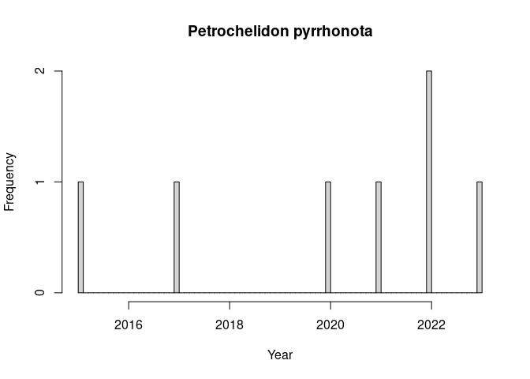<!-- -->

    ##                 species    eventDate   
    ##  Corthylio calendula:3   Min.   :2013  
    ##  Acanthis flammea   :0   1st Qu.:2013  
    ##  Accipiter cooperii :0   Median :2013  
    ##  Accipiter gentilis :0   Mean   :2016  
    ##  Accipiter striatus :0   3rd Qu.:2018  
    ##  Actitis macularius :0   Max.   :2023  
    ##  (Other)            :0

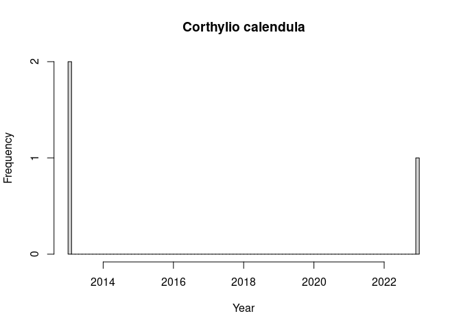<!-- -->

    ##                species     eventDate   
    ##  Sitta canadensis  :25   Min.   :2011  
    ##  Acanthis flammea  : 0   1st Qu.:2017  
    ##  Accipiter cooperii: 0   Median :2021  
    ##  Accipiter gentilis: 0   Mean   :2019  
    ##  Accipiter striatus: 0   3rd Qu.:2022  
    ##  Actitis macularius: 0   Max.   :2023  
    ##  (Other)           : 0

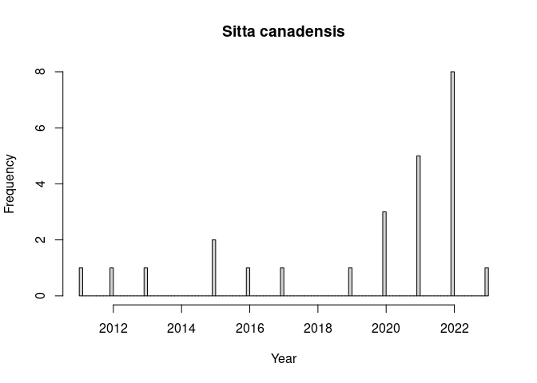<!-- -->

    ##                species    eventDate   
    ##  Sitta carolinensis:9   Min.   :2011  
    ##  Acanthis flammea  :0   1st Qu.:2013  
    ##  Accipiter cooperii:0   Median :2020  
    ##  Accipiter gentilis:0   Mean   :2018  
    ##  Accipiter striatus:0   3rd Qu.:2022  
    ##  Actitis macularius:0   Max.   :2023  
    ##  (Other)           :0

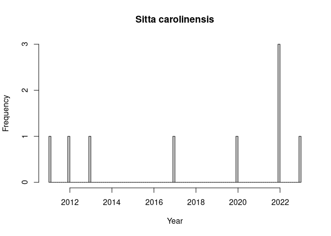<!-- -->

    ##                species    eventDate   
    ##  Sitta pygmaea     :3   Min.   :2011  
    ##  Acanthis flammea  :0   1st Qu.:2011  
    ##  Accipiter cooperii:0   Median :2011  
    ##  Accipiter gentilis:0   Mean   :2015  
    ##  Accipiter striatus:0   3rd Qu.:2016  
    ##  Actitis macularius:0   Max.   :2022  
    ##  (Other)           :0

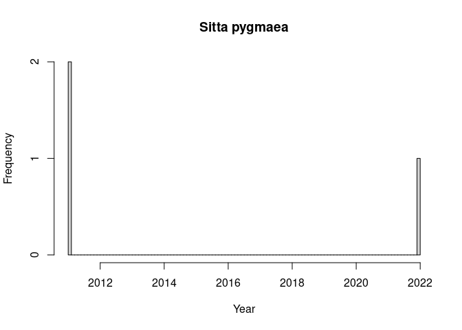<!-- -->

    ##                species    eventDate   
    ##  Certhia americana :2   Min.   :2011  
    ##  Acanthis flammea  :0   1st Qu.:2012  
    ##  Accipiter cooperii:0   Median :2012  
    ##  Accipiter gentilis:0   Mean   :2012  
    ##  Accipiter striatus:0   3rd Qu.:2013  
    ##  Actitis macularius:0   Max.   :2014  
    ##  (Other)           :0

<!-- -->

    ##                 species    eventDate   
    ##  Polioptila caerulea:3   Min.   :2021  
    ##  Acanthis flammea   :0   1st Qu.:2022  
    ##  Accipiter cooperii :0   Median :2022  
    ##  Accipiter gentilis :0   Mean   :2022  
    ##  Accipiter striatus :0   3rd Qu.:2022  
    ##  Actitis macularius :0   Max.   :2023  
    ##  (Other)            :0

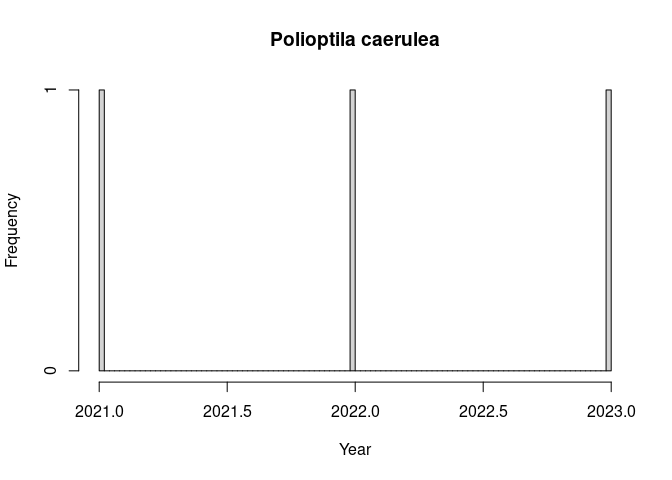<!-- -->

    ##                species     eventDate   
    ##  Troglodytes aedon :41   Min.   :2009  
    ##  Acanthis flammea  : 0   1st Qu.:2017  
    ##  Accipiter cooperii: 0   Median :2021  
    ##  Accipiter gentilis: 0   Mean   :2019  
    ##  Accipiter striatus: 0   3rd Qu.:2022  
    ##  Actitis macularius: 0   Max.   :2023  
    ##  (Other)           : 0

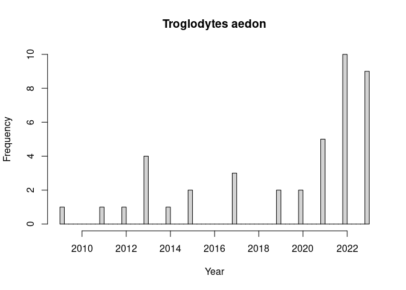<!-- -->

    ##                   species    eventDate   
    ##  Cistothorus stellaris:1   Min.   :2022  
    ##  Acanthis flammea     :0   1st Qu.:2022  
    ##  Accipiter cooperii   :0   Median :2022  
    ##  Accipiter gentilis   :0   Mean   :2022  
    ##  Accipiter striatus   :0   3rd Qu.:2022  
    ##  Actitis macularius   :0   Max.   :2022  
    ##  (Other)              :0

<!-- -->

    ##                   species    eventDate   
    ##  Cistothorus palustris:1   Min.   :2015  
    ##  Acanthis flammea     :0   1st Qu.:2015  
    ##  Accipiter cooperii   :0   Median :2015  
    ##  Accipiter gentilis   :0   Mean   :2015  
    ##  Accipiter striatus   :0   3rd Qu.:2015  
    ##  Actitis macularius   :0   Max.   :2015  
    ##  (Other)              :0

<!-- -->

    ##                species    eventDate   
    ##  Sturnus vulgaris  :3   Min.   :2019  
    ##  Acanthis flammea  :0   1st Qu.:2020  
    ##  Accipiter cooperii:0   Median :2021  
    ##  Accipiter gentilis:0   Mean   :2021  
    ##  Accipiter striatus:0   3rd Qu.:2022  
    ##  Actitis macularius:0   Max.   :2022  
    ##  (Other)           :0

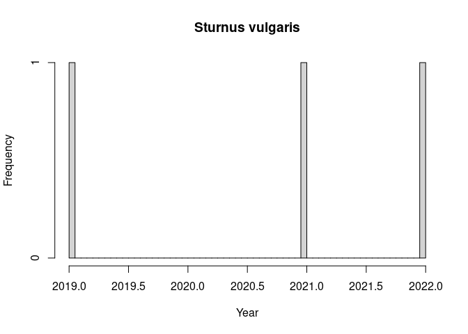<!-- -->

    ##                    species    eventDate   
    ##  Dumetella carolinensis:5   Min.   :2013  
    ##  Acanthis flammea      :0   1st Qu.:2013  
    ##  Accipiter cooperii    :0   Median :2013  
    ##  Accipiter gentilis    :0   Mean   :2016  
    ##  Accipiter striatus    :0   3rd Qu.:2021  
    ##  Actitis macularius    :0   Max.   :2021  
    ##  (Other)               :0

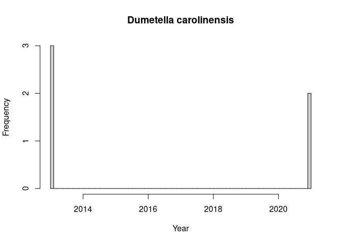<!-- -->

    ##                species     eventDate   
    ##  Toxostoma rufum   :19   Min.   :2011  
    ##  Acanthis flammea  : 0   1st Qu.:2014  
    ##  Accipiter cooperii: 0   Median :2016  
    ##  Accipiter gentilis: 0   Mean   :2017  
    ##  Accipiter striatus: 0   3rd Qu.:2020  
    ##  Actitis macularius: 0   Max.   :2023  
    ##  (Other)           : 0

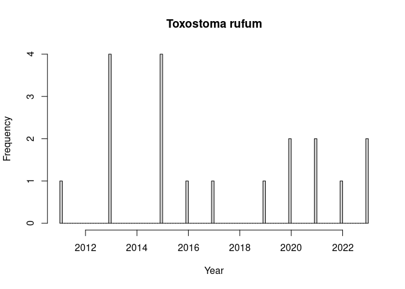<!-- -->

    ##                species    eventDate   
    ##  Mimus polyglottos :1   Min.   :2018  
    ##  Acanthis flammea  :0   1st Qu.:2018  
    ##  Accipiter cooperii:0   Median :2018  
    ##  Accipiter gentilis:0   Mean   :2018  
    ##  Accipiter striatus:0   3rd Qu.:2018  
    ##  Actitis macularius:0   Max.   :2018  
    ##  (Other)           :0

<!-- -->

    ##                species     eventDate   
    ##  Sialia sialis     :12   Min.   :2011  
    ##  Acanthis flammea  : 0   1st Qu.:2016  
    ##  Accipiter cooperii: 0   Median :2021  
    ##  Accipiter gentilis: 0   Mean   :2019  
    ##  Accipiter striatus: 0   3rd Qu.:2022  
    ##  Actitis macularius: 0   Max.   :2023  
    ##  (Other)           : 0

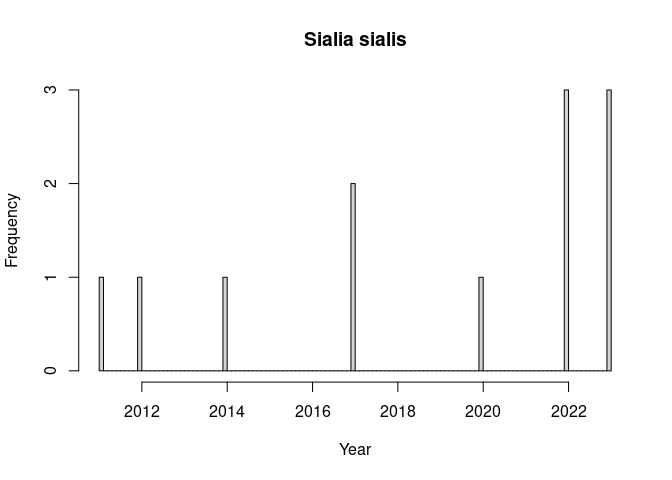<!-- -->

    ##                 species    eventDate   
    ##  Myadestes townsendi:3   Min.   :2013  
    ##  Acanthis flammea   :0   1st Qu.:2013  
    ##  Accipiter cooperii :0   Median :2013  
    ##  Accipiter gentilis :0   Mean   :2013  
    ##  Accipiter striatus :0   3rd Qu.:2013  
    ##  Actitis macularius :0   Max.   :2013  
    ##  (Other)            :0

<!-- -->

    ##                species    eventDate   
    ##  Catharus ustulatus:3   Min.   :2022  
    ##  Acanthis flammea  :0   1st Qu.:2022  
    ##  Accipiter cooperii:0   Median :2022  
    ##  Accipiter gentilis:0   Mean   :2022  
    ##  Accipiter striatus:0   3rd Qu.:2022  
    ##  Actitis macularius:0   Max.   :2023  
    ##  (Other)           :0

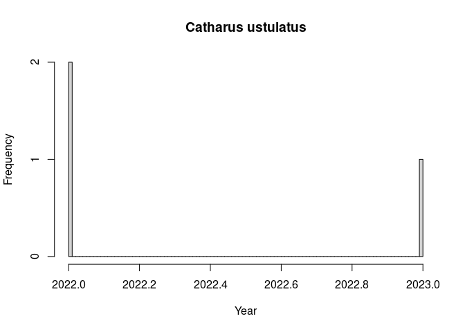<!-- -->

    ##                species     eventDate   
    ##  Turdus migratorius:52   Min.   :2009  
    ##  Acanthis flammea  : 0   1st Qu.:2017  
    ##  Accipiter cooperii: 0   Median :2021  
    ##  Accipiter gentilis: 0   Mean   :2020  
    ##  Accipiter striatus: 0   3rd Qu.:2022  
    ##  Actitis macularius: 0   Max.   :2023  
    ##  (Other)           : 0

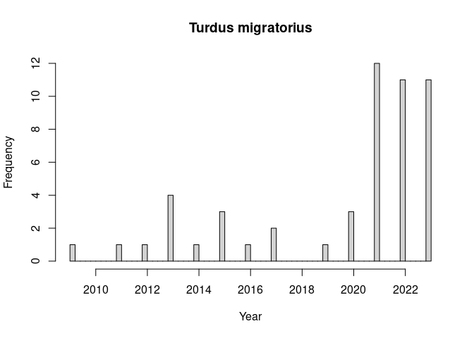<!-- -->

    ##                 species     eventDate   
    ##  Bombycilla cedrorum:18   Min.   :2011  
    ##  Acanthis flammea   : 0   1st Qu.:2018  
    ##  Accipiter cooperii : 0   Median :2021  
    ##  Accipiter gentilis : 0   Mean   :2020  
    ##  Accipiter striatus : 0   3rd Qu.:2022  
    ##  Actitis macularius : 0   Max.   :2023  
    ##  (Other)            : 0

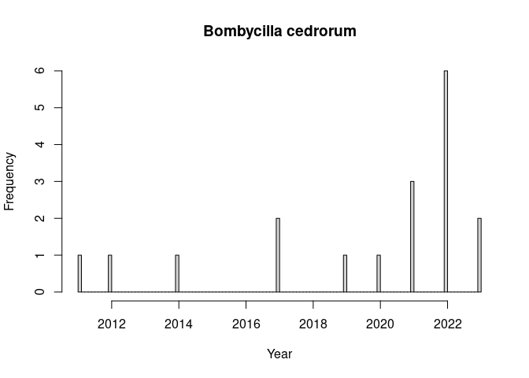<!-- -->

    ##                species    eventDate   
    ##  Passer domesticus :1   Min.   :2021  
    ##  Acanthis flammea  :0   1st Qu.:2021  
    ##  Accipiter cooperii:0   Median :2021  
    ##  Accipiter gentilis:0   Mean   :2021  
    ##  Accipiter striatus:0   3rd Qu.:2021  
    ##  Actitis macularius:0   Max.   :2021  
    ##  (Other)           :0

<!-- -->

    ##                  species    eventDate   
    ##  Haemorhous mexicanus:2   Min.   :2016  
    ##  Acanthis flammea    :0   1st Qu.:2018  
    ##  Accipiter cooperii  :0   Median :2019  
    ##  Accipiter gentilis  :0   Mean   :2019  
    ##  Accipiter striatus  :0   3rd Qu.:2020  
    ##  Actitis macularius  :0   Max.   :2022  
    ##  (Other)             :0

<!-- -->

    ##                species    eventDate   
    ##  Loxia curvirostra :5   Min.   :2011  
    ##  Acanthis flammea  :0   1st Qu.:2014  
    ##  Accipiter cooperii:0   Median :2022  
    ##  Accipiter gentilis:0   Mean   :2018  
    ##  Accipiter striatus:0   3rd Qu.:2022  
    ##  Actitis macularius:0   Max.   :2023  
    ##  (Other)           :0

<!-- -->

    ##                species    eventDate   
    ##  Spinus pinus      :2   Min.   :2016  
    ##  Acanthis flammea  :0   1st Qu.:2017  
    ##  Accipiter cooperii:0   Median :2018  
    ##  Accipiter gentilis:0   Mean   :2018  
    ##  Accipiter striatus:0   3rd Qu.:2019  
    ##  Actitis macularius:0   Max.   :2020  
    ##  (Other)           :0

<!-- -->

    ##                species     eventDate   
    ##  Spinus tristis    :51   Min.   :2011  
    ##  Acanthis flammea  : 0   1st Qu.:2016  
    ##  Accipiter cooperii: 0   Median :2021  
    ##  Accipiter gentilis: 0   Mean   :2019  
    ##  Accipiter striatus: 0   3rd Qu.:2022  
    ##  Actitis macularius: 0   Max.   :2023  
    ##  (Other)           : 0

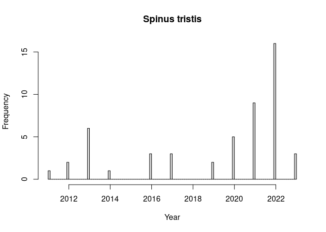<!-- -->

    ##                species    eventDate   
    ##  Calcarius ornatus :1   Min.   :2015  
    ##  Acanthis flammea  :0   1st Qu.:2015  
    ##  Accipiter cooperii:0   Median :2015  
    ##  Accipiter gentilis:0   Mean   :2015  
    ##  Accipiter striatus:0   3rd Qu.:2015  
    ##  Actitis macularius:0   Max.   :2015  
    ##  (Other)           :0

<!-- -->

    ##                species    eventDate   
    ##  Peucaea cassinii  :1   Min.   :2013  
    ##  Acanthis flammea  :0   1st Qu.:2013  
    ##  Accipiter cooperii:0   Median :2013  
    ##  Accipiter gentilis:0   Mean   :2013  
    ##  Accipiter striatus:0   3rd Qu.:2013  
    ##  Actitis macularius:0   Max.   :2013  
    ##  (Other)           :0

<!-- -->

    ##                   species     eventDate   
    ##  Ammodramus savannarum:43   Min.   :2011  
    ##  Acanthis flammea     : 0   1st Qu.:2015  
    ##  Accipiter cooperii   : 0   Median :2018  
    ##  Accipiter gentilis   : 0   Mean   :2018  
    ##  Accipiter striatus   : 0   3rd Qu.:2021  
    ##  Actitis macularius   : 0   Max.   :2023  
    ##  (Other)              : 0

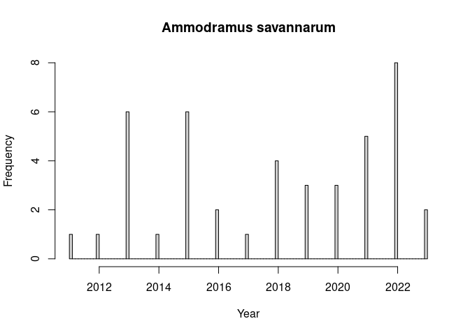<!-- -->

    ##                species     eventDate   
    ##  Spizella passerina:39   Min.   :2011  
    ##  Acanthis flammea  : 0   1st Qu.:2014  
    ##  Accipiter cooperii: 0   Median :2020  
    ##  Accipiter gentilis: 0   Mean   :2019  
    ##  Accipiter striatus: 0   3rd Qu.:2022  
    ##  Actitis macularius: 0   Max.   :2023  
    ##  (Other)           : 0

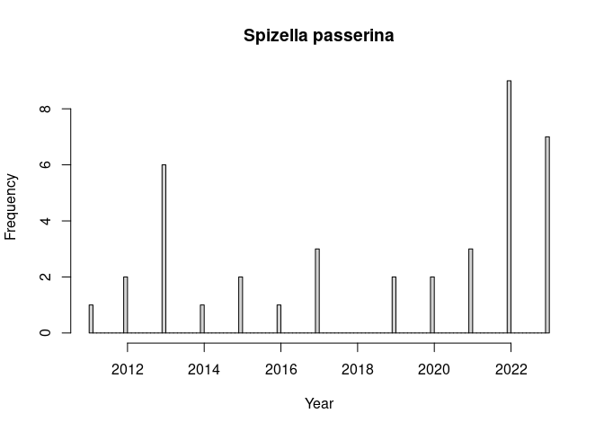<!-- -->

    ##                species    eventDate   
    ##  Spizella pallida  :4   Min.   :2013  
    ##  Acanthis flammea  :0   1st Qu.:2013  
    ##  Accipiter cooperii:0   Median :2016  
    ##  Accipiter gentilis:0   Mean   :2016  
    ##  Accipiter striatus:0   3rd Qu.:2018  
    ##  Actitis macularius:0   Max.   :2020  
    ##  (Other)           :0

<!-- -->

    ##                species     eventDate   
    ##  Spizella pusilla  :35   Min.   :2011  
    ##  Acanthis flammea  : 0   1st Qu.:2015  
    ##  Accipiter cooperii: 0   Median :2019  
    ##  Accipiter gentilis: 0   Mean   :2018  
    ##  Accipiter striatus: 0   3rd Qu.:2022  
    ##  Actitis macularius: 0   Max.   :2023  
    ##  (Other)           : 0

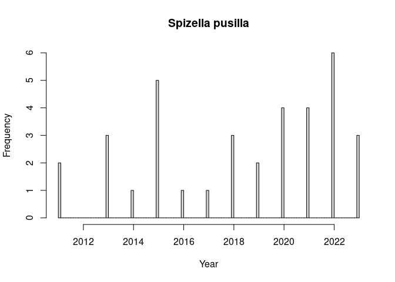<!-- -->

    ##                  species     eventDate   
    ##  Chondestes grammacus:56   Min.   :2009  
    ##  Acanthis flammea    : 0   1st Qu.:2015  
    ##  Accipiter cooperii  : 0   Median :2019  
    ##  Accipiter gentilis  : 0   Mean   :2018  
    ##  Accipiter striatus  : 0   3rd Qu.:2021  
    ##  Actitis macularius  : 0   Max.   :2023  
    ##  (Other)             : 0

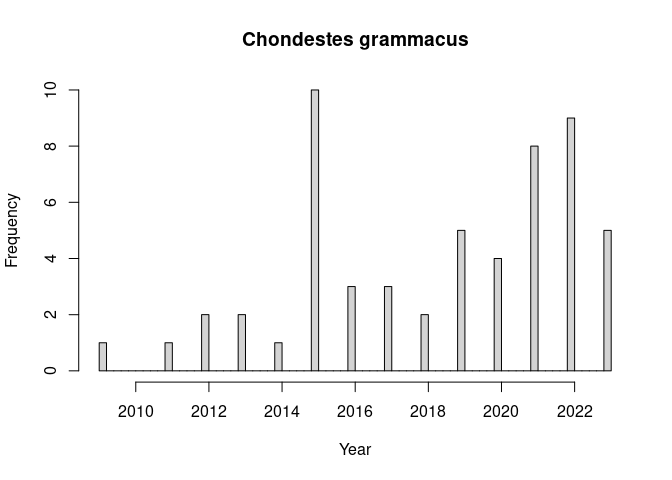<!-- -->

    ##                     species    eventDate   
    ##  Calamospiza melanocorys:8   Min.   :2015  
    ##  Acanthis flammea       :0   1st Qu.:2015  
    ##  Accipiter cooperii     :0   Median :2020  
    ##  Accipiter gentilis     :0   Mean   :2019  
    ##  Accipiter striatus     :0   3rd Qu.:2023  
    ##  Actitis macularius     :0   Max.   :2023  
    ##  (Other)                :0

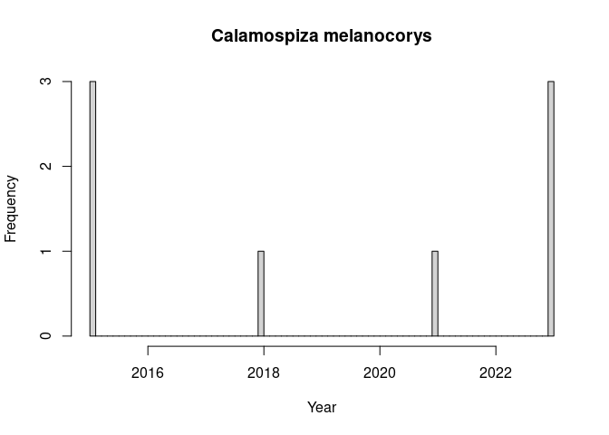<!-- -->

    ##                  species    eventDate   
    ##  Spizelloides arborea:5   Min.   :2013  
    ##  Acanthis flammea    :0   1st Qu.:2013  
    ##  Accipiter cooperii  :0   Median :2017  
    ##  Accipiter gentilis  :0   Mean   :2017  
    ##  Accipiter striatus  :0   3rd Qu.:2021  
    ##  Actitis macularius  :0   Max.   :2023  
    ##  (Other)             :0

<!-- -->

    ##                species    eventDate   
    ##  Junco hyemalis    :4   Min.   :2013  
    ##  Acanthis flammea  :0   1st Qu.:2013  
    ##  Accipiter cooperii:0   Median :2016  
    ##  Accipiter gentilis:0   Mean   :2017  
    ##  Accipiter striatus:0   3rd Qu.:2020  
    ##  Actitis macularius:0   Max.   :2021  
    ##  (Other)           :0

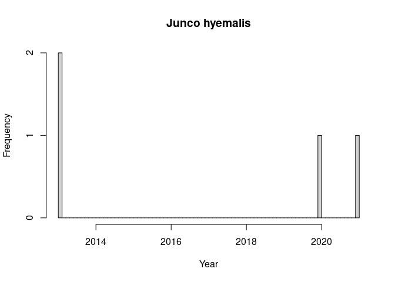<!-- -->

    ##                species    eventDate   
    ##  Junco oreganus    :1   Min.   :2020  
    ##  Acanthis flammea  :0   1st Qu.:2020  
    ##  Accipiter cooperii:0   Median :2020  
    ##  Accipiter gentilis:0   Mean   :2020  
    ##  Accipiter striatus:0   3rd Qu.:2020  
    ##  Actitis macularius:0   Max.   :2020  
    ##  (Other)           :0

<!-- -->

    ##                species    eventDate   
    ##  Junco mearnsi     :1   Min.   :2020  
    ##  Acanthis flammea  :0   1st Qu.:2020  
    ##  Accipiter cooperii:0   Median :2020  
    ##  Accipiter gentilis:0   Mean   :2020  
    ##  Accipiter striatus:0   3rd Qu.:2020  
    ##  Actitis macularius:0   Max.   :2020  
    ##  (Other)           :0

<!-- -->

    ##                    species    eventDate   
    ##  Zonotrichia leucophrys:4   Min.   :2013  
    ##  Acanthis flammea      :0   1st Qu.:2013  
    ##  Accipiter cooperii    :0   Median :2016  
    ##  Accipiter gentilis    :0   Mean   :2017  
    ##  Accipiter striatus    :0   3rd Qu.:2021  
    ##  Actitis macularius    :0   Max.   :2023  
    ##  (Other)               :0

<!-- -->

    ##                 species    eventDate   
    ##  Zonotrichia querula:2   Min.   :2013  
    ##  Acanthis flammea   :0   1st Qu.:2013  
    ##  Accipiter cooperii :0   Median :2013  
    ##  Accipiter gentilis :0   Mean   :2013  
    ##  Accipiter striatus :0   3rd Qu.:2013  
    ##  Actitis macularius :0   Max.   :2013  
    ##  (Other)            :0

<!-- -->

    ##                    species    eventDate   
    ##  Zonotrichia albicollis:1   Min.   :2021  
    ##  Acanthis flammea      :0   1st Qu.:2021  
    ##  Accipiter cooperii    :0   Median :2021  
    ##  Accipiter gentilis    :0   Mean   :2021  
    ##  Accipiter striatus    :0   3rd Qu.:2021  
    ##  Actitis macularius    :0   Max.   :2021  
    ##  (Other)               :0

<!-- -->

    ##                 species    eventDate   
    ##  Pooecetes gramineus:5   Min.   :2013  
    ##  Acanthis flammea   :0   1st Qu.:2013  
    ##  Accipiter cooperii :0   Median :2013  
    ##  Accipiter gentilis :0   Mean   :2014  
    ##  Accipiter striatus :0   3rd Qu.:2015  
    ##  Actitis macularius :0   Max.   :2015  
    ##  (Other)            :0

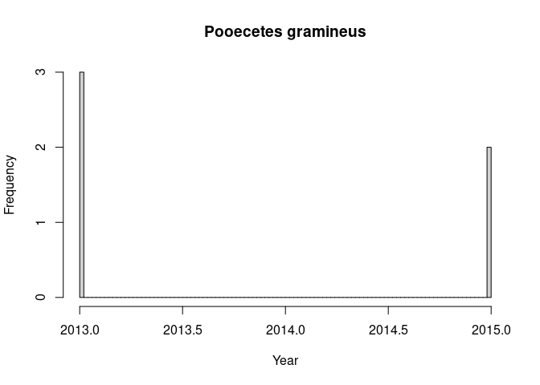<!-- -->

    ##                       species    eventDate   
    ##  Passerculus sandwichensis:4   Min.   :2016  
    ##  Acanthis flammea         :0   1st Qu.:2016  
    ##  Accipiter cooperii       :0   Median :2016  
    ##  Accipiter gentilis       :0   Mean   :2018  
    ##  Accipiter striatus       :0   3rd Qu.:2018  
    ##  Actitis macularius       :0   Max.   :2023  
    ##  (Other)                  :0

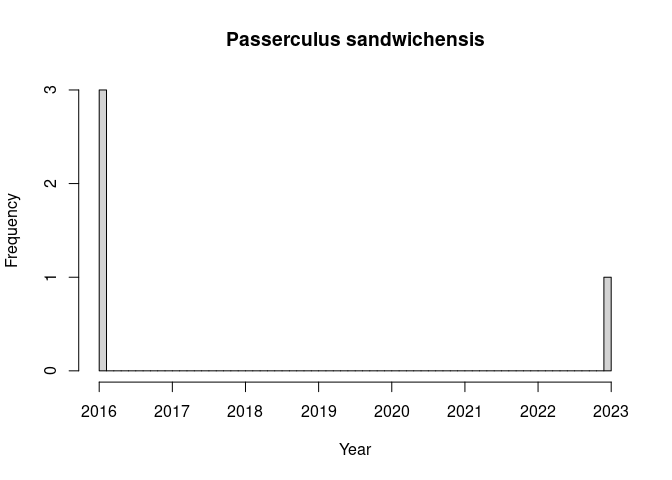<!-- -->

    ##                species    eventDate   
    ##  Melospiza melodia :2   Min.   :2022  
    ##  Acanthis flammea  :0   1st Qu.:2022  
    ##  Accipiter cooperii:0   Median :2022  
    ##  Accipiter gentilis:0   Mean   :2022  
    ##  Accipiter striatus:0   3rd Qu.:2023  
    ##  Actitis macularius:0   Max.   :2023  
    ##  (Other)           :0

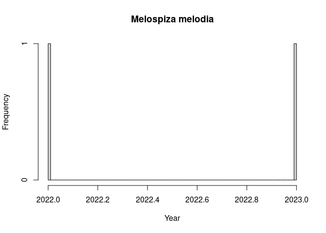<!-- -->

    ##                 species    eventDate   
    ##  Melospiza lincolnii:6   Min.   :2013  
    ##  Acanthis flammea   :0   1st Qu.:2013  
    ##  Accipiter cooperii :0   Median :2013  
    ##  Accipiter gentilis :0   Mean   :2014  
    ##  Accipiter striatus :0   3rd Qu.:2013  
    ##  Actitis macularius :0   Max.   :2020  
    ##  (Other)            :0

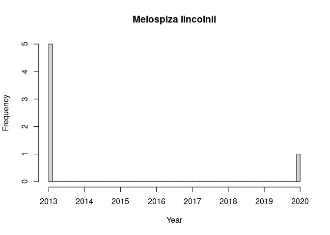<!-- -->

    ##                 species    eventDate   
    ##  Melospiza georgiana:1   Min.   :2013  
    ##  Acanthis flammea   :0   1st Qu.:2013  
    ##  Accipiter cooperii :0   Median :2013  
    ##  Accipiter gentilis :0   Mean   :2013  
    ##  Accipiter striatus :0   3rd Qu.:2013  
    ##  Actitis macularius :0   Max.   :2013  
    ##  (Other)            :0

<!-- -->

    ##                species     eventDate   
    ##  Pipilo maculatus  :18   Min.   :2012  
    ##  Acanthis flammea  : 0   1st Qu.:2013  
    ##  Accipiter cooperii: 0   Median :2018  
    ##  Accipiter gentilis: 0   Mean   :2018  
    ##  Accipiter striatus: 0   3rd Qu.:2022  
    ##  Actitis macularius: 0   Max.   :2023  
    ##  (Other)           : 0

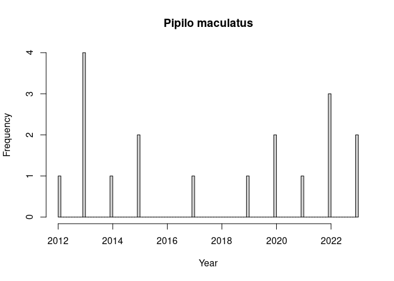<!-- -->

    ##                species    eventDate   
    ##  Icteria virens    :3   Min.   :2013  
    ##  Acanthis flammea  :0   1st Qu.:2013  
    ##  Accipiter cooperii:0   Median :2013  
    ##  Accipiter gentilis:0   Mean   :2014  
    ##  Accipiter striatus:0   3rd Qu.:2015  
    ##  Actitis macularius:0   Max.   :2017  
    ##  (Other)           :0

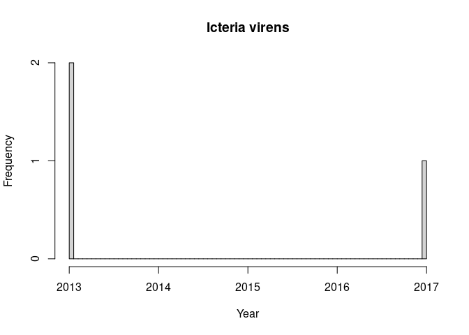<!-- -->

    ##                           species     eventDate   
    ##  Xanthocephalus xanthocephalus:21   Min.   :2015  
    ##  Acanthis flammea             : 0   1st Qu.:2020  
    ##  Accipiter cooperii           : 0   Median :2021  
    ##  Accipiter gentilis           : 0   Mean   :2021  
    ##  Accipiter striatus           : 0   3rd Qu.:2022  
    ##  Actitis macularius           : 0   Max.   :2023  
    ##  (Other)                      : 0

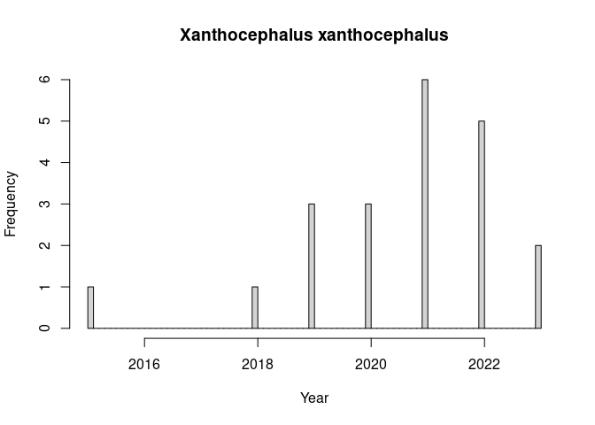<!-- -->

    ##                   species    eventDate   
    ##  Dolichonyx oryzivorus:5   Min.   :2011  
    ##  Acanthis flammea     :0   1st Qu.:2015  
    ##  Accipiter cooperii   :0   Median :2018  
    ##  Accipiter gentilis   :0   Mean   :2017  
    ##  Accipiter striatus   :0   3rd Qu.:2021  
    ##  Actitis macularius   :0   Max.   :2022  
    ##  (Other)              :0

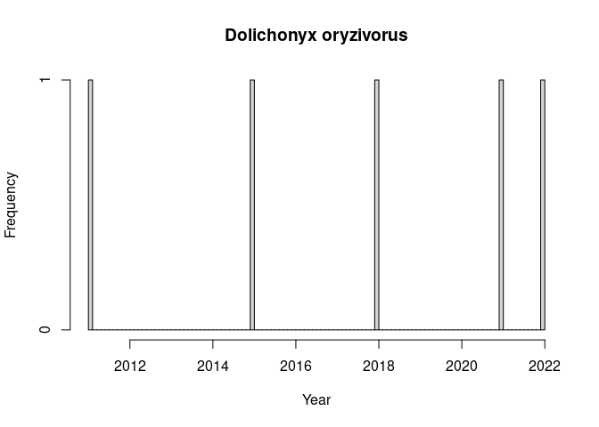<!-- -->

    ##                species     eventDate   
    ##  Sturnella neglecta:68   Min.   :2011  
    ##  Acanthis flammea  : 0   1st Qu.:2015  
    ##  Accipiter cooperii: 0   Median :2020  
    ##  Accipiter gentilis: 0   Mean   :2019  
    ##  Accipiter striatus: 0   3rd Qu.:2022  
    ##  Actitis macularius: 0   Max.   :2023  
    ##  (Other)           : 0

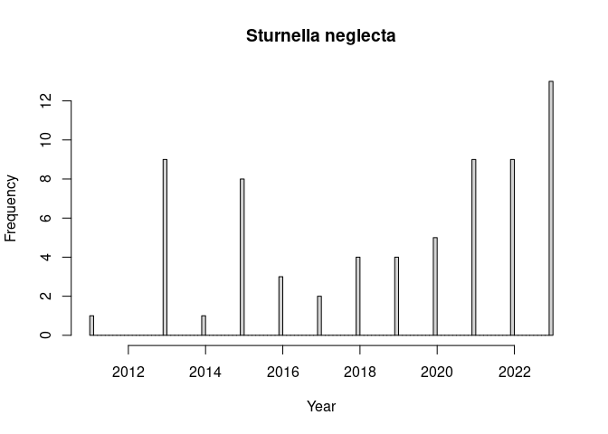<!-- -->

    ##                species    eventDate   
    ##  Sturnella magna   :3   Min.   :2016  
    ##  Acanthis flammea  :0   1st Qu.:2018  
    ##  Accipiter cooperii:0   Median :2021  
    ##  Accipiter gentilis:0   Mean   :2020  
    ##  Accipiter striatus:0   3rd Qu.:2022  
    ##  Actitis macularius:0   Max.   :2023  
    ##  (Other)           :0

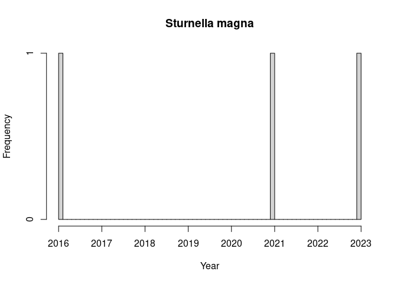<!-- -->

    ##                species     eventDate   
    ##  Icterus spurius   :19   Min.   :2011  
    ##  Acanthis flammea  : 0   1st Qu.:2015  
    ##  Accipiter cooperii: 0   Median :2019  
    ##  Accipiter gentilis: 0   Mean   :2018  
    ##  Accipiter striatus: 0   3rd Qu.:2022  
    ##  Actitis macularius: 0   Max.   :2022  
    ##  (Other)           : 0

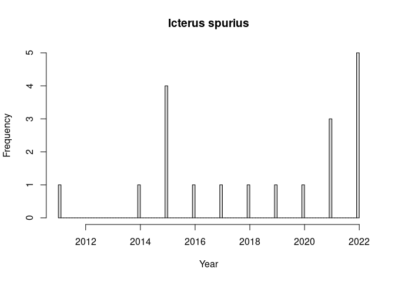<!-- -->

    ##                species    eventDate   
    ##  Icterus galbula   :4   Min.   :2016  
    ##  Acanthis flammea  :0   1st Qu.:2017  
    ##  Accipiter cooperii:0   Median :2019  
    ##  Accipiter gentilis:0   Mean   :2019  
    ##  Accipiter striatus:0   3rd Qu.:2021  
    ##  Actitis macularius:0   Max.   :2022  
    ##  (Other)           :0

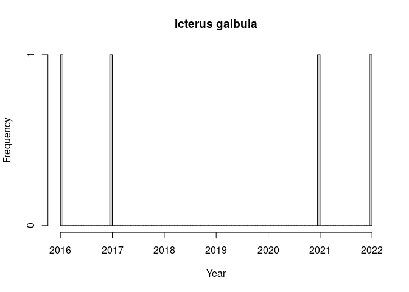<!-- -->

    ##                 species     eventDate   
    ##  Agelaius phoeniceus:55   Min.   :2009  
    ##  Acanthis flammea   : 0   1st Qu.:2018  
    ##  Accipiter cooperii : 0   Median :2021  
    ##  Accipiter gentilis : 0   Mean   :2020  
    ##  Accipiter striatus : 0   3rd Qu.:2022  
    ##  Actitis macularius : 0   Max.   :2023  
    ##  (Other)            : 0

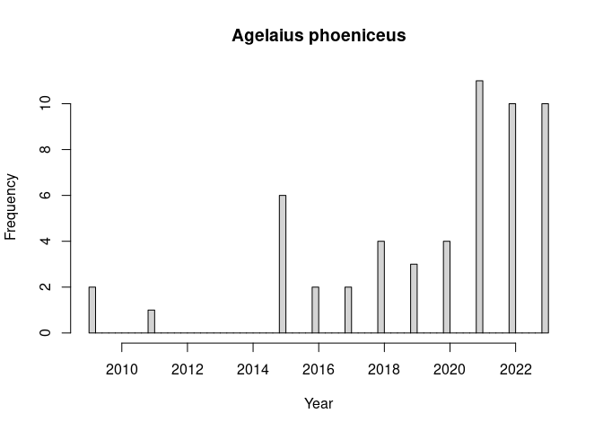<!-- -->

    ##                species     eventDate   
    ##  Molothrus ater    :43   Min.   :2011  
    ##  Acanthis flammea  : 0   1st Qu.:2016  
    ##  Accipiter cooperii: 0   Median :2020  
    ##  Accipiter gentilis: 0   Mean   :2019  
    ##  Accipiter striatus: 0   3rd Qu.:2022  
    ##  Actitis macularius: 0   Max.   :2023  
    ##  (Other)           : 0

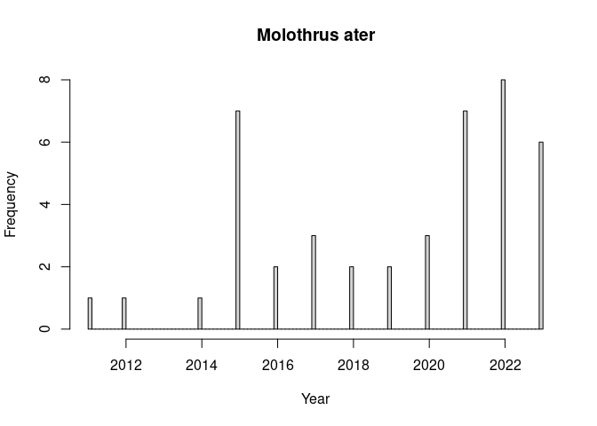<!-- -->

    ##                species     eventDate   
    ##  Quiscalus quiscula:21   Min.   :2011  
    ##  Acanthis flammea  : 0   1st Qu.:2017  
    ##  Accipiter cooperii: 0   Median :2021  
    ##  Accipiter gentilis: 0   Mean   :2019  
    ##  Accipiter striatus: 0   3rd Qu.:2021  
    ##  Actitis macularius: 0   Max.   :2023  
    ##  (Other)           : 0

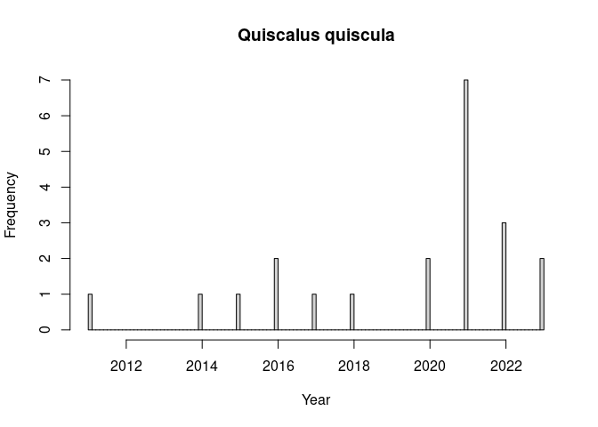<!-- -->

    ##                 species    eventDate   
    ##  Quiscalus mexicanus:1   Min.   :2015  
    ##  Acanthis flammea   :0   1st Qu.:2015  
    ##  Accipiter cooperii :0   Median :2015  
    ##  Accipiter gentilis :0   Mean   :2015  
    ##  Accipiter striatus :0   3rd Qu.:2015  
    ##  Actitis macularius :0   Max.   :2015  
    ##  (Other)            :0

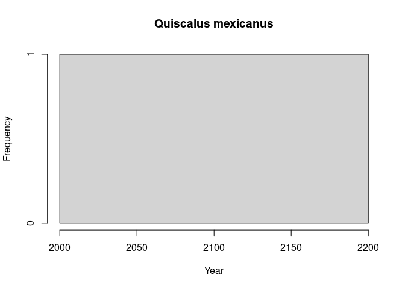<!-- -->

    ##                 species    eventDate   
    ##  Seiurus aurocapilla:5   Min.   :2013  
    ##  Acanthis flammea   :0   1st Qu.:2015  
    ##  Accipiter cooperii :0   Median :2016  
    ##  Accipiter gentilis :0   Mean   :2018  
    ##  Accipiter striatus :0   3rd Qu.:2023  
    ##  Actitis macularius :0   Max.   :2023  
    ##  (Other)            :0

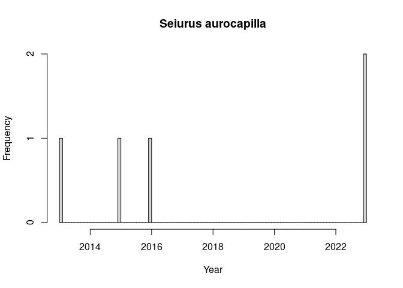<!-- -->

    ##                     species    eventDate   
    ##  Parkesia noveboracensis:1   Min.   :2023  
    ##  Acanthis flammea       :0   1st Qu.:2023  
    ##  Accipiter cooperii     :0   Median :2023  
    ##  Accipiter gentilis     :0   Mean   :2023  
    ##  Accipiter striatus     :0   3rd Qu.:2023  
    ##  Actitis macularius     :0   Max.   :2023  
    ##  (Other)                :0

<!-- -->

    ##                species    eventDate   
    ##  Mniotilta varia   :2   Min.   :2013  
    ##  Acanthis flammea  :0   1st Qu.:2016  
    ##  Accipiter cooperii:0   Median :2018  
    ##  Accipiter gentilis:0   Mean   :2018  
    ##  Accipiter striatus:0   3rd Qu.:2020  
    ##  Actitis macularius:0   Max.   :2023  
    ##  (Other)           :0

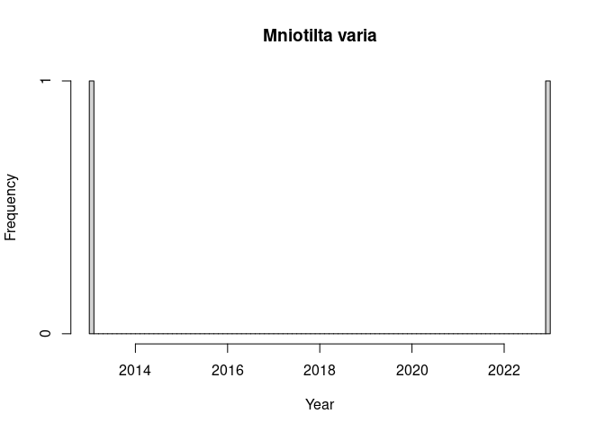<!-- -->

    ##                species    eventDate   
    ##  Leiothlypis celata:7   Min.   :2013  
    ##  Acanthis flammea  :0   1st Qu.:2013  
    ##  Accipiter cooperii:0   Median :2020  
    ##  Accipiter gentilis:0   Mean   :2018  
    ##  Accipiter striatus:0   3rd Qu.:2023  
    ##  Actitis macularius:0   Max.   :2023  
    ##  (Other)           :0

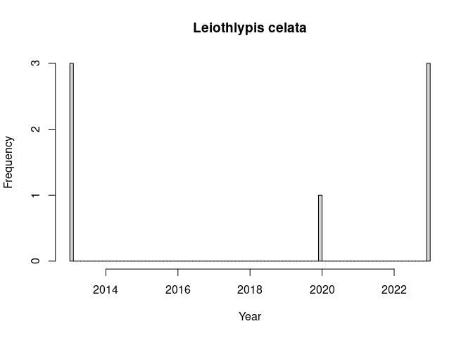<!-- -->

    ##                     species    eventDate   
    ##  Leiothlypis ruficapilla:1   Min.   :2023  
    ##  Acanthis flammea       :0   1st Qu.:2023  
    ##  Accipiter cooperii     :0   Median :2023  
    ##  Accipiter gentilis     :0   Mean   :2023  
    ##  Accipiter striatus     :0   3rd Qu.:2023  
    ##  Actitis macularius     :0   Max.   :2023  
    ##  (Other)                :0

<!-- -->

    ##                species     eventDate   
    ##  Geothlypis trichas:19   Min.   :2011  
    ##  Acanthis flammea  : 0   1st Qu.:2015  
    ##  Accipiter cooperii: 0   Median :2017  
    ##  Accipiter gentilis: 0   Mean   :2018  
    ##  Accipiter striatus: 0   3rd Qu.:2021  
    ##  Actitis macularius: 0   Max.   :2022  
    ##  (Other)           : 0

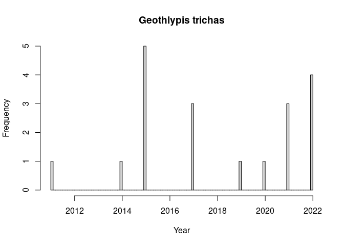<!-- -->

    ##                 species    eventDate   
    ##  Setophaga ruticilla:7   Min.   :2013  
    ##  Acanthis flammea   :0   1st Qu.:2014  
    ##  Accipiter cooperii :0   Median :2015  
    ##  Accipiter gentilis :0   Mean   :2018  
    ##  Accipiter striatus :0   3rd Qu.:2022  
    ##  Actitis macularius :0   Max.   :2023  
    ##  (Other)            :0

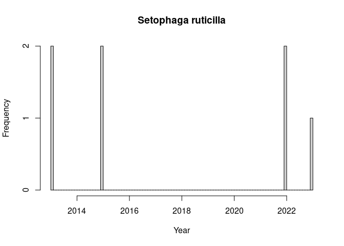<!-- -->

    ##                species     eventDate   
    ##  Setophaga petechia:29   Min.   :2011  
    ##  Acanthis flammea  : 0   1st Qu.:2016  
    ##  Accipiter cooperii: 0   Median :2020  
    ##  Accipiter gentilis: 0   Mean   :2019  
    ##  Accipiter striatus: 0   3rd Qu.:2022  
    ##  Actitis macularius: 0   Max.   :2023  
    ##  (Other)           : 0

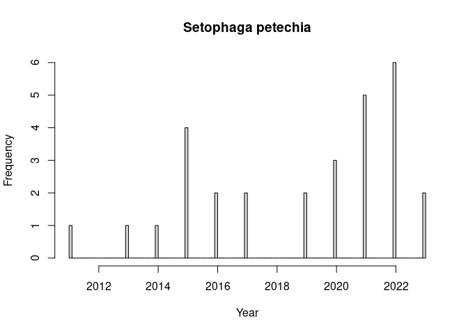<!-- -->

    ##                species    eventDate   
    ##  Setophaga coronata:5   Min.   :2013  
    ##  Acanthis flammea  :0   1st Qu.:2013  
    ##  Accipiter cooperii:0   Median :2023  
    ##  Accipiter gentilis:0   Mean   :2019  
    ##  Accipiter striatus:0   3rd Qu.:2023  
    ##  Actitis macularius:0   Max.   :2023  
    ##  (Other)           :0

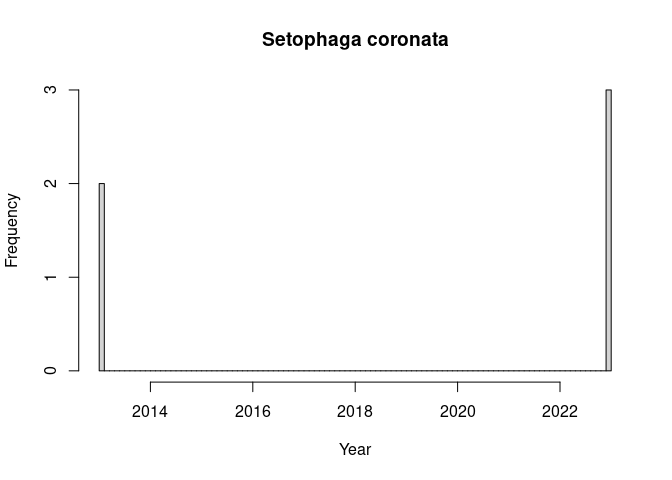<!-- -->

    ##                species    eventDate   
    ##  Cardellina pusilla:3   Min.   :2013  
    ##  Acanthis flammea  :0   1st Qu.:2013  
    ##  Accipiter cooperii:0   Median :2013  
    ##  Accipiter gentilis:0   Mean   :2013  
    ##  Accipiter striatus:0   3rd Qu.:2013  
    ##  Actitis macularius:0   Max.   :2013  
    ##  (Other)           :0

<!-- -->

    ##                   species     eventDate   
    ##  Cardinalis cardinalis:12   Min.   :2013  
    ##  Acanthis flammea     : 0   1st Qu.:2013  
    ##  Accipiter cooperii   : 0   Median :2013  
    ##  Accipiter gentilis   : 0   Mean   :2014  
    ##  Accipiter striatus   : 0   3rd Qu.:2013  
    ##  Actitis macularius   : 0   Max.   :2019  
    ##  (Other)              : 0

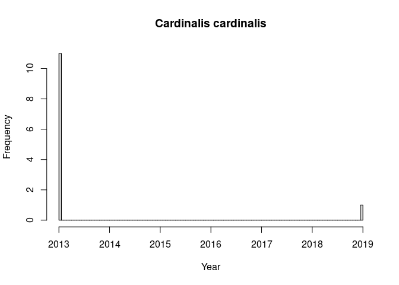<!-- -->

    ##                     species    eventDate   
    ##  Pheucticus ludovicianus:1   Min.   :2020  
    ##  Acanthis flammea       :0   1st Qu.:2020  
    ##  Accipiter cooperii     :0   Median :2020  
    ##  Accipiter gentilis     :0   Mean   :2020  
    ##  Accipiter striatus     :0   3rd Qu.:2020  
    ##  Actitis macularius     :0   Max.   :2020  
    ##  (Other)                :0

<!-- -->

    ##                       species    eventDate   
    ##  Pheucticus melanocephalus:2   Min.   :2022  
    ##  Acanthis flammea         :0   1st Qu.:2022  
    ##  Accipiter cooperii       :0   Median :2022  
    ##  Accipiter gentilis       :0   Mean   :2022  
    ##  Accipiter striatus       :0   3rd Qu.:2023  
    ##  Actitis macularius       :0   Max.   :2023  
    ##  (Other)                  :0

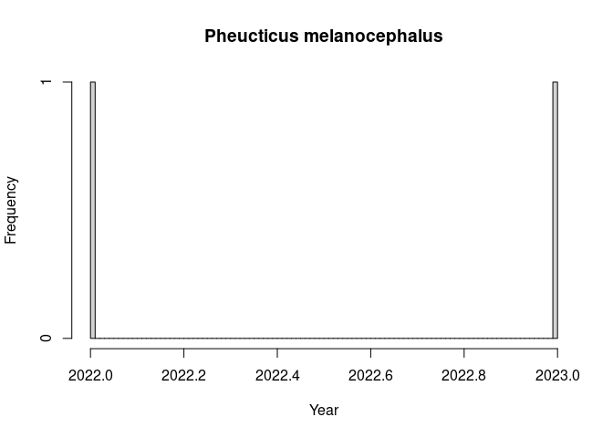<!-- -->

    ##                species     eventDate   
    ##  Passerina caerulea:20   Min.   :2011  
    ##  Acanthis flammea  : 0   1st Qu.:2015  
    ##  Accipiter cooperii: 0   Median :2020  
    ##  Accipiter gentilis: 0   Mean   :2018  
    ##  Accipiter striatus: 0   3rd Qu.:2021  
    ##  Actitis macularius: 0   Max.   :2023  
    ##  (Other)           : 0

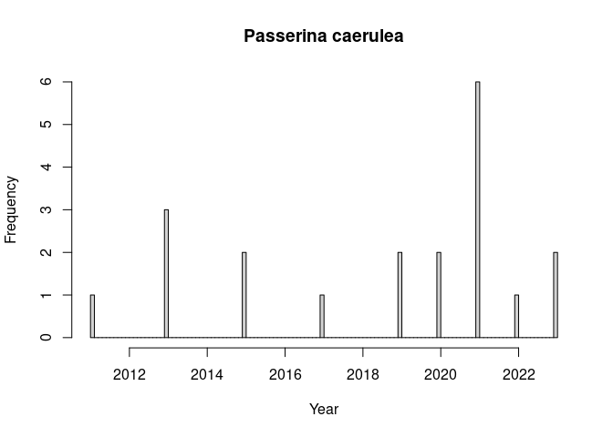<!-- -->

    ##                species    eventDate   
    ##  Passerina cyanea  :1   Min.   :2011  
    ##  Acanthis flammea  :0   1st Qu.:2011  
    ##  Accipiter cooperii:0   Median :2011  
    ##  Accipiter gentilis:0   Mean   :2011  
    ##  Accipiter striatus:0   3rd Qu.:2011  
    ##  Actitis macularius:0   Max.   :2011  
    ##  (Other)           :0

<!-- -->

    ##                species     eventDate   
    ##  Spiza americana   :13   Min.   :2011  
    ##  Acanthis flammea  : 0   1st Qu.:2015  
    ##  Accipiter cooperii: 0   Median :2020  
    ##  Accipiter gentilis: 0   Mean   :2018  
    ##  Accipiter striatus: 0   3rd Qu.:2021  
    ##  Actitis macularius: 0   Max.   :2022  
    ##  (Other)           : 0

<!-- -->

    ##                         species      eventDate   
    ##  Setophaga coronata/auduboni:526   Min.   :1996  
    ##  Acanthis flammea           :  0   1st Qu.:2015  
    ##  Accipiter cooperii         :  0   Median :2018  
    ##  Accipiter gentilis         :  0   Mean   :2017  
    ##  Accipiter striatus         :  0   3rd Qu.:2021  
    ##  Actitis macularius         :  0   Max.   :2022  
    ##  (Other)                    :  0

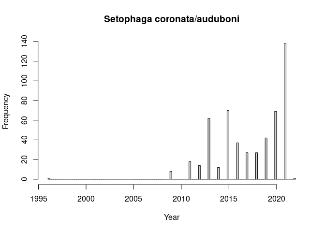<!-- -->

## Pine Ridge / Oglala

``` r
districtR(ne_nf_gbif = ne_nf_gbif,district="Pine Ridge / Oglala")
```

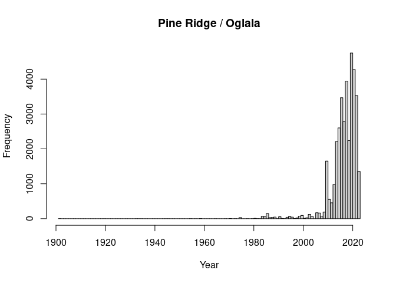<!-- -->

    ##                species    eventDate   
    ##  Anser caerulescens:1   Min.   :2017  
    ##  Acanthis flammea  :0   1st Qu.:2017  
    ##  Accipiter cooperii:0   Median :2017  
    ##  Accipiter gentilis:0   Mean   :2017  
    ##  Accipiter striatus:0   3rd Qu.:2017  
    ##  Actitis macularius:0   Max.   :2017  
    ##  (Other)           :0

<!-- -->

    ##                species    eventDate   
    ##  Branta hutchinsii :1   Min.   :2021  
    ##  Acanthis flammea  :0   1st Qu.:2021  
    ##  Accipiter cooperii:0   Median :2021  
    ##  Accipiter gentilis:0   Mean   :2021  
    ##  Accipiter striatus:0   3rd Qu.:2021  
    ##  Actitis macularius:0   Max.   :2021  
    ##  (Other)           :0

<!-- -->

    ##                species     eventDate   
    ##  Branta canadensis :45   Min.   :2010  
    ##  Acanthis flammea  : 0   1st Qu.:2017  
    ##  Accipiter cooperii: 0   Median :2021  
    ##  Accipiter gentilis: 0   Mean   :2019  
    ##  Accipiter striatus: 0   3rd Qu.:2021  
    ##  Actitis macularius: 0   Max.   :2023  
    ##  (Other)           : 0

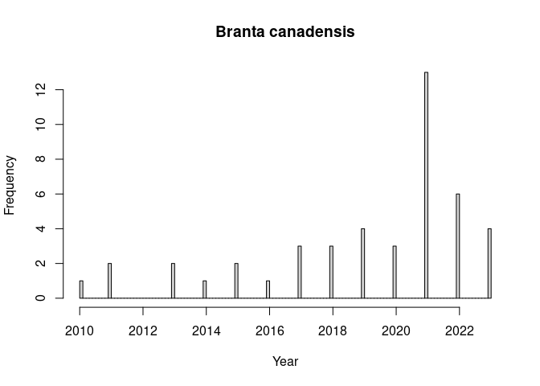<!-- -->

    ##                species    eventDate   
    ##  Cygnus buccinator :1   Min.   :2020  
    ##  Acanthis flammea  :0   1st Qu.:2020  
    ##  Accipiter cooperii:0   Median :2020  
    ##  Accipiter gentilis:0   Mean   :2020  
    ##  Accipiter striatus:0   3rd Qu.:2020  
    ##  Actitis macularius:0   Max.   :2020  
    ##  (Other)           :0

<!-- -->

    ##                species     eventDate   
    ##  Aix sponsa        :65   Min.   :1984  
    ##  Acanthis flammea  : 0   1st Qu.:2014  
    ##  Accipiter cooperii: 0   Median :2018  
    ##  Accipiter gentilis: 0   Mean   :2017  
    ##  Accipiter striatus: 0   3rd Qu.:2020  
    ##  Actitis macularius: 0   Max.   :2023  
    ##  (Other)           : 0

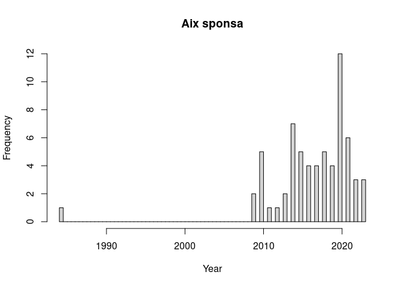<!-- -->

    ##                species     eventDate   
    ##  Spatula discors   :89   Min.   :1984  
    ##  Acanthis flammea  : 0   1st Qu.:2016  
    ##  Accipiter cooperii: 0   Median :2019  
    ##  Accipiter gentilis: 0   Mean   :2017  
    ##  Accipiter striatus: 0   3rd Qu.:2021  
    ##  Actitis macularius: 0   Max.   :2023  
    ##  (Other)           : 0

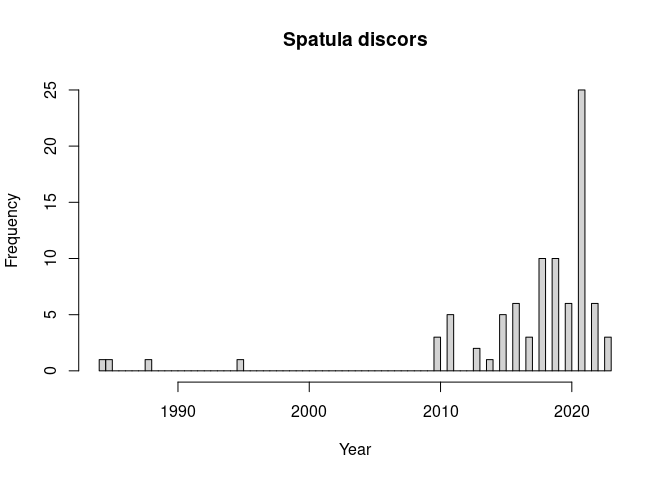<!-- -->

    ##                species    eventDate   
    ##  Spatula cyanoptera:3   Min.   :2018  
    ##  Acanthis flammea  :0   1st Qu.:2019  
    ##  Accipiter cooperii:0   Median :2020  
    ##  Accipiter gentilis:0   Mean   :2020  
    ##  Accipiter striatus:0   3rd Qu.:2021  
    ##  Actitis macularius:0   Max.   :2022  
    ##  (Other)           :0

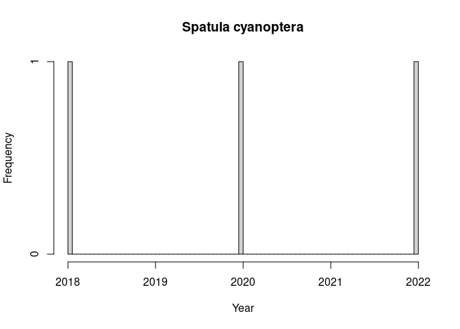<!-- -->

    ##                species     eventDate   
    ##  Spatula clypeata  :61   Min.   :1984  
    ##  Acanthis flammea  : 0   1st Qu.:2017  
    ##  Accipiter cooperii: 0   Median :2019  
    ##  Accipiter gentilis: 0   Mean   :2017  
    ##  Accipiter striatus: 0   3rd Qu.:2021  
    ##  Actitis macularius: 0   Max.   :2023  
    ##  (Other)           : 0

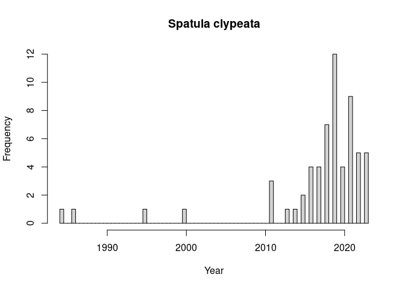<!-- -->

    ##                species     eventDate   
    ##  Mareca strepera   :40   Min.   :1984  
    ##  Acanthis flammea  : 0   1st Qu.:2018  
    ##  Accipiter cooperii: 0   Median :2019  
    ##  Accipiter gentilis: 0   Mean   :2018  
    ##  Accipiter striatus: 0   3rd Qu.:2021  
    ##  Actitis macularius: 0   Max.   :2023  
    ##  (Other)           : 0

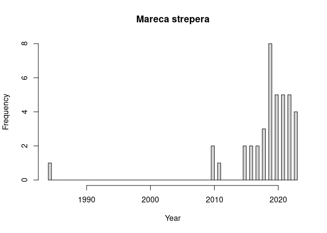<!-- -->

    ##                species     eventDate   
    ##  Mareca americana  :21   Min.   :2000  
    ##  Acanthis flammea  : 0   1st Qu.:2016  
    ##  Accipiter cooperii: 0   Median :2018  
    ##  Accipiter gentilis: 0   Mean   :2016  
    ##  Accipiter striatus: 0   3rd Qu.:2020  
    ##  Actitis macularius: 0   Max.   :2022  
    ##  (Other)           : 0

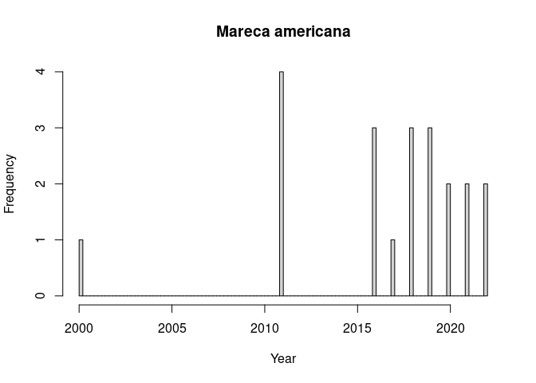<!-- -->

    ##                species      eventDate   
    ##  Anas platyrhynchos:186   Min.   :1984  
    ##  Acanthis flammea  :  0   1st Qu.:2015  
    ##  Accipiter cooperii:  0   Median :2018  
    ##  Accipiter gentilis:  0   Mean   :2017  
    ##  Accipiter striatus:  0   3rd Qu.:2021  
    ##  Actitis macularius:  0   Max.   :2023  
    ##  (Other)           :  0

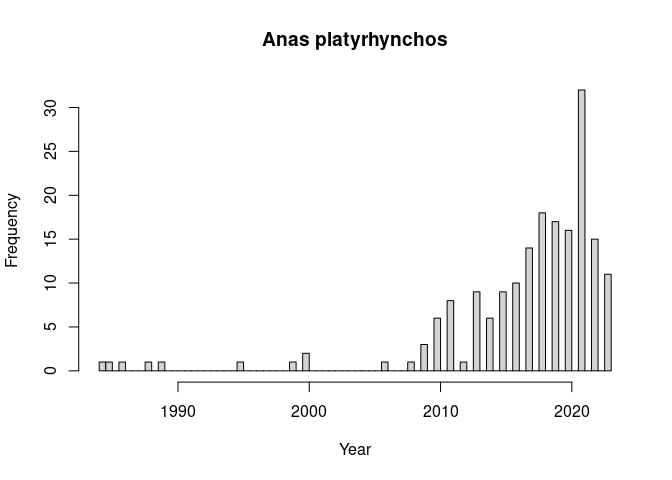<!-- -->

    ##                species     eventDate   
    ##  Anas acuta        :29   Min.   :1984  
    ##  Acanthis flammea  : 0   1st Qu.:2014  
    ##  Accipiter cooperii: 0   Median :2018  
    ##  Accipiter gentilis: 0   Mean   :2015  
    ##  Accipiter striatus: 0   3rd Qu.:2020  
    ##  Actitis macularius: 0   Max.   :2023  
    ##  (Other)           : 0

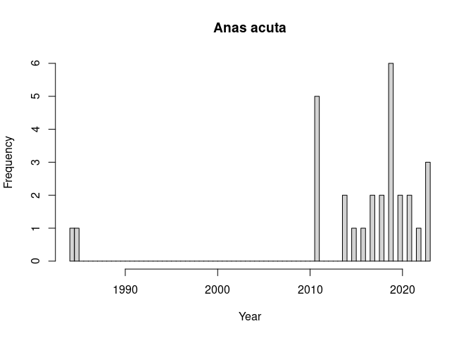<!-- -->

    ##                species     eventDate   
    ##  Anas crecca       :20   Min.   :1995  
    ##  Acanthis flammea  : 0   1st Qu.:2015  
    ##  Accipiter cooperii: 0   Median :2018  
    ##  Accipiter gentilis: 0   Mean   :2017  
    ##  Accipiter striatus: 0   3rd Qu.:2020  
    ##  Actitis macularius: 0   Max.   :2023  
    ##  (Other)           : 0

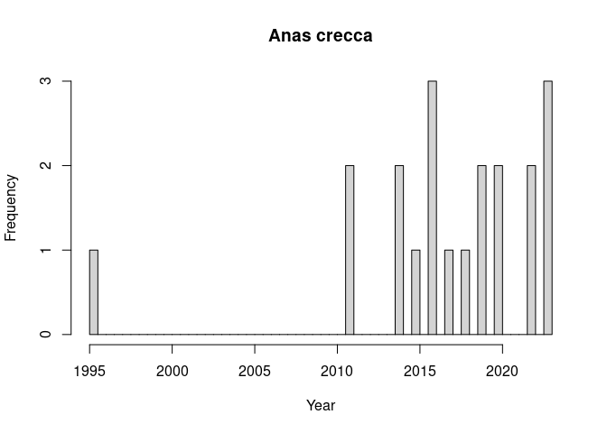<!-- -->

    ##                species    eventDate   
    ##  Aythya valisineria:2   Min.   :1984  
    ##  Acanthis flammea  :0   1st Qu.:1994  
    ##  Accipiter cooperii:0   Median :2004  
    ##  Accipiter gentilis:0   Mean   :2004  
    ##  Accipiter striatus:0   3rd Qu.:2013  
    ##  Actitis macularius:0   Max.   :2023  
    ##  (Other)           :0

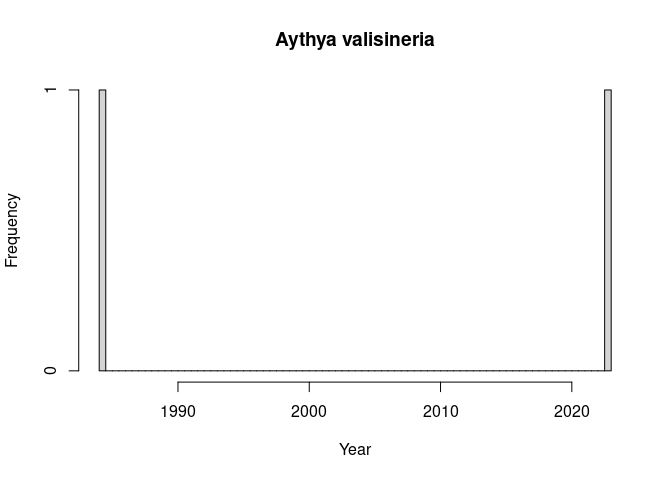<!-- -->

    ##                species    eventDate   
    ##  Aythya americana  :9   Min.   :1985  
    ##  Acanthis flammea  :0   1st Qu.:2011  
    ##  Accipiter cooperii:0   Median :2014  
    ##  Accipiter gentilis:0   Mean   :2012  
    ##  Accipiter striatus:0   3rd Qu.:2018  
    ##  Actitis macularius:0   Max.   :2021  
    ##  (Other)           :0

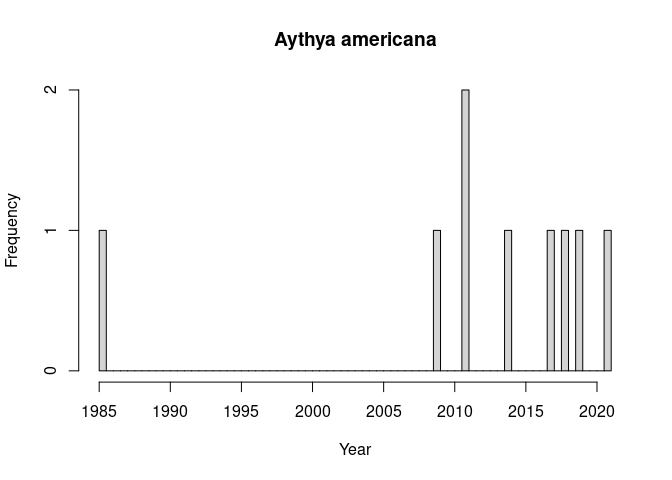<!-- -->

    ##                species     eventDate   
    ##  Aythya collaris   :12   Min.   :1984  
    ##  Acanthis flammea  : 0   1st Qu.:2013  
    ##  Accipiter cooperii: 0   Median :2019  
    ##  Accipiter gentilis: 0   Mean   :2015  
    ##  Accipiter striatus: 0   3rd Qu.:2022  
    ##  Actitis macularius: 0   Max.   :2022  
    ##  (Other)           : 0

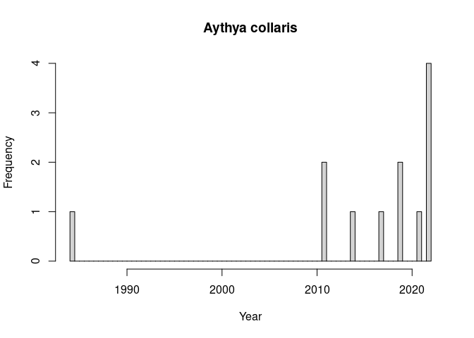<!-- -->

    ##                species    eventDate   
    ##  Aythya affinis    :5   Min.   :2011  
    ##  Acanthis flammea  :0   1st Qu.:2011  
    ##  Accipiter cooperii:0   Median :2019  
    ##  Accipiter gentilis:0   Mean   :2016  
    ##  Accipiter striatus:0   3rd Qu.:2019  
    ##  Actitis macularius:0   Max.   :2021  
    ##  (Other)           :0

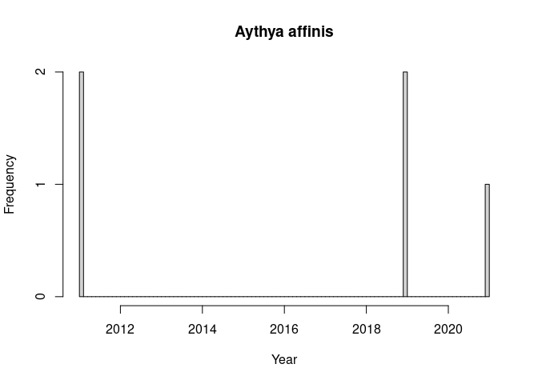<!-- -->

    ##                species     eventDate   
    ##  Bucephala albeola :10   Min.   :2011  
    ##  Acanthis flammea  : 0   1st Qu.:2019  
    ##  Accipiter cooperii: 0   Median :2019  
    ##  Accipiter gentilis: 0   Mean   :2019  
    ##  Accipiter striatus: 0   3rd Qu.:2022  
    ##  Actitis macularius: 0   Max.   :2022  
    ##  (Other)           : 0

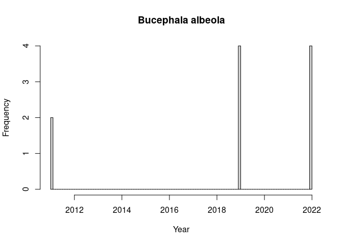<!-- -->

    ##                species    eventDate   
    ##  Bucephala clangula:1   Min.   :2011  
    ##  Acanthis flammea  :0   1st Qu.:2011  
    ##  Accipiter cooperii:0   Median :2011  
    ##  Accipiter gentilis:0   Mean   :2011  
    ##  Accipiter striatus:0   3rd Qu.:2011  
    ##  Actitis macularius:0   Max.   :2011  
    ##  (Other)           :0

<!-- -->

    ##                   species    eventDate   
    ##  Lophodytes cucullatus:3   Min.   :2016  
    ##  Acanthis flammea     :0   1st Qu.:2018  
    ##  Accipiter cooperii   :0   Median :2021  
    ##  Accipiter gentilis   :0   Mean   :2019  
    ##  Accipiter striatus   :0   3rd Qu.:2021  
    ##  Actitis macularius   :0   Max.   :2021  
    ##  (Other)              :0

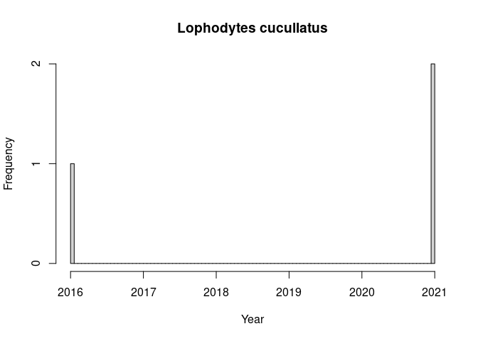<!-- -->

    ##                species    eventDate   
    ##  Mergus merganser  :5   Min.   :2011  
    ##  Acanthis flammea  :0   1st Qu.:2016  
    ##  Accipiter cooperii:0   Median :2016  
    ##  Accipiter gentilis:0   Mean   :2017  
    ##  Accipiter striatus:0   3rd Qu.:2021  
    ##  Actitis macularius:0   Max.   :2021  
    ##  (Other)           :0

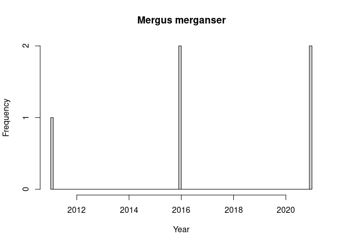<!-- -->

    ##                species     eventDate   
    ##  Oxyura jamaicensis:16   Min.   :2009  
    ##  Acanthis flammea  : 0   1st Qu.:2016  
    ##  Accipiter cooperii: 0   Median :2018  
    ##  Accipiter gentilis: 0   Mean   :2017  
    ##  Accipiter striatus: 0   3rd Qu.:2019  
    ##  Actitis macularius: 0   Max.   :2022  
    ##  (Other)           : 0

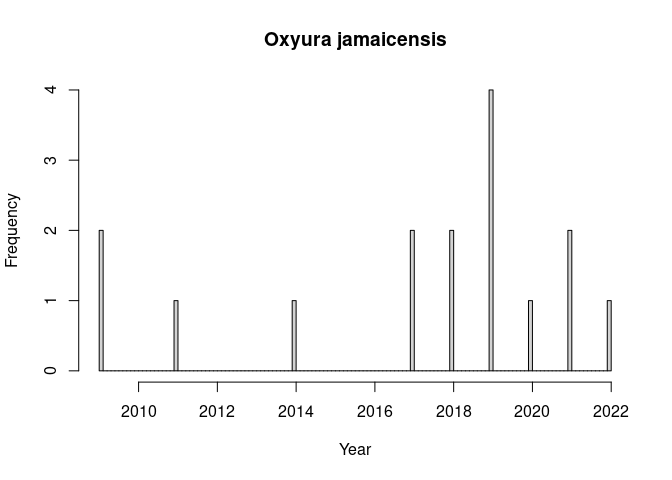<!-- -->

    ##                 species    eventDate   
    ##  Colinus virginianus:1   Min.   :2023  
    ##  Acanthis flammea   :0   1st Qu.:2023  
    ##  Accipiter cooperii :0   Median :2023  
    ##  Accipiter gentilis :0   Mean   :2023  
    ##  Accipiter striatus :0   3rd Qu.:2023  
    ##  Actitis macularius :0   Max.   :2023  
    ##  (Other)            :0

<!-- -->

    ##                 species      eventDate   
    ##  Meleagris gallopavo:283   Min.   :1988  
    ##  Acanthis flammea   :  0   1st Qu.:2016  
    ##  Accipiter cooperii :  0   Median :2018  
    ##  Accipiter gentilis :  0   Mean   :2017  
    ##  Accipiter striatus :  0   3rd Qu.:2021  
    ##  Actitis macularius :  0   Max.   :2023  
    ##  (Other)            :  0

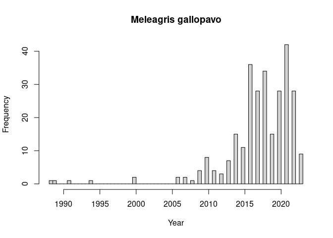<!-- -->

    ##                      species     eventDate   
    ##  Tympanuchus phasianellus:52   Min.   :1984  
    ##  Acanthis flammea        : 0   1st Qu.:2017  
    ##  Accipiter cooperii      : 0   Median :2020  
    ##  Accipiter gentilis      : 0   Mean   :2017  
    ##  Accipiter striatus      : 0   3rd Qu.:2021  
    ##  Actitis macularius      : 0   Max.   :2023  
    ##  (Other)                 : 0

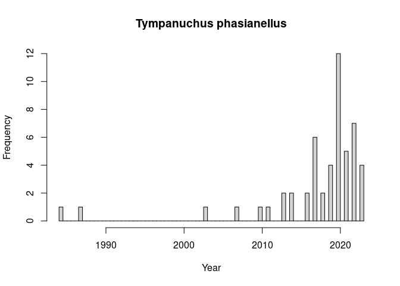<!-- -->

    ##                 species     eventDate   
    ##  Phasianus colchicus:25   Min.   :1984  
    ##  Acanthis flammea   : 0   1st Qu.:2014  
    ##  Accipiter cooperii : 0   Median :2018  
    ##  Accipiter gentilis : 0   Mean   :2015  
    ##  Accipiter striatus : 0   3rd Qu.:2020  
    ##  Actitis macularius : 0   Max.   :2023  
    ##  (Other)            : 0

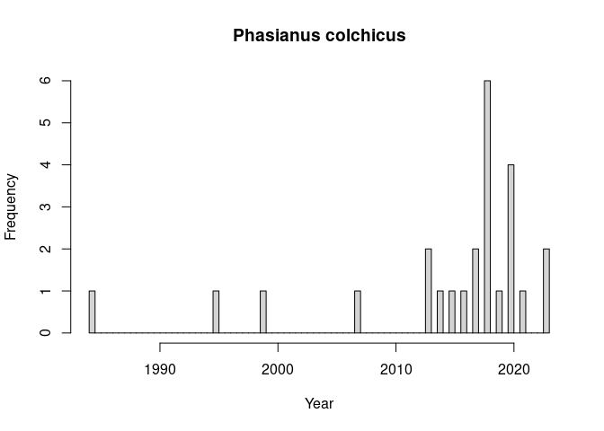<!-- -->

    ##                 species     eventDate   
    ##  Podilymbus podiceps:41   Min.   :2000  
    ##  Acanthis flammea   : 0   1st Qu.:2015  
    ##  Accipiter cooperii : 0   Median :2018  
    ##  Accipiter gentilis : 0   Mean   :2017  
    ##  Accipiter striatus : 0   3rd Qu.:2021  
    ##  Actitis macularius : 0   Max.   :2022  
    ##  (Other)            : 0

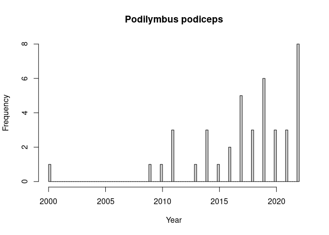<!-- -->

    ##                  species     eventDate   
    ##  Podiceps nigricollis:22   Min.   :1984  
    ##  Acanthis flammea    : 0   1st Qu.:2014  
    ##  Accipiter cooperii  : 0   Median :2018  
    ##  Accipiter gentilis  : 0   Mean   :2016  
    ##  Accipiter striatus  : 0   3rd Qu.:2022  
    ##  Actitis macularius  : 0   Max.   :2023  
    ##  (Other)             : 0

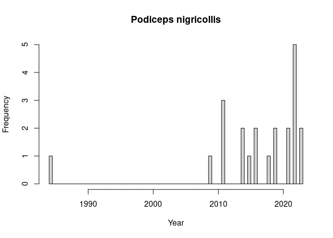<!-- -->

    ##                       species     eventDate   
    ##  Aechmophorus occidentalis:13   Min.   :1982  
    ##  Acanthis flammea         : 0   1st Qu.:2009  
    ##  Accipiter cooperii       : 0   Median :2013  
    ##  Accipiter gentilis       : 0   Mean   :2008  
    ##  Accipiter striatus       : 0   3rd Qu.:2013  
    ##  Actitis macularius       : 0   Max.   :2022  
    ##  (Other)                  : 0

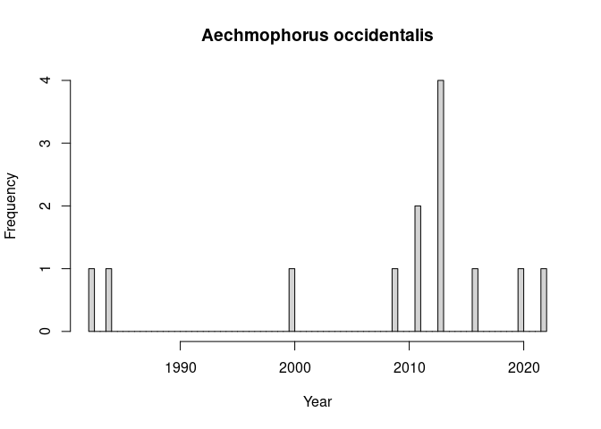<!-- -->

    ##                  species    eventDate   
    ##  Aechmophorus clarkii:1   Min.   :2013  
    ##  Acanthis flammea    :0   1st Qu.:2013  
    ##  Accipiter cooperii  :0   Median :2013  
    ##  Accipiter gentilis  :0   Mean   :2013  
    ##  Accipiter striatus  :0   3rd Qu.:2013  
    ##  Actitis macularius  :0   Max.   :2013  
    ##  (Other)             :0

<!-- -->

    ##                   species      eventDate   
    ##  Streptopelia decaocto:286   Min.   :2007  
    ##  Acanthis flammea     :  0   1st Qu.:2015  
    ##  Accipiter cooperii   :  0   Median :2016  
    ##  Accipiter gentilis   :  0   Mean   :2016  
    ##  Accipiter striatus   :  0   3rd Qu.:2019  
    ##  Actitis macularius   :  0   Max.   :2023  
    ##  (Other)              :  0

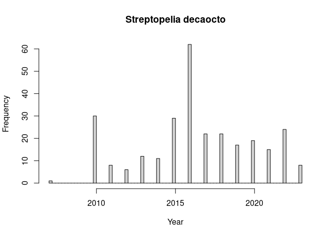<!-- -->

    ##                species      eventDate   
    ##  Zenaida macroura  :769   Min.   :1975  
    ##  Acanthis flammea  :  0   1st Qu.:2015  
    ##  Accipiter cooperii:  0   Median :2019  
    ##  Accipiter gentilis:  0   Mean   :2017  
    ##  Accipiter striatus:  0   3rd Qu.:2021  
    ##  Actitis macularius:  0   Max.   :2023  
    ##  (Other)           :  0

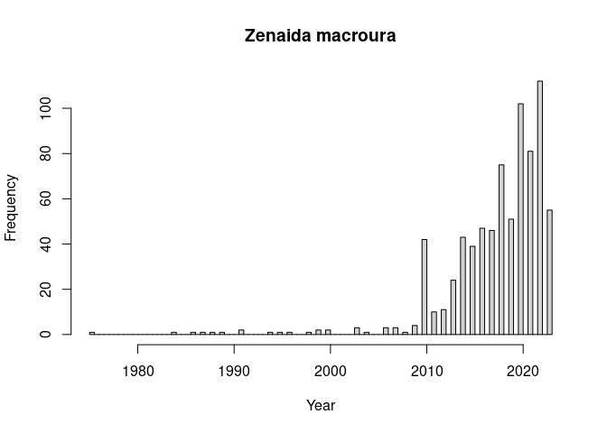<!-- -->

    ##                 species     eventDate   
    ##  Coccyzus americanus:15   Min.   :2017  
    ##  Acanthis flammea   : 0   1st Qu.:2018  
    ##  Accipiter cooperii : 0   Median :2020  
    ##  Accipiter gentilis : 0   Mean   :2020  
    ##  Accipiter striatus : 0   3rd Qu.:2021  
    ##  Actitis macularius : 0   Max.   :2023  
    ##  (Other)            : 0

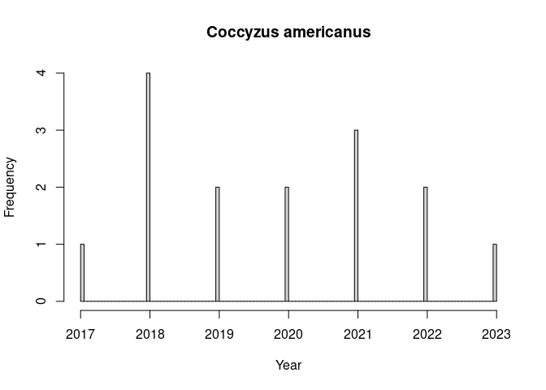<!-- -->

    ##                species      eventDate   
    ##  Chordeiles minor  :173   Min.   :1975  
    ##  Acanthis flammea  :  0   1st Qu.:2016  
    ##  Accipiter cooperii:  0   Median :2019  
    ##  Accipiter gentilis:  0   Mean   :2017  
    ##  Accipiter striatus:  0   3rd Qu.:2021  
    ##  Actitis macularius:  0   Max.   :2023  
    ##  (Other)           :  0

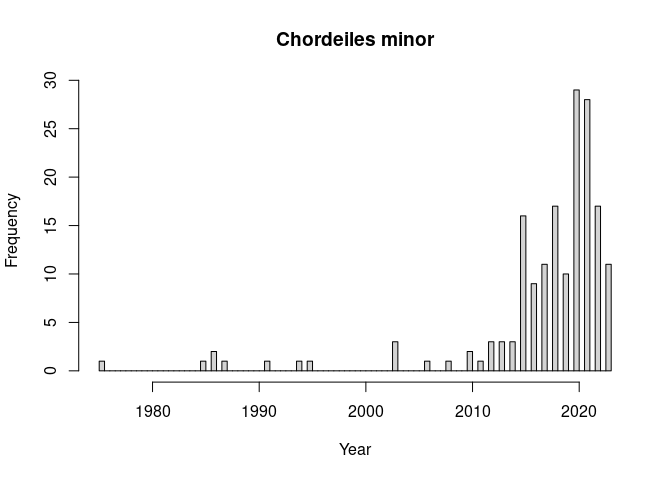<!-- -->

    ##                      species     eventDate   
    ##  Phalaenoptilus nuttallii:75   Min.   :1990  
    ##  Acanthis flammea        : 0   1st Qu.:2015  
    ##  Accipiter cooperii      : 0   Median :2016  
    ##  Accipiter gentilis      : 0   Mean   :2016  
    ##  Accipiter striatus      : 0   3rd Qu.:2020  
    ##  Actitis macularius      : 0   Max.   :2023  
    ##  (Other)                 : 0

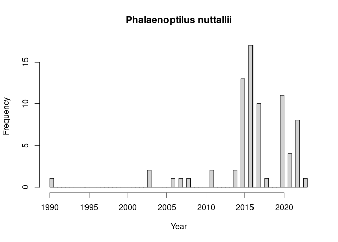<!-- -->

    ##                species     eventDate   
    ##  Chaetura pelagica :17   Min.   :1988  
    ##  Acanthis flammea  : 0   1st Qu.:2010  
    ##  Accipiter cooperii: 0   Median :2017  
    ##  Accipiter gentilis: 0   Mean   :2013  
    ##  Accipiter striatus: 0   3rd Qu.:2021  
    ##  Actitis macularius: 0   Max.   :2023  
    ##  (Other)           : 0

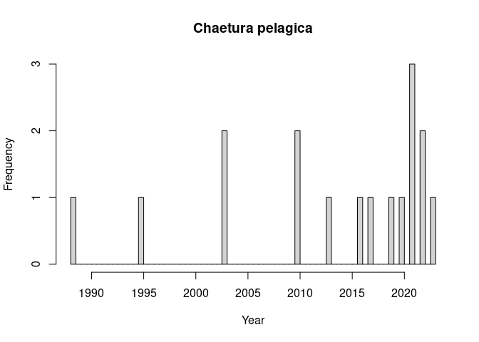<!-- -->

    ##                  species     eventDate   
    ##  Aeronautes saxatalis:38   Min.   :1991  
    ##  Acanthis flammea    : 0   1st Qu.:2018  
    ##  Accipiter cooperii  : 0   Median :2020  
    ##  Accipiter gentilis  : 0   Mean   :2018  
    ##  Accipiter striatus  : 0   3rd Qu.:2022  
    ##  Actitis macularius  : 0   Max.   :2023  
    ##  (Other)             : 0

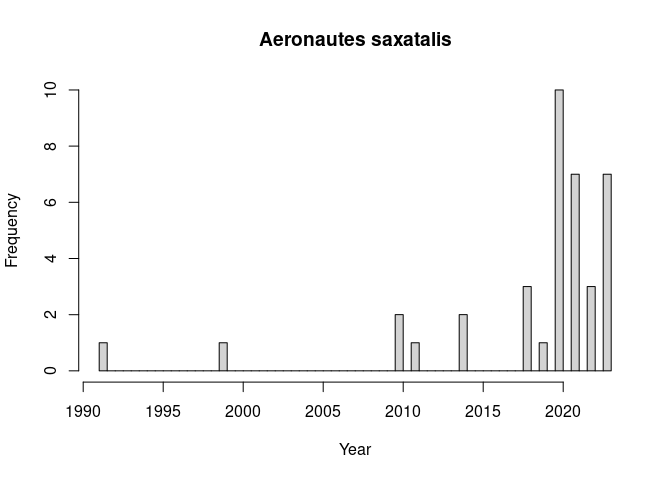<!-- -->

    ##                  species    eventDate   
    ##  Archilochus colubris:1   Min.   :2016  
    ##  Acanthis flammea    :0   1st Qu.:2016  
    ##  Accipiter cooperii  :0   Median :2016  
    ##  Accipiter gentilis  :0   Mean   :2016  
    ##  Accipiter striatus  :0   3rd Qu.:2016  
    ##  Actitis macularius  :0   Max.   :2016  
    ##  (Other)             :0

<!-- -->

    ##                species    eventDate   
    ##  Selasphorus rufus :2   Min.   :2013  
    ##  Acanthis flammea  :0   1st Qu.:2013  
    ##  Accipiter cooperii:0   Median :2013  
    ##  Accipiter gentilis:0   Mean   :2013  
    ##  Accipiter striatus:0   3rd Qu.:2013  
    ##  Actitis macularius:0   Max.   :2013  
    ##  (Other)           :0

<!-- -->

    ##                     species    eventDate   
    ##  Selasphorus platycercus:1   Min.   :2022  
    ##  Acanthis flammea       :0   1st Qu.:2022  
    ##  Accipiter cooperii     :0   Median :2022  
    ##  Accipiter gentilis     :0   Mean   :2022  
    ##  Accipiter striatus     :0   3rd Qu.:2022  
    ##  Actitis macularius     :0   Max.   :2022  
    ##  (Other)                :0

<!-- -->

    ##                species    eventDate   
    ##  Porzana carolina  :4   Min.   :2015  
    ##  Acanthis flammea  :0   1st Qu.:2017  
    ##  Accipiter cooperii:0   Median :2020  
    ##  Accipiter gentilis:0   Mean   :2019  
    ##  Accipiter striatus:0   3rd Qu.:2022  
    ##  Actitis macularius:0   Max.   :2023  
    ##  (Other)           :0

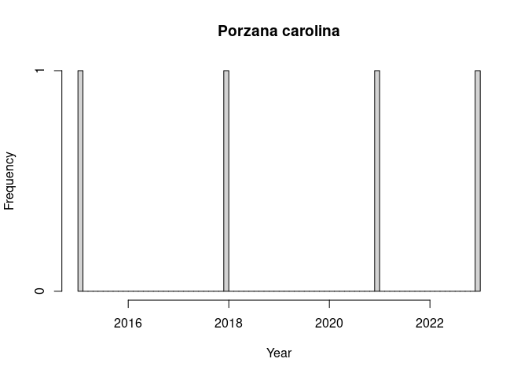<!-- -->

    ##                species     eventDate   
    ##  Fulica americana  :39   Min.   :2000  
    ##  Acanthis flammea  : 0   1st Qu.:2015  
    ##  Accipiter cooperii: 0   Median :2017  
    ##  Accipiter gentilis: 0   Mean   :2016  
    ##  Accipiter striatus: 0   3rd Qu.:2019  
    ##  Actitis macularius: 0   Max.   :2021  
    ##  (Other)           : 0

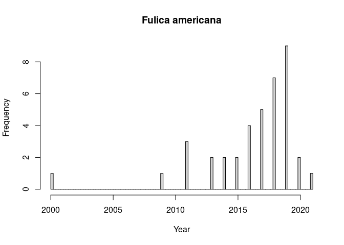<!-- -->

    ##                 species     eventDate   
    ##  Antigone canadensis:18   Min.   :2009  
    ##  Acanthis flammea   : 0   1st Qu.:2016  
    ##  Accipiter cooperii : 0   Median :2019  
    ##  Accipiter gentilis : 0   Mean   :2019  
    ##  Accipiter striatus : 0   3rd Qu.:2022  
    ##  Actitis macularius : 0   Max.   :2022  
    ##  (Other)            : 0

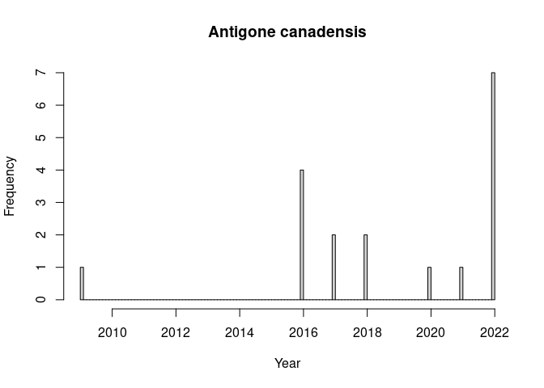<!-- -->

    ##                     species    eventDate   
    ##  Recurvirostra americana:5   Min.   :1981  
    ##  Acanthis flammea       :0   1st Qu.:2011  
    ##  Accipiter cooperii     :0   Median :2018  
    ##  Accipiter gentilis     :0   Mean   :2010  
    ##  Accipiter striatus     :0   3rd Qu.:2019  
    ##  Actitis macularius     :0   Max.   :2022  
    ##  (Other)                :0

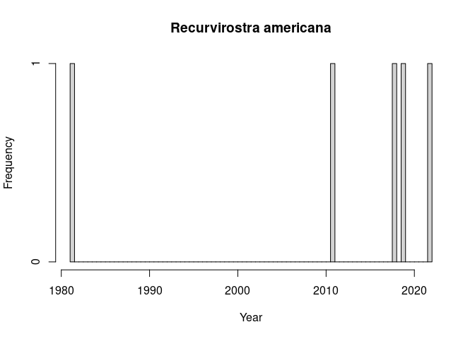<!-- -->

    ##                  species      eventDate   
    ##  Charadrius vociferus:170   Min.   :1975  
    ##  Acanthis flammea    :  0   1st Qu.:2016  
    ##  Accipiter cooperii  :  0   Median :2019  
    ##  Accipiter gentilis  :  0   Mean   :2017  
    ##  Accipiter striatus  :  0   3rd Qu.:2021  
    ##  Actitis macularius  :  0   Max.   :2023  
    ##  (Other)             :  0

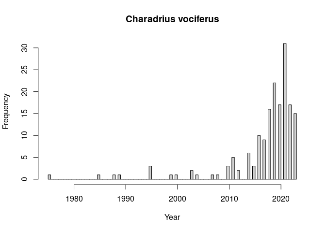<!-- -->

    ##                  species      eventDate   
    ##  Bartramia longicauda:102   Min.   :1985  
    ##  Acanthis flammea    :  0   1st Qu.:2016  
    ##  Accipiter cooperii  :  0   Median :2019  
    ##  Accipiter gentilis  :  0   Mean   :2017  
    ##  Accipiter striatus  :  0   3rd Qu.:2021  
    ##  Actitis macularius  :  0   Max.   :2023  
    ##  (Other)             :  0

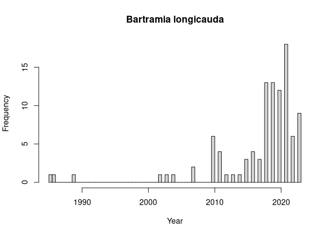<!-- -->

    ##                 species     eventDate   
    ##  Numenius americanus:32   Min.   :1986  
    ##  Acanthis flammea   : 0   1st Qu.:2015  
    ##  Accipiter cooperii : 0   Median :2020  
    ##  Accipiter gentilis : 0   Mean   :2017  
    ##  Accipiter striatus : 0   3rd Qu.:2021  
    ##  Actitis macularius : 0   Max.   :2023  
    ##  (Other)            : 0

<!-- -->

    ##                species    eventDate   
    ##  Limosa fedoa      :4   Min.   :2011  
    ##  Acanthis flammea  :0   1st Qu.:2013  
    ##  Accipiter cooperii:0   Median :2018  
    ##  Accipiter gentilis:0   Mean   :2017  
    ##  Accipiter striatus:0   3rd Qu.:2022  
    ##  Actitis macularius:0   Max.   :2023  
    ##  (Other)           :0

<!-- -->

    ##                species    eventDate   
    ##  Calidris bairdii  :4   Min.   :2011  
    ##  Acanthis flammea  :0   1st Qu.:2016  
    ##  Accipiter cooperii:0   Median :2020  
    ##  Accipiter gentilis:0   Mean   :2018  
    ##  Accipiter striatus:0   3rd Qu.:2022  
    ##  Actitis macularius:0   Max.   :2022  
    ##  (Other)           :0

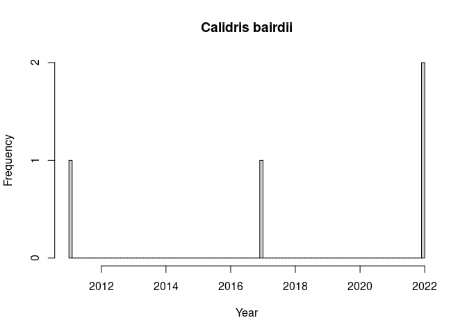<!-- -->

    ##                species    eventDate   
    ##  Calidris minutilla:2   Min.   :2021  
    ##  Acanthis flammea  :0   1st Qu.:2021  
    ##  Accipiter cooperii:0   Median :2022  
    ##  Accipiter gentilis:0   Mean   :2022  
    ##  Accipiter striatus:0   3rd Qu.:2022  
    ##  Actitis macularius:0   Max.   :2022  
    ##  (Other)           :0

<!-- -->

    ##                species    eventDate   
    ##  Calidris melanotos:1   Min.   :2022  
    ##  Acanthis flammea  :0   1st Qu.:2022  
    ##  Accipiter cooperii:0   Median :2022  
    ##  Accipiter gentilis:0   Mean   :2022  
    ##  Accipiter striatus:0   3rd Qu.:2022  
    ##  Actitis macularius:0   Max.   :2022  
    ##  (Other)           :0

<!-- -->

    ##                species    eventDate   
    ##  Calidris pusilla  :1   Min.   :2022  
    ##  Acanthis flammea  :0   1st Qu.:2022  
    ##  Accipiter cooperii:0   Median :2022  
    ##  Accipiter gentilis:0   Mean   :2022  
    ##  Accipiter striatus:0   3rd Qu.:2022  
    ##  Actitis macularius:0   Max.   :2022  
    ##  (Other)           :0

<!-- -->

    ##                     species    eventDate   
    ##  Limnodromus scolopaceus:1   Min.   :2013  
    ##  Acanthis flammea       :0   1st Qu.:2013  
    ##  Accipiter cooperii     :0   Median :2013  
    ##  Accipiter gentilis     :0   Mean   :2013  
    ##  Accipiter striatus     :0   3rd Qu.:2013  
    ##  Actitis macularius     :0   Max.   :2013  
    ##  (Other)                :0

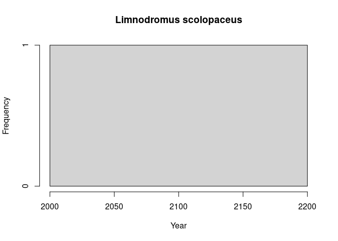<!-- -->

    ##                species     eventDate   
    ##  Gallinago delicata:10   Min.   :2014  
    ##  Acanthis flammea  : 0   1st Qu.:2018  
    ##  Accipiter cooperii: 0   Median :2020  
    ##  Accipiter gentilis: 0   Mean   :2019  
    ##  Accipiter striatus: 0   3rd Qu.:2021  
    ##  Actitis macularius: 0   Max.   :2021  
    ##  (Other)           : 0

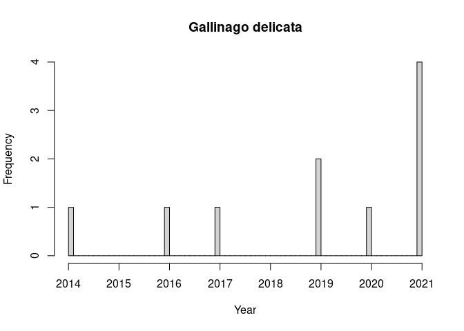<!-- -->

    ##                 species     eventDate   
    ##  Phalaropus tricolor:31   Min.   :2011  
    ##  Acanthis flammea   : 0   1st Qu.:2018  
    ##  Accipiter cooperii : 0   Median :2019  
    ##  Accipiter gentilis : 0   Mean   :2019  
    ##  Accipiter striatus : 0   3rd Qu.:2021  
    ##  Actitis macularius : 0   Max.   :2023  
    ##  (Other)            : 0

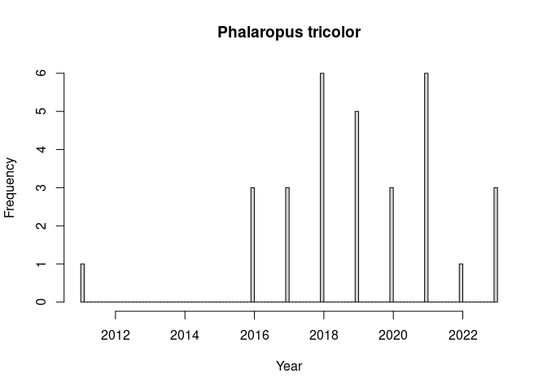<!-- -->

    ##                species    eventDate   
    ##  Phalaropus lobatus:2   Min.   :2018  
    ##  Acanthis flammea  :0   1st Qu.:2019  
    ##  Accipiter cooperii:0   Median :2020  
    ##  Accipiter gentilis:0   Mean   :2020  
    ##  Accipiter striatus:0   3rd Qu.:2022  
    ##  Actitis macularius:0   Max.   :2023  
    ##  (Other)           :0

<!-- -->

    ##                  species     eventDate   
    ##  Actitis macularius  :32   Min.   :1987  
    ##  Acanthis flammea    : 0   1st Qu.:2014  
    ##  Accipiter cooperii  : 0   Median :2018  
    ##  Accipiter gentilis  : 0   Mean   :2016  
    ##  Accipiter striatus  : 0   3rd Qu.:2021  
    ##  Aechmophorus clarkii: 0   Max.   :2022  
    ##  (Other)             : 0

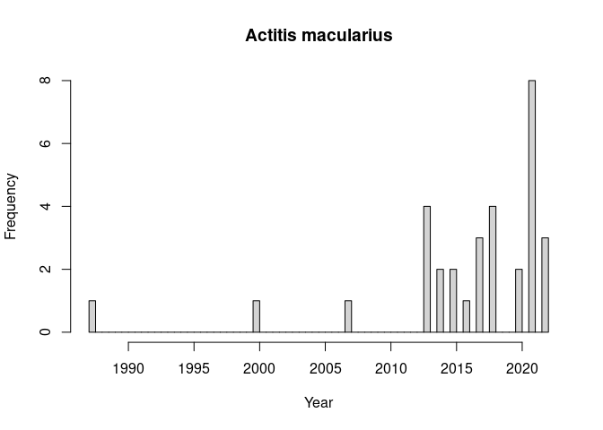<!-- -->

    ##                species    eventDate   
    ##  Tringa solitaria  :4   Min.   :2015  
    ##  Acanthis flammea  :0   1st Qu.:2016  
    ##  Accipiter cooperii:0   Median :2020  
    ##  Accipiter gentilis:0   Mean   :2019  
    ##  Accipiter striatus:0   3rd Qu.:2022  
    ##  Actitis macularius:0   Max.   :2023  
    ##  (Other)           :0

<!-- -->

    ##                species    eventDate   
    ##  Tringa melanoleuca:5   Min.   :2011  
    ##  Acanthis flammea  :0   1st Qu.:2020  
    ##  Accipiter cooperii:0   Median :2021  
    ##  Accipiter gentilis:0   Mean   :2019  
    ##  Accipiter striatus:0   3rd Qu.:2021  
    ##  Actitis macularius:0   Max.   :2022  
    ##  (Other)           :0

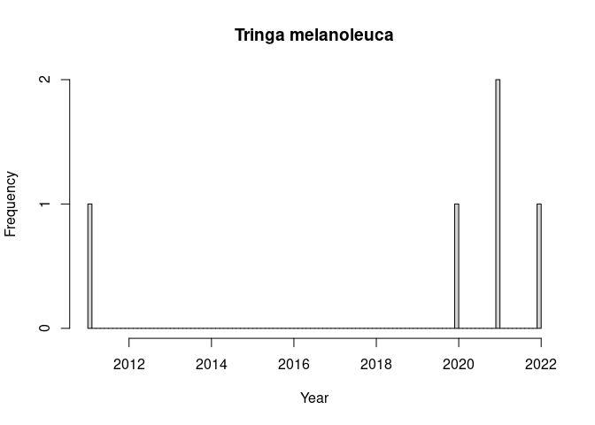<!-- -->

    ##                species    eventDate   
    ##  Tringa flavipes   :5   Min.   :2000  
    ##  Acanthis flammea  :0   1st Qu.:2018  
    ##  Accipiter cooperii:0   Median :2019  
    ##  Accipiter gentilis:0   Mean   :2016  
    ##  Accipiter striatus:0   3rd Qu.:2020  
    ##  Actitis macularius:0   Max.   :2022  
    ##  (Other)           :0

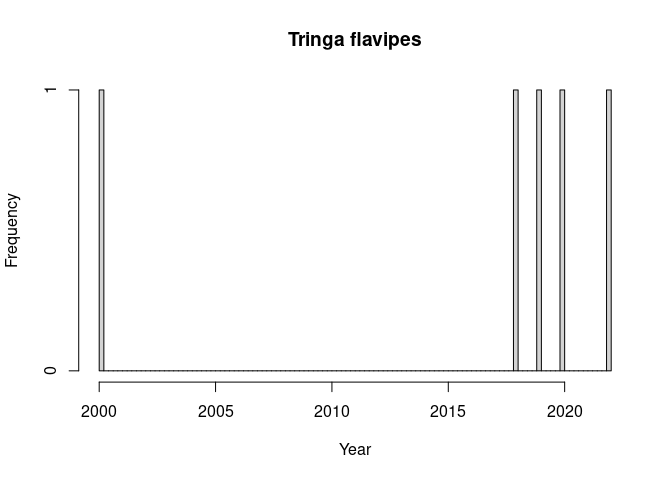<!-- -->

    ##                  species    eventDate   
    ##  Leucophaeus pipixcan:2   Min.   :1985  
    ##  Acanthis flammea    :0   1st Qu.:1993  
    ##  Accipiter cooperii  :0   Median :2000  
    ##  Accipiter gentilis  :0   Mean   :2000  
    ##  Accipiter striatus  :0   3rd Qu.:2008  
    ##  Actitis macularius  :0   Max.   :2016  
    ##  (Other)             :0

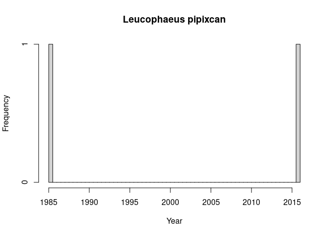<!-- -->

    ##                species    eventDate   
    ##  Larus delawarensis:3   Min.   :1985  
    ##  Acanthis flammea  :0   1st Qu.:2004  
    ##  Accipiter cooperii:0   Median :2022  
    ##  Accipiter gentilis:0   Mean   :2010  
    ##  Accipiter striatus:0   3rd Qu.:2022  
    ##  Actitis macularius:0   Max.   :2022  
    ##  (Other)           :0

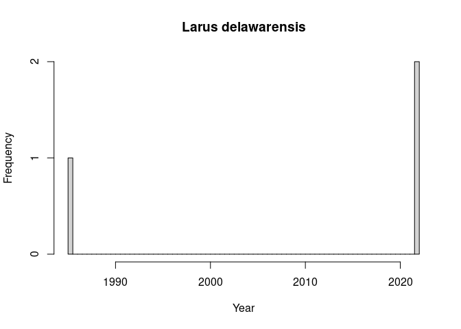<!-- -->

    ##                species    eventDate   
    ##  Chlidonias niger  :1   Min.   :2003  
    ##  Acanthis flammea  :0   1st Qu.:2003  
    ##  Accipiter cooperii:0   Median :2003  
    ##  Accipiter gentilis:0   Mean   :2003  
    ##  Accipiter striatus:0   3rd Qu.:2003  
    ##  Actitis macularius:0   Max.   :2003  
    ##  (Other)           :0

<!-- -->

    ##                species    eventDate   
    ##  Gavia immer       :1   Min.   :2018  
    ##  Acanthis flammea  :0   1st Qu.:2018  
    ##  Accipiter cooperii:0   Median :2018  
    ##  Accipiter gentilis:0   Mean   :2018  
    ##  Accipiter striatus:0   3rd Qu.:2018  
    ##  Actitis macularius:0   Max.   :2018  
    ##  (Other)           :0

<!-- -->

    ##                 species     eventDate   
    ##  Nannopterum auritum:14   Min.   :1984  
    ##  Acanthis flammea   : 0   1st Qu.:2015  
    ##  Accipiter cooperii : 0   Median :2018  
    ##  Accipiter gentilis : 0   Mean   :2014  
    ##  Accipiter striatus : 0   3rd Qu.:2021  
    ##  Actitis macularius : 0   Max.   :2023  
    ##  (Other)            : 0

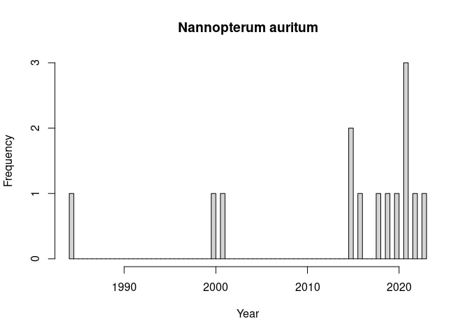<!-- -->

    ##                       species    eventDate   
    ##  Pelecanus erythrorhynchos:5   Min.   :2000  
    ##  Acanthis flammea         :0   1st Qu.:2018  
    ##  Accipiter cooperii       :0   Median :2019  
    ##  Accipiter gentilis       :0   Mean   :2016  
    ##  Accipiter striatus       :0   3rd Qu.:2020  
    ##  Actitis macularius       :0   Max.   :2022  
    ##  (Other)                  :0

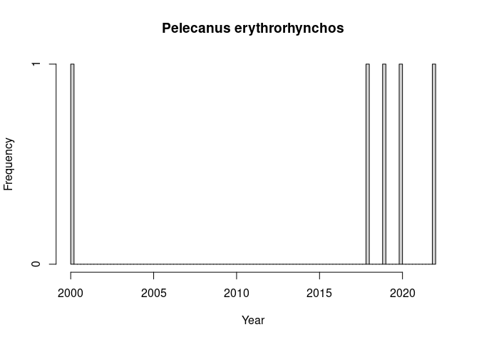<!-- -->

    ##                   species    eventDate   
    ##  Botaurus lentiginosus:1   Min.   :1984  
    ##  Acanthis flammea     :0   1st Qu.:1984  
    ##  Accipiter cooperii   :0   Median :1984  
    ##  Accipiter gentilis   :0   Mean   :1984  
    ##  Accipiter striatus   :0   3rd Qu.:1984  
    ##  Actitis macularius   :0   Max.   :1984  
    ##  (Other)              :0

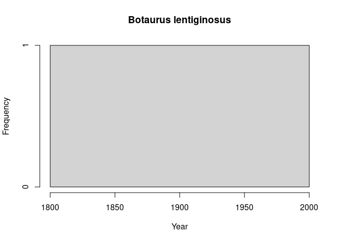<!-- -->

    ##                species     eventDate   
    ##  Ardea herodias    :95   Min.   :1986  
    ##  Acanthis flammea  : 0   1st Qu.:2017  
    ##  Accipiter cooperii: 0   Median :2020  
    ##  Accipiter gentilis: 0   Mean   :2018  
    ##  Accipiter striatus: 0   3rd Qu.:2021  
    ##  Actitis macularius: 0   Max.   :2023  
    ##  (Other)           : 0

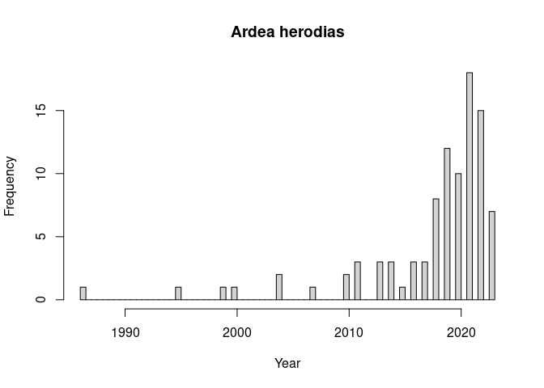<!-- -->

    ##                species    eventDate   
    ##  Ardea alba        :1   Min.   :2021  
    ##  Acanthis flammea  :0   1st Qu.:2021  
    ##  Accipiter cooperii:0   Median :2021  
    ##  Accipiter gentilis:0   Mean   :2021  
    ##  Accipiter striatus:0   3rd Qu.:2021  
    ##  Actitis macularius:0   Max.   :2021  
    ##  (Other)           :0

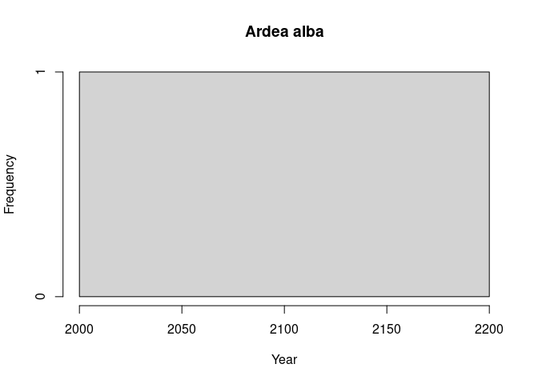<!-- -->

    ##                species    eventDate   
    ##  Bubulcus ibis     :1   Min.   :2014  
    ##  Acanthis flammea  :0   1st Qu.:2014  
    ##  Accipiter cooperii:0   Median :2014  
    ##  Accipiter gentilis:0   Mean   :2014  
    ##  Accipiter striatus:0   3rd Qu.:2014  
    ##  Actitis macularius:0   Max.   :2014  
    ##  (Other)           :0

<!-- -->

    ##                   species    eventDate   
    ##  Nycticorax nycticorax:7   Min.   :1984  
    ##  Acanthis flammea     :0   1st Qu.:2012  
    ##  Accipiter cooperii   :0   Median :2014  
    ##  Accipiter gentilis   :0   Mean   :2012  
    ##  Accipiter striatus   :0   3rd Qu.:2021  
    ##  Actitis macularius   :0   Max.   :2022  
    ##  (Other)              :0

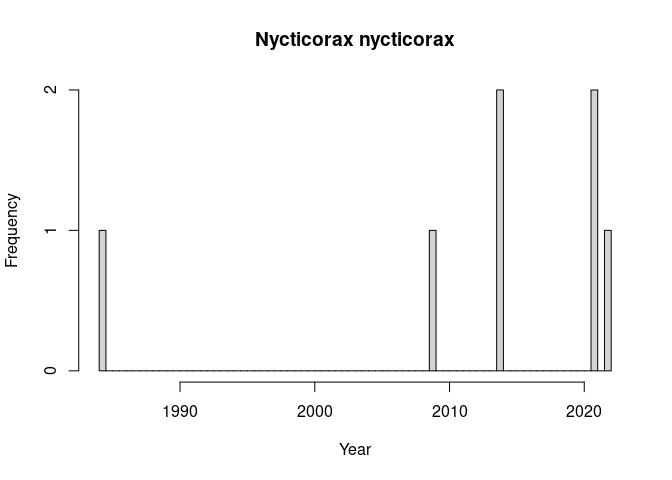<!-- -->

    ##                species    eventDate   
    ##  Plegadis chihi    :2   Min.   :2018  
    ##  Acanthis flammea  :0   1st Qu.:2019  
    ##  Accipiter cooperii:0   Median :2020  
    ##  Accipiter gentilis:0   Mean   :2020  
    ##  Accipiter striatus:0   3rd Qu.:2021  
    ##  Actitis macularius:0   Max.   :2022  
    ##  (Other)           :0

<!-- -->

    ##                species      eventDate   
    ##  Cathartes aura    :514   Min.   :1986  
    ##  Acanthis flammea  :  0   1st Qu.:2015  
    ##  Accipiter cooperii:  0   Median :2018  
    ##  Accipiter gentilis:  0   Mean   :2017  
    ##  Accipiter striatus:  0   3rd Qu.:2021  
    ##  Actitis macularius:  0   Max.   :2023  
    ##  (Other)           :  0

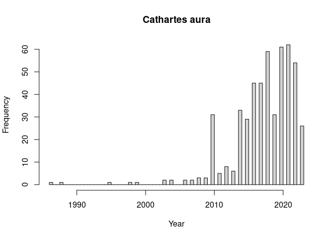<!-- -->

    ##                species     eventDate   
    ##  Pandion haliaetus :23   Min.   :2010  
    ##  Acanthis flammea  : 0   1st Qu.:2014  
    ##  Accipiter cooperii: 0   Median :2016  
    ##  Accipiter gentilis: 0   Mean   :2016  
    ##  Accipiter striatus: 0   3rd Qu.:2020  
    ##  Actitis macularius: 0   Max.   :2022  
    ##  (Other)           : 0

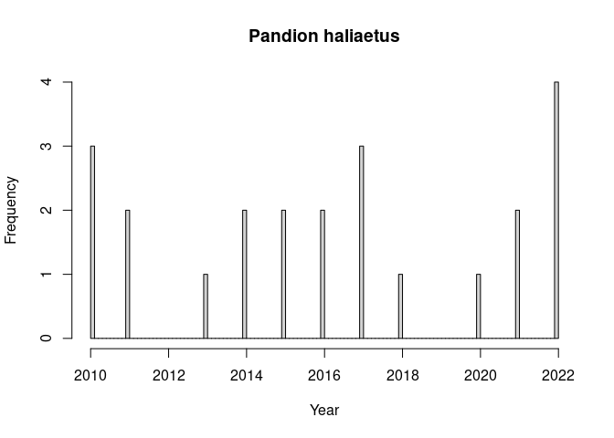<!-- -->

    ##                species     eventDate   
    ##  Aquila chrysaetos :65   Min.   :1986  
    ##  Acanthis flammea  : 0   1st Qu.:2017  
    ##  Accipiter cooperii: 0   Median :2020  
    ##  Accipiter gentilis: 0   Mean   :2018  
    ##  Accipiter striatus: 0   3rd Qu.:2021  
    ##  Actitis macularius: 0   Max.   :2023  
    ##  (Other)           : 0

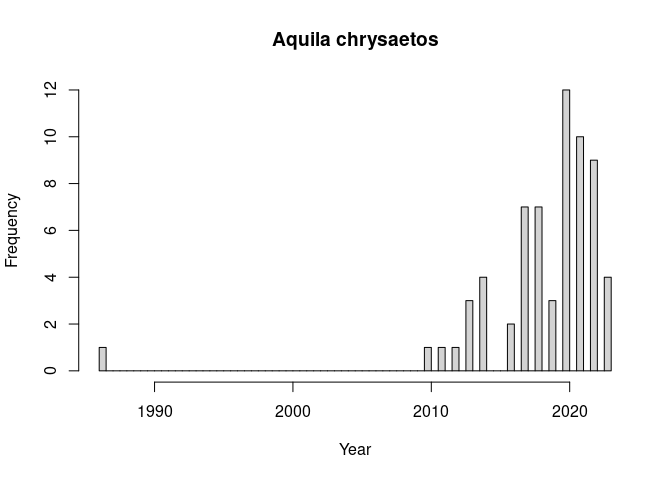<!-- -->

    ##                species     eventDate   
    ##  Circus hudsonius  :49   Min.   :1999  
    ##  Acanthis flammea  : 0   1st Qu.:2015  
    ##  Accipiter cooperii: 0   Median :2018  
    ##  Accipiter gentilis: 0   Mean   :2017  
    ##  Accipiter striatus: 0   3rd Qu.:2021  
    ##  Actitis macularius: 0   Max.   :2023  
    ##  (Other)           : 0

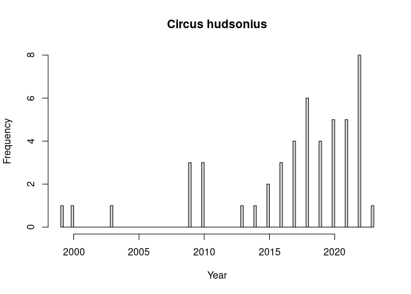<!-- -->

    ##                  species     eventDate   
    ##  Accipiter striatus  :25   Min.   :2009  
    ##  Acanthis flammea    : 0   1st Qu.:2014  
    ##  Accipiter cooperii  : 0   Median :2017  
    ##  Accipiter gentilis  : 0   Mean   :2016  
    ##  Actitis macularius  : 0   3rd Qu.:2020  
    ##  Aechmophorus clarkii: 0   Max.   :2022  
    ##  (Other)             : 0

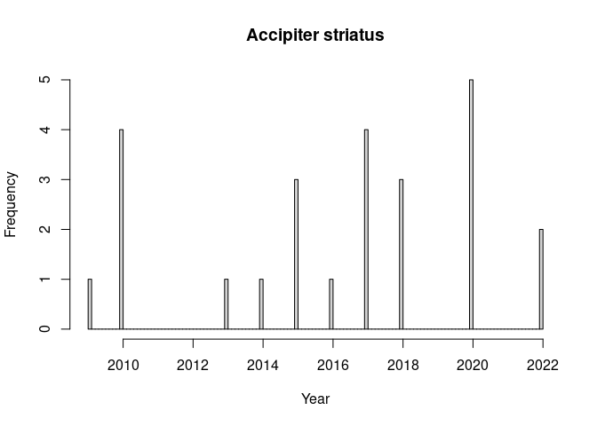<!-- -->

    ##                  species     eventDate   
    ##  Accipiter cooperii  :52   Min.   :1984  
    ##  Acanthis flammea    : 0   1st Qu.:2015  
    ##  Accipiter gentilis  : 0   Median :2018  
    ##  Accipiter striatus  : 0   Mean   :2017  
    ##  Actitis macularius  : 0   3rd Qu.:2021  
    ##  Aechmophorus clarkii: 0   Max.   :2023  
    ##  (Other)             : 0

<!-- -->

    ##                  species    eventDate   
    ##  Accipiter gentilis  :1   Min.   :1989  
    ##  Acanthis flammea    :0   1st Qu.:1989  
    ##  Accipiter cooperii  :0   Median :1989  
    ##  Accipiter striatus  :0   Mean   :1989  
    ##  Actitis macularius  :0   3rd Qu.:1989  
    ##  Aechmophorus clarkii:0   Max.   :1989  
    ##  (Other)             :0

<!-- -->

    ##                      species     eventDate   
    ##  Haliaeetus leucocephalus:20   Min.   :2014  
    ##  Acanthis flammea        : 0   1st Qu.:2017  
    ##  Accipiter cooperii      : 0   Median :2020  
    ##  Accipiter gentilis      : 0   Mean   :2019  
    ##  Accipiter striatus      : 0   3rd Qu.:2021  
    ##  Actitis macularius      : 0   Max.   :2022  
    ##  (Other)                 : 0

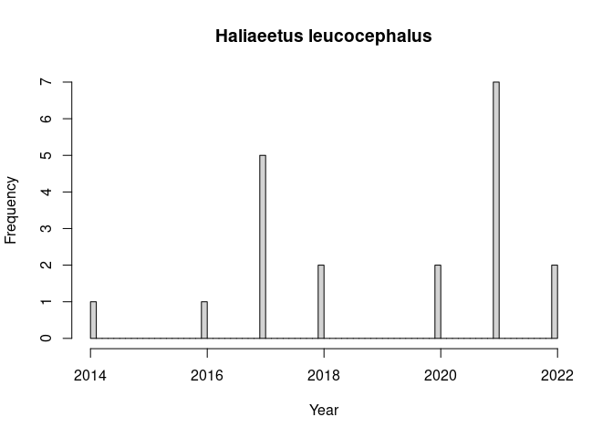<!-- -->

    ##                species    eventDate   
    ##  Buteo platypterus :5   Min.   :2015  
    ##  Acanthis flammea  :0   1st Qu.:2017  
    ##  Accipiter cooperii:0   Median :2017  
    ##  Accipiter gentilis:0   Mean   :2018  
    ##  Accipiter striatus:0   3rd Qu.:2019  
    ##  Actitis macularius:0   Max.   :2021  
    ##  (Other)           :0

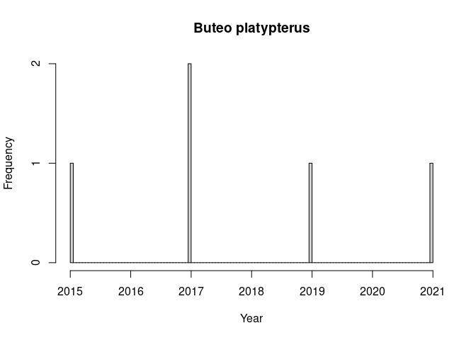<!-- -->

    ##                species     eventDate   
    ##  Buteo swainsoni   :75   Min.   :1981  
    ##  Acanthis flammea  : 0   1st Qu.:2010  
    ##  Accipiter cooperii: 0   Median :2017  
    ##  Accipiter gentilis: 0   Mean   :2014  
    ##  Accipiter striatus: 0   3rd Qu.:2020  
    ##  Actitis macularius: 0   Max.   :2023  
    ##  (Other)           : 0

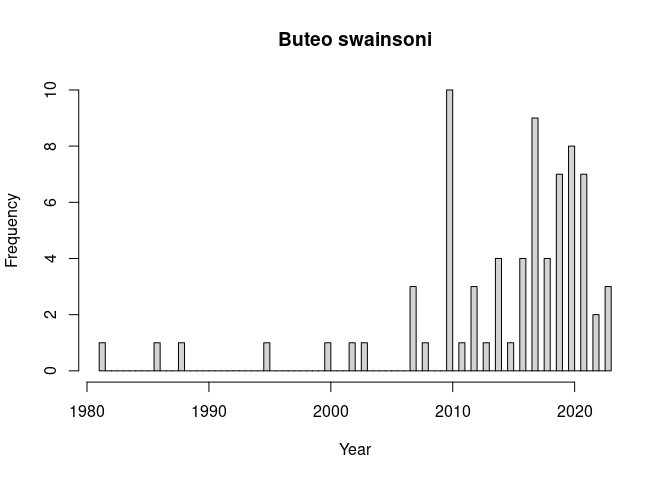<!-- -->

    ##                species      eventDate   
    ##  Buteo jamaicensis :344   Min.   :1984  
    ##  Acanthis flammea  :  0   1st Qu.:2016  
    ##  Accipiter cooperii:  0   Median :2018  
    ##  Accipiter gentilis:  0   Mean   :2017  
    ##  Accipiter striatus:  0   3rd Qu.:2020  
    ##  Actitis macularius:  0   Max.   :2023  
    ##  (Other)           :  0

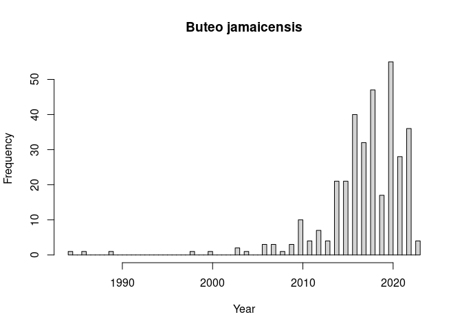<!-- -->

    ##                species     eventDate   
    ##  Buteo lagopus     :12   Min.   :2018  
    ##  Acanthis flammea  : 0   1st Qu.:2020  
    ##  Accipiter cooperii: 0   Median :2020  
    ##  Accipiter gentilis: 0   Mean   :2020  
    ##  Accipiter striatus: 0   3rd Qu.:2021  
    ##  Actitis macularius: 0   Max.   :2021  
    ##  (Other)           : 0

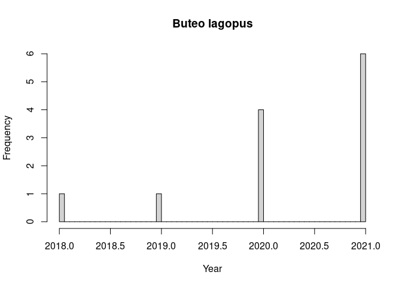<!-- -->

    ##                species     eventDate   
    ##  Buteo regalis     :19   Min.   :2010  
    ##  Acanthis flammea  : 0   1st Qu.:2016  
    ##  Accipiter cooperii: 0   Median :2020  
    ##  Accipiter gentilis: 0   Mean   :2018  
    ##  Accipiter striatus: 0   3rd Qu.:2021  
    ##  Actitis macularius: 0   Max.   :2023  
    ##  (Other)           : 0

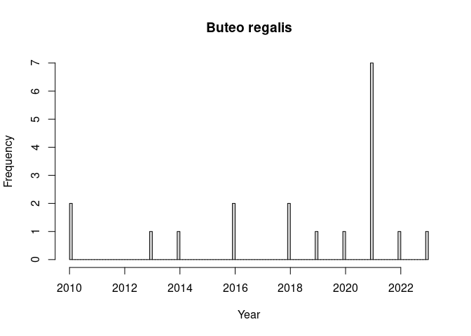<!-- -->

    ##                species    eventDate   
    ##  Tyto alba         :2   Min.   :2015  
    ##  Acanthis flammea  :0   1st Qu.:2015  
    ##  Accipiter cooperii:0   Median :2015  
    ##  Accipiter gentilis:0   Mean   :2015  
    ##  Accipiter striatus:0   3rd Qu.:2015  
    ##  Actitis macularius:0   Max.   :2015  
    ##  (Other)           :0

<!-- -->

    ##                species     eventDate   
    ##  Megascops asio    :30   Min.   :1984  
    ##  Acanthis flammea  : 0   1st Qu.:2016  
    ##  Accipiter cooperii: 0   Median :2018  
    ##  Accipiter gentilis: 0   Mean   :2016  
    ##  Accipiter striatus: 0   3rd Qu.:2021  
    ##  Actitis macularius: 0   Max.   :2023  
    ##  (Other)           : 0

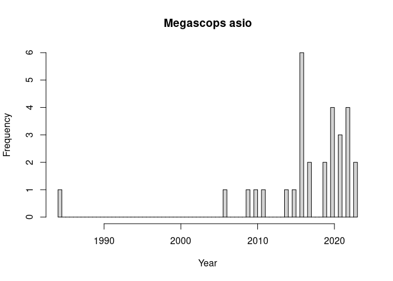<!-- -->

    ##                species    eventDate   
    ##  Bubo scandiacus   :1   Min.   :2021  
    ##  Acanthis flammea  :0   1st Qu.:2021  
    ##  Accipiter cooperii:0   Median :2021  
    ##  Accipiter gentilis:0   Mean   :2021  
    ##  Accipiter striatus:0   3rd Qu.:2021  
    ##  Actitis macularius:0   Max.   :2021  
    ##  (Other)           :0

<!-- -->

    ##                species      eventDate   
    ##  Bubo virginianus  :145   Min.   :1986  
    ##  Acanthis flammea  :  0   1st Qu.:2015  
    ##  Accipiter cooperii:  0   Median :2016  
    ##  Accipiter gentilis:  0   Mean   :2016  
    ##  Accipiter striatus:  0   3rd Qu.:2020  
    ##  Actitis macularius:  0   Max.   :2022  
    ##  (Other)           :  0

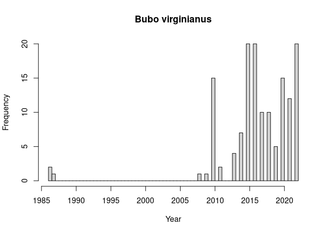<!-- -->

    ##                species     eventDate   
    ##  Athene cunicularia:19   Min.   :1984  
    ##  Acanthis flammea  : 0   1st Qu.:2015  
    ##  Accipiter cooperii: 0   Median :2019  
    ##  Accipiter gentilis: 0   Mean   :2016  
    ##  Accipiter striatus: 0   3rd Qu.:2022  
    ##  Actitis macularius: 0   Max.   :2023  
    ##  (Other)           : 0

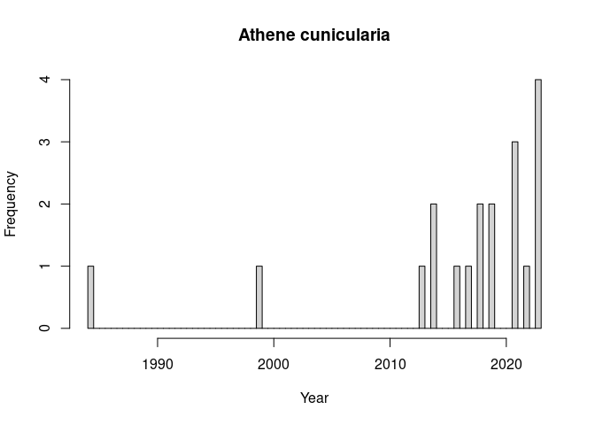<!-- -->

    ##                species    eventDate   
    ##  Strix varia       :1   Min.   :2016  
    ##  Acanthis flammea  :0   1st Qu.:2016  
    ##  Accipiter cooperii:0   Median :2016  
    ##  Accipiter gentilis:0   Mean   :2016  
    ##  Accipiter striatus:0   3rd Qu.:2016  
    ##  Actitis macularius:0   Max.   :2016  
    ##  (Other)           :0

<!-- -->

    ##                species    eventDate   
    ##  Asio flammeus     :8   Min.   :2004  
    ##  Acanthis flammea  :0   1st Qu.:2010  
    ##  Accipiter cooperii:0   Median :2015  
    ##  Accipiter gentilis:0   Mean   :2015  
    ##  Accipiter striatus:0   3rd Qu.:2020  
    ##  Actitis macularius:0   Max.   :2022  
    ##  (Other)           :0

<!-- -->

    ##                species    eventDate   
    ##  Aegolius acadicus :3   Min.   :2009  
    ##  Acanthis flammea  :0   1st Qu.:2014  
    ##  Accipiter cooperii:0   Median :2020  
    ##  Accipiter gentilis:0   Mean   :2017  
    ##  Accipiter striatus:0   3rd Qu.:2021  
    ##  Actitis macularius:0   Max.   :2022  
    ##  (Other)           :0

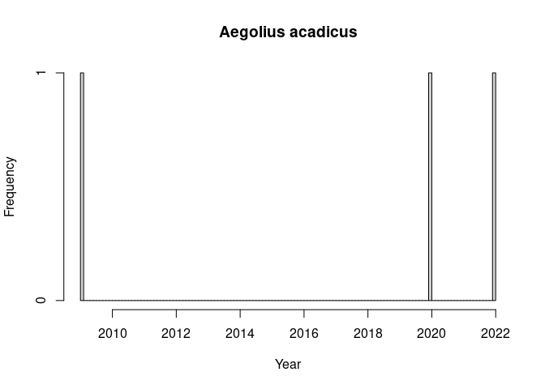<!-- -->

    ##                species      eventDate   
    ##  Megaceryle alcyon :109   Min.   :1986  
    ##  Acanthis flammea  :  0   1st Qu.:2016  
    ##  Accipiter cooperii:  0   Median :2019  
    ##  Accipiter gentilis:  0   Mean   :2016  
    ##  Accipiter striatus:  0   3rd Qu.:2021  
    ##  Actitis macularius:  0   Max.   :2023  
    ##  (Other)           :  0

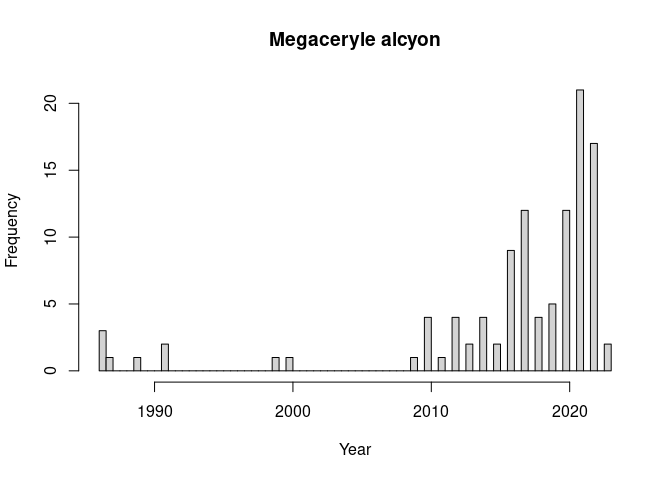<!-- -->

    ##                species    eventDate   
    ##  Sphyrapicus varius:1   Min.   :2009  
    ##  Acanthis flammea  :0   1st Qu.:2009  
    ##  Accipiter cooperii:0   Median :2009  
    ##  Accipiter gentilis:0   Mean   :2009  
    ##  Accipiter striatus:0   3rd Qu.:2009  
    ##  Actitis macularius:0   Max.   :2009  
    ##  (Other)           :0

<!-- -->

    ##                  species    eventDate   
    ##  Sphyrapicus nuchalis:1   Min.   :2014  
    ##  Acanthis flammea    :0   1st Qu.:2014  
    ##  Accipiter cooperii  :0   Median :2014  
    ##  Accipiter gentilis  :0   Mean   :2014  
    ##  Accipiter striatus  :0   3rd Qu.:2014  
    ##  Actitis macularius  :0   Max.   :2014  
    ##  (Other)             :0

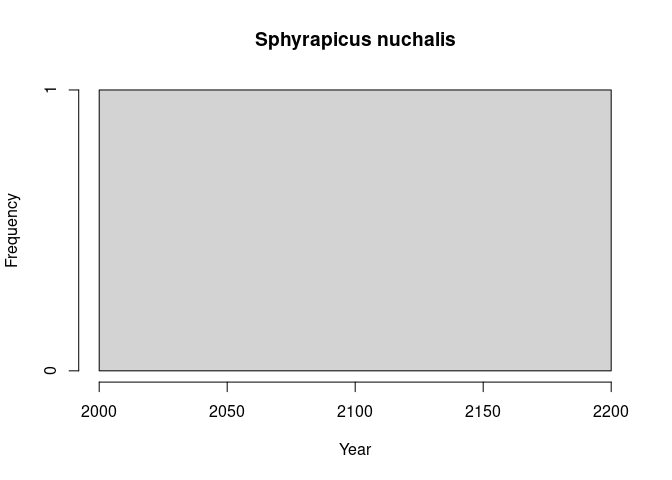<!-- -->

    ##                species     eventDate   
    ##  Melanerpes lewis  :20   Min.   :1980  
    ##  Acanthis flammea  : 0   1st Qu.:1988  
    ##  Accipiter cooperii: 0   Median :1998  
    ##  Accipiter gentilis: 0   Mean   :2000  
    ##  Accipiter striatus: 0   3rd Qu.:2015  
    ##  Actitis macularius: 0   Max.   :2022  
    ##  (Other)           : 0

<!-- -->

    ##                        species      eventDate   
    ##  Melanerpes erythrocephalus:516   Min.   :1985  
    ##  Acanthis flammea          :  0   1st Qu.:2017  
    ##  Accipiter cooperii        :  0   Median :2019  
    ##  Accipiter gentilis        :  0   Mean   :2018  
    ##  Accipiter striatus        :  0   3rd Qu.:2021  
    ##  Actitis macularius        :  0   Max.   :2023  
    ##  (Other)                   :  0

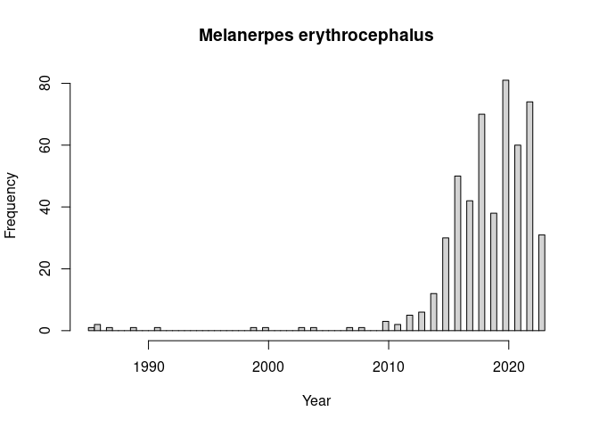<!-- -->

    ##                  species    eventDate   
    ##  Melanerpes carolinus:5   Min.   :2011  
    ##  Acanthis flammea    :0   1st Qu.:2013  
    ##  Accipiter cooperii  :0   Median :2014  
    ##  Accipiter gentilis  :0   Mean   :2014  
    ##  Accipiter striatus  :0   3rd Qu.:2015  
    ##  Actitis macularius  :0   Max.   :2017  
    ##  (Other)             :0

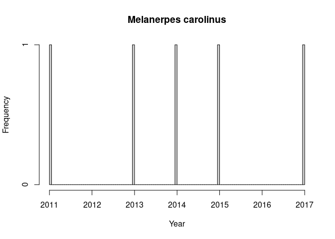<!-- -->

    ##                species    eventDate   
    ##  Picoides dorsalis :5   Min.   :2014  
    ##  Acanthis flammea  :0   1st Qu.:2014  
    ##  Accipiter cooperii:0   Median :2014  
    ##  Accipiter gentilis:0   Mean   :2014  
    ##  Accipiter striatus:0   3rd Qu.:2014  
    ##  Actitis macularius:0   Max.   :2014  
    ##  (Other)           :0

<!-- -->

    ##                 species      eventDate   
    ##  Dryobates pubescens:473   Min.   :1975  
    ##  Acanthis flammea   :  0   1st Qu.:2015  
    ##  Accipiter cooperii :  0   Median :2018  
    ##  Accipiter gentilis :  0   Mean   :2017  
    ##  Accipiter striatus :  0   3rd Qu.:2021  
    ##  Actitis macularius :  0   Max.   :2023  
    ##  (Other)            :  0

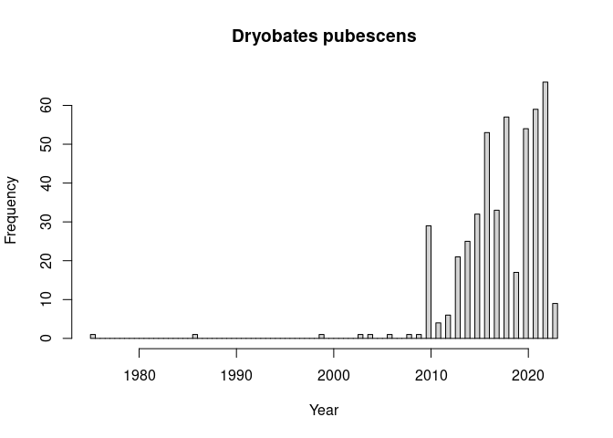<!-- -->

    ##                     species      eventDate   
    ##  Leuconotopicus villosus:530   Min.   :1975  
    ##  Acanthis flammea       :  0   1st Qu.:2015  
    ##  Accipiter cooperii     :  0   Median :2018  
    ##  Accipiter gentilis     :  0   Mean   :2017  
    ##  Accipiter striatus     :  0   3rd Qu.:2020  
    ##  Actitis macularius     :  0   Max.   :2023  
    ##  (Other)                :  0

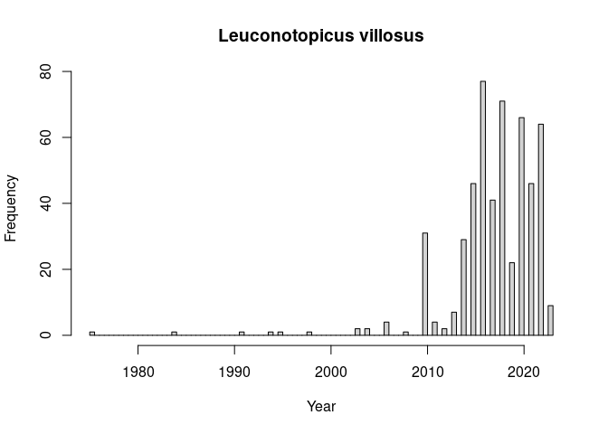<!-- -->

    ##                species      eventDate   
    ##  Colaptes auratus  :828   Min.   :1975  
    ##  Acanthis flammea  :  0   1st Qu.:2015  
    ##  Accipiter cooperii:  0   Median :2018  
    ##  Accipiter gentilis:  0   Mean   :2017  
    ##  Accipiter striatus:  0   3rd Qu.:2020  
    ##  Actitis macularius:  0   Max.   :2023  
    ##  (Other)           :  0

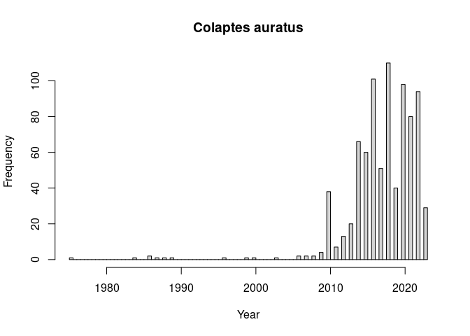<!-- -->

    ##                species      eventDate   
    ##  Falco sparverius  :336   Min.   :1985  
    ##  Acanthis flammea  :  0   1st Qu.:2016  
    ##  Accipiter cooperii:  0   Median :2019  
    ##  Accipiter gentilis:  0   Mean   :2018  
    ##  Accipiter striatus:  0   3rd Qu.:2021  
    ##  Actitis macularius:  0   Max.   :2023  
    ##  (Other)           :  0

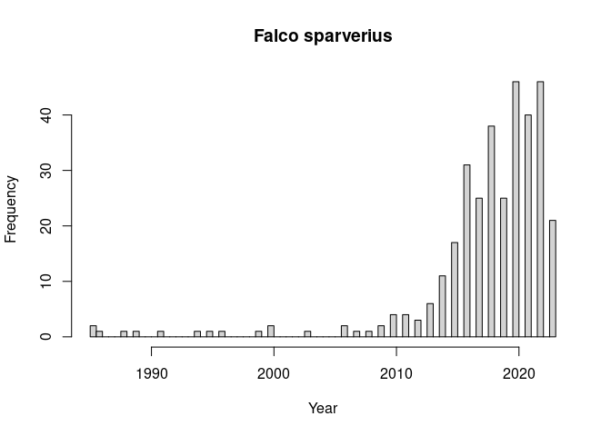<!-- -->

    ##                species    eventDate   
    ##  Falco columbarius :7   Min.   :2014  
    ##  Acanthis flammea  :0   1st Qu.:2016  
    ##  Accipiter cooperii:0   Median :2017  
    ##  Accipiter gentilis:0   Mean   :2018  
    ##  Accipiter striatus:0   3rd Qu.:2019  
    ##  Actitis macularius:0   Max.   :2022  
    ##  (Other)           :0

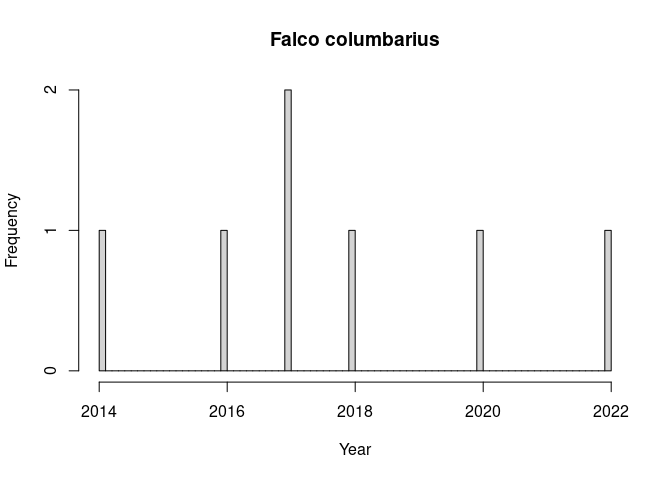<!-- -->

    ##                species    eventDate   
    ##  Falco peregrinus  :4   Min.   :2016  
    ##  Acanthis flammea  :0   1st Qu.:2016  
    ##  Accipiter cooperii:0   Median :2016  
    ##  Accipiter gentilis:0   Mean   :2017  
    ##  Accipiter striatus:0   3rd Qu.:2017  
    ##  Actitis macularius:0   Max.   :2020  
    ##  (Other)           :0

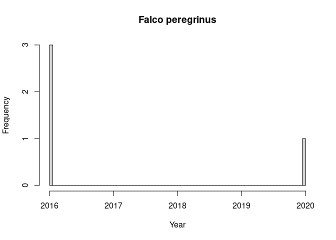<!-- -->

    ##                species     eventDate   
    ##  Falco mexicanus   :34   Min.   :1984  
    ##  Acanthis flammea  : 0   1st Qu.:2015  
    ##  Accipiter cooperii: 0   Median :2018  
    ##  Accipiter gentilis: 0   Mean   :2014  
    ##  Accipiter striatus: 0   3rd Qu.:2020  
    ##  Actitis macularius: 0   Max.   :2023  
    ##  (Other)           : 0

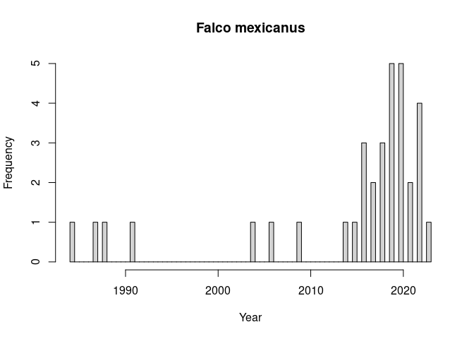<!-- -->

    ##                species    eventDate   
    ##  Contopus cooperi  :9   Min.   :2010  
    ##  Acanthis flammea  :0   1st Qu.:2015  
    ##  Accipiter cooperii:0   Median :2018  
    ##  Accipiter gentilis:0   Mean   :2018  
    ##  Accipiter striatus:0   3rd Qu.:2020  
    ##  Actitis macularius:0   Max.   :2023  
    ##  (Other)           :0

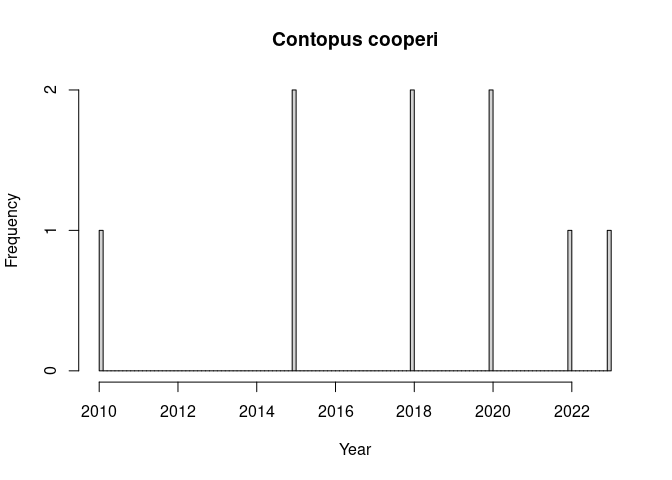<!-- -->

    ##                 species      eventDate   
    ##  Contopus sordidulus:468   Min.   :1971  
    ##  Acanthis flammea   :  0   1st Qu.:2016  
    ##  Accipiter cooperii :  0   Median :2019  
    ##  Accipiter gentilis :  0   Mean   :2017  
    ##  Accipiter striatus :  0   3rd Qu.:2021  
    ##  Actitis macularius :  0   Max.   :2023  
    ##  (Other)            :  0

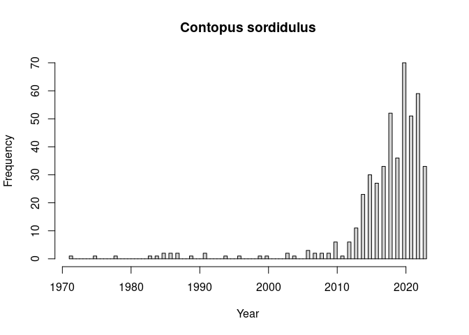<!-- -->

    ##                species    eventDate   
    ##  Contopus virens   :1   Min.   :2020  
    ##  Acanthis flammea  :0   1st Qu.:2020  
    ##  Accipiter cooperii:0   Median :2020  
    ##  Accipiter gentilis:0   Mean   :2020  
    ##  Accipiter striatus:0   3rd Qu.:2020  
    ##  Actitis macularius:0   Max.   :2020  
    ##  (Other)           :0

<!-- -->

    ##                species    eventDate   
    ##  Empidonax alnorum :2   Min.   :2021  
    ##  Acanthis flammea  :0   1st Qu.:2021  
    ##  Accipiter cooperii:0   Median :2022  
    ##  Accipiter gentilis:0   Mean   :2022  
    ##  Accipiter striatus:0   3rd Qu.:2022  
    ##  Actitis macularius:0   Max.   :2022  
    ##  (Other)           :0

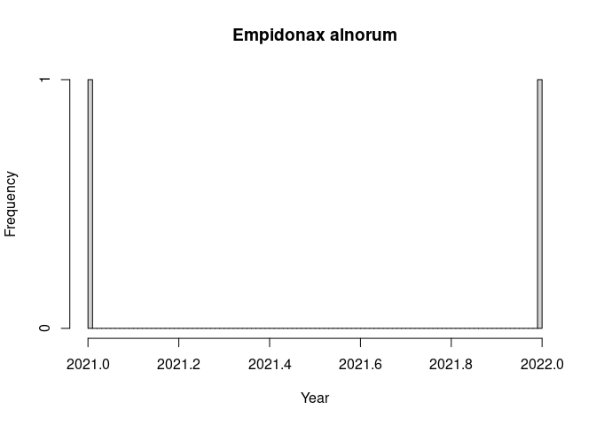<!-- -->

    ##                species     eventDate   
    ##  Empidonax traillii:23   Min.   :2010  
    ##  Acanthis flammea  : 0   1st Qu.:2018  
    ##  Accipiter cooperii: 0   Median :2020  
    ##  Accipiter gentilis: 0   Mean   :2019  
    ##  Accipiter striatus: 0   3rd Qu.:2022  
    ##  Actitis macularius: 0   Max.   :2023  
    ##  (Other)           : 0

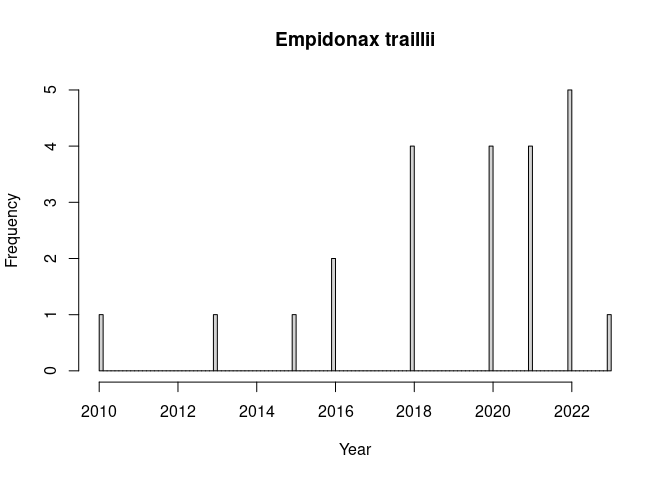<!-- -->

    ##                species     eventDate   
    ##  Empidonax minimus :38   Min.   :2007  
    ##  Acanthis flammea  : 0   1st Qu.:2016  
    ##  Accipiter cooperii: 0   Median :2018  
    ##  Accipiter gentilis: 0   Mean   :2017  
    ##  Accipiter striatus: 0   3rd Qu.:2020  
    ##  Actitis macularius: 0   Max.   :2023  
    ##  (Other)           : 0

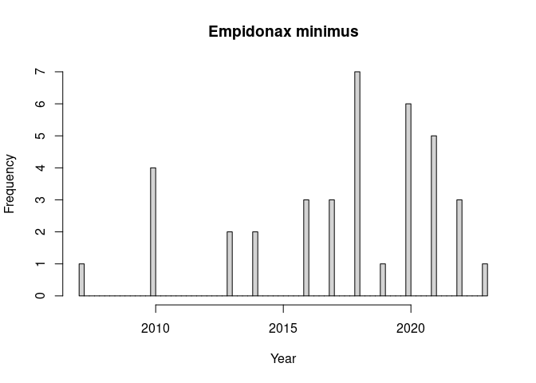<!-- -->

    ##                 species    eventDate   
    ##  Empidonax hammondii:4   Min.   :2020  
    ##  Acanthis flammea   :0   1st Qu.:2020  
    ##  Accipiter cooperii :0   Median :2021  
    ##  Accipiter gentilis :0   Mean   :2021  
    ##  Accipiter striatus :0   3rd Qu.:2022  
    ##  Actitis macularius :0   Max.   :2022  
    ##  (Other)            :0

<!-- -->

    ##                species    eventDate   
    ##  Empidonax wrightii:1   Min.   :2013  
    ##  Acanthis flammea  :0   1st Qu.:2013  
    ##  Accipiter cooperii:0   Median :2013  
    ##  Accipiter gentilis:0   Mean   :2013  
    ##  Accipiter striatus:0   3rd Qu.:2013  
    ##  Actitis macularius:0   Max.   :2013  
    ##  (Other)           :0

<!-- -->

    ##                   species    eventDate   
    ##  Empidonax oberholseri:5   Min.   :2013  
    ##  Acanthis flammea     :0   1st Qu.:2014  
    ##  Accipiter cooperii   :0   Median :2015  
    ##  Accipiter gentilis   :0   Mean   :2017  
    ##  Accipiter striatus   :0   3rd Qu.:2021  
    ##  Actitis macularius   :0   Max.   :2023  
    ##  (Other)              :0

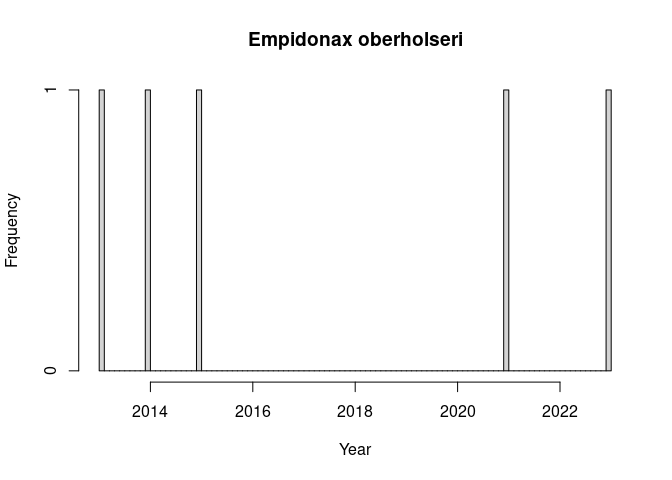<!-- -->

    ##                    species     eventDate   
    ##  Empidonax occidentalis:71   Min.   :1994  
    ##  Acanthis flammea      : 0   1st Qu.:2016  
    ##  Accipiter cooperii    : 0   Median :2020  
    ##  Accipiter gentilis    : 0   Mean   :2017  
    ##  Accipiter striatus    : 0   3rd Qu.:2021  
    ##  Actitis macularius    : 0   Max.   :2023  
    ##  (Other)               : 0

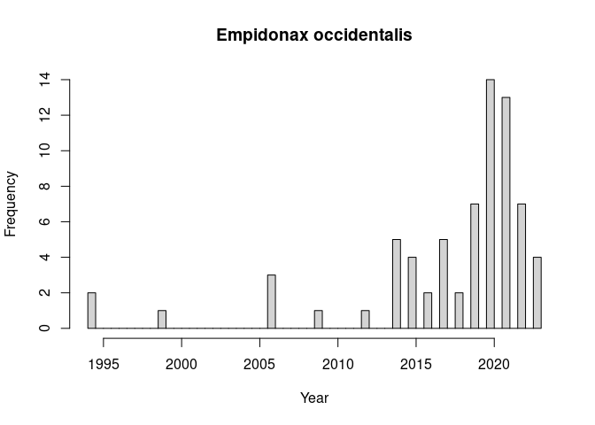<!-- -->

    ##                species      eventDate   
    ##  Sayornis phoebe   :150   Min.   :1991  
    ##  Acanthis flammea  :  0   1st Qu.:2015  
    ##  Accipiter cooperii:  0   Median :2018  
    ##  Accipiter gentilis:  0   Mean   :2017  
    ##  Accipiter striatus:  0   3rd Qu.:2020  
    ##  Actitis macularius:  0   Max.   :2023  
    ##  (Other)           :  0

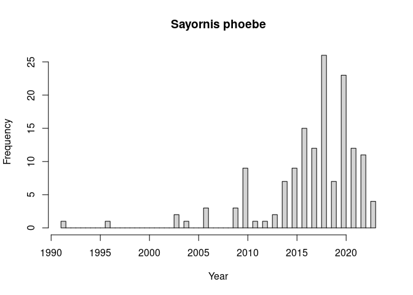<!-- -->

    ##                species      eventDate   
    ##  Sayornis saya     :124   Min.   :1982  
    ##  Acanthis flammea  :  0   1st Qu.:2014  
    ##  Accipiter cooperii:  0   Median :2018  
    ##  Accipiter gentilis:  0   Mean   :2016  
    ##  Accipiter striatus:  0   3rd Qu.:2021  
    ##  Actitis macularius:  0   Max.   :2023  
    ##  (Other)           :  0

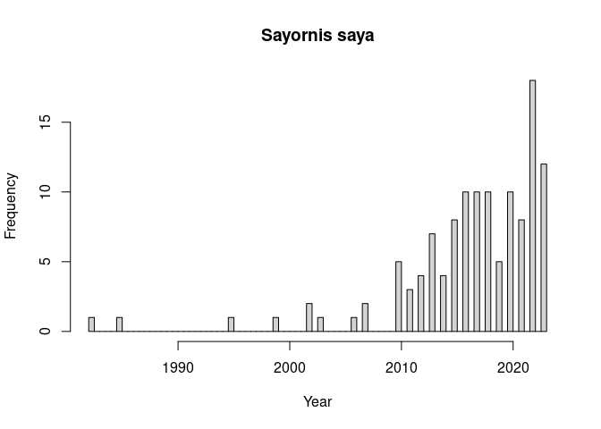<!-- -->

    ##                species      eventDate   
    ##  Myiarchus crinitus:212   Min.   :1986  
    ##  Acanthis flammea  :  0   1st Qu.:2016  
    ##  Accipiter cooperii:  0   Median :2019  
    ##  Accipiter gentilis:  0   Mean   :2018  
    ##  Accipiter striatus:  0   3rd Qu.:2021  
    ##  Actitis macularius:  0   Max.   :2023  
    ##  (Other)           :  0

<!-- -->

    ##                 species     eventDate   
    ##  Tyrannus vociferans:22   Min.   :1984  
    ##  Acanthis flammea   : 0   1st Qu.:2013  
    ##  Accipiter cooperii : 0   Median :2018  
    ##  Accipiter gentilis : 0   Mean   :2016  
    ##  Accipiter striatus : 0   3rd Qu.:2020  
    ##  Actitis macularius : 0   Max.   :2023  
    ##  (Other)            : 0

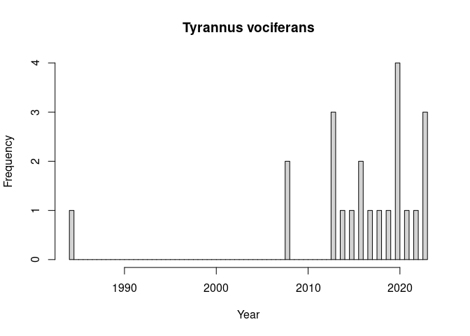<!-- -->

    ##                 species      eventDate   
    ##  Tyrannus verticalis:209   Min.   :1975  
    ##  Acanthis flammea   :  0   1st Qu.:2015  
    ##  Accipiter cooperii :  0   Median :2018  
    ##  Accipiter gentilis :  0   Mean   :2016  
    ##  Accipiter striatus :  0   3rd Qu.:2021  
    ##  Actitis macularius :  0   Max.   :2023  
    ##  (Other)            :  0

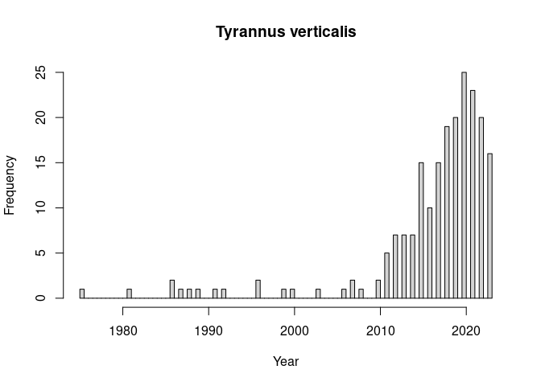<!-- -->

    ##                species      eventDate   
    ##  Tyrannus tyrannus :415   Min.   :1975  
    ##  Acanthis flammea  :  0   1st Qu.:2017  
    ##  Accipiter cooperii:  0   Median :2020  
    ##  Accipiter gentilis:  0   Mean   :2018  
    ##  Accipiter striatus:  0   3rd Qu.:2021  
    ##  Actitis macularius:  0   Max.   :2023  
    ##  (Other)           :  0

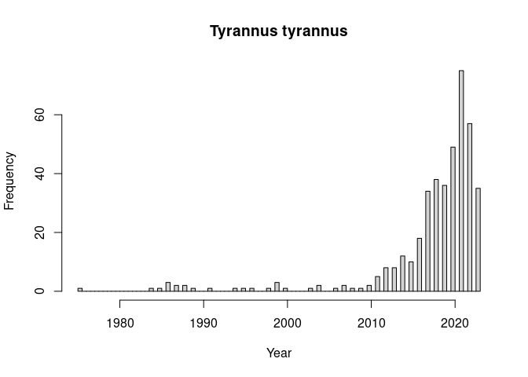<!-- -->

    ##                species     eventDate   
    ##  Vireo bellii      :16   Min.   :1984  
    ##  Acanthis flammea  : 0   1st Qu.:2015  
    ##  Accipiter cooperii: 0   Median :2018  
    ##  Accipiter gentilis: 0   Mean   :2015  
    ##  Accipiter striatus: 0   3rd Qu.:2020  
    ##  Actitis macularius: 0   Max.   :2023  
    ##  (Other)           : 0

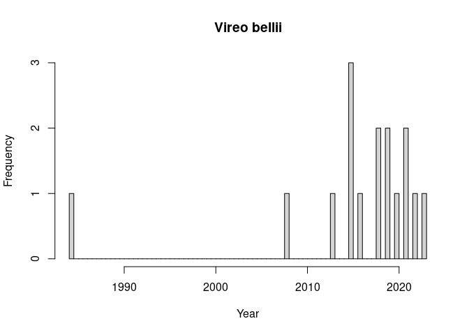<!-- -->

    ##                species    eventDate   
    ##  Vireo cassinii    :8   Min.   :2013  
    ##  Acanthis flammea  :0   1st Qu.:2014  
    ##  Accipiter cooperii:0   Median :2014  
    ##  Accipiter gentilis:0   Mean   :2015  
    ##  Accipiter striatus:0   3rd Qu.:2017  
    ##  Actitis macularius:0   Max.   :2018  
    ##  (Other)           :0

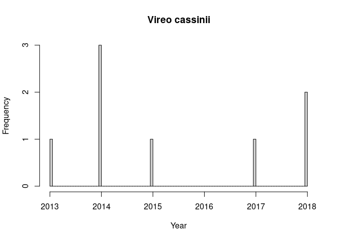<!-- -->

    ##                species    eventDate   
    ##  Vireo solitarius  :1   Min.   :2017  
    ##  Acanthis flammea  :0   1st Qu.:2017  
    ##  Accipiter cooperii:0   Median :2017  
    ##  Accipiter gentilis:0   Mean   :2017  
    ##  Accipiter striatus:0   3rd Qu.:2017  
    ##  Actitis macularius:0   Max.   :2017  
    ##  (Other)           :0

<!-- -->

    ##                species     eventDate   
    ##  Vireo plumbeus    :64   Min.   :2006  
    ##  Acanthis flammea  : 0   1st Qu.:2010  
    ##  Accipiter cooperii: 0   Median :2015  
    ##  Accipiter gentilis: 0   Mean   :2015  
    ##  Accipiter striatus: 0   3rd Qu.:2019  
    ##  Actitis macularius: 0   Max.   :2023  
    ##  (Other)           : 0

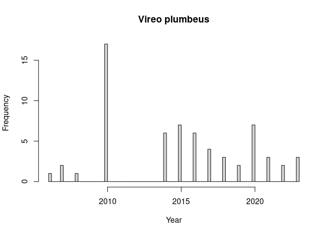<!-- -->

    ##                  species    eventDate   
    ##  Vireo philadelphicus:1   Min.   :2022  
    ##  Acanthis flammea    :0   1st Qu.:2022  
    ##  Accipiter cooperii  :0   Median :2022  
    ##  Accipiter gentilis  :0   Mean   :2022  
    ##  Accipiter striatus  :0   3rd Qu.:2022  
    ##  Actitis macularius  :0   Max.   :2022  
    ##  (Other)             :0

<!-- -->

    ##                species     eventDate   
    ##  Vireo gilvus      :60   Min.   :1986  
    ##  Acanthis flammea  : 0   1st Qu.:2016  
    ##  Accipiter cooperii: 0   Median :2019  
    ##  Accipiter gentilis: 0   Mean   :2017  
    ##  Accipiter striatus: 0   3rd Qu.:2021  
    ##  Actitis macularius: 0   Max.   :2023  
    ##  (Other)           : 0

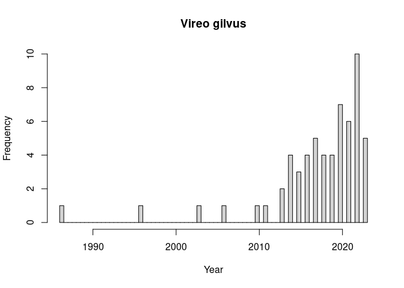<!-- -->

    ##                species      eventDate   
    ##  Vireo olivaceus   :253   Min.   :1975  
    ##  Acanthis flammea  :  0   1st Qu.:2016  
    ##  Accipiter cooperii:  0   Median :2020  
    ##  Accipiter gentilis:  0   Mean   :2017  
    ##  Accipiter striatus:  0   3rd Qu.:2021  
    ##  Actitis macularius:  0   Max.   :2023  
    ##  (Other)           :  0

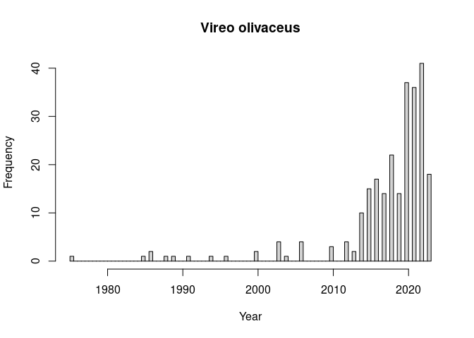<!-- -->

    ##                 species     eventDate   
    ##  Lanius ludovicianus:85   Min.   :1981  
    ##  Acanthis flammea   : 0   1st Qu.:2016  
    ##  Accipiter cooperii : 0   Median :2019  
    ##  Accipiter gentilis : 0   Mean   :2017  
    ##  Accipiter striatus : 0   3rd Qu.:2021  
    ##  Actitis macularius : 0   Max.   :2023  
    ##  (Other)            : 0

<!-- -->

    ##                species    eventDate   
    ##  Lanius borealis   :7   Min.   :2014  
    ##  Acanthis flammea  :0   1st Qu.:2015  
    ##  Accipiter cooperii:0   Median :2021  
    ##  Accipiter gentilis:0   Mean   :2018  
    ##  Accipiter striatus:0   3rd Qu.:2021  
    ##  Actitis macularius:0   Max.   :2021  
    ##  (Other)           :0

<!-- -->

    ##                       species     eventDate   
    ##  Gymnorhinus cyanocephalus:11   Min.   :1986  
    ##  Acanthis flammea         : 0   1st Qu.:1988  
    ##  Accipiter cooperii       : 0   Median :2017  
    ##  Accipiter gentilis       : 0   Mean   :2005  
    ##  Accipiter striatus       : 0   3rd Qu.:2020  
    ##  Actitis macularius       : 0   Max.   :2022  
    ##  (Other)                  : 0

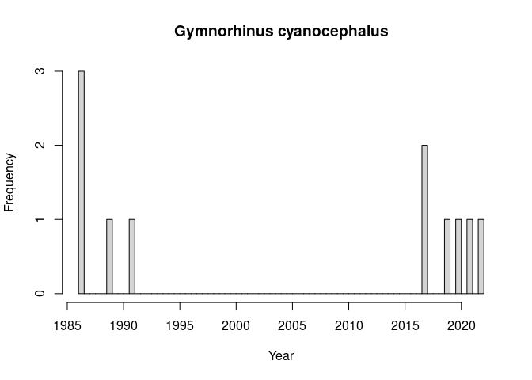<!-- -->

    ##                 species      eventDate   
    ##  Cyanocitta cristata:549   Min.   :1975  
    ##  Acanthis flammea   :  0   1st Qu.:2015  
    ##  Accipiter cooperii :  0   Median :2018  
    ##  Accipiter gentilis :  0   Mean   :2017  
    ##  Accipiter striatus :  0   3rd Qu.:2021  
    ##  Actitis macularius :  0   Max.   :2023  
    ##  (Other)            :  0

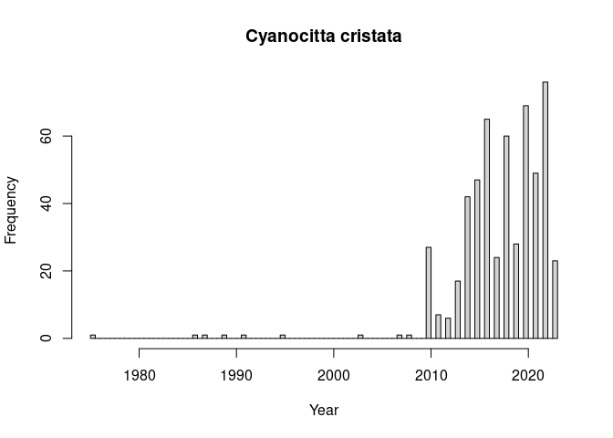<!-- -->

    ##                species     eventDate   
    ##  Pica hudsonia     :93   Min.   :1971  
    ##  Acanthis flammea  : 0   1st Qu.:2017  
    ##  Accipiter cooperii: 0   Median :2020  
    ##  Accipiter gentilis: 0   Mean   :2017  
    ##  Accipiter striatus: 0   3rd Qu.:2022  
    ##  Actitis macularius: 0   Max.   :2023  
    ##  (Other)           : 0

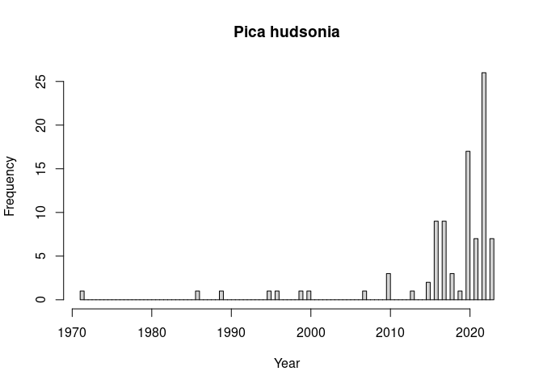<!-- -->

    ##                  species    eventDate   
    ##  Nucifraga columbiana:8   Min.   :2017  
    ##  Acanthis flammea    :0   1st Qu.:2017  
    ##  Accipiter cooperii  :0   Median :2017  
    ##  Accipiter gentilis  :0   Mean   :2017  
    ##  Accipiter striatus  :0   3rd Qu.:2017  
    ##  Actitis macularius  :0   Max.   :2017  
    ##  (Other)             :0

<!-- -->

    ##                   species      eventDate   
    ##  Corvus brachyrhynchos:686   Min.   :1975  
    ##  Acanthis flammea     :  0   1st Qu.:2015  
    ##  Accipiter cooperii   :  0   Median :2018  
    ##  Accipiter gentilis   :  0   Mean   :2017  
    ##  Accipiter striatus   :  0   3rd Qu.:2021  
    ##  Actitis macularius   :  0   Max.   :2023  
    ##  (Other)              :  0

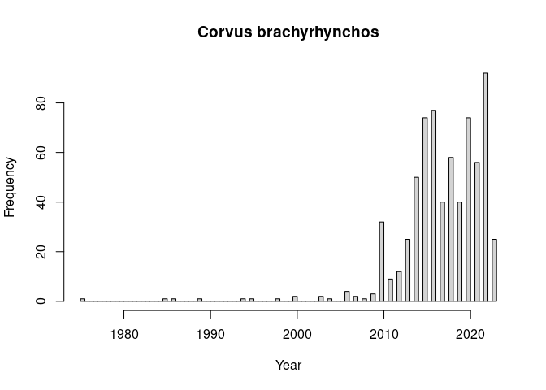<!-- -->

    ##                  species      eventDate   
    ##  Poecile atricapillus:972   Min.   :1971  
    ##  Acanthis flammea    :  0   1st Qu.:2015  
    ##  Accipiter cooperii  :  0   Median :2018  
    ##  Accipiter gentilis  :  0   Mean   :2017  
    ##  Accipiter striatus  :  0   3rd Qu.:2021  
    ##  Actitis macularius  :  0   Max.   :2023  
    ##  (Other)             :  0

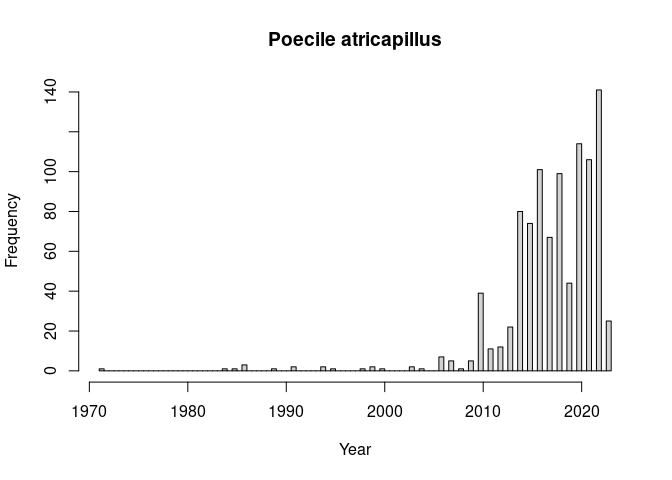<!-- -->

    ##                  species      eventDate   
    ##  Eremophila alpestris:152   Min.   :1946  
    ##  Acanthis flammea    :  0   1st Qu.:2016  
    ##  Accipiter cooperii  :  0   Median :2019  
    ##  Accipiter gentilis  :  0   Mean   :2015  
    ##  Accipiter striatus  :  0   3rd Qu.:2021  
    ##  Actitis macularius  :  0   Max.   :2023  
    ##  (Other)             :  0

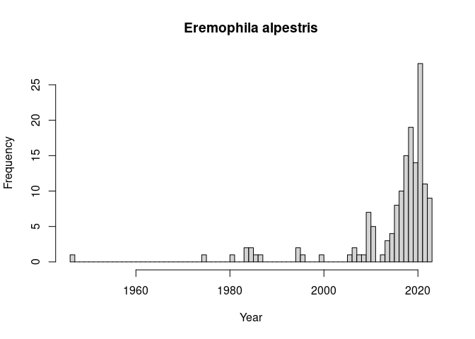<!-- -->

    ##                        species      eventDate   
    ##  Stelgidopteryx serripennis:110   Min.   :1975  
    ##  Acanthis flammea          :  0   1st Qu.:2013  
    ##  Accipiter cooperii        :  0   Median :2018  
    ##  Accipiter gentilis        :  0   Mean   :2016  
    ##  Accipiter striatus        :  0   3rd Qu.:2021  
    ##  Actitis macularius        :  0   Max.   :2023  
    ##  (Other)                   :  0

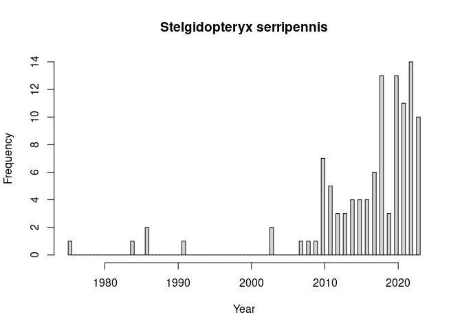<!-- -->

    ##                 species      eventDate   
    ##  Tachycineta bicolor:126   Min.   :1975  
    ##  Acanthis flammea   :  0   1st Qu.:2017  
    ##  Accipiter cooperii :  0   Median :2020  
    ##  Accipiter gentilis :  0   Mean   :2018  
    ##  Accipiter striatus :  0   3rd Qu.:2021  
    ##  Actitis macularius :  0   Max.   :2023  
    ##  (Other)            :  0

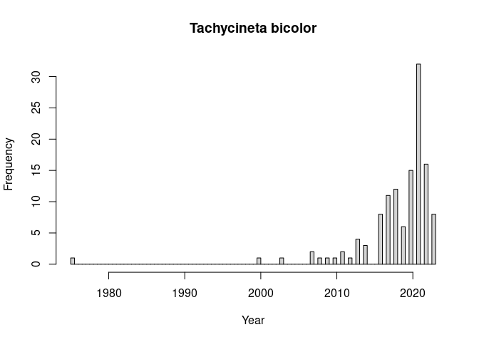<!-- -->

    ##                    species      eventDate   
    ##  Tachycineta thalassina:135   Min.   :1984  
    ##  Acanthis flammea      :  0   1st Qu.:2015  
    ##  Accipiter cooperii    :  0   Median :2018  
    ##  Accipiter gentilis    :  0   Mean   :2016  
    ##  Accipiter striatus    :  0   3rd Qu.:2021  
    ##  Actitis macularius    :  0   Max.   :2023  
    ##  (Other)               :  0

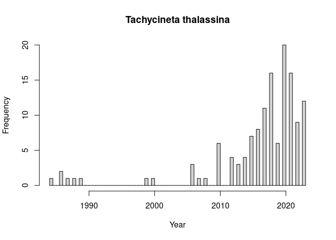<!-- -->

    ##                species     eventDate   
    ##  Riparia riparia   :15   Min.   :1975  
    ##  Acanthis flammea  : 0   1st Qu.:2014  
    ##  Accipiter cooperii: 0   Median :2019  
    ##  Accipiter gentilis: 0   Mean   :2015  
    ##  Accipiter striatus: 0   3rd Qu.:2021  
    ##  Actitis macularius: 0   Max.   :2022  
    ##  (Other)           : 0

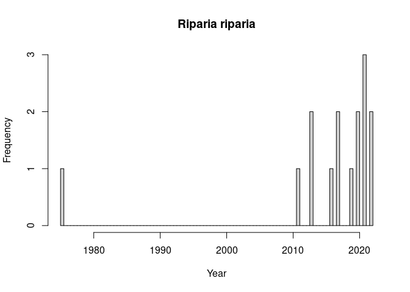<!-- -->

    ##                species      eventDate   
    ##  Hirundo rustica   :293   Min.   :1984  
    ##  Acanthis flammea  :  0   1st Qu.:2016  
    ##  Accipiter cooperii:  0   Median :2018  
    ##  Accipiter gentilis:  0   Mean   :2017  
    ##  Accipiter striatus:  0   3rd Qu.:2021  
    ##  Actitis macularius:  0   Max.   :2023  
    ##  (Other)           :  0

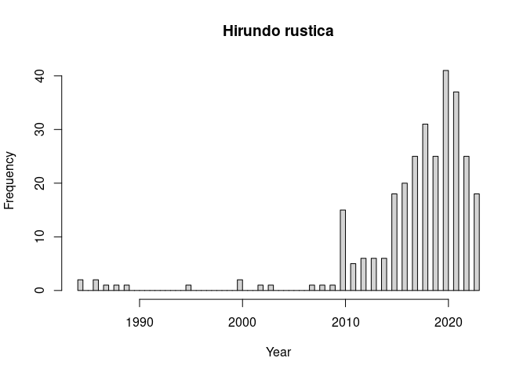<!-- -->

    ##                      species      eventDate   
    ##  Petrochelidon pyrrhonota:103   Min.   :1975  
    ##  Acanthis flammea        :  0   1st Qu.:2015  
    ##  Accipiter cooperii      :  0   Median :2019  
    ##  Accipiter gentilis      :  0   Mean   :2016  
    ##  Accipiter striatus      :  0   3rd Qu.:2021  
    ##  Actitis macularius      :  0   Max.   :2023  
    ##  (Other)                 :  0

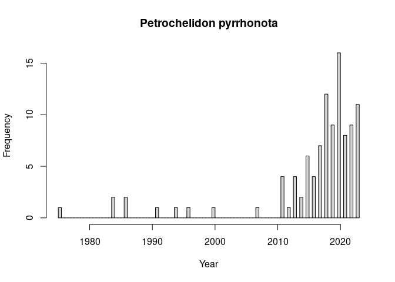<!-- -->

    ##                 species     eventDate   
    ##  Corthylio calendula:45   Min.   :2003  
    ##  Acanthis flammea   : 0   1st Qu.:2015  
    ##  Accipiter cooperii : 0   Median :2016  
    ##  Accipiter gentilis : 0   Mean   :2016  
    ##  Accipiter striatus : 0   3rd Qu.:2020  
    ##  Actitis macularius : 0   Max.   :2022  
    ##  (Other)            : 0

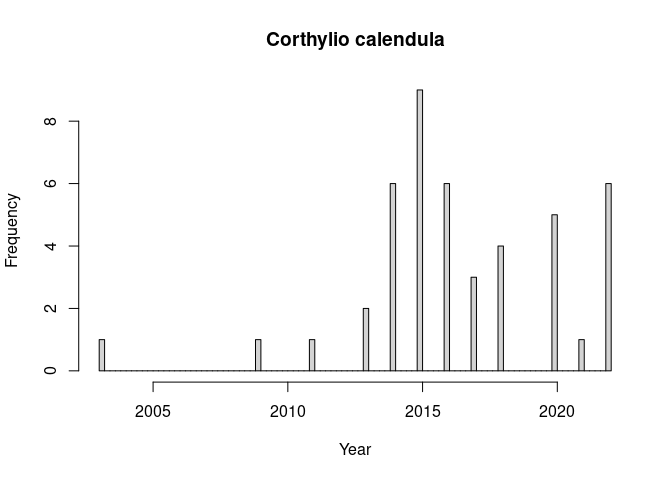<!-- -->

    ##                species    eventDate   
    ##  Regulus satrapa   :2   Min.   :2017  
    ##  Acanthis flammea  :0   1st Qu.:2017  
    ##  Accipiter cooperii:0   Median :2017  
    ##  Accipiter gentilis:0   Mean   :2017  
    ##  Accipiter striatus:0   3rd Qu.:2017  
    ##  Actitis macularius:0   Max.   :2017  
    ##  (Other)           :0

<!-- -->

    ##                species      eventDate   
    ##  Sitta canadensis  :481   Min.   :1975  
    ##  Acanthis flammea  :  0   1st Qu.:2015  
    ##  Accipiter cooperii:  0   Median :2018  
    ##  Accipiter gentilis:  0   Mean   :2017  
    ##  Accipiter striatus:  0   3rd Qu.:2020  
    ##  Actitis macularius:  0   Max.   :2023  
    ##  (Other)           :  0

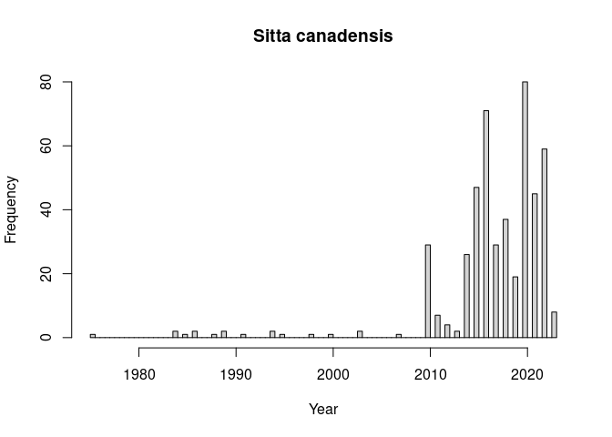<!-- -->

    ##                species      eventDate   
    ##  Sitta carolinensis:594   Min.   :1975  
    ##  Acanthis flammea  :  0   1st Qu.:2015  
    ##  Accipiter cooperii:  0   Median :2018  
    ##  Accipiter gentilis:  0   Mean   :2017  
    ##  Accipiter striatus:  0   3rd Qu.:2021  
    ##  Actitis macularius:  0   Max.   :2023  
    ##  (Other)           :  0

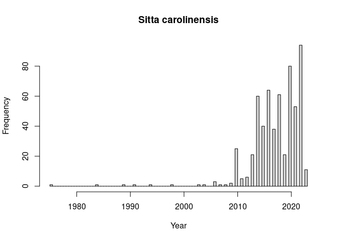<!-- -->

    ##                species      eventDate   
    ##  Sitta pygmaea     :607   Min.   :1975  
    ##  Acanthis flammea  :  0   1st Qu.:2015  
    ##  Accipiter cooperii:  0   Median :2018  
    ##  Accipiter gentilis:  0   Mean   :2017  
    ##  Accipiter striatus:  0   3rd Qu.:2020  
    ##  Actitis macularius:  0   Max.   :2023  
    ##  (Other)           :  0

<!-- -->

    ##                species     eventDate   
    ##  Certhia americana :54   Min.   :1986  
    ##  Acanthis flammea  : 0   1st Qu.:2010  
    ##  Accipiter cooperii: 0   Median :2016  
    ##  Accipiter gentilis: 0   Mean   :2015  
    ##  Accipiter striatus: 0   3rd Qu.:2020  
    ##  Actitis macularius: 0   Max.   :2022  
    ##  (Other)           : 0

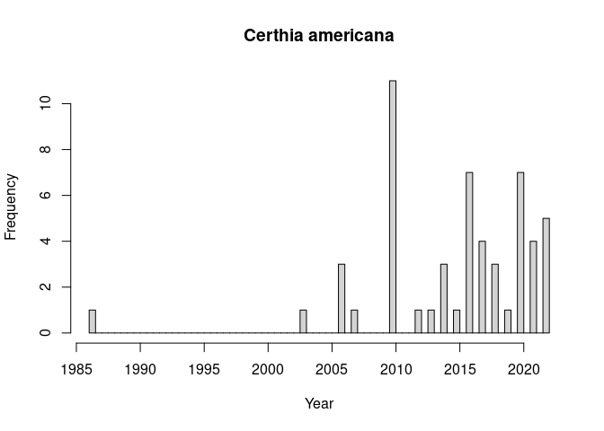<!-- -->

    ##                 species     eventDate   
    ##  Polioptila caerulea:47   Min.   :2013  
    ##  Acanthis flammea   : 0   1st Qu.:2017  
    ##  Accipiter cooperii : 0   Median :2020  
    ##  Accipiter gentilis : 0   Mean   :2019  
    ##  Accipiter striatus : 0   3rd Qu.:2021  
    ##  Actitis macularius : 0   Max.   :2023  
    ##  (Other)            : 0

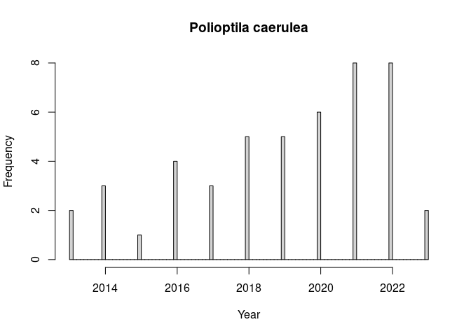<!-- -->

    ##                  species      eventDate   
    ##  Salpinctes obsoletus:127   Min.   :1984  
    ##  Acanthis flammea    :  0   1st Qu.:2015  
    ##  Accipiter cooperii  :  0   Median :2018  
    ##  Accipiter gentilis  :  0   Mean   :2016  
    ##  Accipiter striatus  :  0   3rd Qu.:2022  
    ##  Actitis macularius  :  0   Max.   :2023  
    ##  (Other)             :  0

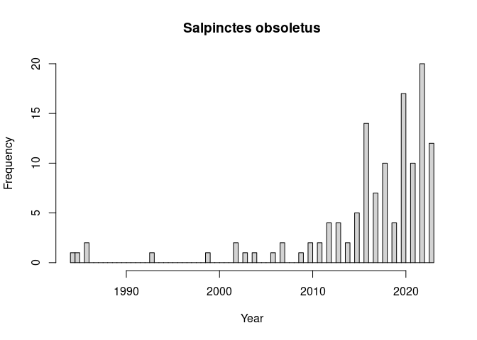<!-- -->

    ##                species      eventDate   
    ##  Troglodytes aedon :766   Min.   :1975  
    ##  Acanthis flammea  :  0   1st Qu.:2015  
    ##  Accipiter cooperii:  0   Median :2018  
    ##  Accipiter gentilis:  0   Mean   :2017  
    ##  Accipiter striatus:  0   3rd Qu.:2021  
    ##  Actitis macularius:  0   Max.   :2023  
    ##  (Other)           :  0

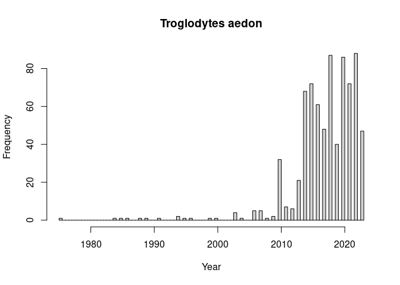<!-- -->

    ##                   species    eventDate   
    ##  Troglodytes pacificus:2   Min.   :2017  
    ##  Acanthis flammea     :0   1st Qu.:2017  
    ##  Accipiter cooperii   :0   Median :2017  
    ##  Accipiter gentilis   :0   Mean   :2017  
    ##  Accipiter striatus   :0   3rd Qu.:2017  
    ##  Actitis macularius   :0   Max.   :2017  
    ##  (Other)              :0

<!-- -->

    ##                  species    eventDate   
    ##  Troglodytes hiemalis:1   Min.   :2018  
    ##  Acanthis flammea    :0   1st Qu.:2018  
    ##  Accipiter cooperii  :0   Median :2018  
    ##  Accipiter gentilis  :0   Mean   :2018  
    ##  Accipiter striatus  :0   3rd Qu.:2018  
    ##  Actitis macularius  :0   Max.   :2018  
    ##  (Other)             :0

<!-- -->

    ##                   species    eventDate   
    ##  Cistothorus palustris:3   Min.   :2020  
    ##  Acanthis flammea     :0   1st Qu.:2020  
    ##  Accipiter cooperii   :0   Median :2021  
    ##  Accipiter gentilis   :0   Mean   :2021  
    ##  Accipiter striatus   :0   3rd Qu.:2022  
    ##  Actitis macularius   :0   Max.   :2022  
    ##  (Other)              :0

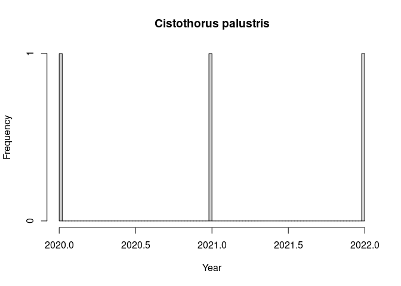<!-- -->

    ##                species      eventDate   
    ##  Sturnus vulgaris  :381   Min.   :1975  
    ##  Acanthis flammea  :  0   1st Qu.:2016  
    ##  Accipiter cooperii:  0   Median :2019  
    ##  Accipiter gentilis:  0   Mean   :2018  
    ##  Accipiter striatus:  0   3rd Qu.:2021  
    ##  Actitis macularius:  0   Max.   :2023  
    ##  (Other)           :  0

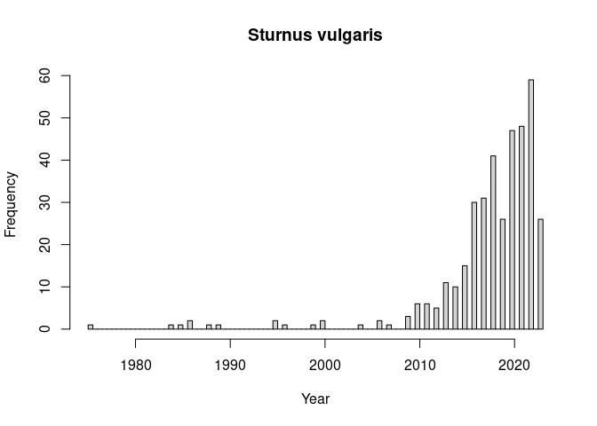<!-- -->

    ##                    species      eventDate   
    ##  Dumetella carolinensis:142   Min.   :1996  
    ##  Acanthis flammea      :  0   1st Qu.:2015  
    ##  Accipiter cooperii    :  0   Median :2018  
    ##  Accipiter gentilis    :  0   Mean   :2018  
    ##  Accipiter striatus    :  0   3rd Qu.:2021  
    ##  Actitis macularius    :  0   Max.   :2023  
    ##  (Other)               :  0

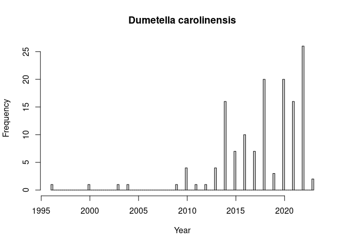<!-- -->

    ##                   species    eventDate   
    ##  Toxostoma curvirostre:1   Min.   :2016  
    ##  Acanthis flammea     :0   1st Qu.:2016  
    ##  Accipiter cooperii   :0   Median :2016  
    ##  Accipiter gentilis   :0   Mean   :2016  
    ##  Accipiter striatus   :0   3rd Qu.:2016  
    ##  Actitis macularius   :0   Max.   :2016  
    ##  (Other)              :0

<!-- -->

    ##                species      eventDate   
    ##  Toxostoma rufum   :255   Min.   :1985  
    ##  Acanthis flammea  :  0   1st Qu.:2016  
    ##  Accipiter cooperii:  0   Median :2019  
    ##  Accipiter gentilis:  0   Mean   :2017  
    ##  Accipiter striatus:  0   3rd Qu.:2021  
    ##  Actitis macularius:  0   Max.   :2023  
    ##  (Other)           :  0

<!-- -->

    ##                  species    eventDate   
    ##  Oreoscoptes montanus:2   Min.   :2012  
    ##  Acanthis flammea    :0   1st Qu.:2013  
    ##  Accipiter cooperii  :0   Median :2014  
    ##  Accipiter gentilis  :0   Mean   :2014  
    ##  Accipiter striatus  :0   3rd Qu.:2015  
    ##  Actitis macularius  :0   Max.   :2016  
    ##  (Other)             :0

<!-- -->

    ##                species    eventDate   
    ##  Mimus polyglottos :3   Min.   :2018  
    ##  Acanthis flammea  :0   1st Qu.:2018  
    ##  Accipiter cooperii:0   Median :2019  
    ##  Accipiter gentilis:0   Mean   :2020  
    ##  Accipiter striatus:0   3rd Qu.:2020  
    ##  Actitis macularius:0   Max.   :2022  
    ##  (Other)           :0

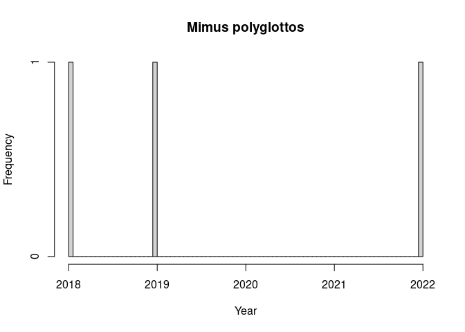<!-- -->

    ##                species      eventDate   
    ##  Sialia sialis     :463   Min.   :1998  
    ##  Acanthis flammea  :  0   1st Qu.:2015  
    ##  Accipiter cooperii:  0   Median :2017  
    ##  Accipiter gentilis:  0   Mean   :2017  
    ##  Accipiter striatus:  0   3rd Qu.:2019  
    ##  Actitis macularius:  0   Max.   :2023  
    ##  (Other)           :  0

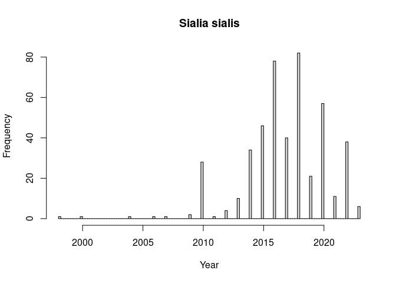<!-- -->

    ##                species      eventDate   
    ##  Sialia currucoides:311   Min.   :1984  
    ##  Acanthis flammea  :  0   1st Qu.:2014  
    ##  Accipiter cooperii:  0   Median :2017  
    ##  Accipiter gentilis:  0   Mean   :2016  
    ##  Accipiter striatus:  0   3rd Qu.:2020  
    ##  Actitis macularius:  0   Max.   :2023  
    ##  (Other)           :  0

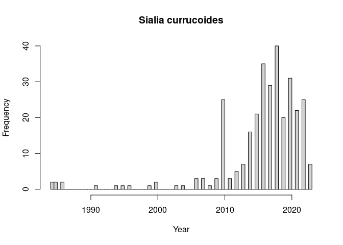<!-- -->

    ##                         species    eventDate   
    ##  Sialia sialis x currucoides:1   Min.   :1985  
    ##  Acanthis flammea           :0   1st Qu.:1985  
    ##  Accipiter cooperii         :0   Median :1985  
    ##  Accipiter gentilis         :0   Mean   :1985  
    ##  Accipiter striatus         :0   3rd Qu.:1985  
    ##  Actitis macularius         :0   Max.   :1985  
    ##  (Other)                    :0

<!-- -->

    ##                 species     eventDate   
    ##  Myadestes townsendi:81   Min.   :1978  
    ##  Acanthis flammea   : 0   1st Qu.:2015  
    ##  Accipiter cooperii : 0   Median :2017  
    ##  Accipiter gentilis : 0   Mean   :2016  
    ##  Accipiter striatus : 0   3rd Qu.:2021  
    ##  Actitis macularius : 0   Max.   :2022  
    ##  (Other)            : 0

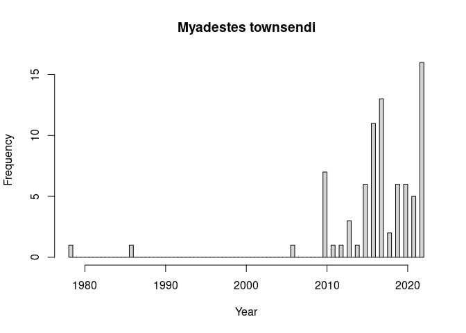<!-- -->

    ##                 species    eventDate   
    ##  Catharus fuscescens:3   Min.   :2013  
    ##  Acanthis flammea   :0   1st Qu.:2016  
    ##  Accipiter cooperii :0   Median :2018  
    ##  Accipiter gentilis :0   Mean   :2018  
    ##  Accipiter striatus :0   3rd Qu.:2020  
    ##  Actitis macularius :0   Max.   :2023  
    ##  (Other)            :0

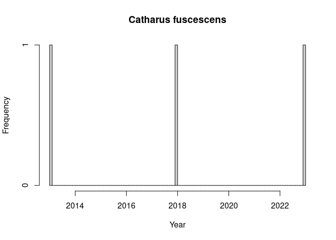<!-- -->

    ##                species      eventDate   
    ##  Catharus ustulatus:121   Min.   :1986  
    ##  Acanthis flammea  :  0   1st Qu.:2016  
    ##  Accipiter cooperii:  0   Median :2018  
    ##  Accipiter gentilis:  0   Mean   :2017  
    ##  Accipiter striatus:  0   3rd Qu.:2020  
    ##  Actitis macularius:  0   Max.   :2023  
    ##  (Other)           :  0

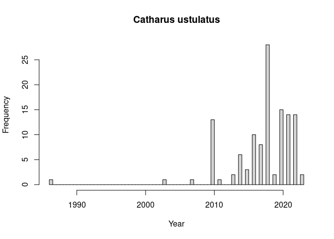<!-- -->

    ##                species     eventDate   
    ##  Catharus guttatus :21   Min.   :2010  
    ##  Acanthis flammea  : 0   1st Qu.:2016  
    ##  Accipiter cooperii: 0   Median :2017  
    ##  Accipiter gentilis: 0   Mean   :2017  
    ##  Accipiter striatus: 0   3rd Qu.:2018  
    ##  Actitis macularius: 0   Max.   :2022  
    ##  (Other)           : 0

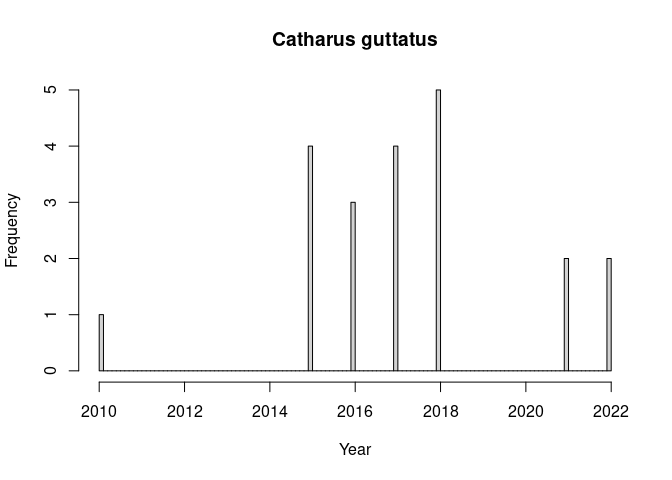<!-- -->

    ##                species      eventDate   
    ##  Turdus migratorius:975   Min.   :1975  
    ##  Acanthis flammea  :  0   1st Qu.:2015  
    ##  Accipiter cooperii:  0   Median :2018  
    ##  Accipiter gentilis:  0   Mean   :2017  
    ##  Accipiter striatus:  0   3rd Qu.:2021  
    ##  Actitis macularius:  0   Max.   :2023  
    ##  (Other)           :  0

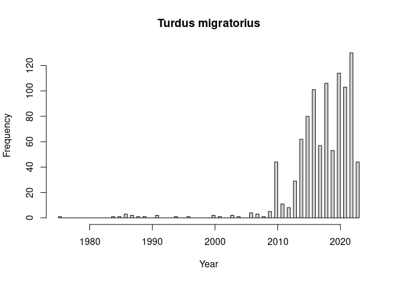<!-- -->

    ##                 species      eventDate   
    ##  Bombycilla cedrorum:291   Min.   :1984  
    ##  Acanthis flammea   :  0   1st Qu.:2015  
    ##  Accipiter cooperii :  0   Median :2018  
    ##  Accipiter gentilis :  0   Mean   :2017  
    ##  Accipiter striatus :  0   3rd Qu.:2020  
    ##  Actitis macularius :  0   Max.   :2023  
    ##  (Other)            :  0

<!-- -->

    ##                species     eventDate   
    ##  Passer domesticus :37   Min.   :1975  
    ##  Acanthis flammea  : 0   1st Qu.:2009  
    ##  Accipiter cooperii: 0   Median :2015  
    ##  Accipiter gentilis: 0   Mean   :2011  
    ##  Accipiter striatus: 0   3rd Qu.:2017  
    ##  Actitis macularius: 0   Max.   :2022  
    ##  (Other)           : 0

<!-- -->

    ##                species    eventDate   
    ##  Anthus rubescens  :2   Min.   :2017  
    ##  Acanthis flammea  :0   1st Qu.:2018  
    ##  Accipiter cooperii:0   Median :2020  
    ##  Accipiter gentilis:0   Mean   :2020  
    ##  Accipiter striatus:0   3rd Qu.:2021  
    ##  Actitis macularius:0   Max.   :2022  
    ##  (Other)           :0

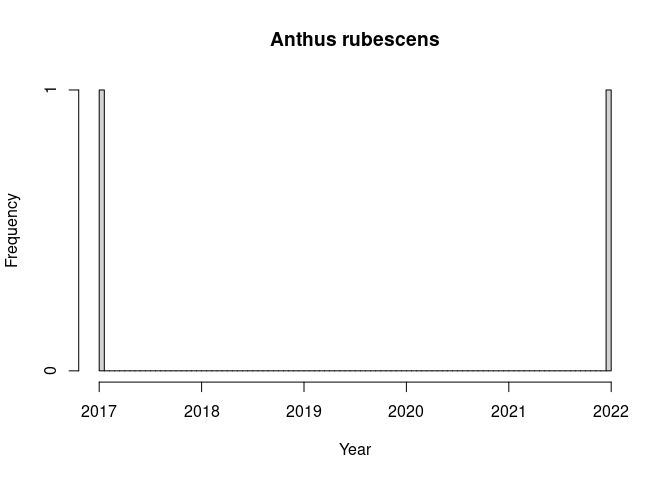<!-- -->

    ##                species    eventDate   
    ##  Anthus spragueii  :1   Min.   :2010  
    ##  Acanthis flammea  :0   1st Qu.:2010  
    ##  Accipiter cooperii:0   Median :2010  
    ##  Accipiter gentilis:0   Mean   :2010  
    ##  Accipiter striatus:0   3rd Qu.:2010  
    ##  Actitis macularius:0   Max.   :2010  
    ##  (Other)           :0

<!-- -->

    ##                        species    eventDate   
    ##  Coccothraustes vespertinus:7   Min.   :2010  
    ##  Acanthis flammea          :0   1st Qu.:2010  
    ##  Accipiter cooperii        :0   Median :2010  
    ##  Accipiter gentilis        :0   Mean   :2011  
    ##  Accipiter striatus        :0   3rd Qu.:2010  
    ##  Actitis macularius        :0   Max.   :2020  
    ##  (Other)                   :0

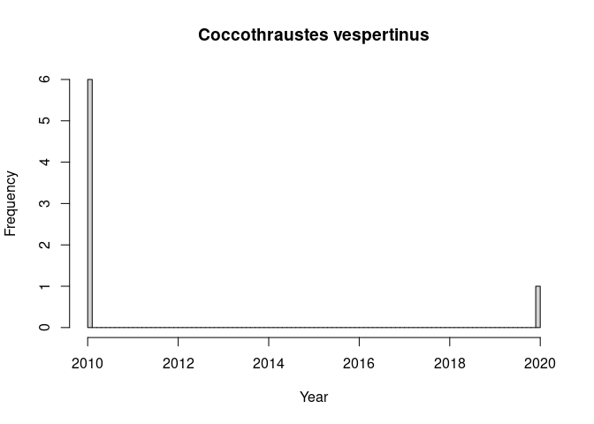<!-- -->

    ##                     species    eventDate   
    ##  Leucosticte tephrocotis:8   Min.   :2020  
    ##  Acanthis flammea       :0   1st Qu.:2020  
    ##  Accipiter cooperii     :0   Median :2020  
    ##  Accipiter gentilis     :0   Mean   :2020  
    ##  Accipiter striatus     :0   3rd Qu.:2020  
    ##  Actitis macularius     :0   Max.   :2020  
    ##  (Other)                :0

<!-- -->

    ##                  species      eventDate   
    ##  Haemorhous mexicanus:127   Min.   :2000  
    ##  Acanthis flammea    :  0   1st Qu.:2015  
    ##  Accipiter cooperii  :  0   Median :2018  
    ##  Accipiter gentilis  :  0   Mean   :2018  
    ##  Accipiter striatus  :  0   3rd Qu.:2021  
    ##  Actitis macularius  :  0   Max.   :2023  
    ##  (Other)             :  0

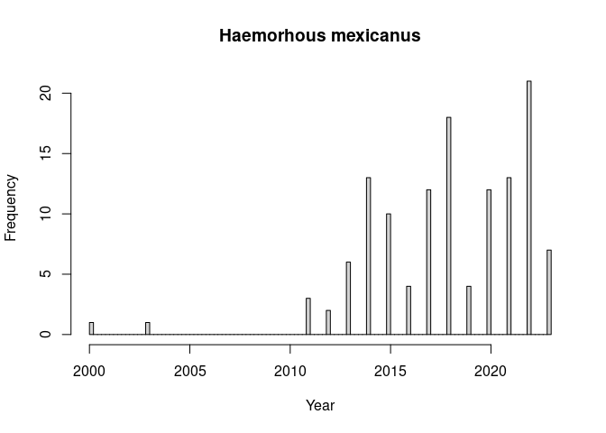<!-- -->

    ##                  species    eventDate   
    ##  Haemorhous purpureus:1   Min.   :2014  
    ##  Acanthis flammea    :0   1st Qu.:2014  
    ##  Accipiter cooperii  :0   Median :2014  
    ##  Accipiter gentilis  :0   Mean   :2014  
    ##  Accipiter striatus  :0   3rd Qu.:2014  
    ##  Actitis macularius  :0   Max.   :2014  
    ##  (Other)             :0

<!-- -->

    ##                 species    eventDate   
    ##  Haemorhous cassinii:6   Min.   :1985  
    ##  Acanthis flammea   :0   1st Qu.:2016  
    ##  Accipiter cooperii :0   Median :2017  
    ##  Accipiter gentilis :0   Mean   :2012  
    ##  Accipiter striatus :0   3rd Qu.:2017  
    ##  Actitis macularius :0   Max.   :2020  
    ##  (Other)            :0

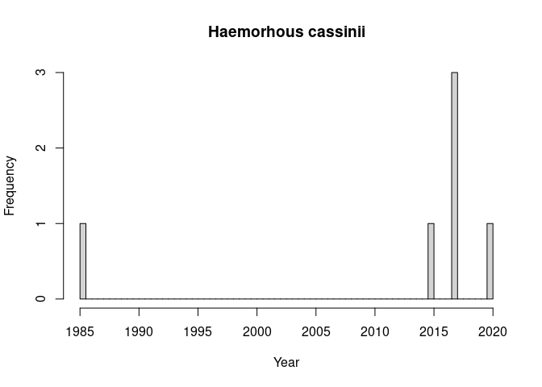<!-- -->

    ##                  species    eventDate   
    ##  Acanthis flammea    :4   Min.   :2015  
    ##  Accipiter cooperii  :0   1st Qu.:2019  
    ##  Accipiter gentilis  :0   Median :2020  
    ##  Accipiter striatus  :0   Mean   :2019  
    ##  Actitis macularius  :0   3rd Qu.:2021  
    ##  Aechmophorus clarkii:0   Max.   :2021  
    ##  (Other)             :0

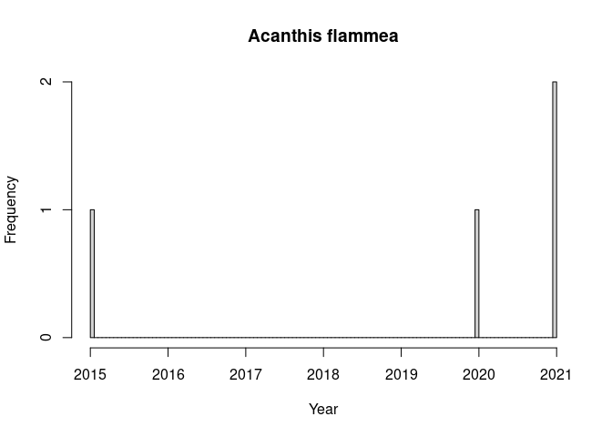<!-- -->

    ##                species      eventDate   
    ##  Loxia curvirostra :493   Min.   :1986  
    ##  Acanthis flammea  :  0   1st Qu.:2015  
    ##  Accipiter cooperii:  0   Median :2017  
    ##  Accipiter gentilis:  0   Mean   :2017  
    ##  Accipiter striatus:  0   3rd Qu.:2020  
    ##  Actitis macularius:  0   Max.   :2023  
    ##  (Other)           :  0

<!-- -->

    ##                species      eventDate   
    ##  Spinus pinus      :156   Min.   :1985  
    ##  Acanthis flammea  :  0   1st Qu.:2015  
    ##  Accipiter cooperii:  0   Median :2018  
    ##  Accipiter gentilis:  0   Mean   :2017  
    ##  Accipiter striatus:  0   3rd Qu.:2020  
    ##  Actitis macularius:  0   Max.   :2023  
    ##  (Other)           :  0

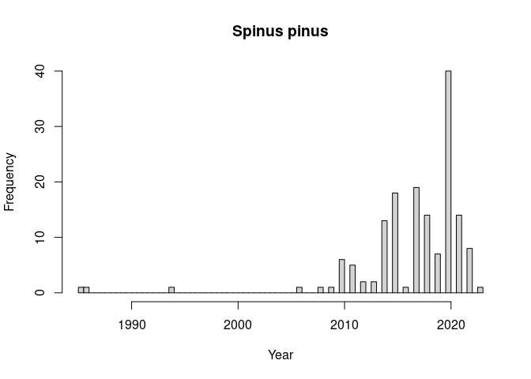<!-- -->

    ##                species    eventDate   
    ##  Spinus psaltria   :2   Min.   :2020  
    ##  Acanthis flammea  :0   1st Qu.:2020  
    ##  Accipiter cooperii:0   Median :2021  
    ##  Accipiter gentilis:0   Mean   :2021  
    ##  Accipiter striatus:0   3rd Qu.:2022  
    ##  Actitis macularius:0   Max.   :2022  
    ##  (Other)           :0

<!-- -->

    ##                species      eventDate   
    ##  Spinus tristis    :836   Min.   :1984  
    ##  Acanthis flammea  :  0   1st Qu.:2015  
    ##  Accipiter cooperii:  0   Median :2018  
    ##  Accipiter gentilis:  0   Mean   :2017  
    ##  Accipiter striatus:  0   3rd Qu.:2020  
    ##  Actitis macularius:  0   Max.   :2023  
    ##  (Other)           :  0

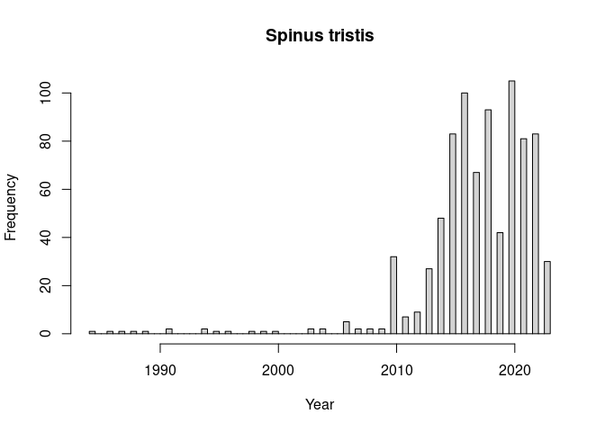<!-- -->

    ##                  species    eventDate   
    ##  Calcarius lapponicus:1   Min.   :2016  
    ##  Acanthis flammea    :0   1st Qu.:2016  
    ##  Accipiter cooperii  :0   Median :2016  
    ##  Accipiter gentilis  :0   Mean   :2016  
    ##  Accipiter striatus  :0   3rd Qu.:2016  
    ##  Actitis macularius  :0   Max.   :2016  
    ##  (Other)             :0

<!-- -->

    ##                species    eventDate   
    ##  Calcarius ornatus :6   Min.   :1995  
    ##  Acanthis flammea  :0   1st Qu.:2014  
    ##  Accipiter cooperii:0   Median :2018  
    ##  Accipiter gentilis:0   Mean   :2014  
    ##  Accipiter striatus:0   3rd Qu.:2020  
    ##  Actitis macularius:0   Max.   :2023  
    ##  (Other)           :0

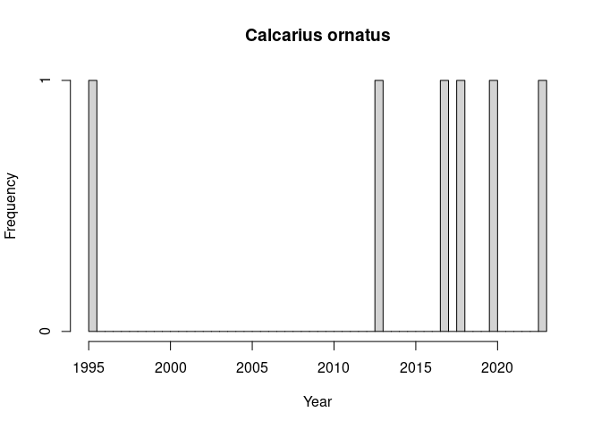<!-- -->

    ##                    species    eventDate   
    ##  Rhynchophanes mccownii:5   Min.   :1995  
    ##  Acanthis flammea      :0   1st Qu.:2010  
    ##  Accipiter cooperii    :0   Median :2014  
    ##  Accipiter gentilis    :0   Mean   :2013  
    ##  Accipiter striatus    :0   3rd Qu.:2023  
    ##  Actitis macularius    :0   Max.   :2023  
    ##  (Other)               :0

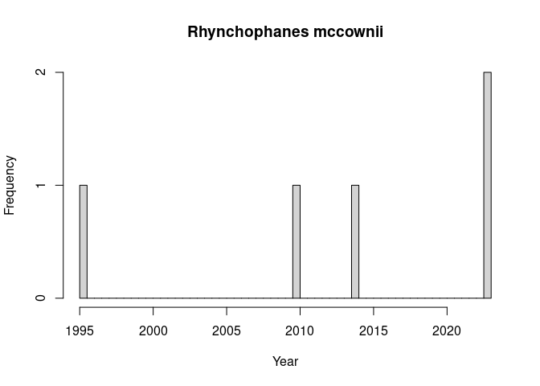<!-- -->

    ##                species    eventDate   
    ##  Peucaea cassinii  :1   Min.   :2011  
    ##  Acanthis flammea  :0   1st Qu.:2011  
    ##  Accipiter cooperii:0   Median :2011  
    ##  Accipiter gentilis:0   Mean   :2011  
    ##  Accipiter striatus:0   3rd Qu.:2011  
    ##  Actitis macularius:0   Max.   :2011  
    ##  (Other)           :0

<!-- -->

    ##                   species     eventDate   
    ##  Ammodramus savannarum:68   Min.   :1986  
    ##  Acanthis flammea     : 0   1st Qu.:2015  
    ##  Accipiter cooperii   : 0   Median :2018  
    ##  Accipiter gentilis   : 0   Mean   :2017  
    ##  Accipiter striatus   : 0   3rd Qu.:2020  
    ##  Actitis macularius   : 0   Max.   :2023  
    ##  (Other)              : 0

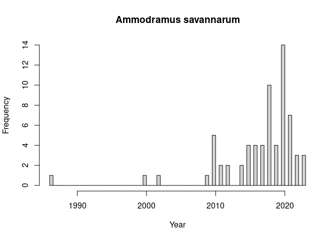<!-- -->

    ##                species      eventDate   
    ##  Spizella passerina:501   Min.   :1984  
    ##  Acanthis flammea  :  0   1st Qu.:2014  
    ##  Accipiter cooperii:  0   Median :2017  
    ##  Accipiter gentilis:  0   Mean   :2016  
    ##  Accipiter striatus:  0   3rd Qu.:2020  
    ##  Actitis macularius:  0   Max.   :2023  
    ##  (Other)           :  0

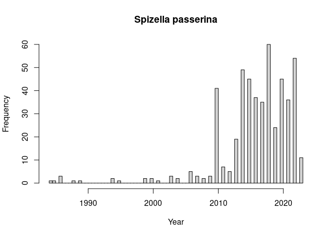<!-- -->

    ##                species      eventDate   
    ##  Spizella pallida  :133   Min.   :1986  
    ##  Acanthis flammea  :  0   1st Qu.:2015  
    ##  Accipiter cooperii:  0   Median :2018  
    ##  Accipiter gentilis:  0   Mean   :2017  
    ##  Accipiter striatus:  0   3rd Qu.:2020  
    ##  Actitis macularius:  0   Max.   :2023  
    ##  (Other)           :  0

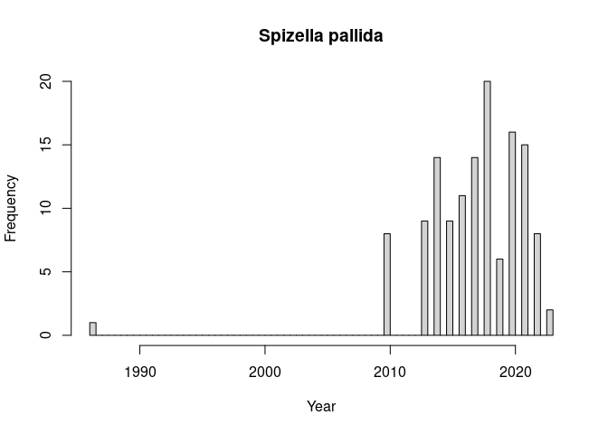<!-- -->

    ##                species     eventDate   
    ##  Spizella pusilla  :16   Min.   :2011  
    ##  Acanthis flammea  : 0   1st Qu.:2015  
    ##  Accipiter cooperii: 0   Median :2018  
    ##  Accipiter gentilis: 0   Mean   :2018  
    ##  Accipiter striatus: 0   3rd Qu.:2020  
    ##  Actitis macularius: 0   Max.   :2022  
    ##  (Other)           : 0

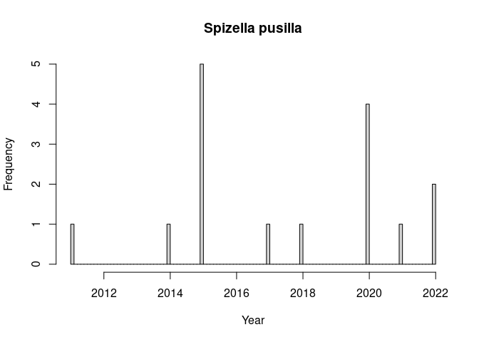<!-- -->

    ##                species     eventDate   
    ##  Spizella breweri  :19   Min.   :1978  
    ##  Acanthis flammea  : 0   1st Qu.:2012  
    ##  Accipiter cooperii: 0   Median :2016  
    ##  Accipiter gentilis: 0   Mean   :2014  
    ##  Accipiter striatus: 0   3rd Qu.:2020  
    ##  Actitis macularius: 0   Max.   :2022  
    ##  (Other)           : 0

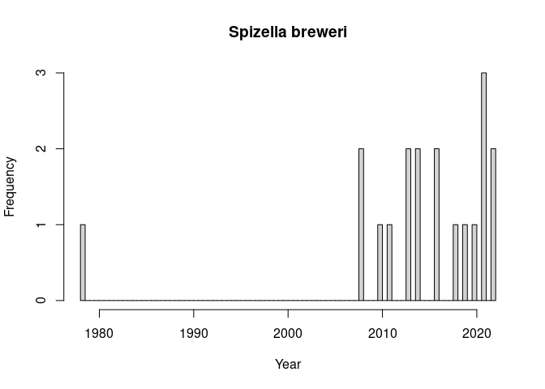<!-- -->

    ##                  species      eventDate   
    ##  Chondestes grammacus:419   Min.   :1986  
    ##  Acanthis flammea    :  0   1st Qu.:2016  
    ##  Accipiter cooperii  :  0   Median :2019  
    ##  Accipiter gentilis  :  0   Mean   :2018  
    ##  Accipiter striatus  :  0   3rd Qu.:2021  
    ##  Actitis macularius  :  0   Max.   :2023  
    ##  (Other)             :  0

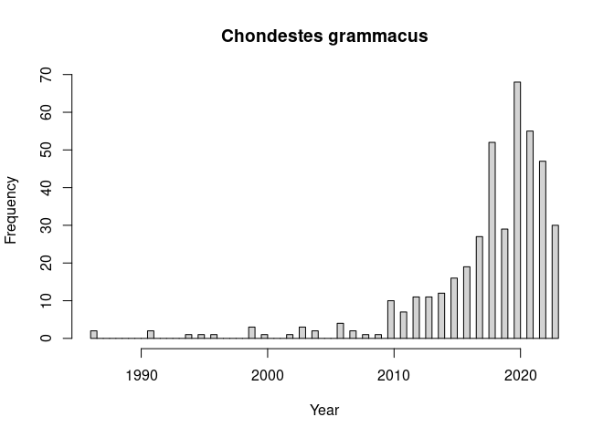<!-- -->

    ##                     species      eventDate   
    ##  Calamospiza melanocorys:144   Min.   :1975  
    ##  Acanthis flammea       :  0   1st Qu.:2014  
    ##  Accipiter cooperii     :  0   Median :2018  
    ##  Accipiter gentilis     :  0   Mean   :2015  
    ##  Accipiter striatus     :  0   3rd Qu.:2020  
    ##  Actitis macularius     :  0   Max.   :2023  
    ##  (Other)                :  0

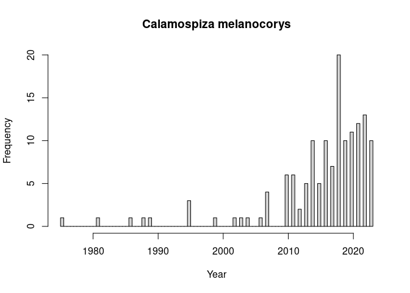<!-- -->

    ##                  species     eventDate   
    ##  Spizelloides arborea:13   Min.   :2013  
    ##  Acanthis flammea    : 0   1st Qu.:2017  
    ##  Accipiter cooperii  : 0   Median :2017  
    ##  Accipiter gentilis  : 0   Mean   :2017  
    ##  Accipiter striatus  : 0   3rd Qu.:2019  
    ##  Actitis macularius  : 0   Max.   :2021  
    ##  (Other)             : 0

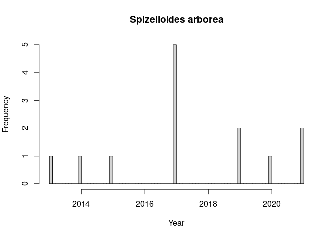<!-- -->

    ##                species    eventDate   
    ##  Passerella iliaca :1   Min.   :2016  
    ##  Acanthis flammea  :0   1st Qu.:2016  
    ##  Accipiter cooperii:0   Median :2016  
    ##  Accipiter gentilis:0   Mean   :2016  
    ##  Accipiter striatus:0   3rd Qu.:2016  
    ##  Actitis macularius:0   Max.   :2016  
    ##  (Other)           :0

<!-- -->

    ##                species      eventDate   
    ##  Junco hyemalis    :152   Min.   :2003  
    ##  Acanthis flammea  :  0   1st Qu.:2015  
    ##  Accipiter cooperii:  0   Median :2018  
    ##  Accipiter gentilis:  0   Mean   :2018  
    ##  Accipiter striatus:  0   3rd Qu.:2020  
    ##  Actitis macularius:  0   Max.   :2023  
    ##  (Other)           :  0

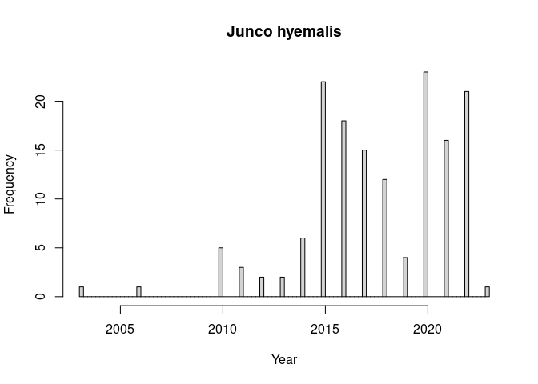<!-- -->

    ##                        species    eventDate   
    ##  Junco hyemalis/cismontanus:2   Min.   :2020  
    ##  Acanthis flammea          :0   1st Qu.:2020  
    ##  Accipiter cooperii        :0   Median :2020  
    ##  Accipiter gentilis        :0   Mean   :2020  
    ##  Accipiter striatus        :0   3rd Qu.:2020  
    ##  Actitis macularius        :0   Max.   :2020  
    ##  (Other)                   :0

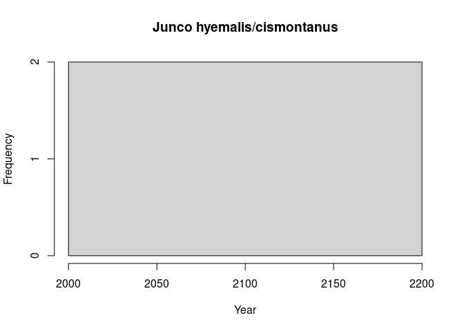<!-- -->

    ##                species    eventDate   
    ##  Junco cismontanus :3   Min.   :2017  
    ##  Acanthis flammea  :0   1st Qu.:2020  
    ##  Accipiter cooperii:0   Median :2022  
    ##  Accipiter gentilis:0   Mean   :2020  
    ##  Accipiter striatus:0   3rd Qu.:2022  
    ##  Actitis macularius:0   Max.   :2022  
    ##  (Other)           :0

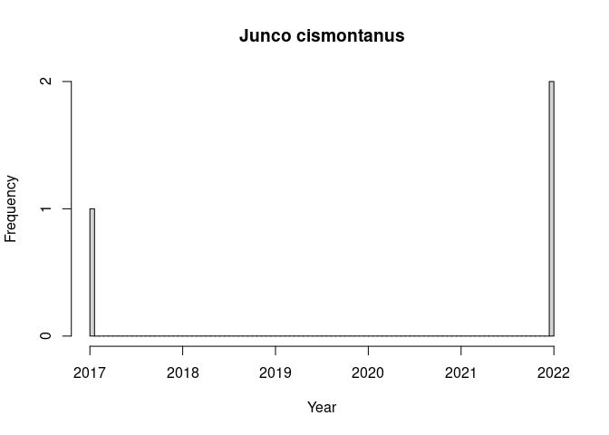<!-- -->

    ##                species     eventDate   
    ##  Junco oreganus    :40   Min.   :2010  
    ##  Acanthis flammea  : 0   1st Qu.:2015  
    ##  Accipiter cooperii: 0   Median :2016  
    ##  Accipiter gentilis: 0   Mean   :2017  
    ##  Accipiter striatus: 0   3rd Qu.:2020  
    ##  Actitis macularius: 0   Max.   :2022  
    ##  (Other)           : 0

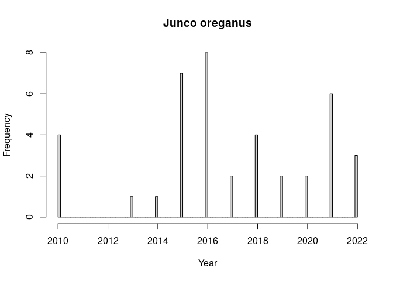<!-- -->

    ##                species     eventDate   
    ##  Junco mearnsi     :22   Min.   :2010  
    ##  Acanthis flammea  : 0   1st Qu.:2015  
    ##  Accipiter cooperii: 0   Median :2017  
    ##  Accipiter gentilis: 0   Mean   :2017  
    ##  Accipiter striatus: 0   3rd Qu.:2020  
    ##  Actitis macularius: 0   Max.   :2022  
    ##  (Other)           : 0

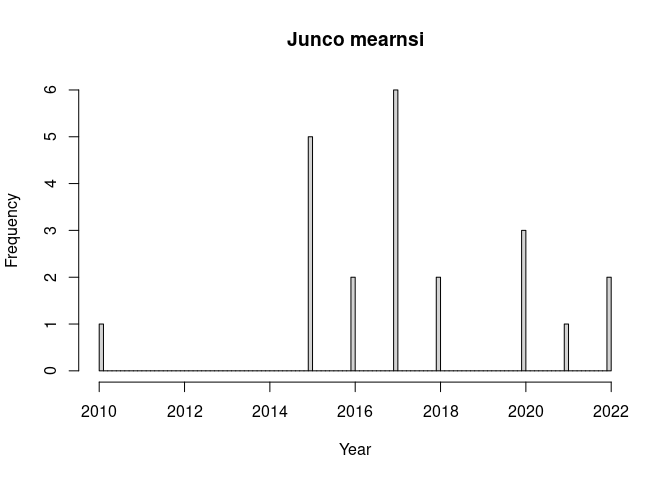<!-- -->

    ##                species     eventDate   
    ##  Junco aikeni      :44   Min.   :1994  
    ##  Acanthis flammea  : 0   1st Qu.:2010  
    ##  Accipiter cooperii: 0   Median :2012  
    ##  Accipiter gentilis: 0   Mean   :2014  
    ##  Accipiter striatus: 0   3rd Qu.:2019  
    ##  Actitis macularius: 0   Max.   :2022  
    ##  (Other)           : 0

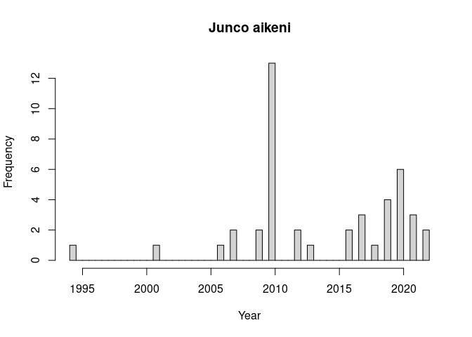<!-- -->

    ##                    species      eventDate   
    ##  Zonotrichia leucophrys:154   Min.   :2009  
    ##  Acanthis flammea      :  0   1st Qu.:2015  
    ##  Accipiter cooperii    :  0   Median :2016  
    ##  Accipiter gentilis    :  0   Mean   :2017  
    ##  Accipiter striatus    :  0   3rd Qu.:2020  
    ##  Actitis macularius    :  0   Max.   :2023  
    ##  (Other)               :  0

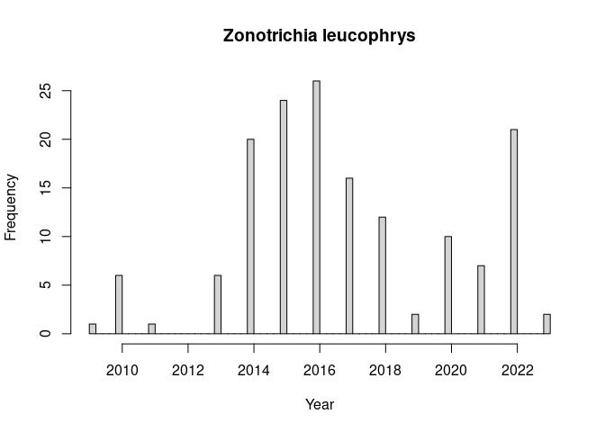<!-- -->

    ##                 species    eventDate   
    ##  Zonotrichia querula:4   Min.   :2014  
    ##  Acanthis flammea   :0   1st Qu.:2016  
    ##  Accipiter cooperii :0   Median :2018  
    ##  Accipiter gentilis :0   Mean   :2018  
    ##  Accipiter striatus :0   3rd Qu.:2019  
    ##  Actitis macularius :0   Max.   :2022  
    ##  (Other)            :0

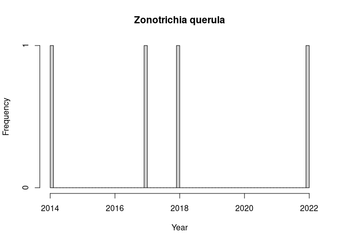<!-- -->

    ##                    species     eventDate   
    ##  Zonotrichia albicollis:30   Min.   :2010  
    ##  Acanthis flammea      : 0   1st Qu.:2015  
    ##  Accipiter cooperii    : 0   Median :2016  
    ##  Accipiter gentilis    : 0   Mean   :2017  
    ##  Accipiter striatus    : 0   3rd Qu.:2018  
    ##  Actitis macularius    : 0   Max.   :2023  
    ##  (Other)               : 0

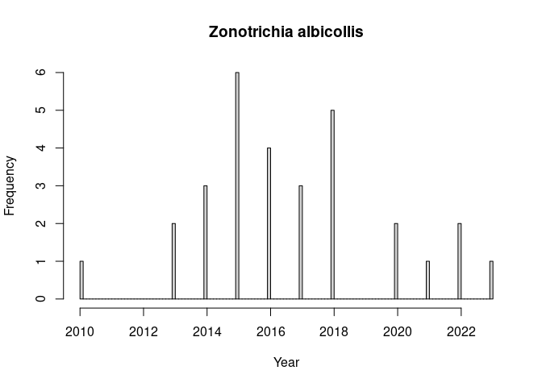<!-- -->

    ##                 species     eventDate   
    ##  Pooecetes gramineus:80   Min.   :1984  
    ##  Acanthis flammea   : 0   1st Qu.:2014  
    ##  Accipiter cooperii : 0   Median :2018  
    ##  Accipiter gentilis : 0   Mean   :2017  
    ##  Accipiter striatus : 0   3rd Qu.:2021  
    ##  Actitis macularius : 0   Max.   :2023  
    ##  (Other)            : 0

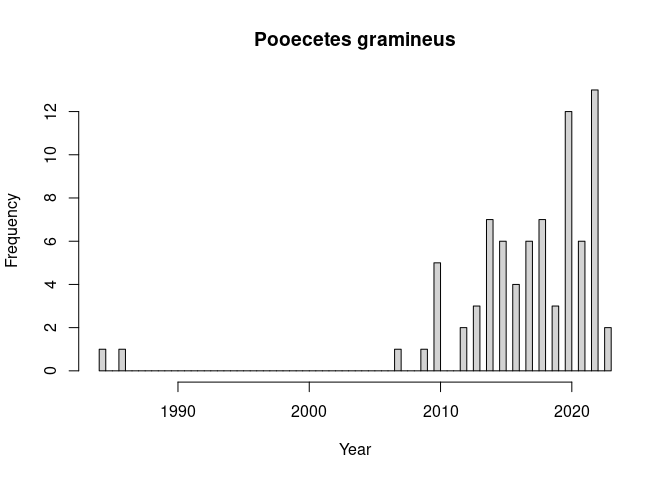<!-- -->

    ##                       species     eventDate   
    ##  Passerculus sandwichensis:23   Min.   :1985  
    ##  Acanthis flammea         : 0   1st Qu.:2016  
    ##  Accipiter cooperii       : 0   Median :2017  
    ##  Accipiter gentilis       : 0   Mean   :2015  
    ##  Accipiter striatus       : 0   3rd Qu.:2018  
    ##  Actitis macularius       : 0   Max.   :2021  
    ##  (Other)                  : 0

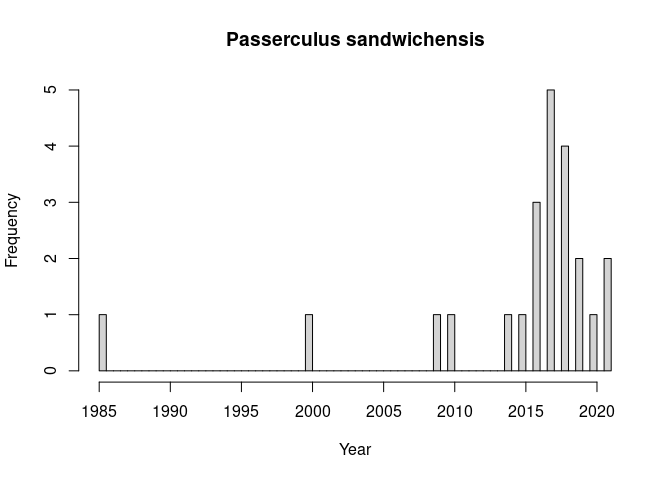<!-- -->

    ##                species    eventDate   
    ##  Centronyx bairdii :8   Min.   :2010  
    ##  Acanthis flammea  :0   1st Qu.:2010  
    ##  Accipiter cooperii:0   Median :2010  
    ##  Accipiter gentilis:0   Mean   :2011  
    ##  Accipiter striatus:0   3rd Qu.:2010  
    ##  Actitis macularius:0   Max.   :2019  
    ##  (Other)           :0

<!-- -->

    ##                species     eventDate   
    ##  Melospiza melodia :42   Min.   :1986  
    ##  Acanthis flammea  : 0   1st Qu.:2015  
    ##  Accipiter cooperii: 0   Median :2017  
    ##  Accipiter gentilis: 0   Mean   :2016  
    ##  Accipiter striatus: 0   3rd Qu.:2020  
    ##  Actitis macularius: 0   Max.   :2023  
    ##  (Other)           : 0

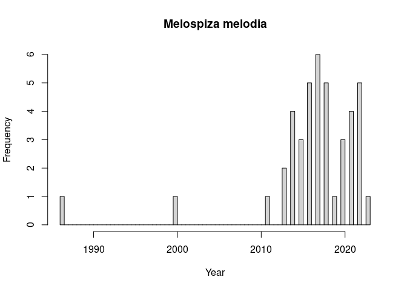<!-- -->

    ##                 species      eventDate   
    ##  Melospiza lincolnii:137   Min.   :2011  
    ##  Acanthis flammea   :  0   1st Qu.:2014  
    ##  Accipiter cooperii :  0   Median :2015  
    ##  Accipiter gentilis :  0   Mean   :2016  
    ##  Accipiter striatus :  0   3rd Qu.:2018  
    ##  Actitis macularius :  0   Max.   :2023  
    ##  (Other)            :  0

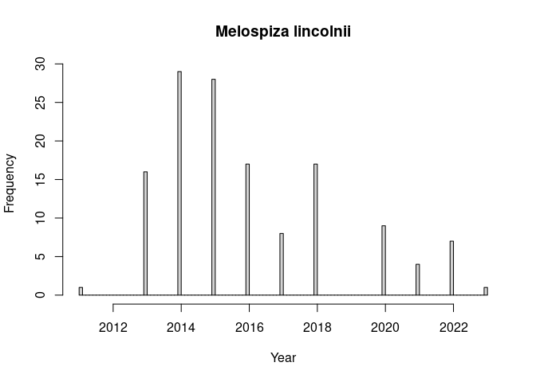<!-- -->

    ##                 species    eventDate   
    ##  Melospiza georgiana:8   Min.   :2014  
    ##  Acanthis flammea   :0   1st Qu.:2014  
    ##  Accipiter cooperii :0   Median :2016  
    ##  Accipiter gentilis :0   Mean   :2017  
    ##  Accipiter striatus :0   3rd Qu.:2020  
    ##  Actitis macularius :0   Max.   :2022  
    ##  (Other)            :0

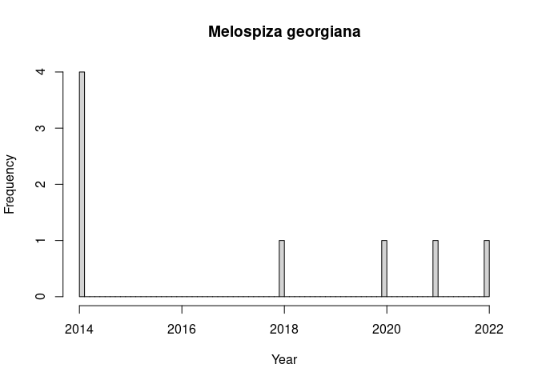<!-- -->

    ##                species    eventDate   
    ##  Pipilo chlorurus  :1   Min.   :2011  
    ##  Acanthis flammea  :0   1st Qu.:2011  
    ##  Accipiter cooperii:0   Median :2011  
    ##  Accipiter gentilis:0   Mean   :2011  
    ##  Accipiter striatus:0   3rd Qu.:2011  
    ##  Actitis macularius:0   Max.   :2011  
    ##  (Other)           :0

<!-- -->

    ##                species      eventDate   
    ##  Pipilo maculatus  :831   Min.   :1984  
    ##  Acanthis flammea  :  0   1st Qu.:2015  
    ##  Accipiter cooperii:  0   Median :2018  
    ##  Accipiter gentilis:  0   Mean   :2017  
    ##  Accipiter striatus:  0   3rd Qu.:2020  
    ##  Actitis macularius:  0   Max.   :2023  
    ##  (Other)           :  0

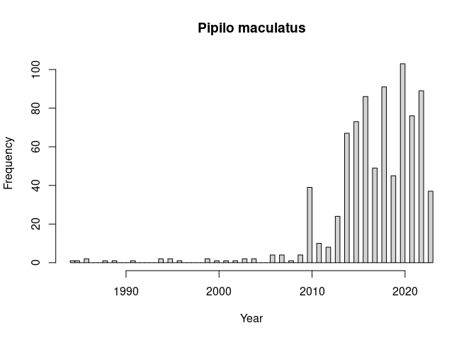<!-- -->

    ##                species      eventDate   
    ##  Icteria virens    :338   Min.   :1984  
    ##  Acanthis flammea  :  0   1st Qu.:2016  
    ##  Accipiter cooperii:  0   Median :2020  
    ##  Accipiter gentilis:  0   Mean   :2018  
    ##  Accipiter striatus:  0   3rd Qu.:2021  
    ##  Actitis macularius:  0   Max.   :2023  
    ##  (Other)           :  0

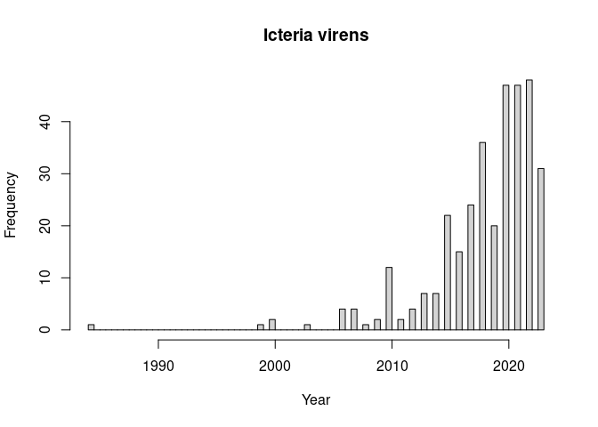<!-- -->

    ##                           species     eventDate   
    ##  Xanthocephalus xanthocephalus:28   Min.   :2013  
    ##  Acanthis flammea             : 0   1st Qu.:2016  
    ##  Accipiter cooperii           : 0   Median :2018  
    ##  Accipiter gentilis           : 0   Mean   :2018  
    ##  Accipiter striatus           : 0   3rd Qu.:2020  
    ##  Actitis macularius           : 0   Max.   :2023  
    ##  (Other)                      : 0

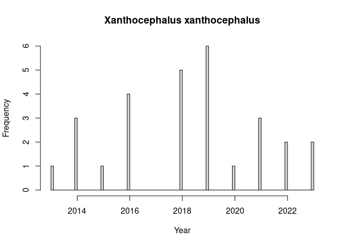<!-- -->

    ##                   species     eventDate   
    ##  Dolichonyx oryzivorus:13   Min.   :1975  
    ##  Acanthis flammea     : 0   1st Qu.:2019  
    ##  Accipiter cooperii   : 0   Median :2020  
    ##  Accipiter gentilis   : 0   Mean   :2017  
    ##  Accipiter striatus   : 0   3rd Qu.:2022  
    ##  Actitis macularius   : 0   Max.   :2023  
    ##  (Other)              : 0

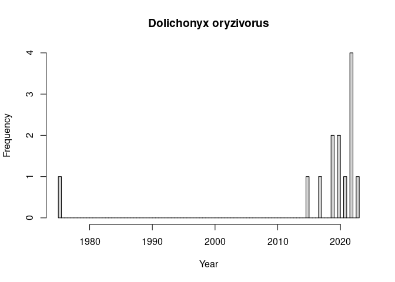<!-- -->

    ##                species      eventDate   
    ##  Sturnella neglecta:667   Min.   :1975  
    ##  Acanthis flammea  :  0   1st Qu.:2017  
    ##  Accipiter cooperii:  0   Median :2020  
    ##  Accipiter gentilis:  0   Mean   :2018  
    ##  Accipiter striatus:  0   3rd Qu.:2021  
    ##  Actitis macularius:  0   Max.   :2023  
    ##  (Other)           :  0

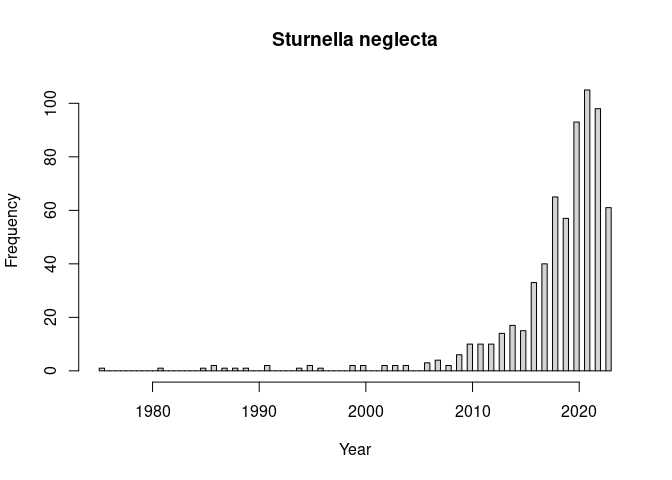<!-- -->

    ##                species    eventDate   
    ##  Sturnella magna   :4   Min.   :2011  
    ##  Acanthis flammea  :0   1st Qu.:2012  
    ##  Accipiter cooperii:0   Median :2015  
    ##  Accipiter gentilis:0   Mean   :2015  
    ##  Accipiter striatus:0   3rd Qu.:2018  
    ##  Actitis macularius:0   Max.   :2019  
    ##  (Other)           :0

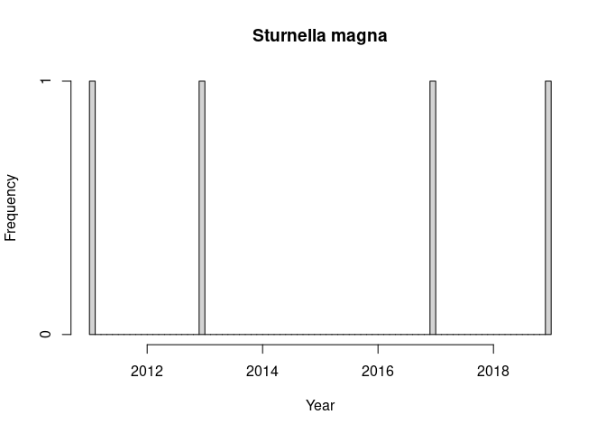<!-- -->

    ##                species      eventDate   
    ##  Icterus spurius   :122   Min.   :1985  
    ##  Acanthis flammea  :  0   1st Qu.:2017  
    ##  Accipiter cooperii:  0   Median :2020  
    ##  Accipiter gentilis:  0   Mean   :2017  
    ##  Accipiter striatus:  0   3rd Qu.:2022  
    ##  Actitis macularius:  0   Max.   :2023  
    ##  (Other)           :  0

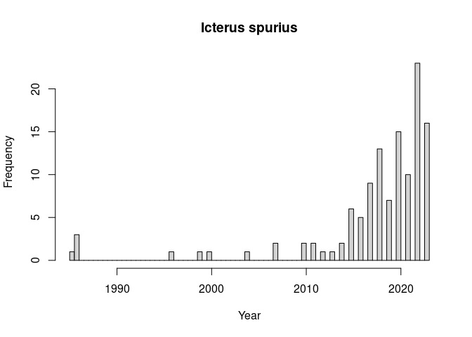<!-- -->

    ##                species      eventDate   
    ##  Icterus bullockii :114   Min.   :1973  
    ##  Acanthis flammea  :  0   1st Qu.:2019  
    ##  Accipiter cooperii:  0   Median :2021  
    ##  Accipiter gentilis:  0   Mean   :2019  
    ##  Accipiter striatus:  0   3rd Qu.:2022  
    ##  Actitis macularius:  0   Max.   :2023  
    ##  (Other)           :  0

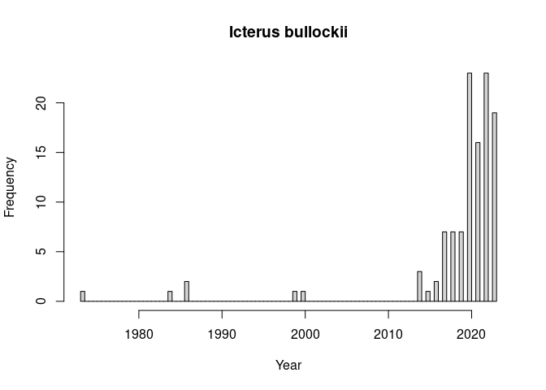<!-- -->

    ##                species     eventDate   
    ##  Icterus galbula   :14   Min.   :2011  
    ##  Acanthis flammea  : 0   1st Qu.:2015  
    ##  Accipiter cooperii: 0   Median :2018  
    ##  Accipiter gentilis: 0   Mean   :2018  
    ##  Accipiter striatus: 0   3rd Qu.:2022  
    ##  Actitis macularius: 0   Max.   :2023  
    ##  (Other)           : 0

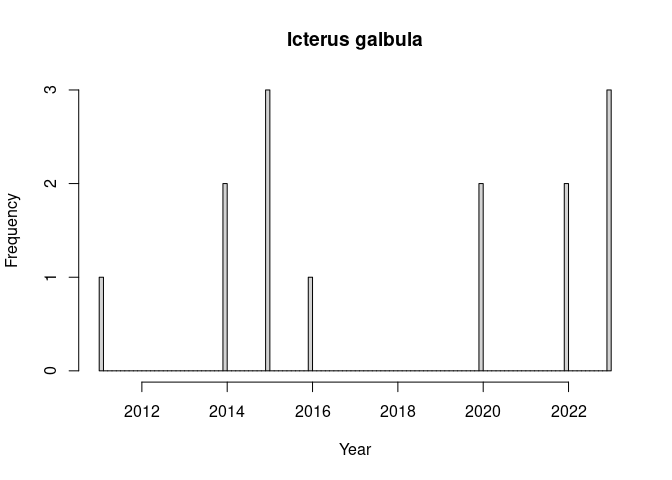<!-- -->

    ##                         species    eventDate   
    ##  Icterus bullockii x galbula:2   Min.   :2021  
    ##  Acanthis flammea           :0   1st Qu.:2021  
    ##  Accipiter cooperii         :0   Median :2022  
    ##  Accipiter gentilis         :0   Mean   :2022  
    ##  Accipiter striatus         :0   3rd Qu.:2022  
    ##  Actitis macularius         :0   Max.   :2022  
    ##  (Other)                    :0

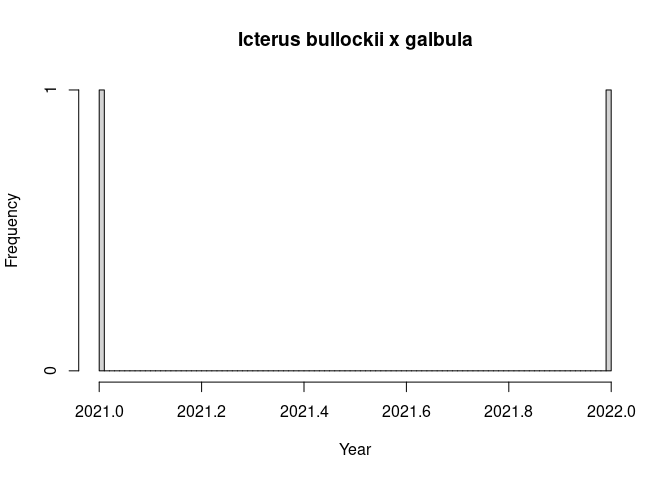<!-- -->

    ##                 species      eventDate   
    ##  Agelaius phoeniceus:355   Min.   :1975  
    ##  Acanthis flammea   :  0   1st Qu.:2018  
    ##  Accipiter cooperii :  0   Median :2020  
    ##  Accipiter gentilis :  0   Mean   :2018  
    ##  Accipiter striatus :  0   3rd Qu.:2022  
    ##  Actitis macularius :  0   Max.   :2023  
    ##  (Other)            :  0

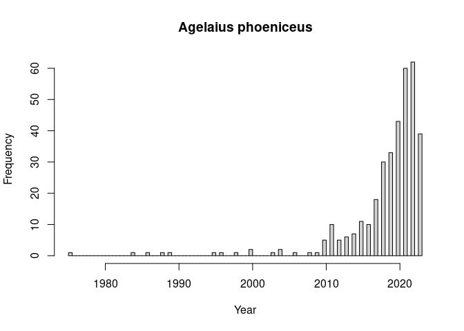<!-- -->

    ##                species      eventDate   
    ##  Molothrus ater    :263   Min.   :1995  
    ##  Acanthis flammea  :  0   1st Qu.:2017  
    ##  Accipiter cooperii:  0   Median :2019  
    ##  Accipiter gentilis:  0   Mean   :2018  
    ##  Accipiter striatus:  0   3rd Qu.:2021  
    ##  Actitis macularius:  0   Max.   :2023  
    ##  (Other)           :  0

<!-- -->

    ##                    species     eventDate   
    ##  Euphagus cyanocephalus:78   Min.   :1971  
    ##  Acanthis flammea      : 0   1st Qu.:2015  
    ##  Accipiter cooperii    : 0   Median :2020  
    ##  Accipiter gentilis    : 0   Mean   :2016  
    ##  Accipiter striatus    : 0   3rd Qu.:2022  
    ##  Actitis macularius    : 0   Max.   :2023  
    ##  (Other)               : 0

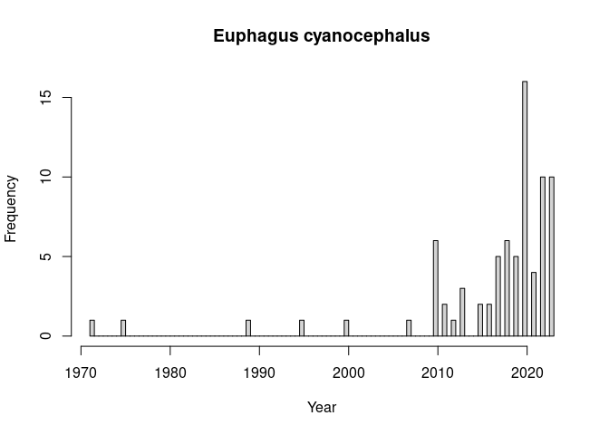<!-- -->

    ##                species      eventDate   
    ##  Quiscalus quiscula:271   Min.   :1975  
    ##  Acanthis flammea  :  0   1st Qu.:2017  
    ##  Accipiter cooperii:  0   Median :2020  
    ##  Accipiter gentilis:  0   Mean   :2018  
    ##  Accipiter striatus:  0   3rd Qu.:2022  
    ##  Actitis macularius:  0   Max.   :2023  
    ##  (Other)           :  0

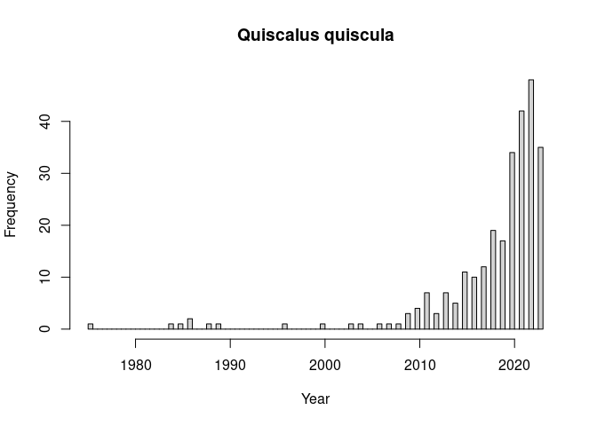<!-- -->

    ##                 species    eventDate   
    ##  Quiscalus mexicanus:2   Min.   :2010  
    ##  Acanthis flammea   :0   1st Qu.:2012  
    ##  Accipiter cooperii :0   Median :2014  
    ##  Accipiter gentilis :0   Mean   :2014  
    ##  Accipiter striatus :0   3rd Qu.:2017  
    ##  Actitis macularius :0   Max.   :2019  
    ##  (Other)            :0

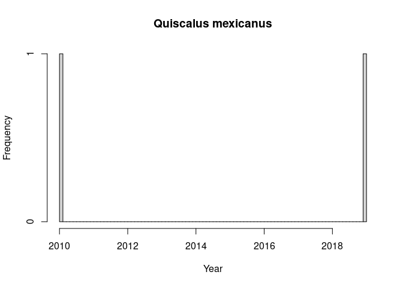<!-- -->

    ##                 species      eventDate   
    ##  Seiurus aurocapilla:156   Min.   :1984  
    ##  Acanthis flammea   :  0   1st Qu.:2014  
    ##  Accipiter cooperii :  0   Median :2017  
    ##  Accipiter gentilis :  0   Mean   :2016  
    ##  Accipiter striatus :  0   3rd Qu.:2020  
    ##  Actitis macularius :  0   Max.   :2023  
    ##  (Other)            :  0

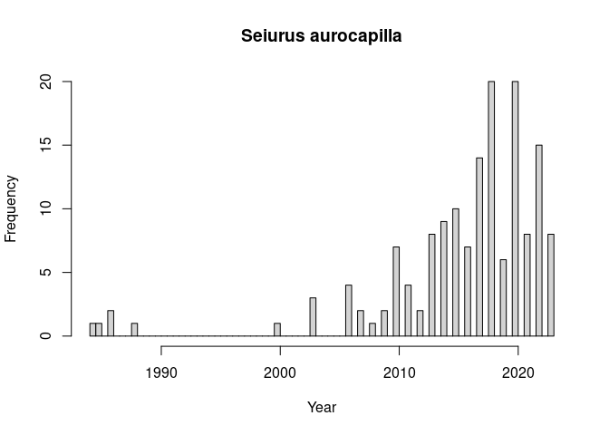<!-- -->

    ##                     species    eventDate   
    ##  Parkesia noveboracensis:5   Min.   :1986  
    ##  Acanthis flammea       :0   1st Qu.:2011  
    ##  Accipiter cooperii     :0   Median :2018  
    ##  Accipiter gentilis     :0   Mean   :2011  
    ##  Accipiter striatus     :0   3rd Qu.:2018  
    ##  Actitis macularius     :0   Max.   :2021  
    ##  (Other)                :0

<!-- -->

    ##                species     eventDate   
    ##  Mniotilta varia   :66   Min.   :1984  
    ##  Acanthis flammea  : 0   1st Qu.:2010  
    ##  Accipiter cooperii: 0   Median :2018  
    ##  Accipiter gentilis: 0   Mean   :2014  
    ##  Accipiter striatus: 0   3rd Qu.:2021  
    ##  Actitis macularius: 0   Max.   :2023  
    ##  (Other)           : 0

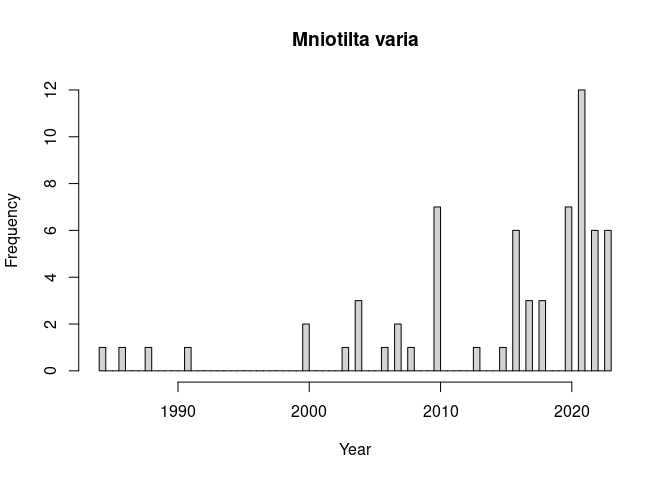<!-- -->

    ##                   species    eventDate   
    ##  Leiothlypis peregrina:9   Min.   :2000  
    ##  Acanthis flammea     :0   1st Qu.:2013  
    ##  Accipiter cooperii   :0   Median :2014  
    ##  Accipiter gentilis   :0   Mean   :2015  
    ##  Accipiter striatus   :0   3rd Qu.:2020  
    ##  Actitis macularius   :0   Max.   :2022  
    ##  (Other)              :0

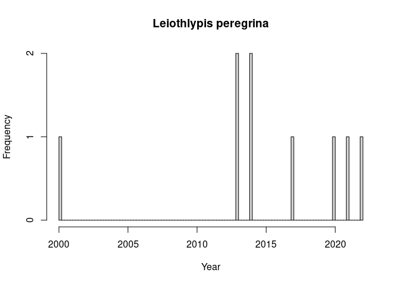<!-- -->

    ##                species      eventDate   
    ##  Leiothlypis celata:252   Min.   :2009  
    ##  Acanthis flammea  :  0   1st Qu.:2014  
    ##  Accipiter cooperii:  0   Median :2016  
    ##  Accipiter gentilis:  0   Mean   :2016  
    ##  Accipiter striatus:  0   3rd Qu.:2018  
    ##  Actitis macularius:  0   Max.   :2022  
    ##  (Other)           :  0

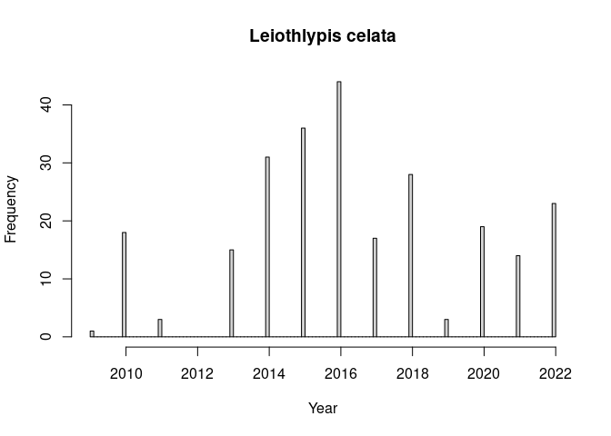<!-- -->

    ##                     species    eventDate   
    ##  Leiothlypis ruficapilla:6   Min.   :2010  
    ##  Acanthis flammea       :0   1st Qu.:2013  
    ##  Accipiter cooperii     :0   Median :2014  
    ##  Accipiter gentilis     :0   Mean   :2015  
    ##  Accipiter striatus     :0   3rd Qu.:2018  
    ##  Actitis macularius     :0   Max.   :2018  
    ##  (Other)                :0

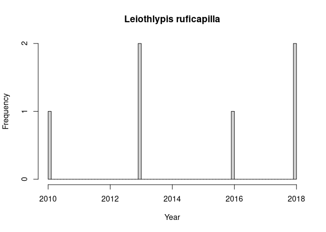<!-- -->

    ##                   species    eventDate   
    ##  Leiothlypis virginiae:1   Min.   :2019  
    ##  Acanthis flammea     :0   1st Qu.:2019  
    ##  Accipiter cooperii   :0   Median :2019  
    ##  Accipiter gentilis   :0   Mean   :2019  
    ##  Accipiter striatus   :0   3rd Qu.:2019  
    ##  Actitis macularius   :0   Max.   :2019  
    ##  (Other)              :0

<!-- -->

    ##                species     eventDate   
    ##  Geothlypis tolmiei:14   Min.   :2010  
    ##  Acanthis flammea  : 0   1st Qu.:2016  
    ##  Accipiter cooperii: 0   Median :2018  
    ##  Accipiter gentilis: 0   Mean   :2017  
    ##  Accipiter striatus: 0   3rd Qu.:2020  
    ##  Actitis macularius: 0   Max.   :2022  
    ##  (Other)           : 0

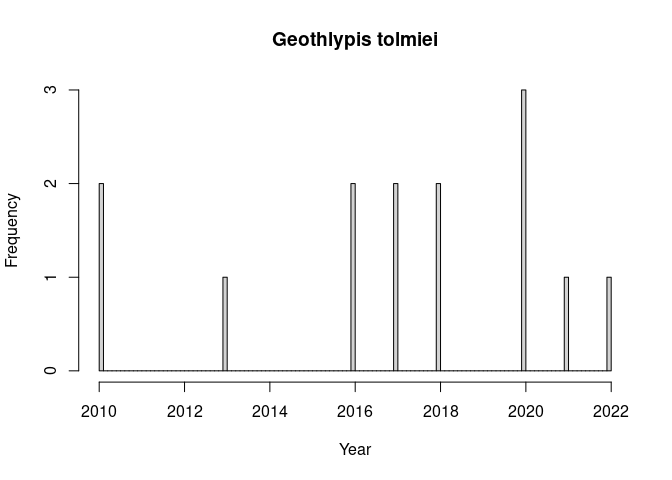<!-- -->

    ##                species     eventDate   
    ##  Geothlypis trichas:75   Min.   :2000  
    ##  Acanthis flammea  : 0   1st Qu.:2015  
    ##  Accipiter cooperii: 0   Median :2018  
    ##  Accipiter gentilis: 0   Mean   :2017  
    ##  Accipiter striatus: 0   3rd Qu.:2021  
    ##  Actitis macularius: 0   Max.   :2023  
    ##  (Other)           : 0

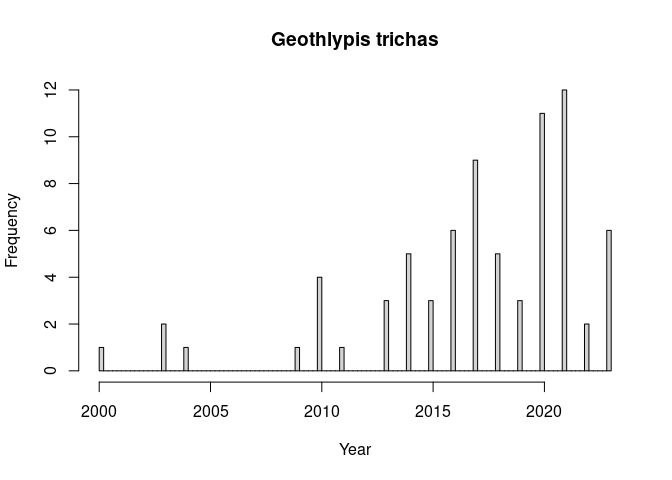<!-- -->

    ##                 species      eventDate   
    ##  Setophaga ruticilla:227   Min.   :1975  
    ##  Acanthis flammea   :  0   1st Qu.:2015  
    ##  Accipiter cooperii :  0   Median :2018  
    ##  Accipiter gentilis :  0   Mean   :2016  
    ##  Accipiter striatus :  0   3rd Qu.:2021  
    ##  Actitis macularius :  0   Max.   :2023  
    ##  (Other)            :  0

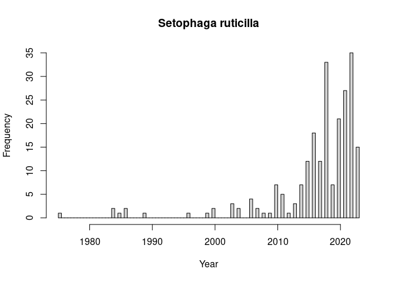<!-- -->

    ##                species      eventDate   
    ##  Setophaga petechia:421   Min.   :1984  
    ##  Acanthis flammea  :  0   1st Qu.:2016  
    ##  Accipiter cooperii:  0   Median :2019  
    ##  Accipiter gentilis:  0   Mean   :2017  
    ##  Accipiter striatus:  0   3rd Qu.:2021  
    ##  Actitis macularius:  0   Max.   :2023  
    ##  (Other)           :  0

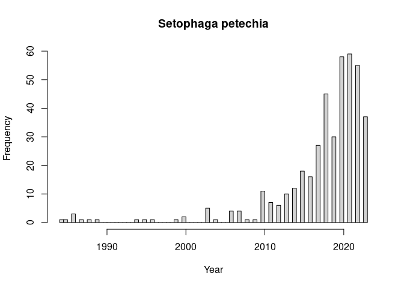<!-- -->

    ##                    species    eventDate   
    ##  Setophaga pensylvanica:2   Min.   :2013  
    ##  Acanthis flammea      :0   1st Qu.:2016  
    ##  Accipiter cooperii    :0   Median :2018  
    ##  Accipiter gentilis    :0   Mean   :2018  
    ##  Accipiter striatus    :0   3rd Qu.:2020  
    ##  Actitis macularius    :0   Max.   :2023  
    ##  (Other)               :0

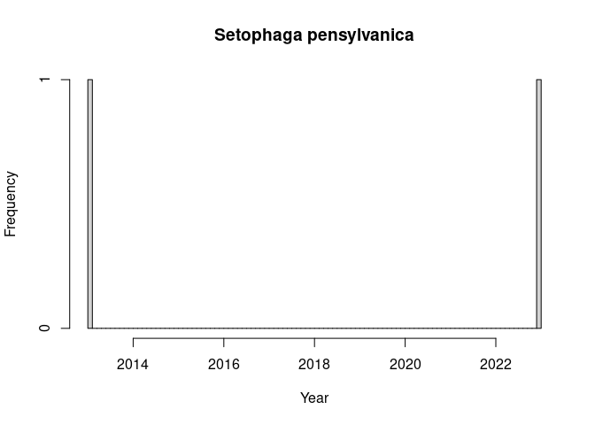<!-- -->

    ##                species     eventDate   
    ##  Setophaga striata :11   Min.   :2003  
    ##  Acanthis flammea  : 0   1st Qu.:2010  
    ##  Accipiter cooperii: 0   Median :2014  
    ##  Accipiter gentilis: 0   Mean   :2014  
    ##  Accipiter striatus: 0   3rd Qu.:2020  
    ##  Actitis macularius: 0   Max.   :2021  
    ##  (Other)           : 0

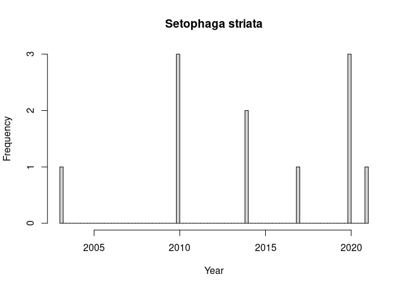<!-- -->

    ##                    species    eventDate   
    ##  Setophaga caerulescens:1   Min.   :2021  
    ##  Acanthis flammea      :0   1st Qu.:2021  
    ##  Accipiter cooperii    :0   Median :2021  
    ##  Accipiter gentilis    :0   Mean   :2021  
    ##  Accipiter striatus    :0   3rd Qu.:2021  
    ##  Actitis macularius    :0   Max.   :2021  
    ##  (Other)               :0

<!-- -->

    ##                species    eventDate   
    ##  Setophaga palmarum:3   Min.   :2009  
    ##  Acanthis flammea  :0   1st Qu.:2012  
    ##  Accipiter cooperii:0   Median :2016  
    ##  Accipiter gentilis:0   Mean   :2014  
    ##  Accipiter striatus:0   3rd Qu.:2017  
    ##  Actitis macularius:0   Max.   :2018  
    ##  (Other)           :0

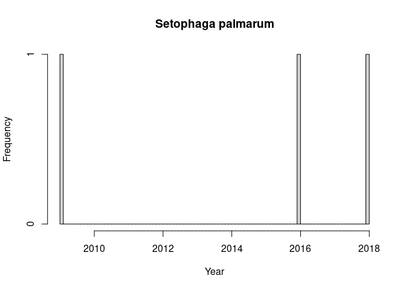<!-- -->

    ##                species      eventDate   
    ##  Setophaga coronata:206   Min.   :1985  
    ##  Acanthis flammea  :  0   1st Qu.:2014  
    ##  Accipiter cooperii:  0   Median :2017  
    ##  Accipiter gentilis:  0   Mean   :2016  
    ##  Accipiter striatus:  0   3rd Qu.:2020  
    ##  Actitis macularius:  0   Max.   :2023  
    ##  (Other)           :  0

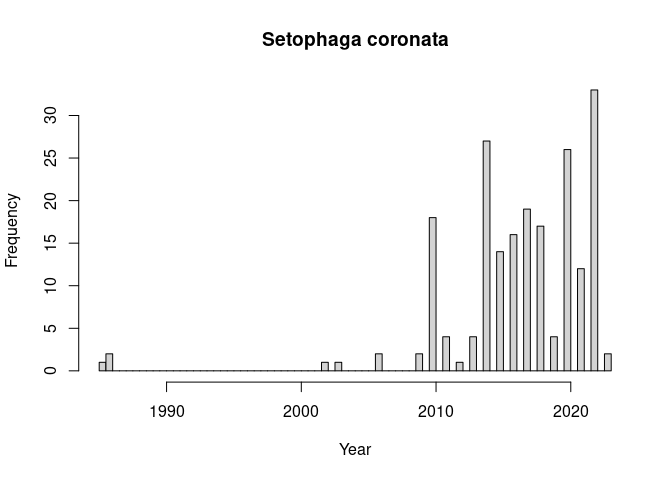<!-- -->

    ##                species      eventDate   
    ##  Setophaga auduboni:107   Min.   :1986  
    ##  Acanthis flammea  :  0   1st Qu.:2014  
    ##  Accipiter cooperii:  0   Median :2016  
    ##  Accipiter gentilis:  0   Mean   :2016  
    ##  Accipiter striatus:  0   3rd Qu.:2019  
    ##  Actitis macularius:  0   Max.   :2022  
    ##  (Other)           :  0

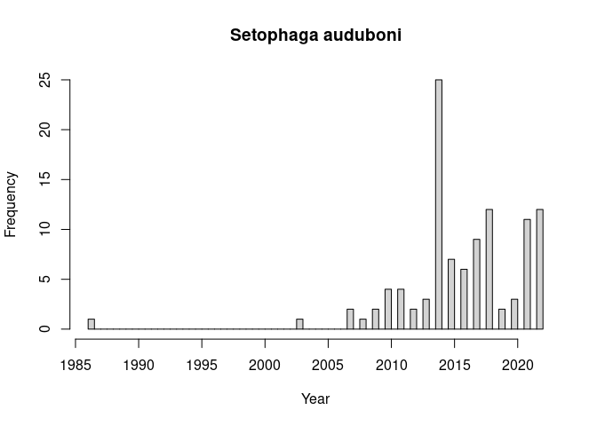<!-- -->

    ##                 species     eventDate   
    ##  Setophaga townsendi:11   Min.   :2014  
    ##  Acanthis flammea   : 0   1st Qu.:2014  
    ##  Accipiter cooperii : 0   Median :2015  
    ##  Accipiter gentilis : 0   Mean   :2016  
    ##  Accipiter striatus : 0   3rd Qu.:2016  
    ##  Actitis macularius : 0   Max.   :2021  
    ##  (Other)            : 0

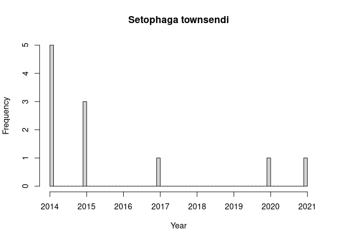<!-- -->

    ##                species      eventDate   
    ##  Cardellina pusilla:207   Min.   :2010  
    ##  Acanthis flammea  :  0   1st Qu.:2014  
    ##  Accipiter cooperii:  0   Median :2016  
    ##  Accipiter gentilis:  0   Mean   :2016  
    ##  Accipiter striatus:  0   3rd Qu.:2019  
    ##  Actitis macularius:  0   Max.   :2022  
    ##  (Other)           :  0

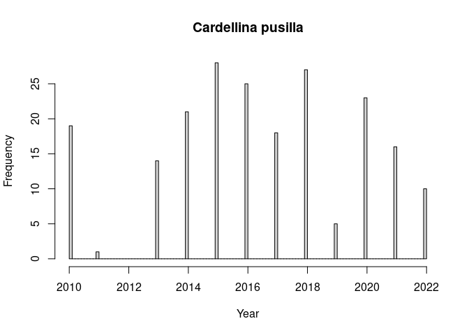<!-- -->

    ##                species    eventDate   
    ##  Piranga rubra     :1   Min.   :2021  
    ##  Acanthis flammea  :0   1st Qu.:2021  
    ##  Accipiter cooperii:0   Median :2021  
    ##  Accipiter gentilis:0   Mean   :2021  
    ##  Accipiter striatus:0   3rd Qu.:2021  
    ##  Actitis macularius:0   Max.   :2021  
    ##  (Other)           :0

<!-- -->

    ##                 species      eventDate   
    ##  Piranga ludoviciana:186   Min.   :1984  
    ##  Acanthis flammea   :  0   1st Qu.:2015  
    ##  Accipiter cooperii :  0   Median :2017  
    ##  Accipiter gentilis :  0   Mean   :2016  
    ##  Accipiter striatus :  0   3rd Qu.:2020  
    ##  Actitis macularius :  0   Max.   :2023  
    ##  (Other)            :  0

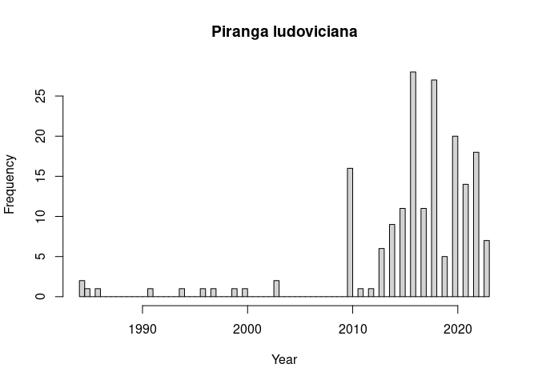<!-- -->

    ##                   species    eventDate   
    ##  Cardinalis cardinalis:5   Min.   :2015  
    ##  Acanthis flammea     :0   1st Qu.:2015  
    ##  Accipiter cooperii   :0   Median :2018  
    ##  Accipiter gentilis   :0   Mean   :2018  
    ##  Accipiter striatus   :0   3rd Qu.:2021  
    ##  Actitis macularius   :0   Max.   :2023  
    ##  (Other)              :0

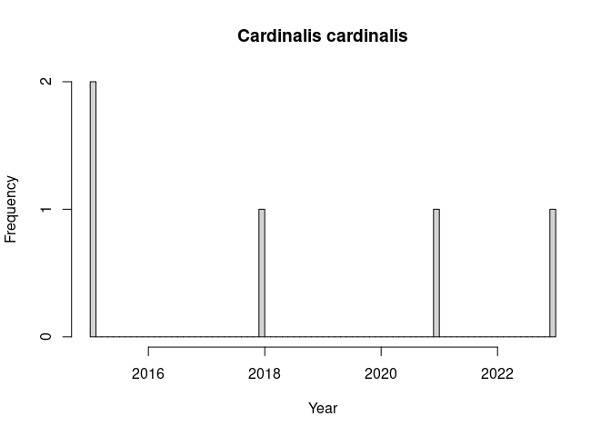<!-- -->

    ##                     species    eventDate   
    ##  Pheucticus ludovicianus:5   Min.   :2009  
    ##  Acanthis flammea       :0   1st Qu.:2021  
    ##  Accipiter cooperii     :0   Median :2021  
    ##  Accipiter gentilis     :0   Mean   :2019  
    ##  Accipiter striatus     :0   3rd Qu.:2022  
    ##  Actitis macularius     :0   Max.   :2022  
    ##  (Other)                :0

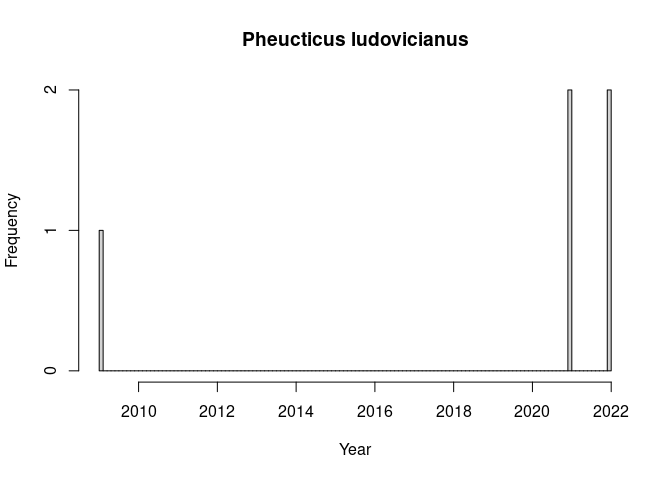<!-- -->

    ##                       species      eventDate   
    ##  Pheucticus melanocephalus:307   Min.   :1975  
    ##  Acanthis flammea         :  0   1st Qu.:2016  
    ##  Accipiter cooperii       :  0   Median :2019  
    ##  Accipiter gentilis       :  0   Mean   :2017  
    ##  Accipiter striatus       :  0   3rd Qu.:2021  
    ##  Actitis macularius       :  0   Max.   :2023  
    ##  (Other)                  :  0

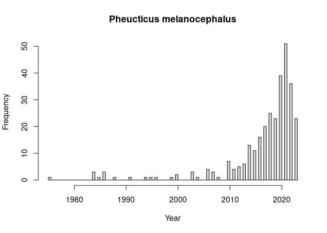<!-- -->

    ##                                      species    eventDate   
    ##  Pheucticus ludovicianus x melanocephalus:1   Min.   :2018  
    ##  Acanthis flammea                        :0   1st Qu.:2018  
    ##  Accipiter cooperii                      :0   Median :2018  
    ##  Accipiter gentilis                      :0   Mean   :2018  
    ##  Accipiter striatus                      :0   3rd Qu.:2018  
    ##  Actitis macularius                      :0   Max.   :2018  
    ##  (Other)                                 :0

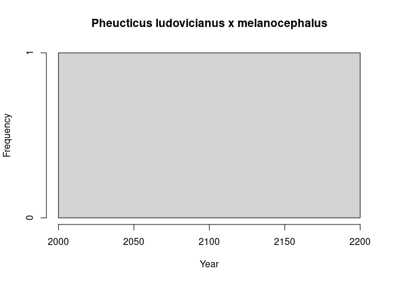<!-- -->

    ##                species     eventDate   
    ##  Passerina caerulea:29   Min.   :1991  
    ##  Acanthis flammea  : 0   1st Qu.:2015  
    ##  Accipiter cooperii: 0   Median :2020  
    ##  Accipiter gentilis: 0   Mean   :2018  
    ##  Accipiter striatus: 0   3rd Qu.:2022  
    ##  Actitis macularius: 0   Max.   :2023  
    ##  (Other)           : 0

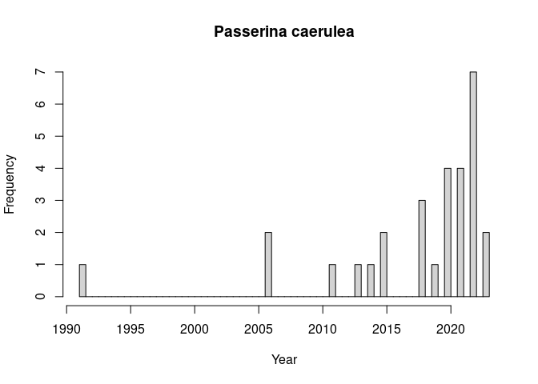<!-- -->

    ##                species     eventDate   
    ##  Passerina amoena  :73   Min.   :1996  
    ##  Acanthis flammea  : 0   1st Qu.:2015  
    ##  Accipiter cooperii: 0   Median :2019  
    ##  Accipiter gentilis: 0   Mean   :2018  
    ##  Accipiter striatus: 0   3rd Qu.:2021  
    ##  Actitis macularius: 0   Max.   :2023  
    ##  (Other)           : 0

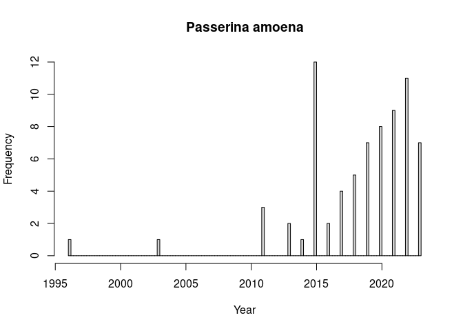<!-- -->

    ##                species     eventDate   
    ##  Passerina cyanea  :24   Min.   :1991  
    ##  Acanthis flammea  : 0   1st Qu.:2014  
    ##  Accipiter cooperii: 0   Median :2015  
    ##  Accipiter gentilis: 0   Mean   :2014  
    ##  Accipiter striatus: 0   3rd Qu.:2019  
    ##  Actitis macularius: 0   Max.   :2022  
    ##  (Other)           : 0

<!-- -->

    ##                       species    eventDate   
    ##  Passerina amoena x cyanea:6   Min.   :2006  
    ##  Acanthis flammea         :0   1st Qu.:2014  
    ##  Accipiter cooperii       :0   Median :2019  
    ##  Accipiter gentilis       :0   Mean   :2016  
    ##  Accipiter striatus       :0   3rd Qu.:2020  
    ##  Actitis macularius       :0   Max.   :2022  
    ##  (Other)                  :0

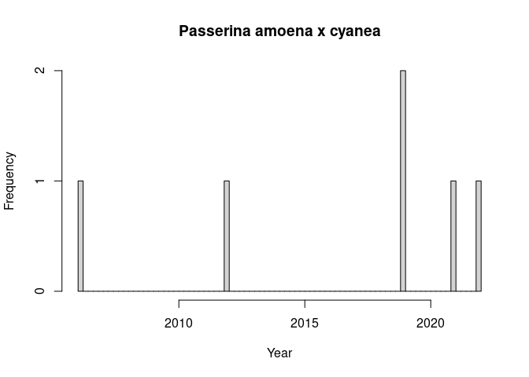<!-- -->

    ##                species     eventDate   
    ##  Spiza americana   :29   Min.   :1996  
    ##  Acanthis flammea  : 0   1st Qu.:2017  
    ##  Accipiter cooperii: 0   Median :2020  
    ##  Accipiter gentilis: 0   Mean   :2017  
    ##  Accipiter striatus: 0   3rd Qu.:2020  
    ##  Actitis macularius: 0   Max.   :2022  
    ##  (Other)           : 0

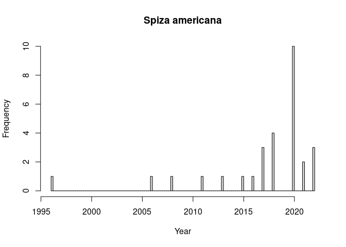<!-- -->

    ##                         species       eventDate   
    ##  Setophaga coronata/auduboni:8540   Min.   :1901  
    ##  Acanthis flammea           :   0   1st Qu.:2015  
    ##  Accipiter cooperii         :   0   Median :2017  
    ##  Accipiter gentilis         :   0   Mean   :2017  
    ##  Accipiter striatus         :   0   3rd Qu.:2020  
    ##  Actitis macularius         :   0   Max.   :2023  
    ##  (Other)                    :   0

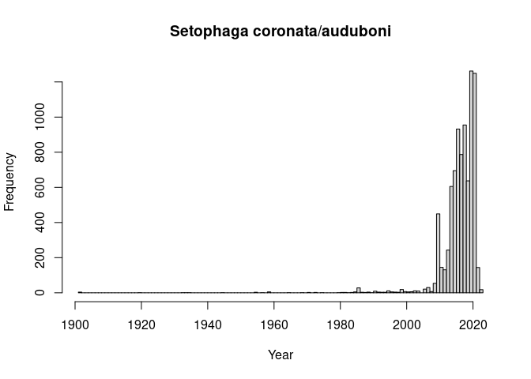<!-- -->

# Missing

What are the missing taxa indicated in this study?

``` r
# prep GBIF data
gbif <- read.delim(paste0(filepath,"0104629-230530130749713.csv"),sep = "\t")

# reduce to relevant columns
# all have coords??

gbif <- gbif%>%
  select(gbifID, institutionCode, catalogNumber, species, locality,
         decimalLongitude, decimalLatitude, year) %>%
  unique()

taxo_order <- read_csv(paste0(filepath,"sp_list_ne.csv"))
taxo_order <- taxo_order%>%
  rename(species = scientific)

# get missing taxa
missing <- read_csv(paste0(filepath,"missing.csv")) %>%
  filter(keep==F)%>%
  rename(species = wrong)

miss_tax <- gbif%>%
  inner_join(missing,"species")

miss_tax <- miss_tax[order(miss_tax$species),]

write_csv(miss_tax,paste0(filepath,"missing_list.csv"))
```

Many of the taxa that are listed as here but have not been confirmed in
the state are exotics or fossil species. One collection appears to have
placed all records from North America at the same locality (Musée des
Confluences, Lyon) The following merit (brief) following up:

| Species                 | Collection                | Locality       | Year                             | Note                                                     |
|-------------------------|---------------------------|----------------|----------------------------------|----------------------------------------------------------|
| *Agelaius tricolor*     | USGS                      | NA             | 1932                             | Mis ID?                                                  |
| *Dryobates scalaris*    | Great Backyard Bird Count | 69144 Keystone | 2000                             | Mis ID?                                                  |
| *Larus heermanni*       | USGS                      | NA             | 1933                             | Wrong locality?                                          |
| *Larus occidentalis*    | iNaturalist               | NA             | Valid record; outside study area |                                                          |
| *Megascops kennicottii* | University of Michigan    | Kearney        | 1925                             | Two birds; likely misidentified; checked with collection |
| *Passer montanus*       | Cornell                   | Several        |                                  | Multiple records; not accepted? Outside study area       |
| *Picoides arcticus*     | Yale Peabody Museum       | Lincoln        | 1895                             | Transcription error; refers to Lincoln, Maine            |
| *Poecile carolinensis*  | Cornell                   | Omaha          | 2000                             | Not on state list; ouside study area                     |
| *Progne tapera*         | USGS                      | NA             | 1923                             | No details; mis ID?                                      |
| *Sialia mexicana*       | USGS                      | Chadron        | 1922                             | Recently seen in state; predates current records?        |

Many thanks to Dr. Brett Benz, Dr. Ben Winger, and Dr. Kristof Zykowski
for the specimen information.

I’m including *Sialia* in the study for now - hoping to confirm.

# Species through time

We can compare our lists through time to see how things have changed.

``` r
zimmer <- read_csv(paste0(filepath,"zimmer_1913_species.csv")) %>%
  select(-Species) %>%
  rename("Zimmer_1913" = List)
```

    ## Rows: 140 Columns: 3
    ## ── Column specification ────────────────────────────────────────────────────────
    ## Delimiter: ","
    ## chr (3): Species, SciName, List
    ## 
    ## ℹ Use `spec()` to retrieve the full column specification for this data.
    ## ℹ Specify the column types or set `show_col_types = FALSE` to quiet this message.

``` r
ford <- read_csv(paste0(filepath,"ford_1957_species.csv")) %>%
  select(-Species)%>%
  rename("Ford_1957" = List)
```

    ## Rows: 21 Columns: 3
    ## ── Column specification ────────────────────────────────────────────────────────
    ## Delimiter: ","
    ## chr (3): Species, SciName, List
    ## 
    ## ℹ Use `spec()` to retrieve the full column specification for this data.
    ## ℹ Specify the column types or set `show_col_types = FALSE` to quiet this message.

``` r
bray <- read_csv(paste0(filepath,"Bray_Sandhills_Species.csv"))%>%
  rename("Bray_1993" = Bray) %>%
  select(-Species,-Notes)
```

    ## Rows: 258 Columns: 4
    ## ── Column specification ────────────────────────────────────────────────────────
    ## Delimiter: ","
    ## chr (4): Species, SciName, Bray, Notes
    ## 
    ## ℹ Use `spec()` to retrieve the full column specification for this data.
    ## ℹ Specify the column types or set `show_col_types = FALSE` to quiet this message.

``` r
ne_nf_gbif <- read_csv(paste0(filepath,"ne_natl_forest_birds.csv")) %>%
  filter(district == "Bessey") %>%
  select(species) %>%
  rename("SciName" = species) %>%
  unique()
```

    ## Rows: 46392 Columns: 6
    ## ── Column specification ────────────────────────────────────────────────────────
    ## Delimiter: ","
    ## chr  (3): species, individualCount, district
    ## dbl  (2): decimalLongitude, decimalLatitude
    ## date (1): eventDate
    ## 
    ## ℹ Use `spec()` to retrieve the full column specification for this data.
    ## ℹ Specify the column types or set `show_col_types = FALSE` to quiet this message.

``` r
ne_nf_gbif$GBIF_2023 <- "GBIF"
```

We have 140 taxa from 1913, 258 taxa, and 202 taxa from 2023.

``` r
comp_years <- zimmer %>%
  full_join(ford,by = "SciName") %>%
  full_join(bray,by = "SciName") %>%
  full_join(ne_nf_gbif,by = "SciName")
```

``` r
# species recorded by GBIF
# debugging step
index <- which(!is.na(comp_years$GBIF_2023))

write_csv(comp_years[index,],paste0(filepath,"missing_gbif.csv"))
```

We can save this file as an appendix of species’ occurrence.

``` r
write_csv(comp_years,paste0(filepath,"compare_lists.csv"))
```

We can also compare all sites, and see what is in the other districts
but not in Bessey yet.

``` r
zimmer <- read_csv(paste0(filepath,"zimmer_1913_species.csv")) %>%
  select(-Species) %>%
  rename("Zimmer_1913" = List)
```

    ## Rows: 140 Columns: 3
    ## ── Column specification ────────────────────────────────────────────────────────
    ## Delimiter: ","
    ## chr (3): Species, SciName, List
    ## 
    ## ℹ Use `spec()` to retrieve the full column specification for this data.
    ## ℹ Specify the column types or set `show_col_types = FALSE` to quiet this message.

``` r
ford <- read_csv(paste0(filepath,"ford_1957_species.csv")) %>%
  select(-Species)%>%
  rename("Ford_1957" = List)
```

    ## Rows: 21 Columns: 3
    ## ── Column specification ────────────────────────────────────────────────────────
    ## Delimiter: ","
    ## chr (3): Species, SciName, List
    ## 
    ## ℹ Use `spec()` to retrieve the full column specification for this data.
    ## ℹ Specify the column types or set `show_col_types = FALSE` to quiet this message.

``` r
bray <- read_csv(paste0(filepath,"Bray_Sandhills_Species.csv"))%>%
  rename("Bray_1993" = Bray) %>%
  select(-Species,-Notes)
```

    ## Rows: 258 Columns: 4
    ## ── Column specification ────────────────────────────────────────────────────────
    ## Delimiter: ","
    ## chr (4): Species, SciName, Bray, Notes
    ## 
    ## ℹ Use `spec()` to retrieve the full column specification for this data.
    ## ℹ Specify the column types or set `show_col_types = FALSE` to quiet this message.

``` r
ne_nf_gbif <- read_csv(paste0(filepath,"ne_natl_forest_birds.csv")) %>%
  rename("SciName" = species)
```

    ## Rows: 46392 Columns: 6
    ## ── Column specification ────────────────────────────────────────────────────────
    ## Delimiter: ","
    ## chr  (3): species, individualCount, district
    ## dbl  (2): decimalLongitude, decimalLatitude
    ## date (1): eventDate
    ## 
    ## ℹ Use `spec()` to retrieve the full column specification for this data.
    ## ℹ Specify the column types or set `show_col_types = FALSE` to quiet this message.

``` r
# split by district
pr_og <- ne_nf_gbif %>% 
  select(SciName,district) %>%
  filter(district == "Pine Ridge / Oglala")%>%
  rename("Pine_Ridge" = district) %>%
  unique()

pr_og$Pine_Ridge[which(!is.na(pr_og$Pine_Ridge))] <- "Confirmed"

bessey <- ne_nf_gbif %>% 
  select(SciName,district) %>%
  filter(district == "Bessey")%>%
  rename("Bessey" = district) %>%
  unique()

bessey$Bessey[which(!is.na(bessey$Bessey))] <- "Confirmed"

mckelvie <- ne_nf_gbif %>% 
  select(SciName,district) %>%
  filter(district == "McKelvie")%>%
  rename("McKelvie" = district) %>%
  unique()

mckelvie$McKelvie[which(!is.na(mckelvie$McKelvie))] <- "Confirmed"

comp_years <- zimmer %>%
  full_join(ford,by = "SciName") %>%
  full_join(bray,by = "SciName") %>%
  full_join(bessey,by = "SciName")%>%
  full_join(mckelvie,by = "SciName")%>%
  full_join(pr_og,by = "SciName")

write_csv(comp_years,paste0(filepath,"all_sites_compare.csv"))
```

# Figures

Here, I document the creation of figures for the manuscript.

``` r
nf <- vect(paste0(filepath,"S_USA.AdministrativeForest/S_USA.AdministrativeForest.shp"))
ne_nf <- nf$FORESTNAME[which(nf$FORESTNAME%like%"Nebraska")]
ne_nf <- nf[which(nf$FORESTNAME==ne_nf)]
ne_crs <- crs(ne_nf)

# get a map of Nebraska Counties
county <- vect("~/Dropbox/GIS/Nebraska/County_Boundaries/BND_CountyBoundary_DOT.shp") %>%
  project(ne_crs)

# crop forest to Nebraska only for map
# small sliver polygon at border, but ok
ne_nf2 <- crop(ne_nf,county)

# county shapefile 

plot(ne_nf2,xlab="Longitude",ylab="Latitude")
plot(county,add=T)
plot(ne_nf2,col="gray",add=T)
for(i in 1:length(county)){
  cr <- county[i]
  center <- centroids(cr)
  name <- cr$Cnty_Name
  if(name=="Morrill"|name=="Garden"){
    lab <- county[which(county$Cnty_Name=="Scotts Bluff")]%>%
      centroids()%>%
      geom()%>%
      as.data.frame()
    center1 <- center %>% geom() %>% as.data.frame()
    lab$x <- center1$x
    center <- vect(lab,geom=c("x","y"),crs=ne_crs)
  }
  text(center,labels=name,halo=T)
}
```

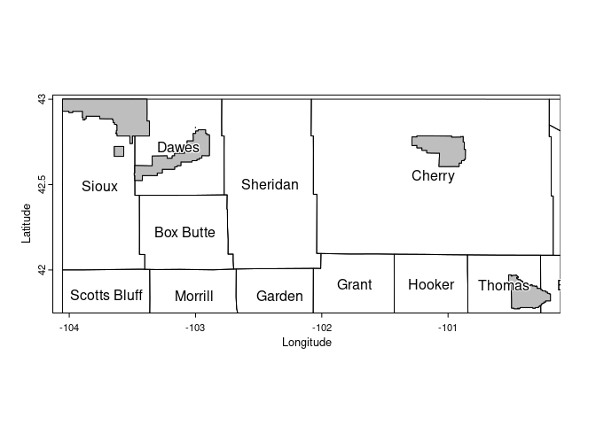<!-- -->

``` r
# forest size
# divide up by county

# pine ridge oglala in Dawes, Sioux
# mckelvie in Cherry
# bessy in Thomas, Blaine

count_cropper <- function(counties){
  cr <- county[contains(counties,vars = county$Cnty_Name)]
  cr_crop <- crop(ne_nf2,cr)
  plot(cr_crop)
  return(expanse(cr_crop,unit="km"))
}

# area of Pine Ridge
count_cropper(counties = c("Dawes","Sioux"))
```

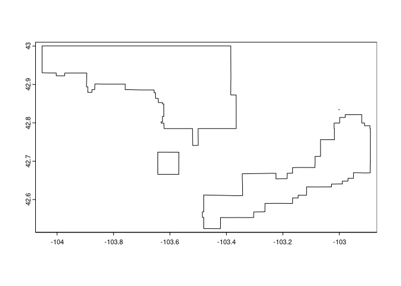<!-- -->

    ## [1] 1436.955

``` r
# area of McKelvie
count_cropper(counties = c("Cherry"))
```

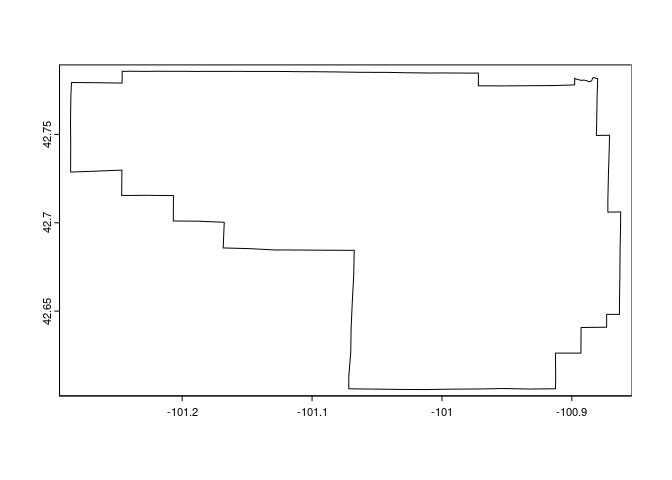<!-- -->

    ## [1] 471.4443

``` r
# area of Bessey
count_cropper(counties = c("Thomas","Blaine"))
```

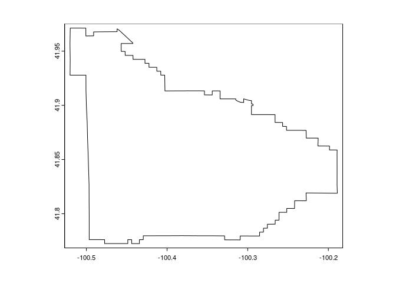<!-- -->

    ## [1] 365.381
